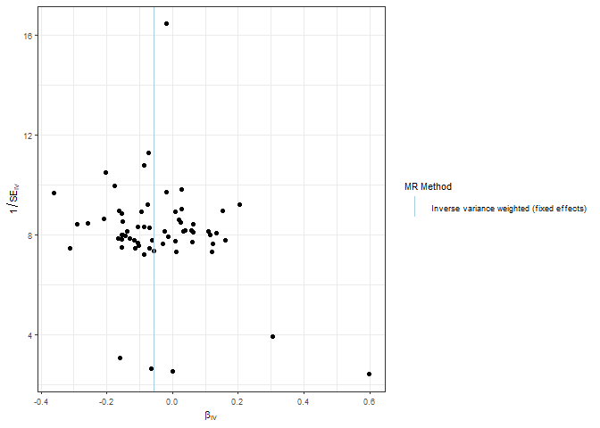
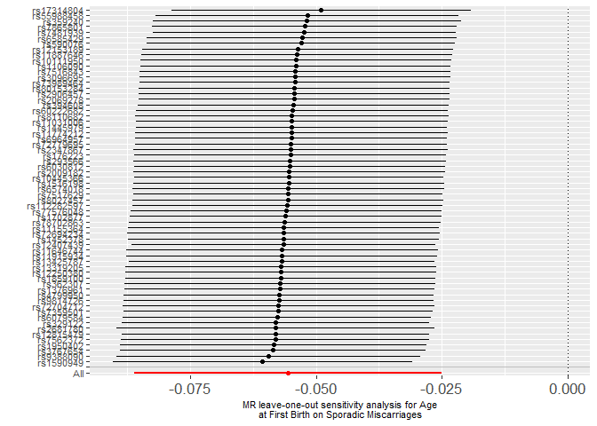
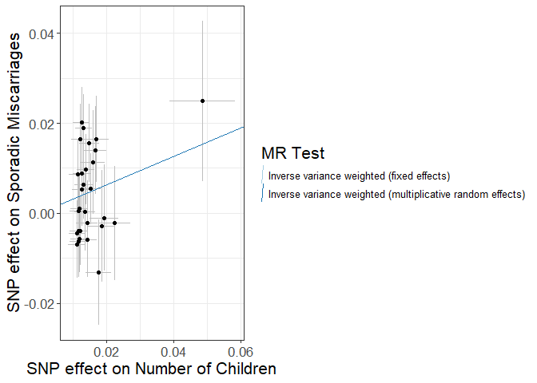
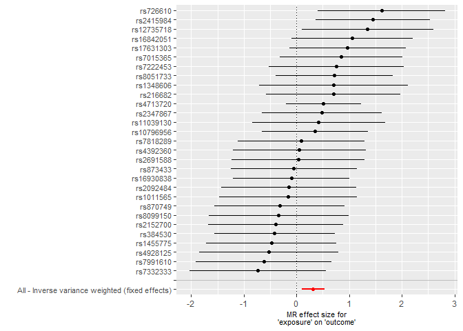
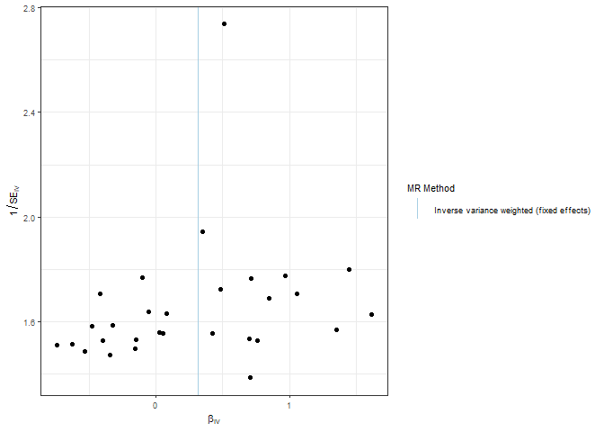
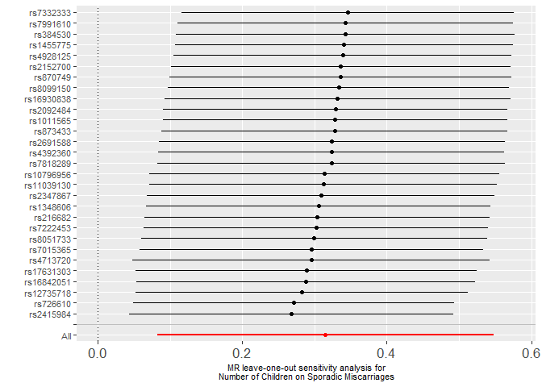

plot_MR
================
Rutuja
2025-04-30

``` r
mr_dat <- read.csv("exposure/mr_dat_age")
mr_res <- read.csv("exposure/mr_res_age.csv")
res_single <- read.csv("exposure/res_single_age.csv")

mr_res
```

    ##   X id.exposure id.outcome outcome exposure
    ## 1 1      g8Iecm     wozxnn outcome exposure
    ## 2 2      g8Iecm     wozxnn outcome exposure
    ##                                                      method nsnp           b
    ## 1                 Inverse variance weighted (fixed effects)   22 -0.02808763
    ## 2 Inverse variance weighted (multiplicative random effects)   22 -0.02808763
    ##           se      pval
    ## 1 0.03324920 0.3982443
    ## 2 0.04245888 0.5082754

``` r
# res_pleio <- mr_pleiotropy_test(mr_dat)
# 
# res_pleio %>%
#   select(-id.exposure, -id.outcome, -outcome, -exposure) %>%
#   gt() %>%
#   fmt_number(
#     columns = c('egger_intercept', 'se')
#   ) %>%
#   fmt_number(
#     columns = pval,
#     rows = pval > 0.001,
#     decimals = 3
#   ) %>% 
#   fmt_scientific(
#     columns = pval,
#     rows = pval <= 0.001,
#     decimals = 1
#   )
# 
# # Heterogeneity statistics 
# res_het <- mr_heterogeneity(mr_dat, method_list = c(
#   "mr_ivw_fe", "mr_ivw_mre"
# ))
# 
# res_het %>%
#   select(-id.exposure, -id.outcome, -outcome, -exposure) %>%
#   gt() %>%
#   fmt_number(
#     columns = Q
#   ) %>%
#   fmt_number(
#     columns = Q_pval,
#     rows = Q_pval > 0.001,
#     decimals = 3
#   ) %>% 
#   fmt_scientific(
#     columns = Q_pval,
#     rows = Q_pval <= 0.001,
#     decimals = 1
#   )
# 
# scatter_p <- mr_scatter_plot(mr_res, mr_dat)
# scatter_out_p <- scatter_p[[1]] + theme_bw() +
#   guides(color=guide_legend(ncol =1)) +
#   theme(
#     text = element_text(size = 8),
#   )
# scatter_out_p
# 
# forrest_p <- mr_forest_plot(res_single)
# forrest_p[[1]]
# 
# funnel_p <- mr_funnel_plot(res_single)
# funnel_out_p <- funnel_p[[1]] + theme_bw() + 
#   guides(color=guide_legend(ncol =1)) + 
#   theme(
#     text = element_text(size = 8), 
#   )
# 
# funnel_out_p
# 
# res_loo <- mr_leaveoneout(mr_dat)
# p3 <- mr_leaveoneout_plot(res_loo)
# p3[[1]]
```

``` r
mr_dat <- read.csv("exposure/mr_dat_chrono")
mr_res <- read.csv("exposure/mr_res_chrono.csv")
res_single <- read.csv("exposure/res_single_chrono.csv")

mr_res
```

    ##   X id.exposure id.outcome outcome exposure
    ## 1 1      g8Iecm     sJbwc8 outcome exposure
    ## 2 2      g8Iecm     sJbwc8 outcome exposure
    ##                                                      method nsnp            b
    ## 1                 Inverse variance weighted (fixed effects)   19 -0.006002749
    ## 2 Inverse variance weighted (multiplicative random effects)   19 -0.006002749
    ##           se      pval
    ## 1 0.01812738 0.7405368
    ## 2 0.02809577 0.8308175

``` r
# res_pleio <- mr_pleiotropy_test(mr_dat)
# 
# res_pleio %>%
#   select(-id.exposure, -id.outcome, -outcome, -exposure) %>%
#   gt() %>%
#   fmt_number(
#     columns = c('egger_intercept', 'se')
#   ) %>%
#   fmt_number(
#     columns = pval,
#     rows = pval > 0.001,
#     decimals = 3
#   ) %>% 
#   fmt_scientific(
#     columns = pval,
#     rows = pval <= 0.001,
#     decimals = 1
#   )
# 
# # Heterogeneity statistics 
# res_het <- mr_heterogeneity(mr_dat, method_list = c(
#   "mr_ivw_fe", "mr_ivw_mre"
# ))
# 
# res_het %>%
#   select(-id.exposure, -id.outcome, -outcome, -exposure) %>%
#   gt() %>%
#   fmt_number(
#     columns = Q
#   ) %>%
#   fmt_number(
#     columns = Q_pval,
#     rows = Q_pval > 0.001,
#     decimals = 3
#   ) %>% 
#   fmt_scientific(
#     columns = Q_pval,
#     rows = Q_pval <= 0.001,
#     decimals = 1
#   )
# 
# scatter_p <- mr_scatter_plot(mr_res, mr_dat)
# scatter_out_p <- scatter_p[[1]] + theme_bw() +
#   guides(color=guide_legend(ncol =1)) +
#   theme(
#     text = element_text(size = 8),
#   )
# scatter_out_p
# 
# forrest_p <- mr_forest_plot(res_single)
# forrest_p[[1]]
# 
# funnel_p <- mr_funnel_plot(res_single)
# funnel_out_p <- funnel_p[[1]] + theme_bw() + 
#   guides(color=guide_legend(ncol =1)) + 
#   theme(
#     text = element_text(size = 8), 
#   )
# 
# funnel_out_p
# 
# res_loo <- mr_leaveoneout(mr_dat)
# p3 <- mr_leaveoneout_plot(res_loo)
# p3[[1]]
# 
```

``` r
# mr_dat <- read.csv("exposure/mr_dat_covid")
# mr_res <- read.csv("exposure/mr_res_covid.csv")
# res_single <- read.csv("exposure/res_single_covid.csv")
# 
# mr_res
# 
# res_pleio <- mr_pleiotropy_test(mr_dat)
# 
# res_pleio %>%
#   select(-id.exposure, -id.outcome, -outcome, -exposure) %>%
#   gt() %>%
#   fmt_number(
#     columns = c('egger_intercept', 'se')
#   ) %>%
#   fmt_number(
#     columns = pval,
#     rows = pval > 0.001,
#     decimals = 3
#   ) %>% 
#   fmt_scientific(
#     columns = pval,
#     rows = pval <= 0.001,
#     decimals = 1
#   )
# 
# # Heterogeneity statistics 
# res_het <- mr_heterogeneity(mr_dat, method_list = c(
#   "mr_ivw_fe", "mr_ivw_mre"
# ))
# 
# res_het %>%
#   select(-id.exposure, -id.outcome, -outcome, -exposure) %>%
#   gt() %>%
#   fmt_number(
#     columns = Q
#   ) %>%
#   fmt_number(
#     columns = Q_pval,
#     rows = Q_pval > 0.001,
#     decimals = 3
#   ) %>% 
#   fmt_scientific(
#     columns = Q_pval,
#     rows = Q_pval <= 0.001,
#     decimals = 1
#   )
# 
# scatter_p <- mr_scatter_plot(mr_res, mr_dat)
# scatter_out_p <- scatter_p[[1]] + theme_bw() +
#   guides(color=guide_legend(ncol =1)) +
#   theme(
#     text = element_text(size = 8),
#   )
# scatter_out_p
# 
# forrest_p <- mr_forest_plot(res_single)
# forrest_p[[1]]
# 
# funnel_p <- mr_funnel_plot(res_single)
# funnel_out_p <- funnel_p[[1]] + theme_bw() + 
#   guides(color=guide_legend(ncol =1)) + 
#   theme(
#     text = element_text(size = 8), 
#   )
# 
# funnel_out_p
# 
# res_loo <- mr_leaveoneout(mr_dat)
# p3 <- mr_leaveoneout_plot(res_loo)
# p3[[1]]
```

``` r
mr_dat <- read.csv("exposure/mr_dat_income")
mr_res <- read.csv("exposure/mr_res_income.csv")
res_single <- read.csv("exposure/res_single_income.csv")

mr_res
```

    ##   X id.exposure id.outcome outcome exposure
    ## 1 1      g8Iecm     INYjO5 outcome exposure
    ## 2 2      g8Iecm     INYjO5 outcome exposure
    ##                                                      method nsnp           b
    ## 1                 Inverse variance weighted (fixed effects)   19 -0.00720529
    ## 2 Inverse variance weighted (multiplicative random effects)   19 -0.00720529
    ##            se      pval
    ## 1 0.006295889 0.2524397
    ## 2 0.007287748 0.3228171

``` r
# res_pleio <- mr_pleiotropy_test(mr_dat)
# 
# res_pleio %>%
#   select(-id.exposure, -id.outcome, -outcome, -exposure) %>%
#   gt() %>%
#   fmt_number(
#     columns = c('egger_intercept', 'se')
#   ) %>%
#   fmt_number(
#     columns = pval,
#     rows = pval > 0.001,
#     decimals = 3
#   ) %>% 
#   fmt_scientific(
#     columns = pval,
#     rows = pval <= 0.001,
#     decimals = 1
#   )
# 
# # Heterogeneity statistics 
# res_het <- mr_heterogeneity(mr_dat, method_list = c(
#   "mr_ivw_fe", "mr_ivw_mre"
# ))
# 
# res_het %>%
#   select(-id.exposure, -id.outcome, -outcome, -exposure) %>%
#   gt() %>%
#   fmt_number(
#     columns = Q
#   ) %>%
#   fmt_number(
#     columns = Q_pval,
#     rows = Q_pval > 0.001,
#     decimals = 3
#   ) %>% 
#   fmt_scientific(
#     columns = Q_pval,
#     rows = Q_pval <= 0.001,
#     decimals = 1
#   )
# 
# scatter_p <- mr_scatter_plot(mr_res, mr_dat)
# scatter_out_p <- scatter_p[[1]] + theme_bw() +
#   guides(color=guide_legend(ncol =1)) +
#   theme(
#     text = element_text(size = 8),
#   )
# scatter_out_p
# 
# forrest_p <- mr_forest_plot(res_single)
# forrest_p[[1]]
# 
# funnel_p <- mr_funnel_plot(res_single)
# funnel_out_p <- funnel_p[[1]] + theme_bw() + 
#   guides(color=guide_legend(ncol =1)) + 
#   theme(
#     text = element_text(size = 8), 
#   )
# 
# funnel_out_p
# 
# res_loo <- mr_leaveoneout(mr_dat)
# p3 <- mr_leaveoneout_plot(res_loo)
# p3[[1]]
```

``` r
# mr_dat <- read.csv("exposure/mr_dat_insomnia")
# mr_res <- read.csv("exposure/mr_res_insomnia.csv")
# res_single <- read.csv("exposure/res_single_insomnia.csv")
# 
# mr_res
# 
# res_pleio <- mr_pleiotropy_test(mr_dat)
# 
# res_pleio %>%
#   select(-id.exposure, -id.outcome, -outcome, -exposure) %>%
#   gt() %>%
#   fmt_number(
#     columns = c('egger_intercept', 'se')
#   ) %>%
#   fmt_number(
#     columns = pval,
#     rows = pval > 0.001,
#     decimals = 3
#   ) %>% 
#   fmt_scientific(
#     columns = pval,
#     rows = pval <= 0.001,
#     decimals = 1
#   )
# 
# # Heterogeneity statistics 
# res_het <- mr_heterogeneity(mr_dat, method_list = c(
#   "mr_ivw_fe", "mr_ivw_mre"
# ))
# 
# res_het %>%
#   select(-id.exposure, -id.outcome, -outcome, -exposure) %>%
#   gt() %>%
#   fmt_number(
#     columns = Q
#   ) %>%
#   fmt_number(
#     columns = Q_pval,
#     rows = Q_pval > 0.001,
#     decimals = 3
#   ) %>% 
#   fmt_scientific(
#     columns = Q_pval,
#     rows = Q_pval <= 0.001,
#     decimals = 1
#   )
# 
# scatter_p <- mr_scatter_plot(mr_res, mr_dat)
# scatter_out_p <- scatter_p[[1]] + theme_bw() +
#   guides(color=guide_legend(ncol =1)) +
#   theme(
#     text = element_text(size = 8),
#   )
# scatter_out_p
# 
# forrest_p <- mr_forest_plot(res_single)
# forrest_p[[1]]
# 
# funnel_p <- mr_funnel_plot(res_single)
# funnel_out_p <- funnel_p[[1]] + theme_bw() + 
#   guides(color=guide_legend(ncol =1)) + 
#   theme(
#     text = element_text(size = 8), 
#   )
# 
# funnel_out_p
# 
# res_loo <- mr_leaveoneout(mr_dat)
# p3 <- mr_leaveoneout_plot(res_loo)
# p3[[1]]
```

``` r
mr_dat <- read.csv("exposure/mr_dat_ptsd")
mr_res <- read.csv("exposure/mr_res_ptsd.csv")
res_single <- read.csv("exposure/res_single_ptsd.csv")

mr_res
```

    ##   X id.exposure id.outcome outcome exposure
    ## 1 1      g8Iecm     ams1GK outcome exposure
    ## 2 2      g8Iecm     ams1GK outcome exposure
    ##                                                      method nsnp          b
    ## 1                 Inverse variance weighted (fixed effects)   22 0.05667768
    ## 2 Inverse variance weighted (multiplicative random effects)   22 0.05667768
    ##           se      pval
    ## 1 0.05118945 0.2682014
    ## 2 0.06191833 0.3600016

``` r
# res_pleio <- mr_pleiotropy_test(mr_dat)
# 
# res_pleio %>%
#   select(-id.exposure, -id.outcome, -outcome, -exposure) %>%
#   gt() %>%
#   fmt_number(
#     columns = c('egger_intercept', 'se')
#   ) %>%
#   fmt_number(
#     columns = pval,
#     rows = pval > 0.001,
#     decimals = 3
#   ) %>% 
#   fmt_scientific(
#     columns = pval,
#     rows = pval <= 0.001,
#     decimals = 1
#   )
# 
# # Heterogeneity statistics 
# res_het <- mr_heterogeneity(mr_dat, method_list = c(
#   "mr_ivw_fe", "mr_ivw_mre"
# ))
# 
# res_het %>%
#   select(-id.exposure, -id.outcome, -outcome, -exposure) %>%
#   gt() %>%
#   fmt_number(
#     columns = Q
#   ) %>%
#   fmt_number(
#     columns = Q_pval,
#     rows = Q_pval > 0.001,
#     decimals = 3
#   ) %>% 
#   fmt_scientific(
#     columns = Q_pval,
#     rows = Q_pval <= 0.001,
#     decimals = 1
#   )
# 
# scatter_p <- mr_scatter_plot(mr_res, mr_dat)
# scatter_out_p <- scatter_p[[1]] + theme_bw() +
#   guides(color=guide_legend(ncol =1)) +
#   theme(
#     text = element_text(size = 8),
#   )
# scatter_out_p
# 
# forrest_p <- mr_forest_plot(res_single)
# forrest_p[[1]]
# 
# funnel_p <- mr_funnel_plot(res_single)
# funnel_out_p <- funnel_p[[1]] + theme_bw() + 
#   guides(color=guide_legend(ncol =1)) + 
#   theme(
#     text = element_text(size = 8), 
#   )
# 
# funnel_out_p
# 
# res_loo <- mr_leaveoneout(mr_dat)
# p3 <- mr_leaveoneout_plot(res_loo)
# p3[[1]]
```

``` r
mr_dat <- read.csv("exposure/mr_dat_number")
mr_res <- read.csv("exposure/mr_res_number.csv")
res_single <- read.csv("exposure/res_single_number.csv")

mr_res
```

    ##   X id.exposure id.outcome outcome exposure
    ## 1 1      g8Iecm     plmQ2e outcome exposure
    ## 2 2      g8Iecm     plmQ2e outcome exposure
    ##                                                      method nsnp          b
    ## 1                 Inverse variance weighted (fixed effects)    3 0.01005555
    ## 2 Inverse variance weighted (multiplicative random effects)    3 0.01005555
    ##           se      pval
    ## 1 0.04175189 0.8096786
    ## 2 0.03570122 0.7782054

``` r
# res_pleio <- mr_pleiotropy_test(mr_dat)
# 
# res_pleio %>%
#   select(-id.exposure, -id.outcome, -outcome, -exposure) %>%
#   gt() %>%
#   fmt_number(
#     columns = c('egger_intercept', 'se')
#   ) %>%
#   fmt_number(
#     columns = pval,
#     rows = pval > 0.001,
#     decimals = 3
#   ) %>% 
#   fmt_scientific(
#     columns = pval,
#     rows = pval <= 0.001,
#     decimals = 1
#   )
# 
# # Heterogeneity statistics 
# res_het <- mr_heterogeneity(mr_dat, method_list = c(
#   "mr_ivw_fe", "mr_ivw_mre"
# ))
# 
# res_het %>%
#   select(-id.exposure, -id.outcome, -outcome, -exposure) %>%
#   gt() %>%
#   fmt_number(
#     columns = Q
#   ) %>%
#   fmt_number(
#     columns = Q_pval,
#     rows = Q_pval > 0.001,
#     decimals = 3
#   ) %>% 
#   fmt_scientific(
#     columns = Q_pval,
#     rows = Q_pval <= 0.001,
#     decimals = 1
#   )
# 
# scatter_p <- mr_scatter_plot(mr_res, mr_dat)
# scatter_out_p <- scatter_p[[1]] + theme_bw() +
#   guides(color=guide_legend(ncol =1)) +
#   theme(
#     text = element_text(size = 8),
#   )
# scatter_out_p
# 
# forrest_p <- mr_forest_plot(res_single)
# forrest_p[[1]]
# 
# 
# funnel_p <- mr_funnel_plot(res_single)
# funnel_out_p <- funnel_p[[1]] + theme_bw() + 
#   guides(color=guide_legend(ncol =1)) + 
#   theme(
#     text = element_text(size = 8), 
#   )
# 
# funnel_out_p
# 
# res_loo <- mr_leaveoneout(mr_dat)
# p3 <- mr_leaveoneout_plot(res_loo)
# p3[[1]]
```

``` r
mr_dat <- read.csv("outcome/mr_dat_age")
mr_res <- read.csv("outcome/mr_res_age.csv")
res_single <- read.csv("outcome/res_single_age.csv")

mr_res
```

    ##   X id.exposure id.outcome outcome exposure
    ## 1 1      fkZY5O     6Dhc7C outcome exposure
    ## 2 2      fkZY5O     6Dhc7C outcome exposure
    ##                                                      method nsnp           b
    ## 1                 Inverse variance weighted (fixed effects)   64 -0.05559455
    ## 2 Inverse variance weighted (multiplicative random effects)   64 -0.05559455
    ##           se         pval
    ## 1 0.01503839 0.0002182973
    ## 2 0.01557908 0.0003589770

``` r
res_pleio <- mr_pleiotropy_test(mr_dat)

res_pleio %>%
  select(-id.exposure, -id.outcome, -outcome, -exposure) %>%
  gt() %>%
  fmt_number(
    columns = c('egger_intercept', 'se')
  ) %>%
  fmt_number(
    columns = pval,
    rows = pval > 0.001,
    decimals = 3
  ) %>% 
  fmt_scientific(
    columns = pval,
    rows = pval <= 0.001,
    decimals = 1
  )
```

<div id="rrodxrlrsi" style="padding-left:0px;padding-right:0px;padding-top:10px;padding-bottom:10px;overflow-x:auto;overflow-y:auto;width:auto;height:auto;">
<style>#rrodxrlrsi table {
  font-family: system-ui, 'Segoe UI', Roboto, Helvetica, Arial, sans-serif, 'Apple Color Emoji', 'Segoe UI Emoji', 'Segoe UI Symbol', 'Noto Color Emoji';
  -webkit-font-smoothing: antialiased;
  -moz-osx-font-smoothing: grayscale;
}
&#10;#rrodxrlrsi thead, #rrodxrlrsi tbody, #rrodxrlrsi tfoot, #rrodxrlrsi tr, #rrodxrlrsi td, #rrodxrlrsi th {
  border-style: none;
}
&#10;#rrodxrlrsi p {
  margin: 0;
  padding: 0;
}
&#10;#rrodxrlrsi .gt_table {
  display: table;
  border-collapse: collapse;
  line-height: normal;
  margin-left: auto;
  margin-right: auto;
  color: #333333;
  font-size: 16px;
  font-weight: normal;
  font-style: normal;
  background-color: #FFFFFF;
  width: auto;
  border-top-style: solid;
  border-top-width: 2px;
  border-top-color: #A8A8A8;
  border-right-style: none;
  border-right-width: 2px;
  border-right-color: #D3D3D3;
  border-bottom-style: solid;
  border-bottom-width: 2px;
  border-bottom-color: #A8A8A8;
  border-left-style: none;
  border-left-width: 2px;
  border-left-color: #D3D3D3;
}
&#10;#rrodxrlrsi .gt_caption {
  padding-top: 4px;
  padding-bottom: 4px;
}
&#10;#rrodxrlrsi .gt_title {
  color: #333333;
  font-size: 125%;
  font-weight: initial;
  padding-top: 4px;
  padding-bottom: 4px;
  padding-left: 5px;
  padding-right: 5px;
  border-bottom-color: #FFFFFF;
  border-bottom-width: 0;
}
&#10;#rrodxrlrsi .gt_subtitle {
  color: #333333;
  font-size: 85%;
  font-weight: initial;
  padding-top: 3px;
  padding-bottom: 5px;
  padding-left: 5px;
  padding-right: 5px;
  border-top-color: #FFFFFF;
  border-top-width: 0;
}
&#10;#rrodxrlrsi .gt_heading {
  background-color: #FFFFFF;
  text-align: center;
  border-bottom-color: #FFFFFF;
  border-left-style: none;
  border-left-width: 1px;
  border-left-color: #D3D3D3;
  border-right-style: none;
  border-right-width: 1px;
  border-right-color: #D3D3D3;
}
&#10;#rrodxrlrsi .gt_bottom_border {
  border-bottom-style: solid;
  border-bottom-width: 2px;
  border-bottom-color: #D3D3D3;
}
&#10;#rrodxrlrsi .gt_col_headings {
  border-top-style: solid;
  border-top-width: 2px;
  border-top-color: #D3D3D3;
  border-bottom-style: solid;
  border-bottom-width: 2px;
  border-bottom-color: #D3D3D3;
  border-left-style: none;
  border-left-width: 1px;
  border-left-color: #D3D3D3;
  border-right-style: none;
  border-right-width: 1px;
  border-right-color: #D3D3D3;
}
&#10;#rrodxrlrsi .gt_col_heading {
  color: #333333;
  background-color: #FFFFFF;
  font-size: 100%;
  font-weight: normal;
  text-transform: inherit;
  border-left-style: none;
  border-left-width: 1px;
  border-left-color: #D3D3D3;
  border-right-style: none;
  border-right-width: 1px;
  border-right-color: #D3D3D3;
  vertical-align: bottom;
  padding-top: 5px;
  padding-bottom: 6px;
  padding-left: 5px;
  padding-right: 5px;
  overflow-x: hidden;
}
&#10;#rrodxrlrsi .gt_column_spanner_outer {
  color: #333333;
  background-color: #FFFFFF;
  font-size: 100%;
  font-weight: normal;
  text-transform: inherit;
  padding-top: 0;
  padding-bottom: 0;
  padding-left: 4px;
  padding-right: 4px;
}
&#10;#rrodxrlrsi .gt_column_spanner_outer:first-child {
  padding-left: 0;
}
&#10;#rrodxrlrsi .gt_column_spanner_outer:last-child {
  padding-right: 0;
}
&#10;#rrodxrlrsi .gt_column_spanner {
  border-bottom-style: solid;
  border-bottom-width: 2px;
  border-bottom-color: #D3D3D3;
  vertical-align: bottom;
  padding-top: 5px;
  padding-bottom: 5px;
  overflow-x: hidden;
  display: inline-block;
  width: 100%;
}
&#10;#rrodxrlrsi .gt_spanner_row {
  border-bottom-style: hidden;
}
&#10;#rrodxrlrsi .gt_group_heading {
  padding-top: 8px;
  padding-bottom: 8px;
  padding-left: 5px;
  padding-right: 5px;
  color: #333333;
  background-color: #FFFFFF;
  font-size: 100%;
  font-weight: initial;
  text-transform: inherit;
  border-top-style: solid;
  border-top-width: 2px;
  border-top-color: #D3D3D3;
  border-bottom-style: solid;
  border-bottom-width: 2px;
  border-bottom-color: #D3D3D3;
  border-left-style: none;
  border-left-width: 1px;
  border-left-color: #D3D3D3;
  border-right-style: none;
  border-right-width: 1px;
  border-right-color: #D3D3D3;
  vertical-align: middle;
  text-align: left;
}
&#10;#rrodxrlrsi .gt_empty_group_heading {
  padding: 0.5px;
  color: #333333;
  background-color: #FFFFFF;
  font-size: 100%;
  font-weight: initial;
  border-top-style: solid;
  border-top-width: 2px;
  border-top-color: #D3D3D3;
  border-bottom-style: solid;
  border-bottom-width: 2px;
  border-bottom-color: #D3D3D3;
  vertical-align: middle;
}
&#10;#rrodxrlrsi .gt_from_md > :first-child {
  margin-top: 0;
}
&#10;#rrodxrlrsi .gt_from_md > :last-child {
  margin-bottom: 0;
}
&#10;#rrodxrlrsi .gt_row {
  padding-top: 8px;
  padding-bottom: 8px;
  padding-left: 5px;
  padding-right: 5px;
  margin: 10px;
  border-top-style: solid;
  border-top-width: 1px;
  border-top-color: #D3D3D3;
  border-left-style: none;
  border-left-width: 1px;
  border-left-color: #D3D3D3;
  border-right-style: none;
  border-right-width: 1px;
  border-right-color: #D3D3D3;
  vertical-align: middle;
  overflow-x: hidden;
}
&#10;#rrodxrlrsi .gt_stub {
  color: #333333;
  background-color: #FFFFFF;
  font-size: 100%;
  font-weight: initial;
  text-transform: inherit;
  border-right-style: solid;
  border-right-width: 2px;
  border-right-color: #D3D3D3;
  padding-left: 5px;
  padding-right: 5px;
}
&#10;#rrodxrlrsi .gt_stub_row_group {
  color: #333333;
  background-color: #FFFFFF;
  font-size: 100%;
  font-weight: initial;
  text-transform: inherit;
  border-right-style: solid;
  border-right-width: 2px;
  border-right-color: #D3D3D3;
  padding-left: 5px;
  padding-right: 5px;
  vertical-align: top;
}
&#10;#rrodxrlrsi .gt_row_group_first td {
  border-top-width: 2px;
}
&#10;#rrodxrlrsi .gt_row_group_first th {
  border-top-width: 2px;
}
&#10;#rrodxrlrsi .gt_summary_row {
  color: #333333;
  background-color: #FFFFFF;
  text-transform: inherit;
  padding-top: 8px;
  padding-bottom: 8px;
  padding-left: 5px;
  padding-right: 5px;
}
&#10;#rrodxrlrsi .gt_first_summary_row {
  border-top-style: solid;
  border-top-color: #D3D3D3;
}
&#10;#rrodxrlrsi .gt_first_summary_row.thick {
  border-top-width: 2px;
}
&#10;#rrodxrlrsi .gt_last_summary_row {
  padding-top: 8px;
  padding-bottom: 8px;
  padding-left: 5px;
  padding-right: 5px;
  border-bottom-style: solid;
  border-bottom-width: 2px;
  border-bottom-color: #D3D3D3;
}
&#10;#rrodxrlrsi .gt_grand_summary_row {
  color: #333333;
  background-color: #FFFFFF;
  text-transform: inherit;
  padding-top: 8px;
  padding-bottom: 8px;
  padding-left: 5px;
  padding-right: 5px;
}
&#10;#rrodxrlrsi .gt_first_grand_summary_row {
  padding-top: 8px;
  padding-bottom: 8px;
  padding-left: 5px;
  padding-right: 5px;
  border-top-style: double;
  border-top-width: 6px;
  border-top-color: #D3D3D3;
}
&#10;#rrodxrlrsi .gt_last_grand_summary_row_top {
  padding-top: 8px;
  padding-bottom: 8px;
  padding-left: 5px;
  padding-right: 5px;
  border-bottom-style: double;
  border-bottom-width: 6px;
  border-bottom-color: #D3D3D3;
}
&#10;#rrodxrlrsi .gt_striped {
  background-color: rgba(128, 128, 128, 0.05);
}
&#10;#rrodxrlrsi .gt_table_body {
  border-top-style: solid;
  border-top-width: 2px;
  border-top-color: #D3D3D3;
  border-bottom-style: solid;
  border-bottom-width: 2px;
  border-bottom-color: #D3D3D3;
}
&#10;#rrodxrlrsi .gt_footnotes {
  color: #333333;
  background-color: #FFFFFF;
  border-bottom-style: none;
  border-bottom-width: 2px;
  border-bottom-color: #D3D3D3;
  border-left-style: none;
  border-left-width: 2px;
  border-left-color: #D3D3D3;
  border-right-style: none;
  border-right-width: 2px;
  border-right-color: #D3D3D3;
}
&#10;#rrodxrlrsi .gt_footnote {
  margin: 0px;
  font-size: 90%;
  padding-top: 4px;
  padding-bottom: 4px;
  padding-left: 5px;
  padding-right: 5px;
}
&#10;#rrodxrlrsi .gt_sourcenotes {
  color: #333333;
  background-color: #FFFFFF;
  border-bottom-style: none;
  border-bottom-width: 2px;
  border-bottom-color: #D3D3D3;
  border-left-style: none;
  border-left-width: 2px;
  border-left-color: #D3D3D3;
  border-right-style: none;
  border-right-width: 2px;
  border-right-color: #D3D3D3;
}
&#10;#rrodxrlrsi .gt_sourcenote {
  font-size: 90%;
  padding-top: 4px;
  padding-bottom: 4px;
  padding-left: 5px;
  padding-right: 5px;
}
&#10;#rrodxrlrsi .gt_left {
  text-align: left;
}
&#10;#rrodxrlrsi .gt_center {
  text-align: center;
}
&#10;#rrodxrlrsi .gt_right {
  text-align: right;
  font-variant-numeric: tabular-nums;
}
&#10;#rrodxrlrsi .gt_font_normal {
  font-weight: normal;
}
&#10;#rrodxrlrsi .gt_font_bold {
  font-weight: bold;
}
&#10;#rrodxrlrsi .gt_font_italic {
  font-style: italic;
}
&#10;#rrodxrlrsi .gt_super {
  font-size: 65%;
}
&#10;#rrodxrlrsi .gt_footnote_marks {
  font-size: 75%;
  vertical-align: 0.4em;
  position: initial;
}
&#10;#rrodxrlrsi .gt_asterisk {
  font-size: 100%;
  vertical-align: 0;
}
&#10;#rrodxrlrsi .gt_indent_1 {
  text-indent: 5px;
}
&#10;#rrodxrlrsi .gt_indent_2 {
  text-indent: 10px;
}
&#10;#rrodxrlrsi .gt_indent_3 {
  text-indent: 15px;
}
&#10;#rrodxrlrsi .gt_indent_4 {
  text-indent: 20px;
}
&#10;#rrodxrlrsi .gt_indent_5 {
  text-indent: 25px;
}
&#10;#rrodxrlrsi .katex-display {
  display: inline-flex !important;
  margin-bottom: 0.75em !important;
}
&#10;#rrodxrlrsi div.Reactable > div.rt-table > div.rt-thead > div.rt-tr.rt-tr-group-header > div.rt-th-group:after {
  height: 0px !important;
}
</style>
<table class="gt_table" data-quarto-disable-processing="false" data-quarto-bootstrap="false">
  <thead>
    <tr class="gt_col_headings">
      <th class="gt_col_heading gt_columns_bottom_border gt_right" rowspan="1" colspan="1" scope="col" id="egger_intercept">egger_intercept</th>
      <th class="gt_col_heading gt_columns_bottom_border gt_right" rowspan="1" colspan="1" scope="col" id="se">se</th>
      <th class="gt_col_heading gt_columns_bottom_border gt_right" rowspan="1" colspan="1" scope="col" id="pval">pval</th>
    </tr>
  </thead>
  <tbody class="gt_table_body">
    <tr><td headers="egger_intercept" class="gt_row gt_right">0.00</td>
<td headers="se" class="gt_row gt_right">0.01</td>
<td headers="pval" class="gt_row gt_right">0.905</td></tr>
  </tbody>
  &#10;  
</table>
</div>

``` r
# Heterogeneity statistics 
res_het <- mr_heterogeneity(mr_dat, method_list = c(
  "mr_ivw_fe", "mr_ivw_mre"
))

res_het %>%
  select(-id.exposure, -id.outcome, -outcome, -exposure) %>%
  gt() %>%
  fmt_number(
    columns = Q
  ) %>%
  fmt_number(
    columns = Q_pval,
    rows = Q_pval > 0.001,
    decimals = 3
  ) %>% 
  fmt_scientific(
    columns = Q_pval,
    rows = Q_pval <= 0.001,
    decimals = 1
  )
```

<div id="mdhtitxukz" style="padding-left:0px;padding-right:0px;padding-top:10px;padding-bottom:10px;overflow-x:auto;overflow-y:auto;width:auto;height:auto;">
<style>#mdhtitxukz table {
  font-family: system-ui, 'Segoe UI', Roboto, Helvetica, Arial, sans-serif, 'Apple Color Emoji', 'Segoe UI Emoji', 'Segoe UI Symbol', 'Noto Color Emoji';
  -webkit-font-smoothing: antialiased;
  -moz-osx-font-smoothing: grayscale;
}
&#10;#mdhtitxukz thead, #mdhtitxukz tbody, #mdhtitxukz tfoot, #mdhtitxukz tr, #mdhtitxukz td, #mdhtitxukz th {
  border-style: none;
}
&#10;#mdhtitxukz p {
  margin: 0;
  padding: 0;
}
&#10;#mdhtitxukz .gt_table {
  display: table;
  border-collapse: collapse;
  line-height: normal;
  margin-left: auto;
  margin-right: auto;
  color: #333333;
  font-size: 16px;
  font-weight: normal;
  font-style: normal;
  background-color: #FFFFFF;
  width: auto;
  border-top-style: solid;
  border-top-width: 2px;
  border-top-color: #A8A8A8;
  border-right-style: none;
  border-right-width: 2px;
  border-right-color: #D3D3D3;
  border-bottom-style: solid;
  border-bottom-width: 2px;
  border-bottom-color: #A8A8A8;
  border-left-style: none;
  border-left-width: 2px;
  border-left-color: #D3D3D3;
}
&#10;#mdhtitxukz .gt_caption {
  padding-top: 4px;
  padding-bottom: 4px;
}
&#10;#mdhtitxukz .gt_title {
  color: #333333;
  font-size: 125%;
  font-weight: initial;
  padding-top: 4px;
  padding-bottom: 4px;
  padding-left: 5px;
  padding-right: 5px;
  border-bottom-color: #FFFFFF;
  border-bottom-width: 0;
}
&#10;#mdhtitxukz .gt_subtitle {
  color: #333333;
  font-size: 85%;
  font-weight: initial;
  padding-top: 3px;
  padding-bottom: 5px;
  padding-left: 5px;
  padding-right: 5px;
  border-top-color: #FFFFFF;
  border-top-width: 0;
}
&#10;#mdhtitxukz .gt_heading {
  background-color: #FFFFFF;
  text-align: center;
  border-bottom-color: #FFFFFF;
  border-left-style: none;
  border-left-width: 1px;
  border-left-color: #D3D3D3;
  border-right-style: none;
  border-right-width: 1px;
  border-right-color: #D3D3D3;
}
&#10;#mdhtitxukz .gt_bottom_border {
  border-bottom-style: solid;
  border-bottom-width: 2px;
  border-bottom-color: #D3D3D3;
}
&#10;#mdhtitxukz .gt_col_headings {
  border-top-style: solid;
  border-top-width: 2px;
  border-top-color: #D3D3D3;
  border-bottom-style: solid;
  border-bottom-width: 2px;
  border-bottom-color: #D3D3D3;
  border-left-style: none;
  border-left-width: 1px;
  border-left-color: #D3D3D3;
  border-right-style: none;
  border-right-width: 1px;
  border-right-color: #D3D3D3;
}
&#10;#mdhtitxukz .gt_col_heading {
  color: #333333;
  background-color: #FFFFFF;
  font-size: 100%;
  font-weight: normal;
  text-transform: inherit;
  border-left-style: none;
  border-left-width: 1px;
  border-left-color: #D3D3D3;
  border-right-style: none;
  border-right-width: 1px;
  border-right-color: #D3D3D3;
  vertical-align: bottom;
  padding-top: 5px;
  padding-bottom: 6px;
  padding-left: 5px;
  padding-right: 5px;
  overflow-x: hidden;
}
&#10;#mdhtitxukz .gt_column_spanner_outer {
  color: #333333;
  background-color: #FFFFFF;
  font-size: 100%;
  font-weight: normal;
  text-transform: inherit;
  padding-top: 0;
  padding-bottom: 0;
  padding-left: 4px;
  padding-right: 4px;
}
&#10;#mdhtitxukz .gt_column_spanner_outer:first-child {
  padding-left: 0;
}
&#10;#mdhtitxukz .gt_column_spanner_outer:last-child {
  padding-right: 0;
}
&#10;#mdhtitxukz .gt_column_spanner {
  border-bottom-style: solid;
  border-bottom-width: 2px;
  border-bottom-color: #D3D3D3;
  vertical-align: bottom;
  padding-top: 5px;
  padding-bottom: 5px;
  overflow-x: hidden;
  display: inline-block;
  width: 100%;
}
&#10;#mdhtitxukz .gt_spanner_row {
  border-bottom-style: hidden;
}
&#10;#mdhtitxukz .gt_group_heading {
  padding-top: 8px;
  padding-bottom: 8px;
  padding-left: 5px;
  padding-right: 5px;
  color: #333333;
  background-color: #FFFFFF;
  font-size: 100%;
  font-weight: initial;
  text-transform: inherit;
  border-top-style: solid;
  border-top-width: 2px;
  border-top-color: #D3D3D3;
  border-bottom-style: solid;
  border-bottom-width: 2px;
  border-bottom-color: #D3D3D3;
  border-left-style: none;
  border-left-width: 1px;
  border-left-color: #D3D3D3;
  border-right-style: none;
  border-right-width: 1px;
  border-right-color: #D3D3D3;
  vertical-align: middle;
  text-align: left;
}
&#10;#mdhtitxukz .gt_empty_group_heading {
  padding: 0.5px;
  color: #333333;
  background-color: #FFFFFF;
  font-size: 100%;
  font-weight: initial;
  border-top-style: solid;
  border-top-width: 2px;
  border-top-color: #D3D3D3;
  border-bottom-style: solid;
  border-bottom-width: 2px;
  border-bottom-color: #D3D3D3;
  vertical-align: middle;
}
&#10;#mdhtitxukz .gt_from_md > :first-child {
  margin-top: 0;
}
&#10;#mdhtitxukz .gt_from_md > :last-child {
  margin-bottom: 0;
}
&#10;#mdhtitxukz .gt_row {
  padding-top: 8px;
  padding-bottom: 8px;
  padding-left: 5px;
  padding-right: 5px;
  margin: 10px;
  border-top-style: solid;
  border-top-width: 1px;
  border-top-color: #D3D3D3;
  border-left-style: none;
  border-left-width: 1px;
  border-left-color: #D3D3D3;
  border-right-style: none;
  border-right-width: 1px;
  border-right-color: #D3D3D3;
  vertical-align: middle;
  overflow-x: hidden;
}
&#10;#mdhtitxukz .gt_stub {
  color: #333333;
  background-color: #FFFFFF;
  font-size: 100%;
  font-weight: initial;
  text-transform: inherit;
  border-right-style: solid;
  border-right-width: 2px;
  border-right-color: #D3D3D3;
  padding-left: 5px;
  padding-right: 5px;
}
&#10;#mdhtitxukz .gt_stub_row_group {
  color: #333333;
  background-color: #FFFFFF;
  font-size: 100%;
  font-weight: initial;
  text-transform: inherit;
  border-right-style: solid;
  border-right-width: 2px;
  border-right-color: #D3D3D3;
  padding-left: 5px;
  padding-right: 5px;
  vertical-align: top;
}
&#10;#mdhtitxukz .gt_row_group_first td {
  border-top-width: 2px;
}
&#10;#mdhtitxukz .gt_row_group_first th {
  border-top-width: 2px;
}
&#10;#mdhtitxukz .gt_summary_row {
  color: #333333;
  background-color: #FFFFFF;
  text-transform: inherit;
  padding-top: 8px;
  padding-bottom: 8px;
  padding-left: 5px;
  padding-right: 5px;
}
&#10;#mdhtitxukz .gt_first_summary_row {
  border-top-style: solid;
  border-top-color: #D3D3D3;
}
&#10;#mdhtitxukz .gt_first_summary_row.thick {
  border-top-width: 2px;
}
&#10;#mdhtitxukz .gt_last_summary_row {
  padding-top: 8px;
  padding-bottom: 8px;
  padding-left: 5px;
  padding-right: 5px;
  border-bottom-style: solid;
  border-bottom-width: 2px;
  border-bottom-color: #D3D3D3;
}
&#10;#mdhtitxukz .gt_grand_summary_row {
  color: #333333;
  background-color: #FFFFFF;
  text-transform: inherit;
  padding-top: 8px;
  padding-bottom: 8px;
  padding-left: 5px;
  padding-right: 5px;
}
&#10;#mdhtitxukz .gt_first_grand_summary_row {
  padding-top: 8px;
  padding-bottom: 8px;
  padding-left: 5px;
  padding-right: 5px;
  border-top-style: double;
  border-top-width: 6px;
  border-top-color: #D3D3D3;
}
&#10;#mdhtitxukz .gt_last_grand_summary_row_top {
  padding-top: 8px;
  padding-bottom: 8px;
  padding-left: 5px;
  padding-right: 5px;
  border-bottom-style: double;
  border-bottom-width: 6px;
  border-bottom-color: #D3D3D3;
}
&#10;#mdhtitxukz .gt_striped {
  background-color: rgba(128, 128, 128, 0.05);
}
&#10;#mdhtitxukz .gt_table_body {
  border-top-style: solid;
  border-top-width: 2px;
  border-top-color: #D3D3D3;
  border-bottom-style: solid;
  border-bottom-width: 2px;
  border-bottom-color: #D3D3D3;
}
&#10;#mdhtitxukz .gt_footnotes {
  color: #333333;
  background-color: #FFFFFF;
  border-bottom-style: none;
  border-bottom-width: 2px;
  border-bottom-color: #D3D3D3;
  border-left-style: none;
  border-left-width: 2px;
  border-left-color: #D3D3D3;
  border-right-style: none;
  border-right-width: 2px;
  border-right-color: #D3D3D3;
}
&#10;#mdhtitxukz .gt_footnote {
  margin: 0px;
  font-size: 90%;
  padding-top: 4px;
  padding-bottom: 4px;
  padding-left: 5px;
  padding-right: 5px;
}
&#10;#mdhtitxukz .gt_sourcenotes {
  color: #333333;
  background-color: #FFFFFF;
  border-bottom-style: none;
  border-bottom-width: 2px;
  border-bottom-color: #D3D3D3;
  border-left-style: none;
  border-left-width: 2px;
  border-left-color: #D3D3D3;
  border-right-style: none;
  border-right-width: 2px;
  border-right-color: #D3D3D3;
}
&#10;#mdhtitxukz .gt_sourcenote {
  font-size: 90%;
  padding-top: 4px;
  padding-bottom: 4px;
  padding-left: 5px;
  padding-right: 5px;
}
&#10;#mdhtitxukz .gt_left {
  text-align: left;
}
&#10;#mdhtitxukz .gt_center {
  text-align: center;
}
&#10;#mdhtitxukz .gt_right {
  text-align: right;
  font-variant-numeric: tabular-nums;
}
&#10;#mdhtitxukz .gt_font_normal {
  font-weight: normal;
}
&#10;#mdhtitxukz .gt_font_bold {
  font-weight: bold;
}
&#10;#mdhtitxukz .gt_font_italic {
  font-style: italic;
}
&#10;#mdhtitxukz .gt_super {
  font-size: 65%;
}
&#10;#mdhtitxukz .gt_footnote_marks {
  font-size: 75%;
  vertical-align: 0.4em;
  position: initial;
}
&#10;#mdhtitxukz .gt_asterisk {
  font-size: 100%;
  vertical-align: 0;
}
&#10;#mdhtitxukz .gt_indent_1 {
  text-indent: 5px;
}
&#10;#mdhtitxukz .gt_indent_2 {
  text-indent: 10px;
}
&#10;#mdhtitxukz .gt_indent_3 {
  text-indent: 15px;
}
&#10;#mdhtitxukz .gt_indent_4 {
  text-indent: 20px;
}
&#10;#mdhtitxukz .gt_indent_5 {
  text-indent: 25px;
}
&#10;#mdhtitxukz .katex-display {
  display: inline-flex !important;
  margin-bottom: 0.75em !important;
}
&#10;#mdhtitxukz div.Reactable > div.rt-table > div.rt-thead > div.rt-tr.rt-tr-group-header > div.rt-th-group:after {
  height: 0px !important;
}
</style>
<table class="gt_table" data-quarto-disable-processing="false" data-quarto-bootstrap="false">
  <thead>
    <tr class="gt_col_headings">
      <th class="gt_col_heading gt_columns_bottom_border gt_left" rowspan="1" colspan="1" scope="col" id="method">method</th>
      <th class="gt_col_heading gt_columns_bottom_border gt_right" rowspan="1" colspan="1" scope="col" id="Q">Q</th>
      <th class="gt_col_heading gt_columns_bottom_border gt_right" rowspan="1" colspan="1" scope="col" id="Q_df">Q_df</th>
      <th class="gt_col_heading gt_columns_bottom_border gt_right" rowspan="1" colspan="1" scope="col" id="Q_pval">Q_pval</th>
    </tr>
  </thead>
  <tbody class="gt_table_body">
    <tr><td headers="method" class="gt_row gt_left">Inverse variance weighted (fixed effects)</td>
<td headers="Q" class="gt_row gt_right">67.61</td>
<td headers="Q_df" class="gt_row gt_right">63</td>
<td headers="Q_pval" class="gt_row gt_right">0.323</td></tr>
    <tr><td headers="method" class="gt_row gt_left">Inverse variance weighted (multiplicative random effects)</td>
<td headers="Q" class="gt_row gt_right">67.61</td>
<td headers="Q_df" class="gt_row gt_right">63</td>
<td headers="Q_pval" class="gt_row gt_right">0.323</td></tr>
  </tbody>
  &#10;  
</table>
</div>

``` r
scatter_p <- mr_scatter_plot(mr_res, mr_dat)
scatter_out_p <- scatter_p[[1]] + theme_bw() +
  guides(color=guide_legend(keywidth = 0.1, label.theme = element_text(size = 10, lineheight = 0.8))) +
  theme(
    text = element_text(size = 16),
  ) +
  xlab("SNP effect on Age at First Birth") +
  ylab("SNP effect on Sporadic Miscarriages")
scatter_out_p
```

<!-- -->

``` r
forrest_p <- mr_forest_plot(res_single)
forrest_p[[1]]
```

    ## Warning: Removed 1 row containing missing values or values outside the scale range
    ## (`geom_errorbarh()`).

    ## Warning: Removed 1 row containing missing values or values outside the scale range
    ## (`geom_point()`).

<!-- -->

``` r
funnel_p <- mr_funnel_plot(res_single)
funnel_out_p <- funnel_p[[1]] + theme_bw() + 
  guides(color=guide_legend(ncol =1)) + 
  theme(
    text = element_text(size = 8), 
  )

funnel_out_p
```

<!-- -->

``` r
res_loo <- mr_leaveoneout(mr_dat)
p3 <- mr_leaveoneout_plot(res_loo)
p3[[1]] + xlab(str_wrap("MR leave-one-out sensitivity analysis for Age at First Birth on Sporadic Miscarriages", width=45)) +
  theme(
    axis.title=element_text(size=16),
    text = element_text(size = 16)
  ) 
```

    ## Warning: Removed 1 row containing missing values or values outside the scale range
    ## (`geom_errorbarh()`).
    ## Removed 1 row containing missing values or values outside the scale range
    ## (`geom_point()`).

<!-- -->

``` r
mr_dat <- read.csv("outcome/mr_dat_chrono")
mr_res <- read.csv("outcome/mr_res_chrono.csv")
res_single <- read.csv("outcome/res_single_chrono.csv")

mr_res
```

    ##   X id.exposure id.outcome outcome exposure
    ## 1 1      f7b1QY     6Dhc7C outcome exposure
    ## 2 2      f7b1QY     6Dhc7C outcome exposure
    ##                                                      method nsnp            b
    ## 1                 Inverse variance weighted (fixed effects)  152 -0.001419041
    ## 2 Inverse variance weighted (multiplicative random effects)  152 -0.001419041
    ##           se      pval
    ## 1 0.03205245 0.9646872
    ## 2 0.03731636 0.9696659

``` r
# res_pleio <- mr_pleiotropy_test(mr_dat)
# 
# res_pleio %>%
#   select(-id.exposure, -id.outcome, -outcome, -exposure) %>%
#   gt() %>%
#   fmt_number(
#     columns = c('egger_intercept', 'se')
#   ) %>%
#   fmt_number(
#     columns = pval,
#     rows = pval > 0.001,
#     decimals = 3
#   ) %>% 
#   fmt_scientific(
#     columns = pval,
#     rows = pval <= 0.001,
#     decimals = 1
#   )
# 
# # Heterogeneity statistics 
# res_het <- mr_heterogeneity(mr_dat, method_list = c(
#   "mr_ivw_fe", "mr_ivw_mre"
# ))
# 
# res_het %>%
#   select(-id.exposure, -id.outcome, -outcome, -exposure) %>%
#   gt() %>%
#   fmt_number(
#     columns = Q
#   ) %>%
#   fmt_number(
#     columns = Q_pval,
#     rows = Q_pval > 0.001,
#     decimals = 3
#   ) %>% 
#   fmt_scientific(
#     columns = Q_pval,
#     rows = Q_pval <= 0.001,
#     decimals = 1
#   )
# 
# scatter_p <- mr_scatter_plot(mr_res, mr_dat)
# scatter_out_p <- scatter_p[[1]] + theme_bw() +
#   guides(color=guide_legend(ncol =1)) +
#   theme(
#     text = element_text(size = 8),
#   )
# scatter_out_p
# 
# forrest_p <- mr_forest_plot(res_single)
# forrest_p[[1]]
# 
# funnel_p <- mr_funnel_plot(res_single)
# funnel_out_p <- funnel_p[[1]] + theme_bw() + 
#   guides(color=guide_legend(ncol =1)) + 
#   theme(
#     text = element_text(size = 8), 
#   )
# 
# funnel_out_p
# 
# res_loo <- mr_leaveoneout(mr_dat)
# p3 <- mr_leaveoneout_plot(res_loo)
# p3[[1]]
```

``` r
# mr_dat <- read.csv("outcome/mr_dat_covid")
# mr_res <- read.csv("outcome/mr_res_covid.csv")
# res_single <- read.csv("outcome/res_single_covid.csv")
# 
# mr_res
# 
# res_pleio <- mr_pleiotropy_test(mr_dat)
# 
# res_pleio %>%
#   select(-id.exposure, -id.outcome, -outcome, -exposure) %>%
#   gt() %>%
#   fmt_number(
#     columns = c('egger_intercept', 'se')
#   ) %>%
#   fmt_number(
#     columns = pval,
#     rows = pval > 0.001,
#     decimals = 3
#   ) %>% 
#   fmt_scientific(
#     columns = pval,
#     rows = pval <= 0.001,
#     decimals = 1
#   )
# 
# # Heterogeneity statistics 
# res_het <- mr_heterogeneity(mr_dat, method_list = c(
#   "mr_ivw_fe", "mr_ivw_mre"
# ))
# 
# res_het %>%
#   select(-id.exposure, -id.outcome, -outcome, -exposure) %>%
#   gt() %>%
#   fmt_number(
#     columns = Q
#   ) %>%
#   fmt_number(
#     columns = Q_pval,
#     rows = Q_pval > 0.001,
#     decimals = 3
#   ) %>% 
#   fmt_scientific(
#     columns = Q_pval,
#     rows = Q_pval <= 0.001,
#     decimals = 1
#   )
# 
# scatter_p <- mr_scatter_plot(mr_res, mr_dat)
# scatter_out_p <- scatter_p[[1]] + theme_bw() +
#   guides(color=guide_legend(ncol =1)) +
#   theme(
#     text = element_text(size = 8),
#   )
# scatter_out_p
# 
# forrest_p <- mr_forest_plot(res_single)
# forrest_p[[1]]
# 
# funnel_p <- mr_funnel_plot(res_single)
# funnel_out_p <- funnel_p[[1]] + theme_bw() + 
#   guides(color=guide_legend(ncol =1)) + 
#   theme(
#     text = element_text(size = 8), 
#   )
# 
# funnel_out_p
# 
# res_loo <- mr_leaveoneout(mr_dat)
# p3 <- mr_leaveoneout_plot(res_loo)
# p3[[1]]
```

``` r
mr_dat <- read.csv("outcome/mr_dat_income")
mr_res <- read.csv("outcome/mr_res_income.csv")
res_single <- read.csv("outcome/res_single_income.csv")

mr_res
```

    ##   X id.exposure id.outcome outcome exposure
    ## 1 1      2qh9YH     6Dhc7C outcome exposure
    ## 2 2      2qh9YH     6Dhc7C outcome exposure
    ##                                                      method nsnp         b
    ## 1                 Inverse variance weighted (fixed effects)   28 0.1657919
    ## 2 Inverse variance weighted (multiplicative random effects)   28 0.1657919
    ##          se      pval
    ## 1 0.1225099 0.1759619
    ## 2 0.1223726 0.1754775

``` r
# res_pleio <- mr_pleiotropy_test(mr_dat)
# 
# res_pleio %>%
#   select(-id.exposure, -id.outcome, -outcome, -exposure) %>%
#   gt() %>%
#   fmt_number(
#     columns = c('egger_intercept', 'se')
#   ) %>%
#   fmt_number(
#     columns = pval,
#     rows = pval > 0.001,
#     decimals = 3
#   ) %>% 
#   fmt_scientific(
#     columns = pval,
#     rows = pval <= 0.001,
#     decimals = 1
#   )
# 
# # Heterogeneity statistics 
# res_het <- mr_heterogeneity(mr_dat, method_list = c(
#   "mr_ivw_fe", "mr_ivw_mre"
# ))
# 
# res_het %>%
#   select(-id.exposure, -id.outcome, -outcome, -exposure) %>%
#   gt() %>%
#   fmt_number(
#     columns = Q
#   ) %>%
#   fmt_number(
#     columns = Q_pval,
#     rows = Q_pval > 0.001,
#     decimals = 3
#   ) %>% 
#   fmt_scientific(
#     columns = Q_pval,
#     rows = Q_pval <= 0.001,
#     decimals = 1
#   )
# 
# scatter_p <- mr_scatter_plot(mr_res, mr_dat)
# scatter_out_p <- scatter_p[[1]] + theme_bw() +
#   guides(color=guide_legend(ncol =1)) +
#   theme(
#     text = element_text(size = 8),
#   )
# scatter_out_p
# 
# forrest_p <- mr_forest_plot(res_single)
# forrest_p[[1]]
# 
# funnel_p <- mr_funnel_plot(res_single)
# funnel_out_p <- funnel_p[[1]] + theme_bw() + 
#   guides(color=guide_legend(ncol =1)) + 
#   theme(
#     text = element_text(size = 8), 
#   )
# 
# funnel_out_p
# 
# res_loo <- mr_leaveoneout(mr_dat)
# p3 <- mr_leaveoneout_plot(res_loo)
# p3[[1]]
```

``` r
# mr_dat <- read.csv("outcome/mr_dat_insomnia")
# mr_res <- read.csv("outcome/mr_res_insomnia.csv")
# res_single <- read.csv("outcome/res_single_insomnia.csv")
# 
# mr_res
# 
# res_pleio <- mr_pleiotropy_test(mr_dat)
# 
# res_pleio %>%
#   select(-id.exposure, -id.outcome, -outcome, -exposure) %>%
#   gt() %>%
#   fmt_number(
#     columns = c('egger_intercept', 'se')
#   ) %>%
#   fmt_number(
#     columns = pval,
#     rows = pval > 0.001,
#     decimals = 3
#   ) %>% 
#   fmt_scientific(
#     columns = pval,
#     rows = pval <= 0.001,
#     decimals = 1
#   )
# 
# # Heterogeneity statistics 
# res_het <- mr_heterogeneity(mr_dat, method_list = c(
#   "mr_ivw_fe", "mr_ivw_mre"
# ))
# 
# res_het %>%
#   select(-id.exposure, -id.outcome, -outcome, -exposure) %>%
#   gt() %>%
#   fmt_number(
#     columns = Q
#   ) %>%
#   fmt_number(
#     columns = Q_pval,
#     rows = Q_pval > 0.001,
#     decimals = 3
#   ) %>% 
#   fmt_scientific(
#     columns = Q_pval,
#     rows = Q_pval <= 0.001,
#     decimals = 1
#   )
# 
# scatter_p <- mr_scatter_plot(mr_res, mr_dat)
# scatter_out_p <- scatter_p[[1]] + theme_bw() +
#   guides(color=guide_legend(ncol =1)) +
#   theme(
#     text = element_text(size = 8),
#   )
# scatter_out_p
# 
# forrest_p <- mr_forest_plot(res_single)
# forrest_p[[1]]
# 
# funnel_p <- mr_funnel_plot(res_single)
# funnel_out_p <- funnel_p[[1]] + theme_bw() + 
#   guides(color=guide_legend(ncol =1)) + 
#   theme(
#     text = element_text(size = 8), 
#   )
# 
# funnel_out_p
# 
# res_loo <- mr_leaveoneout(mr_dat)
# p3 <- mr_leaveoneout_plot(res_loo)
# p3[[1]]
```

``` r
mr_dat <- read.csv("outcome/mr_dat_ptsd")
mr_res <- read.csv("outcome/mr_res_ptsd.csv")
res_single <- read.csv("outcome/res_single_ptsd.csv")

mr_res
```

    ##   X id.exposure id.outcome outcome exposure
    ## 1 1      rOVoc8     6Dhc7C outcome exposure
    ## 2 2      rOVoc8     6Dhc7C outcome exposure
    ##                                                      method nsnp            b
    ## 1                 Inverse variance weighted (fixed effects)   38 -0.002777377
    ## 2 Inverse variance weighted (multiplicative random effects)   38 -0.002777377
    ##            se      pval
    ## 1 0.002843983 0.3287770
    ## 2 0.002774057 0.3167316

``` r
# res_pleio <- mr_pleiotropy_test(mr_dat)
# 
# res_pleio %>%
#   select(-id.exposure, -id.outcome, -outcome, -exposure) %>%
#   gt() %>%
#   fmt_number(
#     columns = c('egger_intercept', 'se')
#   ) %>%
#   fmt_number(
#     columns = pval,
#     rows = pval > 0.001,
#     decimals = 3
#   ) %>% 
#   fmt_scientific(
#     columns = pval,
#     rows = pval <= 0.001,
#     decimals = 1
#   )
# 
# # Heterogeneity statistics 
# res_het <- mr_heterogeneity(mr_dat, method_list = c(
#   "mr_ivw_fe", "mr_ivw_mre"
# ))
# 
# res_het %>%
#   select(-id.exposure, -id.outcome, -outcome, -exposure) %>%
#   gt() %>%
#   fmt_number(
#     columns = Q
#   ) %>%
#   fmt_number(
#     columns = Q_pval,
#     rows = Q_pval > 0.001,
#     decimals = 3
#   ) %>% 
#   fmt_scientific(
#     columns = Q_pval,
#     rows = Q_pval <= 0.001,
#     decimals = 1
#   )
# 
# scatter_p <- mr_scatter_plot(mr_res, mr_dat)
# scatter_out_p <- scatter_p[[1]] + theme_bw() +
#   guides(color=guide_legend(ncol =1)) +
#   theme(
#     text = element_text(size = 8),
#   )
# scatter_out_p
# 
# forrest_p <- mr_forest_plot(res_single)
# forrest_p[[1]]
# 
# funnel_p <- mr_funnel_plot(res_single)
# funnel_out_p <- funnel_p[[1]] + theme_bw() + 
#   guides(color=guide_legend(ncol =1)) + 
#   theme(
#     text = element_text(size = 8), 
#   )
# 
# funnel_out_p
# 
# res_loo <- mr_leaveoneout(mr_dat)
# p3 <- mr_leaveoneout_plot(res_loo)
# p3[[1]]
```

``` r
mr_dat <- read.csv("outcome/mr_dat_number")
mr_res <- read.csv("outcome/mr_res_number.csv")
res_single <- read.csv("outcome/res_single_number.csv")

mr_res
```

    ##   X id.exposure id.outcome outcome exposure
    ## 1 1      kNDqsr     6Dhc7C outcome exposure
    ## 2 2      kNDqsr     6Dhc7C outcome exposure
    ##                                                      method nsnp         b
    ## 1                 Inverse variance weighted (fixed effects)   29 0.3153238
    ## 2 Inverse variance weighted (multiplicative random effects)   29 0.3153238
    ##          se        pval
    ## 1 0.1112346 0.004585964
    ## 2 0.1185145 0.007799319

``` r
res_pleio <- mr_pleiotropy_test(mr_dat)

res_pleio %>%
  select(-id.exposure, -id.outcome, -outcome, -exposure) %>%
  gt() %>%
  fmt_number(
    columns = c('egger_intercept', 'se')
  ) %>%
  fmt_number(
    columns = pval,
    rows = pval > 0.001,
    decimals = 3
  ) %>% 
  fmt_scientific(
    columns = pval,
    rows = pval <= 0.001,
    decimals = 1
  )
```

<div id="sorqzqpmlm" style="padding-left:0px;padding-right:0px;padding-top:10px;padding-bottom:10px;overflow-x:auto;overflow-y:auto;width:auto;height:auto;">
<style>#sorqzqpmlm table {
  font-family: system-ui, 'Segoe UI', Roboto, Helvetica, Arial, sans-serif, 'Apple Color Emoji', 'Segoe UI Emoji', 'Segoe UI Symbol', 'Noto Color Emoji';
  -webkit-font-smoothing: antialiased;
  -moz-osx-font-smoothing: grayscale;
}
&#10;#sorqzqpmlm thead, #sorqzqpmlm tbody, #sorqzqpmlm tfoot, #sorqzqpmlm tr, #sorqzqpmlm td, #sorqzqpmlm th {
  border-style: none;
}
&#10;#sorqzqpmlm p {
  margin: 0;
  padding: 0;
}
&#10;#sorqzqpmlm .gt_table {
  display: table;
  border-collapse: collapse;
  line-height: normal;
  margin-left: auto;
  margin-right: auto;
  color: #333333;
  font-size: 16px;
  font-weight: normal;
  font-style: normal;
  background-color: #FFFFFF;
  width: auto;
  border-top-style: solid;
  border-top-width: 2px;
  border-top-color: #A8A8A8;
  border-right-style: none;
  border-right-width: 2px;
  border-right-color: #D3D3D3;
  border-bottom-style: solid;
  border-bottom-width: 2px;
  border-bottom-color: #A8A8A8;
  border-left-style: none;
  border-left-width: 2px;
  border-left-color: #D3D3D3;
}
&#10;#sorqzqpmlm .gt_caption {
  padding-top: 4px;
  padding-bottom: 4px;
}
&#10;#sorqzqpmlm .gt_title {
  color: #333333;
  font-size: 125%;
  font-weight: initial;
  padding-top: 4px;
  padding-bottom: 4px;
  padding-left: 5px;
  padding-right: 5px;
  border-bottom-color: #FFFFFF;
  border-bottom-width: 0;
}
&#10;#sorqzqpmlm .gt_subtitle {
  color: #333333;
  font-size: 85%;
  font-weight: initial;
  padding-top: 3px;
  padding-bottom: 5px;
  padding-left: 5px;
  padding-right: 5px;
  border-top-color: #FFFFFF;
  border-top-width: 0;
}
&#10;#sorqzqpmlm .gt_heading {
  background-color: #FFFFFF;
  text-align: center;
  border-bottom-color: #FFFFFF;
  border-left-style: none;
  border-left-width: 1px;
  border-left-color: #D3D3D3;
  border-right-style: none;
  border-right-width: 1px;
  border-right-color: #D3D3D3;
}
&#10;#sorqzqpmlm .gt_bottom_border {
  border-bottom-style: solid;
  border-bottom-width: 2px;
  border-bottom-color: #D3D3D3;
}
&#10;#sorqzqpmlm .gt_col_headings {
  border-top-style: solid;
  border-top-width: 2px;
  border-top-color: #D3D3D3;
  border-bottom-style: solid;
  border-bottom-width: 2px;
  border-bottom-color: #D3D3D3;
  border-left-style: none;
  border-left-width: 1px;
  border-left-color: #D3D3D3;
  border-right-style: none;
  border-right-width: 1px;
  border-right-color: #D3D3D3;
}
&#10;#sorqzqpmlm .gt_col_heading {
  color: #333333;
  background-color: #FFFFFF;
  font-size: 100%;
  font-weight: normal;
  text-transform: inherit;
  border-left-style: none;
  border-left-width: 1px;
  border-left-color: #D3D3D3;
  border-right-style: none;
  border-right-width: 1px;
  border-right-color: #D3D3D3;
  vertical-align: bottom;
  padding-top: 5px;
  padding-bottom: 6px;
  padding-left: 5px;
  padding-right: 5px;
  overflow-x: hidden;
}
&#10;#sorqzqpmlm .gt_column_spanner_outer {
  color: #333333;
  background-color: #FFFFFF;
  font-size: 100%;
  font-weight: normal;
  text-transform: inherit;
  padding-top: 0;
  padding-bottom: 0;
  padding-left: 4px;
  padding-right: 4px;
}
&#10;#sorqzqpmlm .gt_column_spanner_outer:first-child {
  padding-left: 0;
}
&#10;#sorqzqpmlm .gt_column_spanner_outer:last-child {
  padding-right: 0;
}
&#10;#sorqzqpmlm .gt_column_spanner {
  border-bottom-style: solid;
  border-bottom-width: 2px;
  border-bottom-color: #D3D3D3;
  vertical-align: bottom;
  padding-top: 5px;
  padding-bottom: 5px;
  overflow-x: hidden;
  display: inline-block;
  width: 100%;
}
&#10;#sorqzqpmlm .gt_spanner_row {
  border-bottom-style: hidden;
}
&#10;#sorqzqpmlm .gt_group_heading {
  padding-top: 8px;
  padding-bottom: 8px;
  padding-left: 5px;
  padding-right: 5px;
  color: #333333;
  background-color: #FFFFFF;
  font-size: 100%;
  font-weight: initial;
  text-transform: inherit;
  border-top-style: solid;
  border-top-width: 2px;
  border-top-color: #D3D3D3;
  border-bottom-style: solid;
  border-bottom-width: 2px;
  border-bottom-color: #D3D3D3;
  border-left-style: none;
  border-left-width: 1px;
  border-left-color: #D3D3D3;
  border-right-style: none;
  border-right-width: 1px;
  border-right-color: #D3D3D3;
  vertical-align: middle;
  text-align: left;
}
&#10;#sorqzqpmlm .gt_empty_group_heading {
  padding: 0.5px;
  color: #333333;
  background-color: #FFFFFF;
  font-size: 100%;
  font-weight: initial;
  border-top-style: solid;
  border-top-width: 2px;
  border-top-color: #D3D3D3;
  border-bottom-style: solid;
  border-bottom-width: 2px;
  border-bottom-color: #D3D3D3;
  vertical-align: middle;
}
&#10;#sorqzqpmlm .gt_from_md > :first-child {
  margin-top: 0;
}
&#10;#sorqzqpmlm .gt_from_md > :last-child {
  margin-bottom: 0;
}
&#10;#sorqzqpmlm .gt_row {
  padding-top: 8px;
  padding-bottom: 8px;
  padding-left: 5px;
  padding-right: 5px;
  margin: 10px;
  border-top-style: solid;
  border-top-width: 1px;
  border-top-color: #D3D3D3;
  border-left-style: none;
  border-left-width: 1px;
  border-left-color: #D3D3D3;
  border-right-style: none;
  border-right-width: 1px;
  border-right-color: #D3D3D3;
  vertical-align: middle;
  overflow-x: hidden;
}
&#10;#sorqzqpmlm .gt_stub {
  color: #333333;
  background-color: #FFFFFF;
  font-size: 100%;
  font-weight: initial;
  text-transform: inherit;
  border-right-style: solid;
  border-right-width: 2px;
  border-right-color: #D3D3D3;
  padding-left: 5px;
  padding-right: 5px;
}
&#10;#sorqzqpmlm .gt_stub_row_group {
  color: #333333;
  background-color: #FFFFFF;
  font-size: 100%;
  font-weight: initial;
  text-transform: inherit;
  border-right-style: solid;
  border-right-width: 2px;
  border-right-color: #D3D3D3;
  padding-left: 5px;
  padding-right: 5px;
  vertical-align: top;
}
&#10;#sorqzqpmlm .gt_row_group_first td {
  border-top-width: 2px;
}
&#10;#sorqzqpmlm .gt_row_group_first th {
  border-top-width: 2px;
}
&#10;#sorqzqpmlm .gt_summary_row {
  color: #333333;
  background-color: #FFFFFF;
  text-transform: inherit;
  padding-top: 8px;
  padding-bottom: 8px;
  padding-left: 5px;
  padding-right: 5px;
}
&#10;#sorqzqpmlm .gt_first_summary_row {
  border-top-style: solid;
  border-top-color: #D3D3D3;
}
&#10;#sorqzqpmlm .gt_first_summary_row.thick {
  border-top-width: 2px;
}
&#10;#sorqzqpmlm .gt_last_summary_row {
  padding-top: 8px;
  padding-bottom: 8px;
  padding-left: 5px;
  padding-right: 5px;
  border-bottom-style: solid;
  border-bottom-width: 2px;
  border-bottom-color: #D3D3D3;
}
&#10;#sorqzqpmlm .gt_grand_summary_row {
  color: #333333;
  background-color: #FFFFFF;
  text-transform: inherit;
  padding-top: 8px;
  padding-bottom: 8px;
  padding-left: 5px;
  padding-right: 5px;
}
&#10;#sorqzqpmlm .gt_first_grand_summary_row {
  padding-top: 8px;
  padding-bottom: 8px;
  padding-left: 5px;
  padding-right: 5px;
  border-top-style: double;
  border-top-width: 6px;
  border-top-color: #D3D3D3;
}
&#10;#sorqzqpmlm .gt_last_grand_summary_row_top {
  padding-top: 8px;
  padding-bottom: 8px;
  padding-left: 5px;
  padding-right: 5px;
  border-bottom-style: double;
  border-bottom-width: 6px;
  border-bottom-color: #D3D3D3;
}
&#10;#sorqzqpmlm .gt_striped {
  background-color: rgba(128, 128, 128, 0.05);
}
&#10;#sorqzqpmlm .gt_table_body {
  border-top-style: solid;
  border-top-width: 2px;
  border-top-color: #D3D3D3;
  border-bottom-style: solid;
  border-bottom-width: 2px;
  border-bottom-color: #D3D3D3;
}
&#10;#sorqzqpmlm .gt_footnotes {
  color: #333333;
  background-color: #FFFFFF;
  border-bottom-style: none;
  border-bottom-width: 2px;
  border-bottom-color: #D3D3D3;
  border-left-style: none;
  border-left-width: 2px;
  border-left-color: #D3D3D3;
  border-right-style: none;
  border-right-width: 2px;
  border-right-color: #D3D3D3;
}
&#10;#sorqzqpmlm .gt_footnote {
  margin: 0px;
  font-size: 90%;
  padding-top: 4px;
  padding-bottom: 4px;
  padding-left: 5px;
  padding-right: 5px;
}
&#10;#sorqzqpmlm .gt_sourcenotes {
  color: #333333;
  background-color: #FFFFFF;
  border-bottom-style: none;
  border-bottom-width: 2px;
  border-bottom-color: #D3D3D3;
  border-left-style: none;
  border-left-width: 2px;
  border-left-color: #D3D3D3;
  border-right-style: none;
  border-right-width: 2px;
  border-right-color: #D3D3D3;
}
&#10;#sorqzqpmlm .gt_sourcenote {
  font-size: 90%;
  padding-top: 4px;
  padding-bottom: 4px;
  padding-left: 5px;
  padding-right: 5px;
}
&#10;#sorqzqpmlm .gt_left {
  text-align: left;
}
&#10;#sorqzqpmlm .gt_center {
  text-align: center;
}
&#10;#sorqzqpmlm .gt_right {
  text-align: right;
  font-variant-numeric: tabular-nums;
}
&#10;#sorqzqpmlm .gt_font_normal {
  font-weight: normal;
}
&#10;#sorqzqpmlm .gt_font_bold {
  font-weight: bold;
}
&#10;#sorqzqpmlm .gt_font_italic {
  font-style: italic;
}
&#10;#sorqzqpmlm .gt_super {
  font-size: 65%;
}
&#10;#sorqzqpmlm .gt_footnote_marks {
  font-size: 75%;
  vertical-align: 0.4em;
  position: initial;
}
&#10;#sorqzqpmlm .gt_asterisk {
  font-size: 100%;
  vertical-align: 0;
}
&#10;#sorqzqpmlm .gt_indent_1 {
  text-indent: 5px;
}
&#10;#sorqzqpmlm .gt_indent_2 {
  text-indent: 10px;
}
&#10;#sorqzqpmlm .gt_indent_3 {
  text-indent: 15px;
}
&#10;#sorqzqpmlm .gt_indent_4 {
  text-indent: 20px;
}
&#10;#sorqzqpmlm .gt_indent_5 {
  text-indent: 25px;
}
&#10;#sorqzqpmlm .katex-display {
  display: inline-flex !important;
  margin-bottom: 0.75em !important;
}
&#10;#sorqzqpmlm div.Reactable > div.rt-table > div.rt-thead > div.rt-tr.rt-tr-group-header > div.rt-th-group:after {
  height: 0px !important;
}
</style>
<table class="gt_table" data-quarto-disable-processing="false" data-quarto-bootstrap="false">
  <thead>
    <tr class="gt_col_headings">
      <th class="gt_col_heading gt_columns_bottom_border gt_right" rowspan="1" colspan="1" scope="col" id="egger_intercept">egger_intercept</th>
      <th class="gt_col_heading gt_columns_bottom_border gt_right" rowspan="1" colspan="1" scope="col" id="se">se</th>
      <th class="gt_col_heading gt_columns_bottom_border gt_right" rowspan="1" colspan="1" scope="col" id="pval">pval</th>
    </tr>
  </thead>
  <tbody class="gt_table_body">
    <tr><td headers="egger_intercept" class="gt_row gt_right">0.00</td>
<td headers="se" class="gt_row gt_right">0.01</td>
<td headers="pval" class="gt_row gt_right">0.614</td></tr>
  </tbody>
  &#10;  
</table>
</div>

``` r
# Heterogeneity statistics 
res_het <- mr_heterogeneity(mr_dat, method_list = c(
  "mr_ivw_fe", "mr_ivw_mre"
))

res_het %>%
  select(-id.exposure, -id.outcome, -outcome, -exposure) %>%
  gt() %>%
  fmt_number(
    columns = Q
  ) %>%
  fmt_number(
    columns = Q_pval,
    rows = Q_pval > 0.001,
    decimals = 3
  ) %>% 
  fmt_scientific(
    columns = Q_pval,
    rows = Q_pval <= 0.001,
    decimals = 1
  )
```

<div id="liqnntoajy" style="padding-left:0px;padding-right:0px;padding-top:10px;padding-bottom:10px;overflow-x:auto;overflow-y:auto;width:auto;height:auto;">
<style>#liqnntoajy table {
  font-family: system-ui, 'Segoe UI', Roboto, Helvetica, Arial, sans-serif, 'Apple Color Emoji', 'Segoe UI Emoji', 'Segoe UI Symbol', 'Noto Color Emoji';
  -webkit-font-smoothing: antialiased;
  -moz-osx-font-smoothing: grayscale;
}
&#10;#liqnntoajy thead, #liqnntoajy tbody, #liqnntoajy tfoot, #liqnntoajy tr, #liqnntoajy td, #liqnntoajy th {
  border-style: none;
}
&#10;#liqnntoajy p {
  margin: 0;
  padding: 0;
}
&#10;#liqnntoajy .gt_table {
  display: table;
  border-collapse: collapse;
  line-height: normal;
  margin-left: auto;
  margin-right: auto;
  color: #333333;
  font-size: 16px;
  font-weight: normal;
  font-style: normal;
  background-color: #FFFFFF;
  width: auto;
  border-top-style: solid;
  border-top-width: 2px;
  border-top-color: #A8A8A8;
  border-right-style: none;
  border-right-width: 2px;
  border-right-color: #D3D3D3;
  border-bottom-style: solid;
  border-bottom-width: 2px;
  border-bottom-color: #A8A8A8;
  border-left-style: none;
  border-left-width: 2px;
  border-left-color: #D3D3D3;
}
&#10;#liqnntoajy .gt_caption {
  padding-top: 4px;
  padding-bottom: 4px;
}
&#10;#liqnntoajy .gt_title {
  color: #333333;
  font-size: 125%;
  font-weight: initial;
  padding-top: 4px;
  padding-bottom: 4px;
  padding-left: 5px;
  padding-right: 5px;
  border-bottom-color: #FFFFFF;
  border-bottom-width: 0;
}
&#10;#liqnntoajy .gt_subtitle {
  color: #333333;
  font-size: 85%;
  font-weight: initial;
  padding-top: 3px;
  padding-bottom: 5px;
  padding-left: 5px;
  padding-right: 5px;
  border-top-color: #FFFFFF;
  border-top-width: 0;
}
&#10;#liqnntoajy .gt_heading {
  background-color: #FFFFFF;
  text-align: center;
  border-bottom-color: #FFFFFF;
  border-left-style: none;
  border-left-width: 1px;
  border-left-color: #D3D3D3;
  border-right-style: none;
  border-right-width: 1px;
  border-right-color: #D3D3D3;
}
&#10;#liqnntoajy .gt_bottom_border {
  border-bottom-style: solid;
  border-bottom-width: 2px;
  border-bottom-color: #D3D3D3;
}
&#10;#liqnntoajy .gt_col_headings {
  border-top-style: solid;
  border-top-width: 2px;
  border-top-color: #D3D3D3;
  border-bottom-style: solid;
  border-bottom-width: 2px;
  border-bottom-color: #D3D3D3;
  border-left-style: none;
  border-left-width: 1px;
  border-left-color: #D3D3D3;
  border-right-style: none;
  border-right-width: 1px;
  border-right-color: #D3D3D3;
}
&#10;#liqnntoajy .gt_col_heading {
  color: #333333;
  background-color: #FFFFFF;
  font-size: 100%;
  font-weight: normal;
  text-transform: inherit;
  border-left-style: none;
  border-left-width: 1px;
  border-left-color: #D3D3D3;
  border-right-style: none;
  border-right-width: 1px;
  border-right-color: #D3D3D3;
  vertical-align: bottom;
  padding-top: 5px;
  padding-bottom: 6px;
  padding-left: 5px;
  padding-right: 5px;
  overflow-x: hidden;
}
&#10;#liqnntoajy .gt_column_spanner_outer {
  color: #333333;
  background-color: #FFFFFF;
  font-size: 100%;
  font-weight: normal;
  text-transform: inherit;
  padding-top: 0;
  padding-bottom: 0;
  padding-left: 4px;
  padding-right: 4px;
}
&#10;#liqnntoajy .gt_column_spanner_outer:first-child {
  padding-left: 0;
}
&#10;#liqnntoajy .gt_column_spanner_outer:last-child {
  padding-right: 0;
}
&#10;#liqnntoajy .gt_column_spanner {
  border-bottom-style: solid;
  border-bottom-width: 2px;
  border-bottom-color: #D3D3D3;
  vertical-align: bottom;
  padding-top: 5px;
  padding-bottom: 5px;
  overflow-x: hidden;
  display: inline-block;
  width: 100%;
}
&#10;#liqnntoajy .gt_spanner_row {
  border-bottom-style: hidden;
}
&#10;#liqnntoajy .gt_group_heading {
  padding-top: 8px;
  padding-bottom: 8px;
  padding-left: 5px;
  padding-right: 5px;
  color: #333333;
  background-color: #FFFFFF;
  font-size: 100%;
  font-weight: initial;
  text-transform: inherit;
  border-top-style: solid;
  border-top-width: 2px;
  border-top-color: #D3D3D3;
  border-bottom-style: solid;
  border-bottom-width: 2px;
  border-bottom-color: #D3D3D3;
  border-left-style: none;
  border-left-width: 1px;
  border-left-color: #D3D3D3;
  border-right-style: none;
  border-right-width: 1px;
  border-right-color: #D3D3D3;
  vertical-align: middle;
  text-align: left;
}
&#10;#liqnntoajy .gt_empty_group_heading {
  padding: 0.5px;
  color: #333333;
  background-color: #FFFFFF;
  font-size: 100%;
  font-weight: initial;
  border-top-style: solid;
  border-top-width: 2px;
  border-top-color: #D3D3D3;
  border-bottom-style: solid;
  border-bottom-width: 2px;
  border-bottom-color: #D3D3D3;
  vertical-align: middle;
}
&#10;#liqnntoajy .gt_from_md > :first-child {
  margin-top: 0;
}
&#10;#liqnntoajy .gt_from_md > :last-child {
  margin-bottom: 0;
}
&#10;#liqnntoajy .gt_row {
  padding-top: 8px;
  padding-bottom: 8px;
  padding-left: 5px;
  padding-right: 5px;
  margin: 10px;
  border-top-style: solid;
  border-top-width: 1px;
  border-top-color: #D3D3D3;
  border-left-style: none;
  border-left-width: 1px;
  border-left-color: #D3D3D3;
  border-right-style: none;
  border-right-width: 1px;
  border-right-color: #D3D3D3;
  vertical-align: middle;
  overflow-x: hidden;
}
&#10;#liqnntoajy .gt_stub {
  color: #333333;
  background-color: #FFFFFF;
  font-size: 100%;
  font-weight: initial;
  text-transform: inherit;
  border-right-style: solid;
  border-right-width: 2px;
  border-right-color: #D3D3D3;
  padding-left: 5px;
  padding-right: 5px;
}
&#10;#liqnntoajy .gt_stub_row_group {
  color: #333333;
  background-color: #FFFFFF;
  font-size: 100%;
  font-weight: initial;
  text-transform: inherit;
  border-right-style: solid;
  border-right-width: 2px;
  border-right-color: #D3D3D3;
  padding-left: 5px;
  padding-right: 5px;
  vertical-align: top;
}
&#10;#liqnntoajy .gt_row_group_first td {
  border-top-width: 2px;
}
&#10;#liqnntoajy .gt_row_group_first th {
  border-top-width: 2px;
}
&#10;#liqnntoajy .gt_summary_row {
  color: #333333;
  background-color: #FFFFFF;
  text-transform: inherit;
  padding-top: 8px;
  padding-bottom: 8px;
  padding-left: 5px;
  padding-right: 5px;
}
&#10;#liqnntoajy .gt_first_summary_row {
  border-top-style: solid;
  border-top-color: #D3D3D3;
}
&#10;#liqnntoajy .gt_first_summary_row.thick {
  border-top-width: 2px;
}
&#10;#liqnntoajy .gt_last_summary_row {
  padding-top: 8px;
  padding-bottom: 8px;
  padding-left: 5px;
  padding-right: 5px;
  border-bottom-style: solid;
  border-bottom-width: 2px;
  border-bottom-color: #D3D3D3;
}
&#10;#liqnntoajy .gt_grand_summary_row {
  color: #333333;
  background-color: #FFFFFF;
  text-transform: inherit;
  padding-top: 8px;
  padding-bottom: 8px;
  padding-left: 5px;
  padding-right: 5px;
}
&#10;#liqnntoajy .gt_first_grand_summary_row {
  padding-top: 8px;
  padding-bottom: 8px;
  padding-left: 5px;
  padding-right: 5px;
  border-top-style: double;
  border-top-width: 6px;
  border-top-color: #D3D3D3;
}
&#10;#liqnntoajy .gt_last_grand_summary_row_top {
  padding-top: 8px;
  padding-bottom: 8px;
  padding-left: 5px;
  padding-right: 5px;
  border-bottom-style: double;
  border-bottom-width: 6px;
  border-bottom-color: #D3D3D3;
}
&#10;#liqnntoajy .gt_striped {
  background-color: rgba(128, 128, 128, 0.05);
}
&#10;#liqnntoajy .gt_table_body {
  border-top-style: solid;
  border-top-width: 2px;
  border-top-color: #D3D3D3;
  border-bottom-style: solid;
  border-bottom-width: 2px;
  border-bottom-color: #D3D3D3;
}
&#10;#liqnntoajy .gt_footnotes {
  color: #333333;
  background-color: #FFFFFF;
  border-bottom-style: none;
  border-bottom-width: 2px;
  border-bottom-color: #D3D3D3;
  border-left-style: none;
  border-left-width: 2px;
  border-left-color: #D3D3D3;
  border-right-style: none;
  border-right-width: 2px;
  border-right-color: #D3D3D3;
}
&#10;#liqnntoajy .gt_footnote {
  margin: 0px;
  font-size: 90%;
  padding-top: 4px;
  padding-bottom: 4px;
  padding-left: 5px;
  padding-right: 5px;
}
&#10;#liqnntoajy .gt_sourcenotes {
  color: #333333;
  background-color: #FFFFFF;
  border-bottom-style: none;
  border-bottom-width: 2px;
  border-bottom-color: #D3D3D3;
  border-left-style: none;
  border-left-width: 2px;
  border-left-color: #D3D3D3;
  border-right-style: none;
  border-right-width: 2px;
  border-right-color: #D3D3D3;
}
&#10;#liqnntoajy .gt_sourcenote {
  font-size: 90%;
  padding-top: 4px;
  padding-bottom: 4px;
  padding-left: 5px;
  padding-right: 5px;
}
&#10;#liqnntoajy .gt_left {
  text-align: left;
}
&#10;#liqnntoajy .gt_center {
  text-align: center;
}
&#10;#liqnntoajy .gt_right {
  text-align: right;
  font-variant-numeric: tabular-nums;
}
&#10;#liqnntoajy .gt_font_normal {
  font-weight: normal;
}
&#10;#liqnntoajy .gt_font_bold {
  font-weight: bold;
}
&#10;#liqnntoajy .gt_font_italic {
  font-style: italic;
}
&#10;#liqnntoajy .gt_super {
  font-size: 65%;
}
&#10;#liqnntoajy .gt_footnote_marks {
  font-size: 75%;
  vertical-align: 0.4em;
  position: initial;
}
&#10;#liqnntoajy .gt_asterisk {
  font-size: 100%;
  vertical-align: 0;
}
&#10;#liqnntoajy .gt_indent_1 {
  text-indent: 5px;
}
&#10;#liqnntoajy .gt_indent_2 {
  text-indent: 10px;
}
&#10;#liqnntoajy .gt_indent_3 {
  text-indent: 15px;
}
&#10;#liqnntoajy .gt_indent_4 {
  text-indent: 20px;
}
&#10;#liqnntoajy .gt_indent_5 {
  text-indent: 25px;
}
&#10;#liqnntoajy .katex-display {
  display: inline-flex !important;
  margin-bottom: 0.75em !important;
}
&#10;#liqnntoajy div.Reactable > div.rt-table > div.rt-thead > div.rt-tr.rt-tr-group-header > div.rt-th-group:after {
  height: 0px !important;
}
</style>
<table class="gt_table" data-quarto-disable-processing="false" data-quarto-bootstrap="false">
  <thead>
    <tr class="gt_col_headings">
      <th class="gt_col_heading gt_columns_bottom_border gt_left" rowspan="1" colspan="1" scope="col" id="method">method</th>
      <th class="gt_col_heading gt_columns_bottom_border gt_right" rowspan="1" colspan="1" scope="col" id="Q">Q</th>
      <th class="gt_col_heading gt_columns_bottom_border gt_right" rowspan="1" colspan="1" scope="col" id="Q_df">Q_df</th>
      <th class="gt_col_heading gt_columns_bottom_border gt_right" rowspan="1" colspan="1" scope="col" id="Q_pval">Q_pval</th>
    </tr>
  </thead>
  <tbody class="gt_table_body">
    <tr><td headers="method" class="gt_row gt_left">Inverse variance weighted (fixed effects)</td>
<td headers="Q" class="gt_row gt_right">31.78</td>
<td headers="Q_df" class="gt_row gt_right">28</td>
<td headers="Q_pval" class="gt_row gt_right">0.283</td></tr>
    <tr><td headers="method" class="gt_row gt_left">Inverse variance weighted (multiplicative random effects)</td>
<td headers="Q" class="gt_row gt_right">31.78</td>
<td headers="Q_df" class="gt_row gt_right">28</td>
<td headers="Q_pval" class="gt_row gt_right">0.283</td></tr>
  </tbody>
  &#10;  
</table>
</div>

``` r
scatter_p <- mr_scatter_plot(mr_res, mr_dat)
scatter_out_p <- scatter_p[[1]] + theme_bw() +
  guides(color=guide_legend(keywidth = 0.1, label.theme = element_text(size = 10, lineheight = 0.8))) +
  theme(
    text = element_text(size = 16),
  ) +
  xlab("SNP effect on Number of Children") +
  ylab("SNP effect on Sporadic Miscarriages")
scatter_out_p
```

<!-- -->

``` r
forrest_p <- mr_forest_plot(res_single)
forrest_p[[1]]
```

    ## Warning: Removed 1 row containing missing values or values outside the scale range
    ## (`geom_errorbarh()`).

    ## Warning: Removed 1 row containing missing values or values outside the scale range
    ## (`geom_point()`).

<!-- -->

``` r
funnel_p <- mr_funnel_plot(res_single)
funnel_out_p <- funnel_p[[1]] + theme_bw() + 
  guides(color=guide_legend(ncol =1)) + 
  theme(
    text = element_text(size = 8), 
  )

funnel_out_p
```

<!-- -->

``` r
res_loo <- mr_leaveoneout(mr_dat)
p3 <- mr_leaveoneout_plot(res_loo) 
p3[[1]] + xlab(str_wrap("MR leave-one-out sensitivity analysis for Number of Children on Sporadic Miscarriages", width=45)) +
  theme(
    text = element_text(size = 16),
  ) 
```

    ## Warning: Removed 1 row containing missing values or values outside the scale range
    ## (`geom_errorbarh()`).
    ## Removed 1 row containing missing values or values outside the scale range
    ## (`geom_point()`).

<!-- -->
