plot_MR
================
Rutuja
2025-04-30

``` r
library(data.table)
```

    ## Warning: package 'data.table' was built under R version 4.4.3

``` r
library(tidyverse)
```

    ## ── Attaching core tidyverse packages ──────────────────────── tidyverse 2.0.0 ──
    ## ✔ dplyr     1.1.4     ✔ readr     2.1.5
    ## ✔ forcats   1.0.0     ✔ stringr   1.5.1
    ## ✔ ggplot2   3.5.1     ✔ tibble    3.2.1
    ## ✔ lubridate 1.9.3     ✔ tidyr     1.3.1
    ## ✔ purrr     1.0.2     
    ## ── Conflicts ────────────────────────────────────────── tidyverse_conflicts() ──
    ## ✖ dplyr::between()     masks data.table::between()
    ## ✖ dplyr::filter()      masks stats::filter()
    ## ✖ dplyr::first()       masks data.table::first()
    ## ✖ lubridate::hour()    masks data.table::hour()
    ## ✖ lubridate::isoweek() masks data.table::isoweek()
    ## ✖ dplyr::lag()         masks stats::lag()
    ## ✖ dplyr::last()        masks data.table::last()
    ## ✖ lubridate::mday()    masks data.table::mday()
    ## ✖ lubridate::minute()  masks data.table::minute()
    ## ✖ lubridate::month()   masks data.table::month()
    ## ✖ lubridate::quarter() masks data.table::quarter()
    ## ✖ lubridate::second()  masks data.table::second()
    ## ✖ purrr::transpose()   masks data.table::transpose()
    ## ✖ lubridate::wday()    masks data.table::wday()
    ## ✖ lubridate::week()    masks data.table::week()
    ## ✖ lubridate::yday()    masks data.table::yday()
    ## ✖ lubridate::year()    masks data.table::year()
    ## ℹ Use the conflicted package (<http://conflicted.r-lib.org/>) to force all conflicts to become errors

``` r
library(tidyverse)    # Data wrangling 
library(TwoSampleMR)  # MR 
```

    ## Warning: package 'TwoSampleMR' was built under R version 4.4.3

    ## TwoSampleMR version 0.6.14 
    ## 
    ##   [>] New authentication requirements: https://mrcieu.github.io/ieugwasr/articles/guide.html#authentication.
    ##   [>] Major upgrades to our servers completed to improve service and stability.
    ##   [>] We need your help to shape our emerging roadmap!
    ##       Please take 2 minutes to give us feedback -
    ##       https://forms.office.com/e/eSr7EFAfCG

``` r
library(LDlinkR)      # LD and proxy snps
library(gt)
```

    ## Warning: package 'gt' was built under R version 4.4.3

``` r
mr_dat <- read.csv("exposure/mr_dat_age")
mr_res <- read.csv("exposure/mr_res_age.csv")
res_single <- read.csv("exposure/res_single_age.csv")

mr_res
```

    ##   X id.exposure id.outcome outcome exposure
    ## 1 1      B2Gh6u     3sjELv outcome exposure
    ## 2 2      B2Gh6u     3sjELv outcome exposure
    ##                                                      method nsnp          b
    ## 1                 Inverse variance weighted (fixed effects)   22 0.02808763
    ## 2 Inverse variance weighted (multiplicative random effects)   22 0.02808763
    ##           se      pval
    ## 1 0.03324920 0.3982443
    ## 2 0.04245888 0.5082754

``` r
res_pleio <- mr_pleiotropy_test(mr_dat)

res_pleio %>%
  select(-id.exposure, -id.outcome, -outcome, -exposure) %>%
  gt() %>%
  fmt_number(
    columns = c('egger_intercept', 'se')
  ) %>%
  fmt_number(
    columns = pval,
    rows = pval > 0.001,
    decimals = 3
  ) %>% 
  fmt_scientific(
    columns = pval,
    rows = pval <= 0.001,
    decimals = 1
  )
```

<div id="zbirtmmdnk" style="padding-left:0px;padding-right:0px;padding-top:10px;padding-bottom:10px;overflow-x:auto;overflow-y:auto;width:auto;height:auto;">
<style>#zbirtmmdnk table {
  font-family: system-ui, 'Segoe UI', Roboto, Helvetica, Arial, sans-serif, 'Apple Color Emoji', 'Segoe UI Emoji', 'Segoe UI Symbol', 'Noto Color Emoji';
  -webkit-font-smoothing: antialiased;
  -moz-osx-font-smoothing: grayscale;
}
&#10;#zbirtmmdnk thead, #zbirtmmdnk tbody, #zbirtmmdnk tfoot, #zbirtmmdnk tr, #zbirtmmdnk td, #zbirtmmdnk th {
  border-style: none;
}
&#10;#zbirtmmdnk p {
  margin: 0;
  padding: 0;
}
&#10;#zbirtmmdnk .gt_table {
  display: table;
  border-collapse: collapse;
  line-height: normal;
  margin-left: auto;
  margin-right: auto;
  color: #333333;
  font-size: 16px;
  font-weight: normal;
  font-style: normal;
  background-color: #FFFFFF;
  width: auto;
  border-top-style: solid;
  border-top-width: 2px;
  border-top-color: #A8A8A8;
  border-right-style: none;
  border-right-width: 2px;
  border-right-color: #D3D3D3;
  border-bottom-style: solid;
  border-bottom-width: 2px;
  border-bottom-color: #A8A8A8;
  border-left-style: none;
  border-left-width: 2px;
  border-left-color: #D3D3D3;
}
&#10;#zbirtmmdnk .gt_caption {
  padding-top: 4px;
  padding-bottom: 4px;
}
&#10;#zbirtmmdnk .gt_title {
  color: #333333;
  font-size: 125%;
  font-weight: initial;
  padding-top: 4px;
  padding-bottom: 4px;
  padding-left: 5px;
  padding-right: 5px;
  border-bottom-color: #FFFFFF;
  border-bottom-width: 0;
}
&#10;#zbirtmmdnk .gt_subtitle {
  color: #333333;
  font-size: 85%;
  font-weight: initial;
  padding-top: 3px;
  padding-bottom: 5px;
  padding-left: 5px;
  padding-right: 5px;
  border-top-color: #FFFFFF;
  border-top-width: 0;
}
&#10;#zbirtmmdnk .gt_heading {
  background-color: #FFFFFF;
  text-align: center;
  border-bottom-color: #FFFFFF;
  border-left-style: none;
  border-left-width: 1px;
  border-left-color: #D3D3D3;
  border-right-style: none;
  border-right-width: 1px;
  border-right-color: #D3D3D3;
}
&#10;#zbirtmmdnk .gt_bottom_border {
  border-bottom-style: solid;
  border-bottom-width: 2px;
  border-bottom-color: #D3D3D3;
}
&#10;#zbirtmmdnk .gt_col_headings {
  border-top-style: solid;
  border-top-width: 2px;
  border-top-color: #D3D3D3;
  border-bottom-style: solid;
  border-bottom-width: 2px;
  border-bottom-color: #D3D3D3;
  border-left-style: none;
  border-left-width: 1px;
  border-left-color: #D3D3D3;
  border-right-style: none;
  border-right-width: 1px;
  border-right-color: #D3D3D3;
}
&#10;#zbirtmmdnk .gt_col_heading {
  color: #333333;
  background-color: #FFFFFF;
  font-size: 100%;
  font-weight: normal;
  text-transform: inherit;
  border-left-style: none;
  border-left-width: 1px;
  border-left-color: #D3D3D3;
  border-right-style: none;
  border-right-width: 1px;
  border-right-color: #D3D3D3;
  vertical-align: bottom;
  padding-top: 5px;
  padding-bottom: 6px;
  padding-left: 5px;
  padding-right: 5px;
  overflow-x: hidden;
}
&#10;#zbirtmmdnk .gt_column_spanner_outer {
  color: #333333;
  background-color: #FFFFFF;
  font-size: 100%;
  font-weight: normal;
  text-transform: inherit;
  padding-top: 0;
  padding-bottom: 0;
  padding-left: 4px;
  padding-right: 4px;
}
&#10;#zbirtmmdnk .gt_column_spanner_outer:first-child {
  padding-left: 0;
}
&#10;#zbirtmmdnk .gt_column_spanner_outer:last-child {
  padding-right: 0;
}
&#10;#zbirtmmdnk .gt_column_spanner {
  border-bottom-style: solid;
  border-bottom-width: 2px;
  border-bottom-color: #D3D3D3;
  vertical-align: bottom;
  padding-top: 5px;
  padding-bottom: 5px;
  overflow-x: hidden;
  display: inline-block;
  width: 100%;
}
&#10;#zbirtmmdnk .gt_spanner_row {
  border-bottom-style: hidden;
}
&#10;#zbirtmmdnk .gt_group_heading {
  padding-top: 8px;
  padding-bottom: 8px;
  padding-left: 5px;
  padding-right: 5px;
  color: #333333;
  background-color: #FFFFFF;
  font-size: 100%;
  font-weight: initial;
  text-transform: inherit;
  border-top-style: solid;
  border-top-width: 2px;
  border-top-color: #D3D3D3;
  border-bottom-style: solid;
  border-bottom-width: 2px;
  border-bottom-color: #D3D3D3;
  border-left-style: none;
  border-left-width: 1px;
  border-left-color: #D3D3D3;
  border-right-style: none;
  border-right-width: 1px;
  border-right-color: #D3D3D3;
  vertical-align: middle;
  text-align: left;
}
&#10;#zbirtmmdnk .gt_empty_group_heading {
  padding: 0.5px;
  color: #333333;
  background-color: #FFFFFF;
  font-size: 100%;
  font-weight: initial;
  border-top-style: solid;
  border-top-width: 2px;
  border-top-color: #D3D3D3;
  border-bottom-style: solid;
  border-bottom-width: 2px;
  border-bottom-color: #D3D3D3;
  vertical-align: middle;
}
&#10;#zbirtmmdnk .gt_from_md > :first-child {
  margin-top: 0;
}
&#10;#zbirtmmdnk .gt_from_md > :last-child {
  margin-bottom: 0;
}
&#10;#zbirtmmdnk .gt_row {
  padding-top: 8px;
  padding-bottom: 8px;
  padding-left: 5px;
  padding-right: 5px;
  margin: 10px;
  border-top-style: solid;
  border-top-width: 1px;
  border-top-color: #D3D3D3;
  border-left-style: none;
  border-left-width: 1px;
  border-left-color: #D3D3D3;
  border-right-style: none;
  border-right-width: 1px;
  border-right-color: #D3D3D3;
  vertical-align: middle;
  overflow-x: hidden;
}
&#10;#zbirtmmdnk .gt_stub {
  color: #333333;
  background-color: #FFFFFF;
  font-size: 100%;
  font-weight: initial;
  text-transform: inherit;
  border-right-style: solid;
  border-right-width: 2px;
  border-right-color: #D3D3D3;
  padding-left: 5px;
  padding-right: 5px;
}
&#10;#zbirtmmdnk .gt_stub_row_group {
  color: #333333;
  background-color: #FFFFFF;
  font-size: 100%;
  font-weight: initial;
  text-transform: inherit;
  border-right-style: solid;
  border-right-width: 2px;
  border-right-color: #D3D3D3;
  padding-left: 5px;
  padding-right: 5px;
  vertical-align: top;
}
&#10;#zbirtmmdnk .gt_row_group_first td {
  border-top-width: 2px;
}
&#10;#zbirtmmdnk .gt_row_group_first th {
  border-top-width: 2px;
}
&#10;#zbirtmmdnk .gt_summary_row {
  color: #333333;
  background-color: #FFFFFF;
  text-transform: inherit;
  padding-top: 8px;
  padding-bottom: 8px;
  padding-left: 5px;
  padding-right: 5px;
}
&#10;#zbirtmmdnk .gt_first_summary_row {
  border-top-style: solid;
  border-top-color: #D3D3D3;
}
&#10;#zbirtmmdnk .gt_first_summary_row.thick {
  border-top-width: 2px;
}
&#10;#zbirtmmdnk .gt_last_summary_row {
  padding-top: 8px;
  padding-bottom: 8px;
  padding-left: 5px;
  padding-right: 5px;
  border-bottom-style: solid;
  border-bottom-width: 2px;
  border-bottom-color: #D3D3D3;
}
&#10;#zbirtmmdnk .gt_grand_summary_row {
  color: #333333;
  background-color: #FFFFFF;
  text-transform: inherit;
  padding-top: 8px;
  padding-bottom: 8px;
  padding-left: 5px;
  padding-right: 5px;
}
&#10;#zbirtmmdnk .gt_first_grand_summary_row {
  padding-top: 8px;
  padding-bottom: 8px;
  padding-left: 5px;
  padding-right: 5px;
  border-top-style: double;
  border-top-width: 6px;
  border-top-color: #D3D3D3;
}
&#10;#zbirtmmdnk .gt_last_grand_summary_row_top {
  padding-top: 8px;
  padding-bottom: 8px;
  padding-left: 5px;
  padding-right: 5px;
  border-bottom-style: double;
  border-bottom-width: 6px;
  border-bottom-color: #D3D3D3;
}
&#10;#zbirtmmdnk .gt_striped {
  background-color: rgba(128, 128, 128, 0.05);
}
&#10;#zbirtmmdnk .gt_table_body {
  border-top-style: solid;
  border-top-width: 2px;
  border-top-color: #D3D3D3;
  border-bottom-style: solid;
  border-bottom-width: 2px;
  border-bottom-color: #D3D3D3;
}
&#10;#zbirtmmdnk .gt_footnotes {
  color: #333333;
  background-color: #FFFFFF;
  border-bottom-style: none;
  border-bottom-width: 2px;
  border-bottom-color: #D3D3D3;
  border-left-style: none;
  border-left-width: 2px;
  border-left-color: #D3D3D3;
  border-right-style: none;
  border-right-width: 2px;
  border-right-color: #D3D3D3;
}
&#10;#zbirtmmdnk .gt_footnote {
  margin: 0px;
  font-size: 90%;
  padding-top: 4px;
  padding-bottom: 4px;
  padding-left: 5px;
  padding-right: 5px;
}
&#10;#zbirtmmdnk .gt_sourcenotes {
  color: #333333;
  background-color: #FFFFFF;
  border-bottom-style: none;
  border-bottom-width: 2px;
  border-bottom-color: #D3D3D3;
  border-left-style: none;
  border-left-width: 2px;
  border-left-color: #D3D3D3;
  border-right-style: none;
  border-right-width: 2px;
  border-right-color: #D3D3D3;
}
&#10;#zbirtmmdnk .gt_sourcenote {
  font-size: 90%;
  padding-top: 4px;
  padding-bottom: 4px;
  padding-left: 5px;
  padding-right: 5px;
}
&#10;#zbirtmmdnk .gt_left {
  text-align: left;
}
&#10;#zbirtmmdnk .gt_center {
  text-align: center;
}
&#10;#zbirtmmdnk .gt_right {
  text-align: right;
  font-variant-numeric: tabular-nums;
}
&#10;#zbirtmmdnk .gt_font_normal {
  font-weight: normal;
}
&#10;#zbirtmmdnk .gt_font_bold {
  font-weight: bold;
}
&#10;#zbirtmmdnk .gt_font_italic {
  font-style: italic;
}
&#10;#zbirtmmdnk .gt_super {
  font-size: 65%;
}
&#10;#zbirtmmdnk .gt_footnote_marks {
  font-size: 75%;
  vertical-align: 0.4em;
  position: initial;
}
&#10;#zbirtmmdnk .gt_asterisk {
  font-size: 100%;
  vertical-align: 0;
}
&#10;#zbirtmmdnk .gt_indent_1 {
  text-indent: 5px;
}
&#10;#zbirtmmdnk .gt_indent_2 {
  text-indent: 10px;
}
&#10;#zbirtmmdnk .gt_indent_3 {
  text-indent: 15px;
}
&#10;#zbirtmmdnk .gt_indent_4 {
  text-indent: 20px;
}
&#10;#zbirtmmdnk .gt_indent_5 {
  text-indent: 25px;
}
&#10;#zbirtmmdnk .katex-display {
  display: inline-flex !important;
  margin-bottom: 0.75em !important;
}
&#10;#zbirtmmdnk div.Reactable > div.rt-table > div.rt-thead > div.rt-tr.rt-tr-group-header > div.rt-th-group:after {
  height: 0px !important;
}
</style>
<table class="gt_table" data-quarto-disable-processing="false" data-quarto-bootstrap="false">
  <thead>
    <tr class="gt_col_headings">
      <th class="gt_col_heading gt_columns_bottom_border gt_right" rowspan="1" colspan="1" scope="col" id="egger_intercept">egger_intercept</th>
      <th class="gt_col_heading gt_columns_bottom_border gt_right" rowspan="1" colspan="1" scope="col" id="se">se</th>
      <th class="gt_col_heading gt_columns_bottom_border gt_right" rowspan="1" colspan="1" scope="col" id="pval">pval</th>
    </tr>
  </thead>
  <tbody class="gt_table_body">
    <tr><td headers="egger_intercept" class="gt_row gt_right">0.01</td>
<td headers="se" class="gt_row gt_right">0.00</td>
<td headers="pval" class="gt_row gt_right">0.129</td></tr>
  </tbody>
  &#10;  
</table>
</div>

``` r
# Heterogeneity statistics 
res_het <- mr_heterogeneity(mr_dat, method_list = c(
  "mr_ivw_fe", "mr_ivw_mre"
))

res_het %>%
  select(-id.exposure, -id.outcome, -outcome, -exposure) %>%
  gt() %>%
  fmt_number(
    columns = Q
  ) %>%
  fmt_number(
    columns = Q_pval,
    rows = Q_pval > 0.001,
    decimals = 3
  ) %>% 
  fmt_scientific(
    columns = Q_pval,
    rows = Q_pval <= 0.001,
    decimals = 1
  )
```

<div id="uhsxjexnct" style="padding-left:0px;padding-right:0px;padding-top:10px;padding-bottom:10px;overflow-x:auto;overflow-y:auto;width:auto;height:auto;">
<style>#uhsxjexnct table {
  font-family: system-ui, 'Segoe UI', Roboto, Helvetica, Arial, sans-serif, 'Apple Color Emoji', 'Segoe UI Emoji', 'Segoe UI Symbol', 'Noto Color Emoji';
  -webkit-font-smoothing: antialiased;
  -moz-osx-font-smoothing: grayscale;
}
&#10;#uhsxjexnct thead, #uhsxjexnct tbody, #uhsxjexnct tfoot, #uhsxjexnct tr, #uhsxjexnct td, #uhsxjexnct th {
  border-style: none;
}
&#10;#uhsxjexnct p {
  margin: 0;
  padding: 0;
}
&#10;#uhsxjexnct .gt_table {
  display: table;
  border-collapse: collapse;
  line-height: normal;
  margin-left: auto;
  margin-right: auto;
  color: #333333;
  font-size: 16px;
  font-weight: normal;
  font-style: normal;
  background-color: #FFFFFF;
  width: auto;
  border-top-style: solid;
  border-top-width: 2px;
  border-top-color: #A8A8A8;
  border-right-style: none;
  border-right-width: 2px;
  border-right-color: #D3D3D3;
  border-bottom-style: solid;
  border-bottom-width: 2px;
  border-bottom-color: #A8A8A8;
  border-left-style: none;
  border-left-width: 2px;
  border-left-color: #D3D3D3;
}
&#10;#uhsxjexnct .gt_caption {
  padding-top: 4px;
  padding-bottom: 4px;
}
&#10;#uhsxjexnct .gt_title {
  color: #333333;
  font-size: 125%;
  font-weight: initial;
  padding-top: 4px;
  padding-bottom: 4px;
  padding-left: 5px;
  padding-right: 5px;
  border-bottom-color: #FFFFFF;
  border-bottom-width: 0;
}
&#10;#uhsxjexnct .gt_subtitle {
  color: #333333;
  font-size: 85%;
  font-weight: initial;
  padding-top: 3px;
  padding-bottom: 5px;
  padding-left: 5px;
  padding-right: 5px;
  border-top-color: #FFFFFF;
  border-top-width: 0;
}
&#10;#uhsxjexnct .gt_heading {
  background-color: #FFFFFF;
  text-align: center;
  border-bottom-color: #FFFFFF;
  border-left-style: none;
  border-left-width: 1px;
  border-left-color: #D3D3D3;
  border-right-style: none;
  border-right-width: 1px;
  border-right-color: #D3D3D3;
}
&#10;#uhsxjexnct .gt_bottom_border {
  border-bottom-style: solid;
  border-bottom-width: 2px;
  border-bottom-color: #D3D3D3;
}
&#10;#uhsxjexnct .gt_col_headings {
  border-top-style: solid;
  border-top-width: 2px;
  border-top-color: #D3D3D3;
  border-bottom-style: solid;
  border-bottom-width: 2px;
  border-bottom-color: #D3D3D3;
  border-left-style: none;
  border-left-width: 1px;
  border-left-color: #D3D3D3;
  border-right-style: none;
  border-right-width: 1px;
  border-right-color: #D3D3D3;
}
&#10;#uhsxjexnct .gt_col_heading {
  color: #333333;
  background-color: #FFFFFF;
  font-size: 100%;
  font-weight: normal;
  text-transform: inherit;
  border-left-style: none;
  border-left-width: 1px;
  border-left-color: #D3D3D3;
  border-right-style: none;
  border-right-width: 1px;
  border-right-color: #D3D3D3;
  vertical-align: bottom;
  padding-top: 5px;
  padding-bottom: 6px;
  padding-left: 5px;
  padding-right: 5px;
  overflow-x: hidden;
}
&#10;#uhsxjexnct .gt_column_spanner_outer {
  color: #333333;
  background-color: #FFFFFF;
  font-size: 100%;
  font-weight: normal;
  text-transform: inherit;
  padding-top: 0;
  padding-bottom: 0;
  padding-left: 4px;
  padding-right: 4px;
}
&#10;#uhsxjexnct .gt_column_spanner_outer:first-child {
  padding-left: 0;
}
&#10;#uhsxjexnct .gt_column_spanner_outer:last-child {
  padding-right: 0;
}
&#10;#uhsxjexnct .gt_column_spanner {
  border-bottom-style: solid;
  border-bottom-width: 2px;
  border-bottom-color: #D3D3D3;
  vertical-align: bottom;
  padding-top: 5px;
  padding-bottom: 5px;
  overflow-x: hidden;
  display: inline-block;
  width: 100%;
}
&#10;#uhsxjexnct .gt_spanner_row {
  border-bottom-style: hidden;
}
&#10;#uhsxjexnct .gt_group_heading {
  padding-top: 8px;
  padding-bottom: 8px;
  padding-left: 5px;
  padding-right: 5px;
  color: #333333;
  background-color: #FFFFFF;
  font-size: 100%;
  font-weight: initial;
  text-transform: inherit;
  border-top-style: solid;
  border-top-width: 2px;
  border-top-color: #D3D3D3;
  border-bottom-style: solid;
  border-bottom-width: 2px;
  border-bottom-color: #D3D3D3;
  border-left-style: none;
  border-left-width: 1px;
  border-left-color: #D3D3D3;
  border-right-style: none;
  border-right-width: 1px;
  border-right-color: #D3D3D3;
  vertical-align: middle;
  text-align: left;
}
&#10;#uhsxjexnct .gt_empty_group_heading {
  padding: 0.5px;
  color: #333333;
  background-color: #FFFFFF;
  font-size: 100%;
  font-weight: initial;
  border-top-style: solid;
  border-top-width: 2px;
  border-top-color: #D3D3D3;
  border-bottom-style: solid;
  border-bottom-width: 2px;
  border-bottom-color: #D3D3D3;
  vertical-align: middle;
}
&#10;#uhsxjexnct .gt_from_md > :first-child {
  margin-top: 0;
}
&#10;#uhsxjexnct .gt_from_md > :last-child {
  margin-bottom: 0;
}
&#10;#uhsxjexnct .gt_row {
  padding-top: 8px;
  padding-bottom: 8px;
  padding-left: 5px;
  padding-right: 5px;
  margin: 10px;
  border-top-style: solid;
  border-top-width: 1px;
  border-top-color: #D3D3D3;
  border-left-style: none;
  border-left-width: 1px;
  border-left-color: #D3D3D3;
  border-right-style: none;
  border-right-width: 1px;
  border-right-color: #D3D3D3;
  vertical-align: middle;
  overflow-x: hidden;
}
&#10;#uhsxjexnct .gt_stub {
  color: #333333;
  background-color: #FFFFFF;
  font-size: 100%;
  font-weight: initial;
  text-transform: inherit;
  border-right-style: solid;
  border-right-width: 2px;
  border-right-color: #D3D3D3;
  padding-left: 5px;
  padding-right: 5px;
}
&#10;#uhsxjexnct .gt_stub_row_group {
  color: #333333;
  background-color: #FFFFFF;
  font-size: 100%;
  font-weight: initial;
  text-transform: inherit;
  border-right-style: solid;
  border-right-width: 2px;
  border-right-color: #D3D3D3;
  padding-left: 5px;
  padding-right: 5px;
  vertical-align: top;
}
&#10;#uhsxjexnct .gt_row_group_first td {
  border-top-width: 2px;
}
&#10;#uhsxjexnct .gt_row_group_first th {
  border-top-width: 2px;
}
&#10;#uhsxjexnct .gt_summary_row {
  color: #333333;
  background-color: #FFFFFF;
  text-transform: inherit;
  padding-top: 8px;
  padding-bottom: 8px;
  padding-left: 5px;
  padding-right: 5px;
}
&#10;#uhsxjexnct .gt_first_summary_row {
  border-top-style: solid;
  border-top-color: #D3D3D3;
}
&#10;#uhsxjexnct .gt_first_summary_row.thick {
  border-top-width: 2px;
}
&#10;#uhsxjexnct .gt_last_summary_row {
  padding-top: 8px;
  padding-bottom: 8px;
  padding-left: 5px;
  padding-right: 5px;
  border-bottom-style: solid;
  border-bottom-width: 2px;
  border-bottom-color: #D3D3D3;
}
&#10;#uhsxjexnct .gt_grand_summary_row {
  color: #333333;
  background-color: #FFFFFF;
  text-transform: inherit;
  padding-top: 8px;
  padding-bottom: 8px;
  padding-left: 5px;
  padding-right: 5px;
}
&#10;#uhsxjexnct .gt_first_grand_summary_row {
  padding-top: 8px;
  padding-bottom: 8px;
  padding-left: 5px;
  padding-right: 5px;
  border-top-style: double;
  border-top-width: 6px;
  border-top-color: #D3D3D3;
}
&#10;#uhsxjexnct .gt_last_grand_summary_row_top {
  padding-top: 8px;
  padding-bottom: 8px;
  padding-left: 5px;
  padding-right: 5px;
  border-bottom-style: double;
  border-bottom-width: 6px;
  border-bottom-color: #D3D3D3;
}
&#10;#uhsxjexnct .gt_striped {
  background-color: rgba(128, 128, 128, 0.05);
}
&#10;#uhsxjexnct .gt_table_body {
  border-top-style: solid;
  border-top-width: 2px;
  border-top-color: #D3D3D3;
  border-bottom-style: solid;
  border-bottom-width: 2px;
  border-bottom-color: #D3D3D3;
}
&#10;#uhsxjexnct .gt_footnotes {
  color: #333333;
  background-color: #FFFFFF;
  border-bottom-style: none;
  border-bottom-width: 2px;
  border-bottom-color: #D3D3D3;
  border-left-style: none;
  border-left-width: 2px;
  border-left-color: #D3D3D3;
  border-right-style: none;
  border-right-width: 2px;
  border-right-color: #D3D3D3;
}
&#10;#uhsxjexnct .gt_footnote {
  margin: 0px;
  font-size: 90%;
  padding-top: 4px;
  padding-bottom: 4px;
  padding-left: 5px;
  padding-right: 5px;
}
&#10;#uhsxjexnct .gt_sourcenotes {
  color: #333333;
  background-color: #FFFFFF;
  border-bottom-style: none;
  border-bottom-width: 2px;
  border-bottom-color: #D3D3D3;
  border-left-style: none;
  border-left-width: 2px;
  border-left-color: #D3D3D3;
  border-right-style: none;
  border-right-width: 2px;
  border-right-color: #D3D3D3;
}
&#10;#uhsxjexnct .gt_sourcenote {
  font-size: 90%;
  padding-top: 4px;
  padding-bottom: 4px;
  padding-left: 5px;
  padding-right: 5px;
}
&#10;#uhsxjexnct .gt_left {
  text-align: left;
}
&#10;#uhsxjexnct .gt_center {
  text-align: center;
}
&#10;#uhsxjexnct .gt_right {
  text-align: right;
  font-variant-numeric: tabular-nums;
}
&#10;#uhsxjexnct .gt_font_normal {
  font-weight: normal;
}
&#10;#uhsxjexnct .gt_font_bold {
  font-weight: bold;
}
&#10;#uhsxjexnct .gt_font_italic {
  font-style: italic;
}
&#10;#uhsxjexnct .gt_super {
  font-size: 65%;
}
&#10;#uhsxjexnct .gt_footnote_marks {
  font-size: 75%;
  vertical-align: 0.4em;
  position: initial;
}
&#10;#uhsxjexnct .gt_asterisk {
  font-size: 100%;
  vertical-align: 0;
}
&#10;#uhsxjexnct .gt_indent_1 {
  text-indent: 5px;
}
&#10;#uhsxjexnct .gt_indent_2 {
  text-indent: 10px;
}
&#10;#uhsxjexnct .gt_indent_3 {
  text-indent: 15px;
}
&#10;#uhsxjexnct .gt_indent_4 {
  text-indent: 20px;
}
&#10;#uhsxjexnct .gt_indent_5 {
  text-indent: 25px;
}
&#10;#uhsxjexnct .katex-display {
  display: inline-flex !important;
  margin-bottom: 0.75em !important;
}
&#10;#uhsxjexnct div.Reactable > div.rt-table > div.rt-thead > div.rt-tr.rt-tr-group-header > div.rt-th-group:after {
  height: 0px !important;
}
</style>
<table class="gt_table" data-quarto-disable-processing="false" data-quarto-bootstrap="false">
  <thead>
    <tr class="gt_col_headings">
      <th class="gt_col_heading gt_columns_bottom_border gt_left" rowspan="1" colspan="1" scope="col" id="method">method</th>
      <th class="gt_col_heading gt_columns_bottom_border gt_right" rowspan="1" colspan="1" scope="col" id="Q">Q</th>
      <th class="gt_col_heading gt_columns_bottom_border gt_right" rowspan="1" colspan="1" scope="col" id="Q_df">Q_df</th>
      <th class="gt_col_heading gt_columns_bottom_border gt_right" rowspan="1" colspan="1" scope="col" id="Q_pval">Q_pval</th>
    </tr>
  </thead>
  <tbody class="gt_table_body">
    <tr><td headers="method" class="gt_row gt_left">Inverse variance weighted (fixed effects)</td>
<td headers="Q" class="gt_row gt_right">34.24</td>
<td headers="Q_df" class="gt_row gt_right">21</td>
<td headers="Q_pval" class="gt_row gt_right">0.034</td></tr>
    <tr><td headers="method" class="gt_row gt_left">Inverse variance weighted (multiplicative random effects)</td>
<td headers="Q" class="gt_row gt_right">34.24</td>
<td headers="Q_df" class="gt_row gt_right">21</td>
<td headers="Q_pval" class="gt_row gt_right">0.034</td></tr>
  </tbody>
  &#10;  
</table>
</div>

``` r
scatter_p <- mr_scatter_plot(mr_res, mr_dat)
scatter_out_p <- scatter_p[[1]] + theme_bw() +
  guides(color=guide_legend(ncol =1)) +
  theme(
    text = element_text(size = 8),
  )
scatter_out_p
```

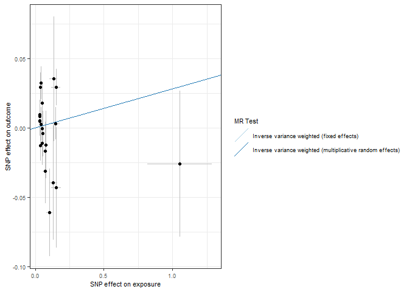<!-- -->

``` r
forrest_p <- mr_forest_plot(res_single)
forrest_p[[1]]
```

    ## Warning: Removed 1 row containing missing values or values outside the scale range
    ## (`geom_errorbarh()`).

    ## Warning: Removed 1 row containing missing values or values outside the scale range
    ## (`geom_point()`).

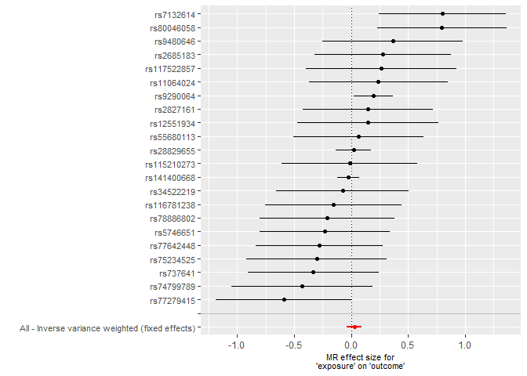<!-- -->

``` r
mr_dat <- read.csv("exposure/mr_dat_chrono")
mr_res <- read.csv("exposure/mr_res_chrono.csv")
res_single <- read.csv("exposure/res_single_chrono.csv")

mr_res
```

    ##   X id.exposure id.outcome outcome exposure
    ## 1 1      ZTnxm8     uopnk4 outcome exposure
    ## 2 2      ZTnxm8     uopnk4 outcome exposure
    ##                                                      method nsnp           b
    ## 1                 Inverse variance weighted (fixed effects)   19 0.006002749
    ## 2 Inverse variance weighted (multiplicative random effects)   19 0.006002749
    ##           se      pval
    ## 1 0.01812738 0.7405368
    ## 2 0.02809577 0.8308175

``` r
res_pleio <- mr_pleiotropy_test(mr_dat)

res_pleio %>%
  select(-id.exposure, -id.outcome, -outcome, -exposure) %>%
  gt() %>%
  fmt_number(
    columns = c('egger_intercept', 'se')
  ) %>%
  fmt_number(
    columns = pval,
    rows = pval > 0.001,
    decimals = 3
  ) %>% 
  fmt_scientific(
    columns = pval,
    rows = pval <= 0.001,
    decimals = 1
  )
```

<div id="oeljnfdtni" style="padding-left:0px;padding-right:0px;padding-top:10px;padding-bottom:10px;overflow-x:auto;overflow-y:auto;width:auto;height:auto;">
<style>#oeljnfdtni table {
  font-family: system-ui, 'Segoe UI', Roboto, Helvetica, Arial, sans-serif, 'Apple Color Emoji', 'Segoe UI Emoji', 'Segoe UI Symbol', 'Noto Color Emoji';
  -webkit-font-smoothing: antialiased;
  -moz-osx-font-smoothing: grayscale;
}
&#10;#oeljnfdtni thead, #oeljnfdtni tbody, #oeljnfdtni tfoot, #oeljnfdtni tr, #oeljnfdtni td, #oeljnfdtni th {
  border-style: none;
}
&#10;#oeljnfdtni p {
  margin: 0;
  padding: 0;
}
&#10;#oeljnfdtni .gt_table {
  display: table;
  border-collapse: collapse;
  line-height: normal;
  margin-left: auto;
  margin-right: auto;
  color: #333333;
  font-size: 16px;
  font-weight: normal;
  font-style: normal;
  background-color: #FFFFFF;
  width: auto;
  border-top-style: solid;
  border-top-width: 2px;
  border-top-color: #A8A8A8;
  border-right-style: none;
  border-right-width: 2px;
  border-right-color: #D3D3D3;
  border-bottom-style: solid;
  border-bottom-width: 2px;
  border-bottom-color: #A8A8A8;
  border-left-style: none;
  border-left-width: 2px;
  border-left-color: #D3D3D3;
}
&#10;#oeljnfdtni .gt_caption {
  padding-top: 4px;
  padding-bottom: 4px;
}
&#10;#oeljnfdtni .gt_title {
  color: #333333;
  font-size: 125%;
  font-weight: initial;
  padding-top: 4px;
  padding-bottom: 4px;
  padding-left: 5px;
  padding-right: 5px;
  border-bottom-color: #FFFFFF;
  border-bottom-width: 0;
}
&#10;#oeljnfdtni .gt_subtitle {
  color: #333333;
  font-size: 85%;
  font-weight: initial;
  padding-top: 3px;
  padding-bottom: 5px;
  padding-left: 5px;
  padding-right: 5px;
  border-top-color: #FFFFFF;
  border-top-width: 0;
}
&#10;#oeljnfdtni .gt_heading {
  background-color: #FFFFFF;
  text-align: center;
  border-bottom-color: #FFFFFF;
  border-left-style: none;
  border-left-width: 1px;
  border-left-color: #D3D3D3;
  border-right-style: none;
  border-right-width: 1px;
  border-right-color: #D3D3D3;
}
&#10;#oeljnfdtni .gt_bottom_border {
  border-bottom-style: solid;
  border-bottom-width: 2px;
  border-bottom-color: #D3D3D3;
}
&#10;#oeljnfdtni .gt_col_headings {
  border-top-style: solid;
  border-top-width: 2px;
  border-top-color: #D3D3D3;
  border-bottom-style: solid;
  border-bottom-width: 2px;
  border-bottom-color: #D3D3D3;
  border-left-style: none;
  border-left-width: 1px;
  border-left-color: #D3D3D3;
  border-right-style: none;
  border-right-width: 1px;
  border-right-color: #D3D3D3;
}
&#10;#oeljnfdtni .gt_col_heading {
  color: #333333;
  background-color: #FFFFFF;
  font-size: 100%;
  font-weight: normal;
  text-transform: inherit;
  border-left-style: none;
  border-left-width: 1px;
  border-left-color: #D3D3D3;
  border-right-style: none;
  border-right-width: 1px;
  border-right-color: #D3D3D3;
  vertical-align: bottom;
  padding-top: 5px;
  padding-bottom: 6px;
  padding-left: 5px;
  padding-right: 5px;
  overflow-x: hidden;
}
&#10;#oeljnfdtni .gt_column_spanner_outer {
  color: #333333;
  background-color: #FFFFFF;
  font-size: 100%;
  font-weight: normal;
  text-transform: inherit;
  padding-top: 0;
  padding-bottom: 0;
  padding-left: 4px;
  padding-right: 4px;
}
&#10;#oeljnfdtni .gt_column_spanner_outer:first-child {
  padding-left: 0;
}
&#10;#oeljnfdtni .gt_column_spanner_outer:last-child {
  padding-right: 0;
}
&#10;#oeljnfdtni .gt_column_spanner {
  border-bottom-style: solid;
  border-bottom-width: 2px;
  border-bottom-color: #D3D3D3;
  vertical-align: bottom;
  padding-top: 5px;
  padding-bottom: 5px;
  overflow-x: hidden;
  display: inline-block;
  width: 100%;
}
&#10;#oeljnfdtni .gt_spanner_row {
  border-bottom-style: hidden;
}
&#10;#oeljnfdtni .gt_group_heading {
  padding-top: 8px;
  padding-bottom: 8px;
  padding-left: 5px;
  padding-right: 5px;
  color: #333333;
  background-color: #FFFFFF;
  font-size: 100%;
  font-weight: initial;
  text-transform: inherit;
  border-top-style: solid;
  border-top-width: 2px;
  border-top-color: #D3D3D3;
  border-bottom-style: solid;
  border-bottom-width: 2px;
  border-bottom-color: #D3D3D3;
  border-left-style: none;
  border-left-width: 1px;
  border-left-color: #D3D3D3;
  border-right-style: none;
  border-right-width: 1px;
  border-right-color: #D3D3D3;
  vertical-align: middle;
  text-align: left;
}
&#10;#oeljnfdtni .gt_empty_group_heading {
  padding: 0.5px;
  color: #333333;
  background-color: #FFFFFF;
  font-size: 100%;
  font-weight: initial;
  border-top-style: solid;
  border-top-width: 2px;
  border-top-color: #D3D3D3;
  border-bottom-style: solid;
  border-bottom-width: 2px;
  border-bottom-color: #D3D3D3;
  vertical-align: middle;
}
&#10;#oeljnfdtni .gt_from_md > :first-child {
  margin-top: 0;
}
&#10;#oeljnfdtni .gt_from_md > :last-child {
  margin-bottom: 0;
}
&#10;#oeljnfdtni .gt_row {
  padding-top: 8px;
  padding-bottom: 8px;
  padding-left: 5px;
  padding-right: 5px;
  margin: 10px;
  border-top-style: solid;
  border-top-width: 1px;
  border-top-color: #D3D3D3;
  border-left-style: none;
  border-left-width: 1px;
  border-left-color: #D3D3D3;
  border-right-style: none;
  border-right-width: 1px;
  border-right-color: #D3D3D3;
  vertical-align: middle;
  overflow-x: hidden;
}
&#10;#oeljnfdtni .gt_stub {
  color: #333333;
  background-color: #FFFFFF;
  font-size: 100%;
  font-weight: initial;
  text-transform: inherit;
  border-right-style: solid;
  border-right-width: 2px;
  border-right-color: #D3D3D3;
  padding-left: 5px;
  padding-right: 5px;
}
&#10;#oeljnfdtni .gt_stub_row_group {
  color: #333333;
  background-color: #FFFFFF;
  font-size: 100%;
  font-weight: initial;
  text-transform: inherit;
  border-right-style: solid;
  border-right-width: 2px;
  border-right-color: #D3D3D3;
  padding-left: 5px;
  padding-right: 5px;
  vertical-align: top;
}
&#10;#oeljnfdtni .gt_row_group_first td {
  border-top-width: 2px;
}
&#10;#oeljnfdtni .gt_row_group_first th {
  border-top-width: 2px;
}
&#10;#oeljnfdtni .gt_summary_row {
  color: #333333;
  background-color: #FFFFFF;
  text-transform: inherit;
  padding-top: 8px;
  padding-bottom: 8px;
  padding-left: 5px;
  padding-right: 5px;
}
&#10;#oeljnfdtni .gt_first_summary_row {
  border-top-style: solid;
  border-top-color: #D3D3D3;
}
&#10;#oeljnfdtni .gt_first_summary_row.thick {
  border-top-width: 2px;
}
&#10;#oeljnfdtni .gt_last_summary_row {
  padding-top: 8px;
  padding-bottom: 8px;
  padding-left: 5px;
  padding-right: 5px;
  border-bottom-style: solid;
  border-bottom-width: 2px;
  border-bottom-color: #D3D3D3;
}
&#10;#oeljnfdtni .gt_grand_summary_row {
  color: #333333;
  background-color: #FFFFFF;
  text-transform: inherit;
  padding-top: 8px;
  padding-bottom: 8px;
  padding-left: 5px;
  padding-right: 5px;
}
&#10;#oeljnfdtni .gt_first_grand_summary_row {
  padding-top: 8px;
  padding-bottom: 8px;
  padding-left: 5px;
  padding-right: 5px;
  border-top-style: double;
  border-top-width: 6px;
  border-top-color: #D3D3D3;
}
&#10;#oeljnfdtni .gt_last_grand_summary_row_top {
  padding-top: 8px;
  padding-bottom: 8px;
  padding-left: 5px;
  padding-right: 5px;
  border-bottom-style: double;
  border-bottom-width: 6px;
  border-bottom-color: #D3D3D3;
}
&#10;#oeljnfdtni .gt_striped {
  background-color: rgba(128, 128, 128, 0.05);
}
&#10;#oeljnfdtni .gt_table_body {
  border-top-style: solid;
  border-top-width: 2px;
  border-top-color: #D3D3D3;
  border-bottom-style: solid;
  border-bottom-width: 2px;
  border-bottom-color: #D3D3D3;
}
&#10;#oeljnfdtni .gt_footnotes {
  color: #333333;
  background-color: #FFFFFF;
  border-bottom-style: none;
  border-bottom-width: 2px;
  border-bottom-color: #D3D3D3;
  border-left-style: none;
  border-left-width: 2px;
  border-left-color: #D3D3D3;
  border-right-style: none;
  border-right-width: 2px;
  border-right-color: #D3D3D3;
}
&#10;#oeljnfdtni .gt_footnote {
  margin: 0px;
  font-size: 90%;
  padding-top: 4px;
  padding-bottom: 4px;
  padding-left: 5px;
  padding-right: 5px;
}
&#10;#oeljnfdtni .gt_sourcenotes {
  color: #333333;
  background-color: #FFFFFF;
  border-bottom-style: none;
  border-bottom-width: 2px;
  border-bottom-color: #D3D3D3;
  border-left-style: none;
  border-left-width: 2px;
  border-left-color: #D3D3D3;
  border-right-style: none;
  border-right-width: 2px;
  border-right-color: #D3D3D3;
}
&#10;#oeljnfdtni .gt_sourcenote {
  font-size: 90%;
  padding-top: 4px;
  padding-bottom: 4px;
  padding-left: 5px;
  padding-right: 5px;
}
&#10;#oeljnfdtni .gt_left {
  text-align: left;
}
&#10;#oeljnfdtni .gt_center {
  text-align: center;
}
&#10;#oeljnfdtni .gt_right {
  text-align: right;
  font-variant-numeric: tabular-nums;
}
&#10;#oeljnfdtni .gt_font_normal {
  font-weight: normal;
}
&#10;#oeljnfdtni .gt_font_bold {
  font-weight: bold;
}
&#10;#oeljnfdtni .gt_font_italic {
  font-style: italic;
}
&#10;#oeljnfdtni .gt_super {
  font-size: 65%;
}
&#10;#oeljnfdtni .gt_footnote_marks {
  font-size: 75%;
  vertical-align: 0.4em;
  position: initial;
}
&#10;#oeljnfdtni .gt_asterisk {
  font-size: 100%;
  vertical-align: 0;
}
&#10;#oeljnfdtni .gt_indent_1 {
  text-indent: 5px;
}
&#10;#oeljnfdtni .gt_indent_2 {
  text-indent: 10px;
}
&#10;#oeljnfdtni .gt_indent_3 {
  text-indent: 15px;
}
&#10;#oeljnfdtni .gt_indent_4 {
  text-indent: 20px;
}
&#10;#oeljnfdtni .gt_indent_5 {
  text-indent: 25px;
}
&#10;#oeljnfdtni .katex-display {
  display: inline-flex !important;
  margin-bottom: 0.75em !important;
}
&#10;#oeljnfdtni div.Reactable > div.rt-table > div.rt-thead > div.rt-tr.rt-tr-group-header > div.rt-th-group:after {
  height: 0px !important;
}
</style>
<table class="gt_table" data-quarto-disable-processing="false" data-quarto-bootstrap="false">
  <thead>
    <tr class="gt_col_headings">
      <th class="gt_col_heading gt_columns_bottom_border gt_right" rowspan="1" colspan="1" scope="col" id="egger_intercept">egger_intercept</th>
      <th class="gt_col_heading gt_columns_bottom_border gt_right" rowspan="1" colspan="1" scope="col" id="se">se</th>
      <th class="gt_col_heading gt_columns_bottom_border gt_right" rowspan="1" colspan="1" scope="col" id="pval">pval</th>
    </tr>
  </thead>
  <tbody class="gt_table_body">
    <tr><td headers="egger_intercept" class="gt_row gt_right">0.00</td>
<td headers="se" class="gt_row gt_right">0.00</td>
<td headers="pval" class="gt_row gt_right">0.468</td></tr>
  </tbody>
  &#10;  
</table>
</div>

``` r
# Heterogeneity statistics 
res_het <- mr_heterogeneity(mr_dat, method_list = c(
  "mr_ivw_fe", "mr_ivw_mre"
))

res_het %>%
  select(-id.exposure, -id.outcome, -outcome, -exposure) %>%
  gt() %>%
  fmt_number(
    columns = Q
  ) %>%
  fmt_number(
    columns = Q_pval,
    rows = Q_pval > 0.001,
    decimals = 3
  ) %>% 
  fmt_scientific(
    columns = Q_pval,
    rows = Q_pval <= 0.001,
    decimals = 1
  )
```

<div id="zlqguhimga" style="padding-left:0px;padding-right:0px;padding-top:10px;padding-bottom:10px;overflow-x:auto;overflow-y:auto;width:auto;height:auto;">
<style>#zlqguhimga table {
  font-family: system-ui, 'Segoe UI', Roboto, Helvetica, Arial, sans-serif, 'Apple Color Emoji', 'Segoe UI Emoji', 'Segoe UI Symbol', 'Noto Color Emoji';
  -webkit-font-smoothing: antialiased;
  -moz-osx-font-smoothing: grayscale;
}
&#10;#zlqguhimga thead, #zlqguhimga tbody, #zlqguhimga tfoot, #zlqguhimga tr, #zlqguhimga td, #zlqguhimga th {
  border-style: none;
}
&#10;#zlqguhimga p {
  margin: 0;
  padding: 0;
}
&#10;#zlqguhimga .gt_table {
  display: table;
  border-collapse: collapse;
  line-height: normal;
  margin-left: auto;
  margin-right: auto;
  color: #333333;
  font-size: 16px;
  font-weight: normal;
  font-style: normal;
  background-color: #FFFFFF;
  width: auto;
  border-top-style: solid;
  border-top-width: 2px;
  border-top-color: #A8A8A8;
  border-right-style: none;
  border-right-width: 2px;
  border-right-color: #D3D3D3;
  border-bottom-style: solid;
  border-bottom-width: 2px;
  border-bottom-color: #A8A8A8;
  border-left-style: none;
  border-left-width: 2px;
  border-left-color: #D3D3D3;
}
&#10;#zlqguhimga .gt_caption {
  padding-top: 4px;
  padding-bottom: 4px;
}
&#10;#zlqguhimga .gt_title {
  color: #333333;
  font-size: 125%;
  font-weight: initial;
  padding-top: 4px;
  padding-bottom: 4px;
  padding-left: 5px;
  padding-right: 5px;
  border-bottom-color: #FFFFFF;
  border-bottom-width: 0;
}
&#10;#zlqguhimga .gt_subtitle {
  color: #333333;
  font-size: 85%;
  font-weight: initial;
  padding-top: 3px;
  padding-bottom: 5px;
  padding-left: 5px;
  padding-right: 5px;
  border-top-color: #FFFFFF;
  border-top-width: 0;
}
&#10;#zlqguhimga .gt_heading {
  background-color: #FFFFFF;
  text-align: center;
  border-bottom-color: #FFFFFF;
  border-left-style: none;
  border-left-width: 1px;
  border-left-color: #D3D3D3;
  border-right-style: none;
  border-right-width: 1px;
  border-right-color: #D3D3D3;
}
&#10;#zlqguhimga .gt_bottom_border {
  border-bottom-style: solid;
  border-bottom-width: 2px;
  border-bottom-color: #D3D3D3;
}
&#10;#zlqguhimga .gt_col_headings {
  border-top-style: solid;
  border-top-width: 2px;
  border-top-color: #D3D3D3;
  border-bottom-style: solid;
  border-bottom-width: 2px;
  border-bottom-color: #D3D3D3;
  border-left-style: none;
  border-left-width: 1px;
  border-left-color: #D3D3D3;
  border-right-style: none;
  border-right-width: 1px;
  border-right-color: #D3D3D3;
}
&#10;#zlqguhimga .gt_col_heading {
  color: #333333;
  background-color: #FFFFFF;
  font-size: 100%;
  font-weight: normal;
  text-transform: inherit;
  border-left-style: none;
  border-left-width: 1px;
  border-left-color: #D3D3D3;
  border-right-style: none;
  border-right-width: 1px;
  border-right-color: #D3D3D3;
  vertical-align: bottom;
  padding-top: 5px;
  padding-bottom: 6px;
  padding-left: 5px;
  padding-right: 5px;
  overflow-x: hidden;
}
&#10;#zlqguhimga .gt_column_spanner_outer {
  color: #333333;
  background-color: #FFFFFF;
  font-size: 100%;
  font-weight: normal;
  text-transform: inherit;
  padding-top: 0;
  padding-bottom: 0;
  padding-left: 4px;
  padding-right: 4px;
}
&#10;#zlqguhimga .gt_column_spanner_outer:first-child {
  padding-left: 0;
}
&#10;#zlqguhimga .gt_column_spanner_outer:last-child {
  padding-right: 0;
}
&#10;#zlqguhimga .gt_column_spanner {
  border-bottom-style: solid;
  border-bottom-width: 2px;
  border-bottom-color: #D3D3D3;
  vertical-align: bottom;
  padding-top: 5px;
  padding-bottom: 5px;
  overflow-x: hidden;
  display: inline-block;
  width: 100%;
}
&#10;#zlqguhimga .gt_spanner_row {
  border-bottom-style: hidden;
}
&#10;#zlqguhimga .gt_group_heading {
  padding-top: 8px;
  padding-bottom: 8px;
  padding-left: 5px;
  padding-right: 5px;
  color: #333333;
  background-color: #FFFFFF;
  font-size: 100%;
  font-weight: initial;
  text-transform: inherit;
  border-top-style: solid;
  border-top-width: 2px;
  border-top-color: #D3D3D3;
  border-bottom-style: solid;
  border-bottom-width: 2px;
  border-bottom-color: #D3D3D3;
  border-left-style: none;
  border-left-width: 1px;
  border-left-color: #D3D3D3;
  border-right-style: none;
  border-right-width: 1px;
  border-right-color: #D3D3D3;
  vertical-align: middle;
  text-align: left;
}
&#10;#zlqguhimga .gt_empty_group_heading {
  padding: 0.5px;
  color: #333333;
  background-color: #FFFFFF;
  font-size: 100%;
  font-weight: initial;
  border-top-style: solid;
  border-top-width: 2px;
  border-top-color: #D3D3D3;
  border-bottom-style: solid;
  border-bottom-width: 2px;
  border-bottom-color: #D3D3D3;
  vertical-align: middle;
}
&#10;#zlqguhimga .gt_from_md > :first-child {
  margin-top: 0;
}
&#10;#zlqguhimga .gt_from_md > :last-child {
  margin-bottom: 0;
}
&#10;#zlqguhimga .gt_row {
  padding-top: 8px;
  padding-bottom: 8px;
  padding-left: 5px;
  padding-right: 5px;
  margin: 10px;
  border-top-style: solid;
  border-top-width: 1px;
  border-top-color: #D3D3D3;
  border-left-style: none;
  border-left-width: 1px;
  border-left-color: #D3D3D3;
  border-right-style: none;
  border-right-width: 1px;
  border-right-color: #D3D3D3;
  vertical-align: middle;
  overflow-x: hidden;
}
&#10;#zlqguhimga .gt_stub {
  color: #333333;
  background-color: #FFFFFF;
  font-size: 100%;
  font-weight: initial;
  text-transform: inherit;
  border-right-style: solid;
  border-right-width: 2px;
  border-right-color: #D3D3D3;
  padding-left: 5px;
  padding-right: 5px;
}
&#10;#zlqguhimga .gt_stub_row_group {
  color: #333333;
  background-color: #FFFFFF;
  font-size: 100%;
  font-weight: initial;
  text-transform: inherit;
  border-right-style: solid;
  border-right-width: 2px;
  border-right-color: #D3D3D3;
  padding-left: 5px;
  padding-right: 5px;
  vertical-align: top;
}
&#10;#zlqguhimga .gt_row_group_first td {
  border-top-width: 2px;
}
&#10;#zlqguhimga .gt_row_group_first th {
  border-top-width: 2px;
}
&#10;#zlqguhimga .gt_summary_row {
  color: #333333;
  background-color: #FFFFFF;
  text-transform: inherit;
  padding-top: 8px;
  padding-bottom: 8px;
  padding-left: 5px;
  padding-right: 5px;
}
&#10;#zlqguhimga .gt_first_summary_row {
  border-top-style: solid;
  border-top-color: #D3D3D3;
}
&#10;#zlqguhimga .gt_first_summary_row.thick {
  border-top-width: 2px;
}
&#10;#zlqguhimga .gt_last_summary_row {
  padding-top: 8px;
  padding-bottom: 8px;
  padding-left: 5px;
  padding-right: 5px;
  border-bottom-style: solid;
  border-bottom-width: 2px;
  border-bottom-color: #D3D3D3;
}
&#10;#zlqguhimga .gt_grand_summary_row {
  color: #333333;
  background-color: #FFFFFF;
  text-transform: inherit;
  padding-top: 8px;
  padding-bottom: 8px;
  padding-left: 5px;
  padding-right: 5px;
}
&#10;#zlqguhimga .gt_first_grand_summary_row {
  padding-top: 8px;
  padding-bottom: 8px;
  padding-left: 5px;
  padding-right: 5px;
  border-top-style: double;
  border-top-width: 6px;
  border-top-color: #D3D3D3;
}
&#10;#zlqguhimga .gt_last_grand_summary_row_top {
  padding-top: 8px;
  padding-bottom: 8px;
  padding-left: 5px;
  padding-right: 5px;
  border-bottom-style: double;
  border-bottom-width: 6px;
  border-bottom-color: #D3D3D3;
}
&#10;#zlqguhimga .gt_striped {
  background-color: rgba(128, 128, 128, 0.05);
}
&#10;#zlqguhimga .gt_table_body {
  border-top-style: solid;
  border-top-width: 2px;
  border-top-color: #D3D3D3;
  border-bottom-style: solid;
  border-bottom-width: 2px;
  border-bottom-color: #D3D3D3;
}
&#10;#zlqguhimga .gt_footnotes {
  color: #333333;
  background-color: #FFFFFF;
  border-bottom-style: none;
  border-bottom-width: 2px;
  border-bottom-color: #D3D3D3;
  border-left-style: none;
  border-left-width: 2px;
  border-left-color: #D3D3D3;
  border-right-style: none;
  border-right-width: 2px;
  border-right-color: #D3D3D3;
}
&#10;#zlqguhimga .gt_footnote {
  margin: 0px;
  font-size: 90%;
  padding-top: 4px;
  padding-bottom: 4px;
  padding-left: 5px;
  padding-right: 5px;
}
&#10;#zlqguhimga .gt_sourcenotes {
  color: #333333;
  background-color: #FFFFFF;
  border-bottom-style: none;
  border-bottom-width: 2px;
  border-bottom-color: #D3D3D3;
  border-left-style: none;
  border-left-width: 2px;
  border-left-color: #D3D3D3;
  border-right-style: none;
  border-right-width: 2px;
  border-right-color: #D3D3D3;
}
&#10;#zlqguhimga .gt_sourcenote {
  font-size: 90%;
  padding-top: 4px;
  padding-bottom: 4px;
  padding-left: 5px;
  padding-right: 5px;
}
&#10;#zlqguhimga .gt_left {
  text-align: left;
}
&#10;#zlqguhimga .gt_center {
  text-align: center;
}
&#10;#zlqguhimga .gt_right {
  text-align: right;
  font-variant-numeric: tabular-nums;
}
&#10;#zlqguhimga .gt_font_normal {
  font-weight: normal;
}
&#10;#zlqguhimga .gt_font_bold {
  font-weight: bold;
}
&#10;#zlqguhimga .gt_font_italic {
  font-style: italic;
}
&#10;#zlqguhimga .gt_super {
  font-size: 65%;
}
&#10;#zlqguhimga .gt_footnote_marks {
  font-size: 75%;
  vertical-align: 0.4em;
  position: initial;
}
&#10;#zlqguhimga .gt_asterisk {
  font-size: 100%;
  vertical-align: 0;
}
&#10;#zlqguhimga .gt_indent_1 {
  text-indent: 5px;
}
&#10;#zlqguhimga .gt_indent_2 {
  text-indent: 10px;
}
&#10;#zlqguhimga .gt_indent_3 {
  text-indent: 15px;
}
&#10;#zlqguhimga .gt_indent_4 {
  text-indent: 20px;
}
&#10;#zlqguhimga .gt_indent_5 {
  text-indent: 25px;
}
&#10;#zlqguhimga .katex-display {
  display: inline-flex !important;
  margin-bottom: 0.75em !important;
}
&#10;#zlqguhimga div.Reactable > div.rt-table > div.rt-thead > div.rt-tr.rt-tr-group-header > div.rt-th-group:after {
  height: 0px !important;
}
</style>
<table class="gt_table" data-quarto-disable-processing="false" data-quarto-bootstrap="false">
  <thead>
    <tr class="gt_col_headings">
      <th class="gt_col_heading gt_columns_bottom_border gt_left" rowspan="1" colspan="1" scope="col" id="method">method</th>
      <th class="gt_col_heading gt_columns_bottom_border gt_right" rowspan="1" colspan="1" scope="col" id="Q">Q</th>
      <th class="gt_col_heading gt_columns_bottom_border gt_right" rowspan="1" colspan="1" scope="col" id="Q_df">Q_df</th>
      <th class="gt_col_heading gt_columns_bottom_border gt_right" rowspan="1" colspan="1" scope="col" id="Q_pval">Q_pval</th>
    </tr>
  </thead>
  <tbody class="gt_table_body">
    <tr><td headers="method" class="gt_row gt_left">Inverse variance weighted (fixed effects)</td>
<td headers="Q" class="gt_row gt_right">43.24</td>
<td headers="Q_df" class="gt_row gt_right">18</td>
<td headers="Q_pval" class="gt_row gt_right">7.4&nbsp;×&nbsp;10<sup style='font-size: 65%;'>−4</sup></td></tr>
    <tr><td headers="method" class="gt_row gt_left">Inverse variance weighted (multiplicative random effects)</td>
<td headers="Q" class="gt_row gt_right">43.24</td>
<td headers="Q_df" class="gt_row gt_right">18</td>
<td headers="Q_pval" class="gt_row gt_right">7.4&nbsp;×&nbsp;10<sup style='font-size: 65%;'>−4</sup></td></tr>
  </tbody>
  &#10;  
</table>
</div>

``` r
scatter_p <- mr_scatter_plot(mr_res, mr_dat)
scatter_out_p <- scatter_p[[1]] + theme_bw() +
  guides(color=guide_legend(ncol =1)) +
  theme(
    text = element_text(size = 8),
  )
scatter_out_p
```

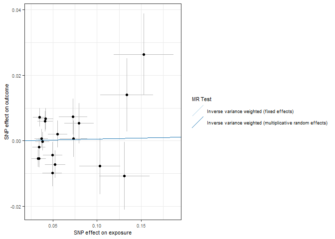<!-- -->

``` r
forrest_p <- mr_forest_plot(res_single)
forrest_p[[1]]
```

    ## Warning: Removed 1 row containing missing values or values outside the scale range
    ## (`geom_errorbarh()`).

    ## Warning: Removed 1 row containing missing values or values outside the scale range
    ## (`geom_point()`).

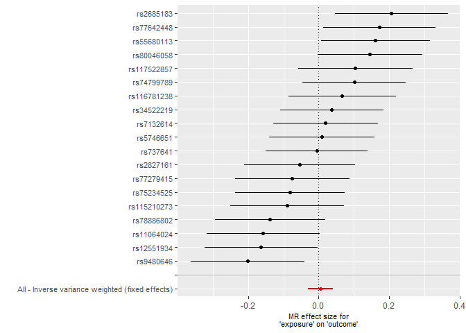<!-- -->

``` r
mr_dat <- read.csv("exposure/mr_dat_covid")
mr_res <- read.csv("exposure/mr_res_covid.csv")
res_single <- read.csv("exposure/res_single_covid.csv")

mr_res
```

    ##   X id.exposure id.outcome outcome exposure
    ## 1 1      ZTnxm8     TgXfaX outcome exposure
    ## 2 2      ZTnxm8     TgXfaX outcome exposure
    ##                                                      method nsnp           b
    ## 1                 Inverse variance weighted (fixed effects)   17 -0.01810289
    ## 2 Inverse variance weighted (multiplicative random effects)   17 -0.01810289
    ##           se      pval
    ## 1 0.06883699 0.7925644
    ## 2 0.07481755 0.8088107

``` r
res_pleio <- mr_pleiotropy_test(mr_dat)

res_pleio %>%
  select(-id.exposure, -id.outcome, -outcome, -exposure) %>%
  gt() %>%
  fmt_number(
    columns = c('egger_intercept', 'se')
  ) %>%
  fmt_number(
    columns = pval,
    rows = pval > 0.001,
    decimals = 3
  ) %>% 
  fmt_scientific(
    columns = pval,
    rows = pval <= 0.001,
    decimals = 1
  )
```

<div id="vgxwnpxkjm" style="padding-left:0px;padding-right:0px;padding-top:10px;padding-bottom:10px;overflow-x:auto;overflow-y:auto;width:auto;height:auto;">
<style>#vgxwnpxkjm table {
  font-family: system-ui, 'Segoe UI', Roboto, Helvetica, Arial, sans-serif, 'Apple Color Emoji', 'Segoe UI Emoji', 'Segoe UI Symbol', 'Noto Color Emoji';
  -webkit-font-smoothing: antialiased;
  -moz-osx-font-smoothing: grayscale;
}
&#10;#vgxwnpxkjm thead, #vgxwnpxkjm tbody, #vgxwnpxkjm tfoot, #vgxwnpxkjm tr, #vgxwnpxkjm td, #vgxwnpxkjm th {
  border-style: none;
}
&#10;#vgxwnpxkjm p {
  margin: 0;
  padding: 0;
}
&#10;#vgxwnpxkjm .gt_table {
  display: table;
  border-collapse: collapse;
  line-height: normal;
  margin-left: auto;
  margin-right: auto;
  color: #333333;
  font-size: 16px;
  font-weight: normal;
  font-style: normal;
  background-color: #FFFFFF;
  width: auto;
  border-top-style: solid;
  border-top-width: 2px;
  border-top-color: #A8A8A8;
  border-right-style: none;
  border-right-width: 2px;
  border-right-color: #D3D3D3;
  border-bottom-style: solid;
  border-bottom-width: 2px;
  border-bottom-color: #A8A8A8;
  border-left-style: none;
  border-left-width: 2px;
  border-left-color: #D3D3D3;
}
&#10;#vgxwnpxkjm .gt_caption {
  padding-top: 4px;
  padding-bottom: 4px;
}
&#10;#vgxwnpxkjm .gt_title {
  color: #333333;
  font-size: 125%;
  font-weight: initial;
  padding-top: 4px;
  padding-bottom: 4px;
  padding-left: 5px;
  padding-right: 5px;
  border-bottom-color: #FFFFFF;
  border-bottom-width: 0;
}
&#10;#vgxwnpxkjm .gt_subtitle {
  color: #333333;
  font-size: 85%;
  font-weight: initial;
  padding-top: 3px;
  padding-bottom: 5px;
  padding-left: 5px;
  padding-right: 5px;
  border-top-color: #FFFFFF;
  border-top-width: 0;
}
&#10;#vgxwnpxkjm .gt_heading {
  background-color: #FFFFFF;
  text-align: center;
  border-bottom-color: #FFFFFF;
  border-left-style: none;
  border-left-width: 1px;
  border-left-color: #D3D3D3;
  border-right-style: none;
  border-right-width: 1px;
  border-right-color: #D3D3D3;
}
&#10;#vgxwnpxkjm .gt_bottom_border {
  border-bottom-style: solid;
  border-bottom-width: 2px;
  border-bottom-color: #D3D3D3;
}
&#10;#vgxwnpxkjm .gt_col_headings {
  border-top-style: solid;
  border-top-width: 2px;
  border-top-color: #D3D3D3;
  border-bottom-style: solid;
  border-bottom-width: 2px;
  border-bottom-color: #D3D3D3;
  border-left-style: none;
  border-left-width: 1px;
  border-left-color: #D3D3D3;
  border-right-style: none;
  border-right-width: 1px;
  border-right-color: #D3D3D3;
}
&#10;#vgxwnpxkjm .gt_col_heading {
  color: #333333;
  background-color: #FFFFFF;
  font-size: 100%;
  font-weight: normal;
  text-transform: inherit;
  border-left-style: none;
  border-left-width: 1px;
  border-left-color: #D3D3D3;
  border-right-style: none;
  border-right-width: 1px;
  border-right-color: #D3D3D3;
  vertical-align: bottom;
  padding-top: 5px;
  padding-bottom: 6px;
  padding-left: 5px;
  padding-right: 5px;
  overflow-x: hidden;
}
&#10;#vgxwnpxkjm .gt_column_spanner_outer {
  color: #333333;
  background-color: #FFFFFF;
  font-size: 100%;
  font-weight: normal;
  text-transform: inherit;
  padding-top: 0;
  padding-bottom: 0;
  padding-left: 4px;
  padding-right: 4px;
}
&#10;#vgxwnpxkjm .gt_column_spanner_outer:first-child {
  padding-left: 0;
}
&#10;#vgxwnpxkjm .gt_column_spanner_outer:last-child {
  padding-right: 0;
}
&#10;#vgxwnpxkjm .gt_column_spanner {
  border-bottom-style: solid;
  border-bottom-width: 2px;
  border-bottom-color: #D3D3D3;
  vertical-align: bottom;
  padding-top: 5px;
  padding-bottom: 5px;
  overflow-x: hidden;
  display: inline-block;
  width: 100%;
}
&#10;#vgxwnpxkjm .gt_spanner_row {
  border-bottom-style: hidden;
}
&#10;#vgxwnpxkjm .gt_group_heading {
  padding-top: 8px;
  padding-bottom: 8px;
  padding-left: 5px;
  padding-right: 5px;
  color: #333333;
  background-color: #FFFFFF;
  font-size: 100%;
  font-weight: initial;
  text-transform: inherit;
  border-top-style: solid;
  border-top-width: 2px;
  border-top-color: #D3D3D3;
  border-bottom-style: solid;
  border-bottom-width: 2px;
  border-bottom-color: #D3D3D3;
  border-left-style: none;
  border-left-width: 1px;
  border-left-color: #D3D3D3;
  border-right-style: none;
  border-right-width: 1px;
  border-right-color: #D3D3D3;
  vertical-align: middle;
  text-align: left;
}
&#10;#vgxwnpxkjm .gt_empty_group_heading {
  padding: 0.5px;
  color: #333333;
  background-color: #FFFFFF;
  font-size: 100%;
  font-weight: initial;
  border-top-style: solid;
  border-top-width: 2px;
  border-top-color: #D3D3D3;
  border-bottom-style: solid;
  border-bottom-width: 2px;
  border-bottom-color: #D3D3D3;
  vertical-align: middle;
}
&#10;#vgxwnpxkjm .gt_from_md > :first-child {
  margin-top: 0;
}
&#10;#vgxwnpxkjm .gt_from_md > :last-child {
  margin-bottom: 0;
}
&#10;#vgxwnpxkjm .gt_row {
  padding-top: 8px;
  padding-bottom: 8px;
  padding-left: 5px;
  padding-right: 5px;
  margin: 10px;
  border-top-style: solid;
  border-top-width: 1px;
  border-top-color: #D3D3D3;
  border-left-style: none;
  border-left-width: 1px;
  border-left-color: #D3D3D3;
  border-right-style: none;
  border-right-width: 1px;
  border-right-color: #D3D3D3;
  vertical-align: middle;
  overflow-x: hidden;
}
&#10;#vgxwnpxkjm .gt_stub {
  color: #333333;
  background-color: #FFFFFF;
  font-size: 100%;
  font-weight: initial;
  text-transform: inherit;
  border-right-style: solid;
  border-right-width: 2px;
  border-right-color: #D3D3D3;
  padding-left: 5px;
  padding-right: 5px;
}
&#10;#vgxwnpxkjm .gt_stub_row_group {
  color: #333333;
  background-color: #FFFFFF;
  font-size: 100%;
  font-weight: initial;
  text-transform: inherit;
  border-right-style: solid;
  border-right-width: 2px;
  border-right-color: #D3D3D3;
  padding-left: 5px;
  padding-right: 5px;
  vertical-align: top;
}
&#10;#vgxwnpxkjm .gt_row_group_first td {
  border-top-width: 2px;
}
&#10;#vgxwnpxkjm .gt_row_group_first th {
  border-top-width: 2px;
}
&#10;#vgxwnpxkjm .gt_summary_row {
  color: #333333;
  background-color: #FFFFFF;
  text-transform: inherit;
  padding-top: 8px;
  padding-bottom: 8px;
  padding-left: 5px;
  padding-right: 5px;
}
&#10;#vgxwnpxkjm .gt_first_summary_row {
  border-top-style: solid;
  border-top-color: #D3D3D3;
}
&#10;#vgxwnpxkjm .gt_first_summary_row.thick {
  border-top-width: 2px;
}
&#10;#vgxwnpxkjm .gt_last_summary_row {
  padding-top: 8px;
  padding-bottom: 8px;
  padding-left: 5px;
  padding-right: 5px;
  border-bottom-style: solid;
  border-bottom-width: 2px;
  border-bottom-color: #D3D3D3;
}
&#10;#vgxwnpxkjm .gt_grand_summary_row {
  color: #333333;
  background-color: #FFFFFF;
  text-transform: inherit;
  padding-top: 8px;
  padding-bottom: 8px;
  padding-left: 5px;
  padding-right: 5px;
}
&#10;#vgxwnpxkjm .gt_first_grand_summary_row {
  padding-top: 8px;
  padding-bottom: 8px;
  padding-left: 5px;
  padding-right: 5px;
  border-top-style: double;
  border-top-width: 6px;
  border-top-color: #D3D3D3;
}
&#10;#vgxwnpxkjm .gt_last_grand_summary_row_top {
  padding-top: 8px;
  padding-bottom: 8px;
  padding-left: 5px;
  padding-right: 5px;
  border-bottom-style: double;
  border-bottom-width: 6px;
  border-bottom-color: #D3D3D3;
}
&#10;#vgxwnpxkjm .gt_striped {
  background-color: rgba(128, 128, 128, 0.05);
}
&#10;#vgxwnpxkjm .gt_table_body {
  border-top-style: solid;
  border-top-width: 2px;
  border-top-color: #D3D3D3;
  border-bottom-style: solid;
  border-bottom-width: 2px;
  border-bottom-color: #D3D3D3;
}
&#10;#vgxwnpxkjm .gt_footnotes {
  color: #333333;
  background-color: #FFFFFF;
  border-bottom-style: none;
  border-bottom-width: 2px;
  border-bottom-color: #D3D3D3;
  border-left-style: none;
  border-left-width: 2px;
  border-left-color: #D3D3D3;
  border-right-style: none;
  border-right-width: 2px;
  border-right-color: #D3D3D3;
}
&#10;#vgxwnpxkjm .gt_footnote {
  margin: 0px;
  font-size: 90%;
  padding-top: 4px;
  padding-bottom: 4px;
  padding-left: 5px;
  padding-right: 5px;
}
&#10;#vgxwnpxkjm .gt_sourcenotes {
  color: #333333;
  background-color: #FFFFFF;
  border-bottom-style: none;
  border-bottom-width: 2px;
  border-bottom-color: #D3D3D3;
  border-left-style: none;
  border-left-width: 2px;
  border-left-color: #D3D3D3;
  border-right-style: none;
  border-right-width: 2px;
  border-right-color: #D3D3D3;
}
&#10;#vgxwnpxkjm .gt_sourcenote {
  font-size: 90%;
  padding-top: 4px;
  padding-bottom: 4px;
  padding-left: 5px;
  padding-right: 5px;
}
&#10;#vgxwnpxkjm .gt_left {
  text-align: left;
}
&#10;#vgxwnpxkjm .gt_center {
  text-align: center;
}
&#10;#vgxwnpxkjm .gt_right {
  text-align: right;
  font-variant-numeric: tabular-nums;
}
&#10;#vgxwnpxkjm .gt_font_normal {
  font-weight: normal;
}
&#10;#vgxwnpxkjm .gt_font_bold {
  font-weight: bold;
}
&#10;#vgxwnpxkjm .gt_font_italic {
  font-style: italic;
}
&#10;#vgxwnpxkjm .gt_super {
  font-size: 65%;
}
&#10;#vgxwnpxkjm .gt_footnote_marks {
  font-size: 75%;
  vertical-align: 0.4em;
  position: initial;
}
&#10;#vgxwnpxkjm .gt_asterisk {
  font-size: 100%;
  vertical-align: 0;
}
&#10;#vgxwnpxkjm .gt_indent_1 {
  text-indent: 5px;
}
&#10;#vgxwnpxkjm .gt_indent_2 {
  text-indent: 10px;
}
&#10;#vgxwnpxkjm .gt_indent_3 {
  text-indent: 15px;
}
&#10;#vgxwnpxkjm .gt_indent_4 {
  text-indent: 20px;
}
&#10;#vgxwnpxkjm .gt_indent_5 {
  text-indent: 25px;
}
&#10;#vgxwnpxkjm .katex-display {
  display: inline-flex !important;
  margin-bottom: 0.75em !important;
}
&#10;#vgxwnpxkjm div.Reactable > div.rt-table > div.rt-thead > div.rt-tr.rt-tr-group-header > div.rt-th-group:after {
  height: 0px !important;
}
</style>
<table class="gt_table" data-quarto-disable-processing="false" data-quarto-bootstrap="false">
  <thead>
    <tr class="gt_col_headings">
      <th class="gt_col_heading gt_columns_bottom_border gt_right" rowspan="1" colspan="1" scope="col" id="egger_intercept">egger_intercept</th>
      <th class="gt_col_heading gt_columns_bottom_border gt_right" rowspan="1" colspan="1" scope="col" id="se">se</th>
      <th class="gt_col_heading gt_columns_bottom_border gt_right" rowspan="1" colspan="1" scope="col" id="pval">pval</th>
    </tr>
  </thead>
  <tbody class="gt_table_body">
    <tr><td headers="egger_intercept" class="gt_row gt_right">0.00</td>
<td headers="se" class="gt_row gt_right">0.01</td>
<td headers="pval" class="gt_row gt_right">0.921</td></tr>
  </tbody>
  &#10;  
</table>
</div>

``` r
# Heterogeneity statistics 
res_het <- mr_heterogeneity(mr_dat, method_list = c(
  "mr_ivw_fe", "mr_ivw_mre"
))

res_het %>%
  select(-id.exposure, -id.outcome, -outcome, -exposure) %>%
  gt() %>%
  fmt_number(
    columns = Q
  ) %>%
  fmt_number(
    columns = Q_pval,
    rows = Q_pval > 0.001,
    decimals = 3
  ) %>% 
  fmt_scientific(
    columns = Q_pval,
    rows = Q_pval <= 0.001,
    decimals = 1
  )
```

<div id="fkdnblyymm" style="padding-left:0px;padding-right:0px;padding-top:10px;padding-bottom:10px;overflow-x:auto;overflow-y:auto;width:auto;height:auto;">
<style>#fkdnblyymm table {
  font-family: system-ui, 'Segoe UI', Roboto, Helvetica, Arial, sans-serif, 'Apple Color Emoji', 'Segoe UI Emoji', 'Segoe UI Symbol', 'Noto Color Emoji';
  -webkit-font-smoothing: antialiased;
  -moz-osx-font-smoothing: grayscale;
}
&#10;#fkdnblyymm thead, #fkdnblyymm tbody, #fkdnblyymm tfoot, #fkdnblyymm tr, #fkdnblyymm td, #fkdnblyymm th {
  border-style: none;
}
&#10;#fkdnblyymm p {
  margin: 0;
  padding: 0;
}
&#10;#fkdnblyymm .gt_table {
  display: table;
  border-collapse: collapse;
  line-height: normal;
  margin-left: auto;
  margin-right: auto;
  color: #333333;
  font-size: 16px;
  font-weight: normal;
  font-style: normal;
  background-color: #FFFFFF;
  width: auto;
  border-top-style: solid;
  border-top-width: 2px;
  border-top-color: #A8A8A8;
  border-right-style: none;
  border-right-width: 2px;
  border-right-color: #D3D3D3;
  border-bottom-style: solid;
  border-bottom-width: 2px;
  border-bottom-color: #A8A8A8;
  border-left-style: none;
  border-left-width: 2px;
  border-left-color: #D3D3D3;
}
&#10;#fkdnblyymm .gt_caption {
  padding-top: 4px;
  padding-bottom: 4px;
}
&#10;#fkdnblyymm .gt_title {
  color: #333333;
  font-size: 125%;
  font-weight: initial;
  padding-top: 4px;
  padding-bottom: 4px;
  padding-left: 5px;
  padding-right: 5px;
  border-bottom-color: #FFFFFF;
  border-bottom-width: 0;
}
&#10;#fkdnblyymm .gt_subtitle {
  color: #333333;
  font-size: 85%;
  font-weight: initial;
  padding-top: 3px;
  padding-bottom: 5px;
  padding-left: 5px;
  padding-right: 5px;
  border-top-color: #FFFFFF;
  border-top-width: 0;
}
&#10;#fkdnblyymm .gt_heading {
  background-color: #FFFFFF;
  text-align: center;
  border-bottom-color: #FFFFFF;
  border-left-style: none;
  border-left-width: 1px;
  border-left-color: #D3D3D3;
  border-right-style: none;
  border-right-width: 1px;
  border-right-color: #D3D3D3;
}
&#10;#fkdnblyymm .gt_bottom_border {
  border-bottom-style: solid;
  border-bottom-width: 2px;
  border-bottom-color: #D3D3D3;
}
&#10;#fkdnblyymm .gt_col_headings {
  border-top-style: solid;
  border-top-width: 2px;
  border-top-color: #D3D3D3;
  border-bottom-style: solid;
  border-bottom-width: 2px;
  border-bottom-color: #D3D3D3;
  border-left-style: none;
  border-left-width: 1px;
  border-left-color: #D3D3D3;
  border-right-style: none;
  border-right-width: 1px;
  border-right-color: #D3D3D3;
}
&#10;#fkdnblyymm .gt_col_heading {
  color: #333333;
  background-color: #FFFFFF;
  font-size: 100%;
  font-weight: normal;
  text-transform: inherit;
  border-left-style: none;
  border-left-width: 1px;
  border-left-color: #D3D3D3;
  border-right-style: none;
  border-right-width: 1px;
  border-right-color: #D3D3D3;
  vertical-align: bottom;
  padding-top: 5px;
  padding-bottom: 6px;
  padding-left: 5px;
  padding-right: 5px;
  overflow-x: hidden;
}
&#10;#fkdnblyymm .gt_column_spanner_outer {
  color: #333333;
  background-color: #FFFFFF;
  font-size: 100%;
  font-weight: normal;
  text-transform: inherit;
  padding-top: 0;
  padding-bottom: 0;
  padding-left: 4px;
  padding-right: 4px;
}
&#10;#fkdnblyymm .gt_column_spanner_outer:first-child {
  padding-left: 0;
}
&#10;#fkdnblyymm .gt_column_spanner_outer:last-child {
  padding-right: 0;
}
&#10;#fkdnblyymm .gt_column_spanner {
  border-bottom-style: solid;
  border-bottom-width: 2px;
  border-bottom-color: #D3D3D3;
  vertical-align: bottom;
  padding-top: 5px;
  padding-bottom: 5px;
  overflow-x: hidden;
  display: inline-block;
  width: 100%;
}
&#10;#fkdnblyymm .gt_spanner_row {
  border-bottom-style: hidden;
}
&#10;#fkdnblyymm .gt_group_heading {
  padding-top: 8px;
  padding-bottom: 8px;
  padding-left: 5px;
  padding-right: 5px;
  color: #333333;
  background-color: #FFFFFF;
  font-size: 100%;
  font-weight: initial;
  text-transform: inherit;
  border-top-style: solid;
  border-top-width: 2px;
  border-top-color: #D3D3D3;
  border-bottom-style: solid;
  border-bottom-width: 2px;
  border-bottom-color: #D3D3D3;
  border-left-style: none;
  border-left-width: 1px;
  border-left-color: #D3D3D3;
  border-right-style: none;
  border-right-width: 1px;
  border-right-color: #D3D3D3;
  vertical-align: middle;
  text-align: left;
}
&#10;#fkdnblyymm .gt_empty_group_heading {
  padding: 0.5px;
  color: #333333;
  background-color: #FFFFFF;
  font-size: 100%;
  font-weight: initial;
  border-top-style: solid;
  border-top-width: 2px;
  border-top-color: #D3D3D3;
  border-bottom-style: solid;
  border-bottom-width: 2px;
  border-bottom-color: #D3D3D3;
  vertical-align: middle;
}
&#10;#fkdnblyymm .gt_from_md > :first-child {
  margin-top: 0;
}
&#10;#fkdnblyymm .gt_from_md > :last-child {
  margin-bottom: 0;
}
&#10;#fkdnblyymm .gt_row {
  padding-top: 8px;
  padding-bottom: 8px;
  padding-left: 5px;
  padding-right: 5px;
  margin: 10px;
  border-top-style: solid;
  border-top-width: 1px;
  border-top-color: #D3D3D3;
  border-left-style: none;
  border-left-width: 1px;
  border-left-color: #D3D3D3;
  border-right-style: none;
  border-right-width: 1px;
  border-right-color: #D3D3D3;
  vertical-align: middle;
  overflow-x: hidden;
}
&#10;#fkdnblyymm .gt_stub {
  color: #333333;
  background-color: #FFFFFF;
  font-size: 100%;
  font-weight: initial;
  text-transform: inherit;
  border-right-style: solid;
  border-right-width: 2px;
  border-right-color: #D3D3D3;
  padding-left: 5px;
  padding-right: 5px;
}
&#10;#fkdnblyymm .gt_stub_row_group {
  color: #333333;
  background-color: #FFFFFF;
  font-size: 100%;
  font-weight: initial;
  text-transform: inherit;
  border-right-style: solid;
  border-right-width: 2px;
  border-right-color: #D3D3D3;
  padding-left: 5px;
  padding-right: 5px;
  vertical-align: top;
}
&#10;#fkdnblyymm .gt_row_group_first td {
  border-top-width: 2px;
}
&#10;#fkdnblyymm .gt_row_group_first th {
  border-top-width: 2px;
}
&#10;#fkdnblyymm .gt_summary_row {
  color: #333333;
  background-color: #FFFFFF;
  text-transform: inherit;
  padding-top: 8px;
  padding-bottom: 8px;
  padding-left: 5px;
  padding-right: 5px;
}
&#10;#fkdnblyymm .gt_first_summary_row {
  border-top-style: solid;
  border-top-color: #D3D3D3;
}
&#10;#fkdnblyymm .gt_first_summary_row.thick {
  border-top-width: 2px;
}
&#10;#fkdnblyymm .gt_last_summary_row {
  padding-top: 8px;
  padding-bottom: 8px;
  padding-left: 5px;
  padding-right: 5px;
  border-bottom-style: solid;
  border-bottom-width: 2px;
  border-bottom-color: #D3D3D3;
}
&#10;#fkdnblyymm .gt_grand_summary_row {
  color: #333333;
  background-color: #FFFFFF;
  text-transform: inherit;
  padding-top: 8px;
  padding-bottom: 8px;
  padding-left: 5px;
  padding-right: 5px;
}
&#10;#fkdnblyymm .gt_first_grand_summary_row {
  padding-top: 8px;
  padding-bottom: 8px;
  padding-left: 5px;
  padding-right: 5px;
  border-top-style: double;
  border-top-width: 6px;
  border-top-color: #D3D3D3;
}
&#10;#fkdnblyymm .gt_last_grand_summary_row_top {
  padding-top: 8px;
  padding-bottom: 8px;
  padding-left: 5px;
  padding-right: 5px;
  border-bottom-style: double;
  border-bottom-width: 6px;
  border-bottom-color: #D3D3D3;
}
&#10;#fkdnblyymm .gt_striped {
  background-color: rgba(128, 128, 128, 0.05);
}
&#10;#fkdnblyymm .gt_table_body {
  border-top-style: solid;
  border-top-width: 2px;
  border-top-color: #D3D3D3;
  border-bottom-style: solid;
  border-bottom-width: 2px;
  border-bottom-color: #D3D3D3;
}
&#10;#fkdnblyymm .gt_footnotes {
  color: #333333;
  background-color: #FFFFFF;
  border-bottom-style: none;
  border-bottom-width: 2px;
  border-bottom-color: #D3D3D3;
  border-left-style: none;
  border-left-width: 2px;
  border-left-color: #D3D3D3;
  border-right-style: none;
  border-right-width: 2px;
  border-right-color: #D3D3D3;
}
&#10;#fkdnblyymm .gt_footnote {
  margin: 0px;
  font-size: 90%;
  padding-top: 4px;
  padding-bottom: 4px;
  padding-left: 5px;
  padding-right: 5px;
}
&#10;#fkdnblyymm .gt_sourcenotes {
  color: #333333;
  background-color: #FFFFFF;
  border-bottom-style: none;
  border-bottom-width: 2px;
  border-bottom-color: #D3D3D3;
  border-left-style: none;
  border-left-width: 2px;
  border-left-color: #D3D3D3;
  border-right-style: none;
  border-right-width: 2px;
  border-right-color: #D3D3D3;
}
&#10;#fkdnblyymm .gt_sourcenote {
  font-size: 90%;
  padding-top: 4px;
  padding-bottom: 4px;
  padding-left: 5px;
  padding-right: 5px;
}
&#10;#fkdnblyymm .gt_left {
  text-align: left;
}
&#10;#fkdnblyymm .gt_center {
  text-align: center;
}
&#10;#fkdnblyymm .gt_right {
  text-align: right;
  font-variant-numeric: tabular-nums;
}
&#10;#fkdnblyymm .gt_font_normal {
  font-weight: normal;
}
&#10;#fkdnblyymm .gt_font_bold {
  font-weight: bold;
}
&#10;#fkdnblyymm .gt_font_italic {
  font-style: italic;
}
&#10;#fkdnblyymm .gt_super {
  font-size: 65%;
}
&#10;#fkdnblyymm .gt_footnote_marks {
  font-size: 75%;
  vertical-align: 0.4em;
  position: initial;
}
&#10;#fkdnblyymm .gt_asterisk {
  font-size: 100%;
  vertical-align: 0;
}
&#10;#fkdnblyymm .gt_indent_1 {
  text-indent: 5px;
}
&#10;#fkdnblyymm .gt_indent_2 {
  text-indent: 10px;
}
&#10;#fkdnblyymm .gt_indent_3 {
  text-indent: 15px;
}
&#10;#fkdnblyymm .gt_indent_4 {
  text-indent: 20px;
}
&#10;#fkdnblyymm .gt_indent_5 {
  text-indent: 25px;
}
&#10;#fkdnblyymm .katex-display {
  display: inline-flex !important;
  margin-bottom: 0.75em !important;
}
&#10;#fkdnblyymm div.Reactable > div.rt-table > div.rt-thead > div.rt-tr.rt-tr-group-header > div.rt-th-group:after {
  height: 0px !important;
}
</style>
<table class="gt_table" data-quarto-disable-processing="false" data-quarto-bootstrap="false">
  <thead>
    <tr class="gt_col_headings">
      <th class="gt_col_heading gt_columns_bottom_border gt_left" rowspan="1" colspan="1" scope="col" id="method">method</th>
      <th class="gt_col_heading gt_columns_bottom_border gt_right" rowspan="1" colspan="1" scope="col" id="Q">Q</th>
      <th class="gt_col_heading gt_columns_bottom_border gt_right" rowspan="1" colspan="1" scope="col" id="Q_df">Q_df</th>
      <th class="gt_col_heading gt_columns_bottom_border gt_right" rowspan="1" colspan="1" scope="col" id="Q_pval">Q_pval</th>
    </tr>
  </thead>
  <tbody class="gt_table_body">
    <tr><td headers="method" class="gt_row gt_left">Inverse variance weighted (fixed effects)</td>
<td headers="Q" class="gt_row gt_right">18.90</td>
<td headers="Q_df" class="gt_row gt_right">16</td>
<td headers="Q_pval" class="gt_row gt_right">0.274</td></tr>
    <tr><td headers="method" class="gt_row gt_left">Inverse variance weighted (multiplicative random effects)</td>
<td headers="Q" class="gt_row gt_right">18.90</td>
<td headers="Q_df" class="gt_row gt_right">16</td>
<td headers="Q_pval" class="gt_row gt_right">0.274</td></tr>
  </tbody>
  &#10;  
</table>
</div>

``` r
scatter_p <- mr_scatter_plot(mr_res, mr_dat)
scatter_out_p <- scatter_p[[1]] + theme_bw() +
  guides(color=guide_legend(ncol =1)) +
  theme(
    text = element_text(size = 8),
  )
scatter_out_p
```

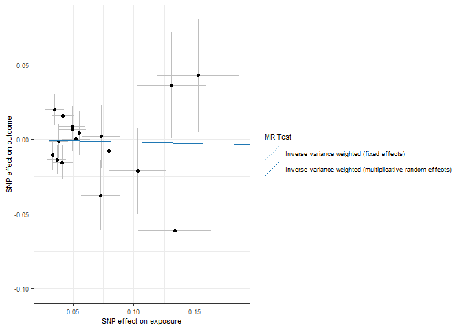<!-- -->

``` r
forrest_p <- mr_forest_plot(res_single)
forrest_p[[1]]
```

    ## Warning: Removed 1 row containing missing values or values outside the scale range
    ## (`geom_errorbarh()`).

    ## Warning: Removed 1 row containing missing values or values outside the scale range
    ## (`geom_point()`).

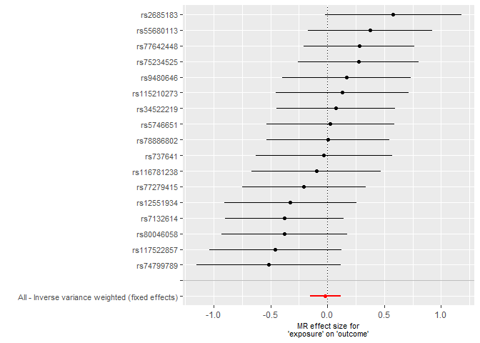<!-- -->

``` r
mr_dat <- read.csv("exposure/mr_dat_income")
mr_res <- read.csv("exposure/mr_res_income.csv")
res_single <- read.csv("exposure/res_single_income.csv")

mr_res
```

    ##   X id.exposure id.outcome outcome exposure
    ## 1 1      B2Gh6u     W994PQ outcome exposure
    ## 2 2      B2Gh6u     W994PQ outcome exposure
    ##                                                      method nsnp          b
    ## 1                 Inverse variance weighted (fixed effects)   19 0.00720529
    ## 2 Inverse variance weighted (multiplicative random effects)   19 0.00720529
    ##            se      pval
    ## 1 0.006295889 0.2524397
    ## 2 0.007287748 0.3228171

``` r
res_pleio <- mr_pleiotropy_test(mr_dat)

res_pleio %>%
  select(-id.exposure, -id.outcome, -outcome, -exposure) %>%
  gt() %>%
  fmt_number(
    columns = c('egger_intercept', 'se')
  ) %>%
  fmt_number(
    columns = pval,
    rows = pval > 0.001,
    decimals = 3
  ) %>% 
  fmt_scientific(
    columns = pval,
    rows = pval <= 0.001,
    decimals = 1
  )
```

<div id="yhgukwpbzn" style="padding-left:0px;padding-right:0px;padding-top:10px;padding-bottom:10px;overflow-x:auto;overflow-y:auto;width:auto;height:auto;">
<style>#yhgukwpbzn table {
  font-family: system-ui, 'Segoe UI', Roboto, Helvetica, Arial, sans-serif, 'Apple Color Emoji', 'Segoe UI Emoji', 'Segoe UI Symbol', 'Noto Color Emoji';
  -webkit-font-smoothing: antialiased;
  -moz-osx-font-smoothing: grayscale;
}
&#10;#yhgukwpbzn thead, #yhgukwpbzn tbody, #yhgukwpbzn tfoot, #yhgukwpbzn tr, #yhgukwpbzn td, #yhgukwpbzn th {
  border-style: none;
}
&#10;#yhgukwpbzn p {
  margin: 0;
  padding: 0;
}
&#10;#yhgukwpbzn .gt_table {
  display: table;
  border-collapse: collapse;
  line-height: normal;
  margin-left: auto;
  margin-right: auto;
  color: #333333;
  font-size: 16px;
  font-weight: normal;
  font-style: normal;
  background-color: #FFFFFF;
  width: auto;
  border-top-style: solid;
  border-top-width: 2px;
  border-top-color: #A8A8A8;
  border-right-style: none;
  border-right-width: 2px;
  border-right-color: #D3D3D3;
  border-bottom-style: solid;
  border-bottom-width: 2px;
  border-bottom-color: #A8A8A8;
  border-left-style: none;
  border-left-width: 2px;
  border-left-color: #D3D3D3;
}
&#10;#yhgukwpbzn .gt_caption {
  padding-top: 4px;
  padding-bottom: 4px;
}
&#10;#yhgukwpbzn .gt_title {
  color: #333333;
  font-size: 125%;
  font-weight: initial;
  padding-top: 4px;
  padding-bottom: 4px;
  padding-left: 5px;
  padding-right: 5px;
  border-bottom-color: #FFFFFF;
  border-bottom-width: 0;
}
&#10;#yhgukwpbzn .gt_subtitle {
  color: #333333;
  font-size: 85%;
  font-weight: initial;
  padding-top: 3px;
  padding-bottom: 5px;
  padding-left: 5px;
  padding-right: 5px;
  border-top-color: #FFFFFF;
  border-top-width: 0;
}
&#10;#yhgukwpbzn .gt_heading {
  background-color: #FFFFFF;
  text-align: center;
  border-bottom-color: #FFFFFF;
  border-left-style: none;
  border-left-width: 1px;
  border-left-color: #D3D3D3;
  border-right-style: none;
  border-right-width: 1px;
  border-right-color: #D3D3D3;
}
&#10;#yhgukwpbzn .gt_bottom_border {
  border-bottom-style: solid;
  border-bottom-width: 2px;
  border-bottom-color: #D3D3D3;
}
&#10;#yhgukwpbzn .gt_col_headings {
  border-top-style: solid;
  border-top-width: 2px;
  border-top-color: #D3D3D3;
  border-bottom-style: solid;
  border-bottom-width: 2px;
  border-bottom-color: #D3D3D3;
  border-left-style: none;
  border-left-width: 1px;
  border-left-color: #D3D3D3;
  border-right-style: none;
  border-right-width: 1px;
  border-right-color: #D3D3D3;
}
&#10;#yhgukwpbzn .gt_col_heading {
  color: #333333;
  background-color: #FFFFFF;
  font-size: 100%;
  font-weight: normal;
  text-transform: inherit;
  border-left-style: none;
  border-left-width: 1px;
  border-left-color: #D3D3D3;
  border-right-style: none;
  border-right-width: 1px;
  border-right-color: #D3D3D3;
  vertical-align: bottom;
  padding-top: 5px;
  padding-bottom: 6px;
  padding-left: 5px;
  padding-right: 5px;
  overflow-x: hidden;
}
&#10;#yhgukwpbzn .gt_column_spanner_outer {
  color: #333333;
  background-color: #FFFFFF;
  font-size: 100%;
  font-weight: normal;
  text-transform: inherit;
  padding-top: 0;
  padding-bottom: 0;
  padding-left: 4px;
  padding-right: 4px;
}
&#10;#yhgukwpbzn .gt_column_spanner_outer:first-child {
  padding-left: 0;
}
&#10;#yhgukwpbzn .gt_column_spanner_outer:last-child {
  padding-right: 0;
}
&#10;#yhgukwpbzn .gt_column_spanner {
  border-bottom-style: solid;
  border-bottom-width: 2px;
  border-bottom-color: #D3D3D3;
  vertical-align: bottom;
  padding-top: 5px;
  padding-bottom: 5px;
  overflow-x: hidden;
  display: inline-block;
  width: 100%;
}
&#10;#yhgukwpbzn .gt_spanner_row {
  border-bottom-style: hidden;
}
&#10;#yhgukwpbzn .gt_group_heading {
  padding-top: 8px;
  padding-bottom: 8px;
  padding-left: 5px;
  padding-right: 5px;
  color: #333333;
  background-color: #FFFFFF;
  font-size: 100%;
  font-weight: initial;
  text-transform: inherit;
  border-top-style: solid;
  border-top-width: 2px;
  border-top-color: #D3D3D3;
  border-bottom-style: solid;
  border-bottom-width: 2px;
  border-bottom-color: #D3D3D3;
  border-left-style: none;
  border-left-width: 1px;
  border-left-color: #D3D3D3;
  border-right-style: none;
  border-right-width: 1px;
  border-right-color: #D3D3D3;
  vertical-align: middle;
  text-align: left;
}
&#10;#yhgukwpbzn .gt_empty_group_heading {
  padding: 0.5px;
  color: #333333;
  background-color: #FFFFFF;
  font-size: 100%;
  font-weight: initial;
  border-top-style: solid;
  border-top-width: 2px;
  border-top-color: #D3D3D3;
  border-bottom-style: solid;
  border-bottom-width: 2px;
  border-bottom-color: #D3D3D3;
  vertical-align: middle;
}
&#10;#yhgukwpbzn .gt_from_md > :first-child {
  margin-top: 0;
}
&#10;#yhgukwpbzn .gt_from_md > :last-child {
  margin-bottom: 0;
}
&#10;#yhgukwpbzn .gt_row {
  padding-top: 8px;
  padding-bottom: 8px;
  padding-left: 5px;
  padding-right: 5px;
  margin: 10px;
  border-top-style: solid;
  border-top-width: 1px;
  border-top-color: #D3D3D3;
  border-left-style: none;
  border-left-width: 1px;
  border-left-color: #D3D3D3;
  border-right-style: none;
  border-right-width: 1px;
  border-right-color: #D3D3D3;
  vertical-align: middle;
  overflow-x: hidden;
}
&#10;#yhgukwpbzn .gt_stub {
  color: #333333;
  background-color: #FFFFFF;
  font-size: 100%;
  font-weight: initial;
  text-transform: inherit;
  border-right-style: solid;
  border-right-width: 2px;
  border-right-color: #D3D3D3;
  padding-left: 5px;
  padding-right: 5px;
}
&#10;#yhgukwpbzn .gt_stub_row_group {
  color: #333333;
  background-color: #FFFFFF;
  font-size: 100%;
  font-weight: initial;
  text-transform: inherit;
  border-right-style: solid;
  border-right-width: 2px;
  border-right-color: #D3D3D3;
  padding-left: 5px;
  padding-right: 5px;
  vertical-align: top;
}
&#10;#yhgukwpbzn .gt_row_group_first td {
  border-top-width: 2px;
}
&#10;#yhgukwpbzn .gt_row_group_first th {
  border-top-width: 2px;
}
&#10;#yhgukwpbzn .gt_summary_row {
  color: #333333;
  background-color: #FFFFFF;
  text-transform: inherit;
  padding-top: 8px;
  padding-bottom: 8px;
  padding-left: 5px;
  padding-right: 5px;
}
&#10;#yhgukwpbzn .gt_first_summary_row {
  border-top-style: solid;
  border-top-color: #D3D3D3;
}
&#10;#yhgukwpbzn .gt_first_summary_row.thick {
  border-top-width: 2px;
}
&#10;#yhgukwpbzn .gt_last_summary_row {
  padding-top: 8px;
  padding-bottom: 8px;
  padding-left: 5px;
  padding-right: 5px;
  border-bottom-style: solid;
  border-bottom-width: 2px;
  border-bottom-color: #D3D3D3;
}
&#10;#yhgukwpbzn .gt_grand_summary_row {
  color: #333333;
  background-color: #FFFFFF;
  text-transform: inherit;
  padding-top: 8px;
  padding-bottom: 8px;
  padding-left: 5px;
  padding-right: 5px;
}
&#10;#yhgukwpbzn .gt_first_grand_summary_row {
  padding-top: 8px;
  padding-bottom: 8px;
  padding-left: 5px;
  padding-right: 5px;
  border-top-style: double;
  border-top-width: 6px;
  border-top-color: #D3D3D3;
}
&#10;#yhgukwpbzn .gt_last_grand_summary_row_top {
  padding-top: 8px;
  padding-bottom: 8px;
  padding-left: 5px;
  padding-right: 5px;
  border-bottom-style: double;
  border-bottom-width: 6px;
  border-bottom-color: #D3D3D3;
}
&#10;#yhgukwpbzn .gt_striped {
  background-color: rgba(128, 128, 128, 0.05);
}
&#10;#yhgukwpbzn .gt_table_body {
  border-top-style: solid;
  border-top-width: 2px;
  border-top-color: #D3D3D3;
  border-bottom-style: solid;
  border-bottom-width: 2px;
  border-bottom-color: #D3D3D3;
}
&#10;#yhgukwpbzn .gt_footnotes {
  color: #333333;
  background-color: #FFFFFF;
  border-bottom-style: none;
  border-bottom-width: 2px;
  border-bottom-color: #D3D3D3;
  border-left-style: none;
  border-left-width: 2px;
  border-left-color: #D3D3D3;
  border-right-style: none;
  border-right-width: 2px;
  border-right-color: #D3D3D3;
}
&#10;#yhgukwpbzn .gt_footnote {
  margin: 0px;
  font-size: 90%;
  padding-top: 4px;
  padding-bottom: 4px;
  padding-left: 5px;
  padding-right: 5px;
}
&#10;#yhgukwpbzn .gt_sourcenotes {
  color: #333333;
  background-color: #FFFFFF;
  border-bottom-style: none;
  border-bottom-width: 2px;
  border-bottom-color: #D3D3D3;
  border-left-style: none;
  border-left-width: 2px;
  border-left-color: #D3D3D3;
  border-right-style: none;
  border-right-width: 2px;
  border-right-color: #D3D3D3;
}
&#10;#yhgukwpbzn .gt_sourcenote {
  font-size: 90%;
  padding-top: 4px;
  padding-bottom: 4px;
  padding-left: 5px;
  padding-right: 5px;
}
&#10;#yhgukwpbzn .gt_left {
  text-align: left;
}
&#10;#yhgukwpbzn .gt_center {
  text-align: center;
}
&#10;#yhgukwpbzn .gt_right {
  text-align: right;
  font-variant-numeric: tabular-nums;
}
&#10;#yhgukwpbzn .gt_font_normal {
  font-weight: normal;
}
&#10;#yhgukwpbzn .gt_font_bold {
  font-weight: bold;
}
&#10;#yhgukwpbzn .gt_font_italic {
  font-style: italic;
}
&#10;#yhgukwpbzn .gt_super {
  font-size: 65%;
}
&#10;#yhgukwpbzn .gt_footnote_marks {
  font-size: 75%;
  vertical-align: 0.4em;
  position: initial;
}
&#10;#yhgukwpbzn .gt_asterisk {
  font-size: 100%;
  vertical-align: 0;
}
&#10;#yhgukwpbzn .gt_indent_1 {
  text-indent: 5px;
}
&#10;#yhgukwpbzn .gt_indent_2 {
  text-indent: 10px;
}
&#10;#yhgukwpbzn .gt_indent_3 {
  text-indent: 15px;
}
&#10;#yhgukwpbzn .gt_indent_4 {
  text-indent: 20px;
}
&#10;#yhgukwpbzn .gt_indent_5 {
  text-indent: 25px;
}
&#10;#yhgukwpbzn .katex-display {
  display: inline-flex !important;
  margin-bottom: 0.75em !important;
}
&#10;#yhgukwpbzn div.Reactable > div.rt-table > div.rt-thead > div.rt-tr.rt-tr-group-header > div.rt-th-group:after {
  height: 0px !important;
}
</style>
<table class="gt_table" data-quarto-disable-processing="false" data-quarto-bootstrap="false">
  <thead>
    <tr class="gt_col_headings">
      <th class="gt_col_heading gt_columns_bottom_border gt_right" rowspan="1" colspan="1" scope="col" id="egger_intercept">egger_intercept</th>
      <th class="gt_col_heading gt_columns_bottom_border gt_right" rowspan="1" colspan="1" scope="col" id="se">se</th>
      <th class="gt_col_heading gt_columns_bottom_border gt_right" rowspan="1" colspan="1" scope="col" id="pval">pval</th>
    </tr>
  </thead>
  <tbody class="gt_table_body">
    <tr><td headers="egger_intercept" class="gt_row gt_right">0.00</td>
<td headers="se" class="gt_row gt_right">0.00</td>
<td headers="pval" class="gt_row gt_right">0.715</td></tr>
  </tbody>
  &#10;  
</table>
</div>

``` r
# Heterogeneity statistics 
res_het <- mr_heterogeneity(mr_dat, method_list = c(
  "mr_ivw_fe", "mr_ivw_mre"
))

res_het %>%
  select(-id.exposure, -id.outcome, -outcome, -exposure) %>%
  gt() %>%
  fmt_number(
    columns = Q
  ) %>%
  fmt_number(
    columns = Q_pval,
    rows = Q_pval > 0.001,
    decimals = 3
  ) %>% 
  fmt_scientific(
    columns = Q_pval,
    rows = Q_pval <= 0.001,
    decimals = 1
  )
```

<div id="esletmvomv" style="padding-left:0px;padding-right:0px;padding-top:10px;padding-bottom:10px;overflow-x:auto;overflow-y:auto;width:auto;height:auto;">
<style>#esletmvomv table {
  font-family: system-ui, 'Segoe UI', Roboto, Helvetica, Arial, sans-serif, 'Apple Color Emoji', 'Segoe UI Emoji', 'Segoe UI Symbol', 'Noto Color Emoji';
  -webkit-font-smoothing: antialiased;
  -moz-osx-font-smoothing: grayscale;
}
&#10;#esletmvomv thead, #esletmvomv tbody, #esletmvomv tfoot, #esletmvomv tr, #esletmvomv td, #esletmvomv th {
  border-style: none;
}
&#10;#esletmvomv p {
  margin: 0;
  padding: 0;
}
&#10;#esletmvomv .gt_table {
  display: table;
  border-collapse: collapse;
  line-height: normal;
  margin-left: auto;
  margin-right: auto;
  color: #333333;
  font-size: 16px;
  font-weight: normal;
  font-style: normal;
  background-color: #FFFFFF;
  width: auto;
  border-top-style: solid;
  border-top-width: 2px;
  border-top-color: #A8A8A8;
  border-right-style: none;
  border-right-width: 2px;
  border-right-color: #D3D3D3;
  border-bottom-style: solid;
  border-bottom-width: 2px;
  border-bottom-color: #A8A8A8;
  border-left-style: none;
  border-left-width: 2px;
  border-left-color: #D3D3D3;
}
&#10;#esletmvomv .gt_caption {
  padding-top: 4px;
  padding-bottom: 4px;
}
&#10;#esletmvomv .gt_title {
  color: #333333;
  font-size: 125%;
  font-weight: initial;
  padding-top: 4px;
  padding-bottom: 4px;
  padding-left: 5px;
  padding-right: 5px;
  border-bottom-color: #FFFFFF;
  border-bottom-width: 0;
}
&#10;#esletmvomv .gt_subtitle {
  color: #333333;
  font-size: 85%;
  font-weight: initial;
  padding-top: 3px;
  padding-bottom: 5px;
  padding-left: 5px;
  padding-right: 5px;
  border-top-color: #FFFFFF;
  border-top-width: 0;
}
&#10;#esletmvomv .gt_heading {
  background-color: #FFFFFF;
  text-align: center;
  border-bottom-color: #FFFFFF;
  border-left-style: none;
  border-left-width: 1px;
  border-left-color: #D3D3D3;
  border-right-style: none;
  border-right-width: 1px;
  border-right-color: #D3D3D3;
}
&#10;#esletmvomv .gt_bottom_border {
  border-bottom-style: solid;
  border-bottom-width: 2px;
  border-bottom-color: #D3D3D3;
}
&#10;#esletmvomv .gt_col_headings {
  border-top-style: solid;
  border-top-width: 2px;
  border-top-color: #D3D3D3;
  border-bottom-style: solid;
  border-bottom-width: 2px;
  border-bottom-color: #D3D3D3;
  border-left-style: none;
  border-left-width: 1px;
  border-left-color: #D3D3D3;
  border-right-style: none;
  border-right-width: 1px;
  border-right-color: #D3D3D3;
}
&#10;#esletmvomv .gt_col_heading {
  color: #333333;
  background-color: #FFFFFF;
  font-size: 100%;
  font-weight: normal;
  text-transform: inherit;
  border-left-style: none;
  border-left-width: 1px;
  border-left-color: #D3D3D3;
  border-right-style: none;
  border-right-width: 1px;
  border-right-color: #D3D3D3;
  vertical-align: bottom;
  padding-top: 5px;
  padding-bottom: 6px;
  padding-left: 5px;
  padding-right: 5px;
  overflow-x: hidden;
}
&#10;#esletmvomv .gt_column_spanner_outer {
  color: #333333;
  background-color: #FFFFFF;
  font-size: 100%;
  font-weight: normal;
  text-transform: inherit;
  padding-top: 0;
  padding-bottom: 0;
  padding-left: 4px;
  padding-right: 4px;
}
&#10;#esletmvomv .gt_column_spanner_outer:first-child {
  padding-left: 0;
}
&#10;#esletmvomv .gt_column_spanner_outer:last-child {
  padding-right: 0;
}
&#10;#esletmvomv .gt_column_spanner {
  border-bottom-style: solid;
  border-bottom-width: 2px;
  border-bottom-color: #D3D3D3;
  vertical-align: bottom;
  padding-top: 5px;
  padding-bottom: 5px;
  overflow-x: hidden;
  display: inline-block;
  width: 100%;
}
&#10;#esletmvomv .gt_spanner_row {
  border-bottom-style: hidden;
}
&#10;#esletmvomv .gt_group_heading {
  padding-top: 8px;
  padding-bottom: 8px;
  padding-left: 5px;
  padding-right: 5px;
  color: #333333;
  background-color: #FFFFFF;
  font-size: 100%;
  font-weight: initial;
  text-transform: inherit;
  border-top-style: solid;
  border-top-width: 2px;
  border-top-color: #D3D3D3;
  border-bottom-style: solid;
  border-bottom-width: 2px;
  border-bottom-color: #D3D3D3;
  border-left-style: none;
  border-left-width: 1px;
  border-left-color: #D3D3D3;
  border-right-style: none;
  border-right-width: 1px;
  border-right-color: #D3D3D3;
  vertical-align: middle;
  text-align: left;
}
&#10;#esletmvomv .gt_empty_group_heading {
  padding: 0.5px;
  color: #333333;
  background-color: #FFFFFF;
  font-size: 100%;
  font-weight: initial;
  border-top-style: solid;
  border-top-width: 2px;
  border-top-color: #D3D3D3;
  border-bottom-style: solid;
  border-bottom-width: 2px;
  border-bottom-color: #D3D3D3;
  vertical-align: middle;
}
&#10;#esletmvomv .gt_from_md > :first-child {
  margin-top: 0;
}
&#10;#esletmvomv .gt_from_md > :last-child {
  margin-bottom: 0;
}
&#10;#esletmvomv .gt_row {
  padding-top: 8px;
  padding-bottom: 8px;
  padding-left: 5px;
  padding-right: 5px;
  margin: 10px;
  border-top-style: solid;
  border-top-width: 1px;
  border-top-color: #D3D3D3;
  border-left-style: none;
  border-left-width: 1px;
  border-left-color: #D3D3D3;
  border-right-style: none;
  border-right-width: 1px;
  border-right-color: #D3D3D3;
  vertical-align: middle;
  overflow-x: hidden;
}
&#10;#esletmvomv .gt_stub {
  color: #333333;
  background-color: #FFFFFF;
  font-size: 100%;
  font-weight: initial;
  text-transform: inherit;
  border-right-style: solid;
  border-right-width: 2px;
  border-right-color: #D3D3D3;
  padding-left: 5px;
  padding-right: 5px;
}
&#10;#esletmvomv .gt_stub_row_group {
  color: #333333;
  background-color: #FFFFFF;
  font-size: 100%;
  font-weight: initial;
  text-transform: inherit;
  border-right-style: solid;
  border-right-width: 2px;
  border-right-color: #D3D3D3;
  padding-left: 5px;
  padding-right: 5px;
  vertical-align: top;
}
&#10;#esletmvomv .gt_row_group_first td {
  border-top-width: 2px;
}
&#10;#esletmvomv .gt_row_group_first th {
  border-top-width: 2px;
}
&#10;#esletmvomv .gt_summary_row {
  color: #333333;
  background-color: #FFFFFF;
  text-transform: inherit;
  padding-top: 8px;
  padding-bottom: 8px;
  padding-left: 5px;
  padding-right: 5px;
}
&#10;#esletmvomv .gt_first_summary_row {
  border-top-style: solid;
  border-top-color: #D3D3D3;
}
&#10;#esletmvomv .gt_first_summary_row.thick {
  border-top-width: 2px;
}
&#10;#esletmvomv .gt_last_summary_row {
  padding-top: 8px;
  padding-bottom: 8px;
  padding-left: 5px;
  padding-right: 5px;
  border-bottom-style: solid;
  border-bottom-width: 2px;
  border-bottom-color: #D3D3D3;
}
&#10;#esletmvomv .gt_grand_summary_row {
  color: #333333;
  background-color: #FFFFFF;
  text-transform: inherit;
  padding-top: 8px;
  padding-bottom: 8px;
  padding-left: 5px;
  padding-right: 5px;
}
&#10;#esletmvomv .gt_first_grand_summary_row {
  padding-top: 8px;
  padding-bottom: 8px;
  padding-left: 5px;
  padding-right: 5px;
  border-top-style: double;
  border-top-width: 6px;
  border-top-color: #D3D3D3;
}
&#10;#esletmvomv .gt_last_grand_summary_row_top {
  padding-top: 8px;
  padding-bottom: 8px;
  padding-left: 5px;
  padding-right: 5px;
  border-bottom-style: double;
  border-bottom-width: 6px;
  border-bottom-color: #D3D3D3;
}
&#10;#esletmvomv .gt_striped {
  background-color: rgba(128, 128, 128, 0.05);
}
&#10;#esletmvomv .gt_table_body {
  border-top-style: solid;
  border-top-width: 2px;
  border-top-color: #D3D3D3;
  border-bottom-style: solid;
  border-bottom-width: 2px;
  border-bottom-color: #D3D3D3;
}
&#10;#esletmvomv .gt_footnotes {
  color: #333333;
  background-color: #FFFFFF;
  border-bottom-style: none;
  border-bottom-width: 2px;
  border-bottom-color: #D3D3D3;
  border-left-style: none;
  border-left-width: 2px;
  border-left-color: #D3D3D3;
  border-right-style: none;
  border-right-width: 2px;
  border-right-color: #D3D3D3;
}
&#10;#esletmvomv .gt_footnote {
  margin: 0px;
  font-size: 90%;
  padding-top: 4px;
  padding-bottom: 4px;
  padding-left: 5px;
  padding-right: 5px;
}
&#10;#esletmvomv .gt_sourcenotes {
  color: #333333;
  background-color: #FFFFFF;
  border-bottom-style: none;
  border-bottom-width: 2px;
  border-bottom-color: #D3D3D3;
  border-left-style: none;
  border-left-width: 2px;
  border-left-color: #D3D3D3;
  border-right-style: none;
  border-right-width: 2px;
  border-right-color: #D3D3D3;
}
&#10;#esletmvomv .gt_sourcenote {
  font-size: 90%;
  padding-top: 4px;
  padding-bottom: 4px;
  padding-left: 5px;
  padding-right: 5px;
}
&#10;#esletmvomv .gt_left {
  text-align: left;
}
&#10;#esletmvomv .gt_center {
  text-align: center;
}
&#10;#esletmvomv .gt_right {
  text-align: right;
  font-variant-numeric: tabular-nums;
}
&#10;#esletmvomv .gt_font_normal {
  font-weight: normal;
}
&#10;#esletmvomv .gt_font_bold {
  font-weight: bold;
}
&#10;#esletmvomv .gt_font_italic {
  font-style: italic;
}
&#10;#esletmvomv .gt_super {
  font-size: 65%;
}
&#10;#esletmvomv .gt_footnote_marks {
  font-size: 75%;
  vertical-align: 0.4em;
  position: initial;
}
&#10;#esletmvomv .gt_asterisk {
  font-size: 100%;
  vertical-align: 0;
}
&#10;#esletmvomv .gt_indent_1 {
  text-indent: 5px;
}
&#10;#esletmvomv .gt_indent_2 {
  text-indent: 10px;
}
&#10;#esletmvomv .gt_indent_3 {
  text-indent: 15px;
}
&#10;#esletmvomv .gt_indent_4 {
  text-indent: 20px;
}
&#10;#esletmvomv .gt_indent_5 {
  text-indent: 25px;
}
&#10;#esletmvomv .katex-display {
  display: inline-flex !important;
  margin-bottom: 0.75em !important;
}
&#10;#esletmvomv div.Reactable > div.rt-table > div.rt-thead > div.rt-tr.rt-tr-group-header > div.rt-th-group:after {
  height: 0px !important;
}
</style>
<table class="gt_table" data-quarto-disable-processing="false" data-quarto-bootstrap="false">
  <thead>
    <tr class="gt_col_headings">
      <th class="gt_col_heading gt_columns_bottom_border gt_left" rowspan="1" colspan="1" scope="col" id="method">method</th>
      <th class="gt_col_heading gt_columns_bottom_border gt_right" rowspan="1" colspan="1" scope="col" id="Q">Q</th>
      <th class="gt_col_heading gt_columns_bottom_border gt_right" rowspan="1" colspan="1" scope="col" id="Q_df">Q_df</th>
      <th class="gt_col_heading gt_columns_bottom_border gt_right" rowspan="1" colspan="1" scope="col" id="Q_pval">Q_pval</th>
    </tr>
  </thead>
  <tbody class="gt_table_body">
    <tr><td headers="method" class="gt_row gt_left">Inverse variance weighted (fixed effects)</td>
<td headers="Q" class="gt_row gt_right">24.12</td>
<td headers="Q_df" class="gt_row gt_right">18</td>
<td headers="Q_pval" class="gt_row gt_right">0.151</td></tr>
    <tr><td headers="method" class="gt_row gt_left">Inverse variance weighted (multiplicative random effects)</td>
<td headers="Q" class="gt_row gt_right">24.12</td>
<td headers="Q_df" class="gt_row gt_right">18</td>
<td headers="Q_pval" class="gt_row gt_right">0.151</td></tr>
  </tbody>
  &#10;  
</table>
</div>

``` r
scatter_p <- mr_scatter_plot(mr_res, mr_dat)
scatter_out_p <- scatter_p[[1]] + theme_bw() +
  guides(color=guide_legend(ncol =1)) +
  theme(
    text = element_text(size = 8),
  )
scatter_out_p
```

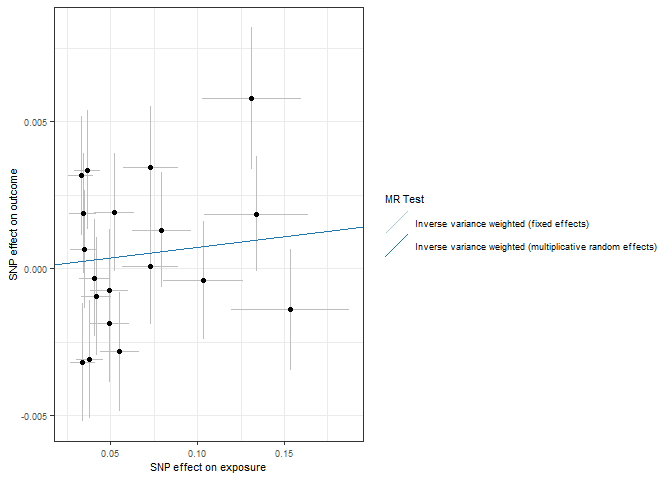<!-- -->

``` r
forrest_p <- mr_forest_plot(res_single)
forrest_p[[1]]
```

    ## Warning: Removed 1 row containing missing values or values outside the scale range
    ## (`geom_errorbarh()`).

    ## Warning: Removed 1 row containing missing values or values outside the scale range
    ## (`geom_point()`).

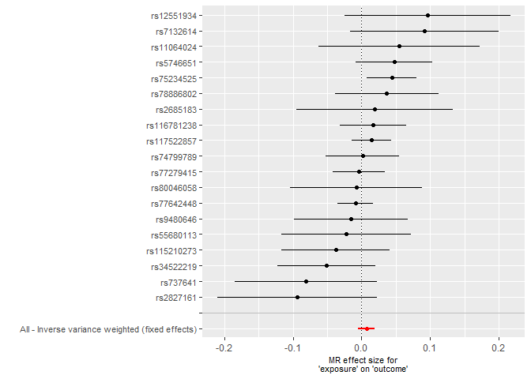<!-- -->

``` r
mr_dat <- read.csv("exposure/mr_dat_insomnia")
mr_res <- read.csv("exposure/mr_res_insomnia.csv")
res_single <- read.csv("exposure/res_single_insomnia.csv")

mr_res
```

    ##   X id.exposure id.outcome outcome exposure
    ## 1 1      ZTnxm8     O8Qsrh outcome exposure
    ## 2 2      ZTnxm8     O8Qsrh outcome exposure
    ##                                                      method nsnp         b
    ## 1                 Inverse variance weighted (fixed effects)   18 0.9618766
    ## 2 Inverse variance weighted (multiplicative random effects)   18 0.9618766
    ##           se          pval
    ## 1 0.02565125 9.842017e-308
    ## 2 2.80517434  7.316784e-01

``` r
res_pleio <- mr_pleiotropy_test(mr_dat)

res_pleio %>%
  select(-id.exposure, -id.outcome, -outcome, -exposure) %>%
  gt() %>%
  fmt_number(
    columns = c('egger_intercept', 'se')
  ) %>%
  fmt_number(
    columns = pval,
    rows = pval > 0.001,
    decimals = 3
  ) %>% 
  fmt_scientific(
    columns = pval,
    rows = pval <= 0.001,
    decimals = 1
  )
```

<div id="tseggzlhdd" style="padding-left:0px;padding-right:0px;padding-top:10px;padding-bottom:10px;overflow-x:auto;overflow-y:auto;width:auto;height:auto;">
<style>#tseggzlhdd table {
  font-family: system-ui, 'Segoe UI', Roboto, Helvetica, Arial, sans-serif, 'Apple Color Emoji', 'Segoe UI Emoji', 'Segoe UI Symbol', 'Noto Color Emoji';
  -webkit-font-smoothing: antialiased;
  -moz-osx-font-smoothing: grayscale;
}
&#10;#tseggzlhdd thead, #tseggzlhdd tbody, #tseggzlhdd tfoot, #tseggzlhdd tr, #tseggzlhdd td, #tseggzlhdd th {
  border-style: none;
}
&#10;#tseggzlhdd p {
  margin: 0;
  padding: 0;
}
&#10;#tseggzlhdd .gt_table {
  display: table;
  border-collapse: collapse;
  line-height: normal;
  margin-left: auto;
  margin-right: auto;
  color: #333333;
  font-size: 16px;
  font-weight: normal;
  font-style: normal;
  background-color: #FFFFFF;
  width: auto;
  border-top-style: solid;
  border-top-width: 2px;
  border-top-color: #A8A8A8;
  border-right-style: none;
  border-right-width: 2px;
  border-right-color: #D3D3D3;
  border-bottom-style: solid;
  border-bottom-width: 2px;
  border-bottom-color: #A8A8A8;
  border-left-style: none;
  border-left-width: 2px;
  border-left-color: #D3D3D3;
}
&#10;#tseggzlhdd .gt_caption {
  padding-top: 4px;
  padding-bottom: 4px;
}
&#10;#tseggzlhdd .gt_title {
  color: #333333;
  font-size: 125%;
  font-weight: initial;
  padding-top: 4px;
  padding-bottom: 4px;
  padding-left: 5px;
  padding-right: 5px;
  border-bottom-color: #FFFFFF;
  border-bottom-width: 0;
}
&#10;#tseggzlhdd .gt_subtitle {
  color: #333333;
  font-size: 85%;
  font-weight: initial;
  padding-top: 3px;
  padding-bottom: 5px;
  padding-left: 5px;
  padding-right: 5px;
  border-top-color: #FFFFFF;
  border-top-width: 0;
}
&#10;#tseggzlhdd .gt_heading {
  background-color: #FFFFFF;
  text-align: center;
  border-bottom-color: #FFFFFF;
  border-left-style: none;
  border-left-width: 1px;
  border-left-color: #D3D3D3;
  border-right-style: none;
  border-right-width: 1px;
  border-right-color: #D3D3D3;
}
&#10;#tseggzlhdd .gt_bottom_border {
  border-bottom-style: solid;
  border-bottom-width: 2px;
  border-bottom-color: #D3D3D3;
}
&#10;#tseggzlhdd .gt_col_headings {
  border-top-style: solid;
  border-top-width: 2px;
  border-top-color: #D3D3D3;
  border-bottom-style: solid;
  border-bottom-width: 2px;
  border-bottom-color: #D3D3D3;
  border-left-style: none;
  border-left-width: 1px;
  border-left-color: #D3D3D3;
  border-right-style: none;
  border-right-width: 1px;
  border-right-color: #D3D3D3;
}
&#10;#tseggzlhdd .gt_col_heading {
  color: #333333;
  background-color: #FFFFFF;
  font-size: 100%;
  font-weight: normal;
  text-transform: inherit;
  border-left-style: none;
  border-left-width: 1px;
  border-left-color: #D3D3D3;
  border-right-style: none;
  border-right-width: 1px;
  border-right-color: #D3D3D3;
  vertical-align: bottom;
  padding-top: 5px;
  padding-bottom: 6px;
  padding-left: 5px;
  padding-right: 5px;
  overflow-x: hidden;
}
&#10;#tseggzlhdd .gt_column_spanner_outer {
  color: #333333;
  background-color: #FFFFFF;
  font-size: 100%;
  font-weight: normal;
  text-transform: inherit;
  padding-top: 0;
  padding-bottom: 0;
  padding-left: 4px;
  padding-right: 4px;
}
&#10;#tseggzlhdd .gt_column_spanner_outer:first-child {
  padding-left: 0;
}
&#10;#tseggzlhdd .gt_column_spanner_outer:last-child {
  padding-right: 0;
}
&#10;#tseggzlhdd .gt_column_spanner {
  border-bottom-style: solid;
  border-bottom-width: 2px;
  border-bottom-color: #D3D3D3;
  vertical-align: bottom;
  padding-top: 5px;
  padding-bottom: 5px;
  overflow-x: hidden;
  display: inline-block;
  width: 100%;
}
&#10;#tseggzlhdd .gt_spanner_row {
  border-bottom-style: hidden;
}
&#10;#tseggzlhdd .gt_group_heading {
  padding-top: 8px;
  padding-bottom: 8px;
  padding-left: 5px;
  padding-right: 5px;
  color: #333333;
  background-color: #FFFFFF;
  font-size: 100%;
  font-weight: initial;
  text-transform: inherit;
  border-top-style: solid;
  border-top-width: 2px;
  border-top-color: #D3D3D3;
  border-bottom-style: solid;
  border-bottom-width: 2px;
  border-bottom-color: #D3D3D3;
  border-left-style: none;
  border-left-width: 1px;
  border-left-color: #D3D3D3;
  border-right-style: none;
  border-right-width: 1px;
  border-right-color: #D3D3D3;
  vertical-align: middle;
  text-align: left;
}
&#10;#tseggzlhdd .gt_empty_group_heading {
  padding: 0.5px;
  color: #333333;
  background-color: #FFFFFF;
  font-size: 100%;
  font-weight: initial;
  border-top-style: solid;
  border-top-width: 2px;
  border-top-color: #D3D3D3;
  border-bottom-style: solid;
  border-bottom-width: 2px;
  border-bottom-color: #D3D3D3;
  vertical-align: middle;
}
&#10;#tseggzlhdd .gt_from_md > :first-child {
  margin-top: 0;
}
&#10;#tseggzlhdd .gt_from_md > :last-child {
  margin-bottom: 0;
}
&#10;#tseggzlhdd .gt_row {
  padding-top: 8px;
  padding-bottom: 8px;
  padding-left: 5px;
  padding-right: 5px;
  margin: 10px;
  border-top-style: solid;
  border-top-width: 1px;
  border-top-color: #D3D3D3;
  border-left-style: none;
  border-left-width: 1px;
  border-left-color: #D3D3D3;
  border-right-style: none;
  border-right-width: 1px;
  border-right-color: #D3D3D3;
  vertical-align: middle;
  overflow-x: hidden;
}
&#10;#tseggzlhdd .gt_stub {
  color: #333333;
  background-color: #FFFFFF;
  font-size: 100%;
  font-weight: initial;
  text-transform: inherit;
  border-right-style: solid;
  border-right-width: 2px;
  border-right-color: #D3D3D3;
  padding-left: 5px;
  padding-right: 5px;
}
&#10;#tseggzlhdd .gt_stub_row_group {
  color: #333333;
  background-color: #FFFFFF;
  font-size: 100%;
  font-weight: initial;
  text-transform: inherit;
  border-right-style: solid;
  border-right-width: 2px;
  border-right-color: #D3D3D3;
  padding-left: 5px;
  padding-right: 5px;
  vertical-align: top;
}
&#10;#tseggzlhdd .gt_row_group_first td {
  border-top-width: 2px;
}
&#10;#tseggzlhdd .gt_row_group_first th {
  border-top-width: 2px;
}
&#10;#tseggzlhdd .gt_summary_row {
  color: #333333;
  background-color: #FFFFFF;
  text-transform: inherit;
  padding-top: 8px;
  padding-bottom: 8px;
  padding-left: 5px;
  padding-right: 5px;
}
&#10;#tseggzlhdd .gt_first_summary_row {
  border-top-style: solid;
  border-top-color: #D3D3D3;
}
&#10;#tseggzlhdd .gt_first_summary_row.thick {
  border-top-width: 2px;
}
&#10;#tseggzlhdd .gt_last_summary_row {
  padding-top: 8px;
  padding-bottom: 8px;
  padding-left: 5px;
  padding-right: 5px;
  border-bottom-style: solid;
  border-bottom-width: 2px;
  border-bottom-color: #D3D3D3;
}
&#10;#tseggzlhdd .gt_grand_summary_row {
  color: #333333;
  background-color: #FFFFFF;
  text-transform: inherit;
  padding-top: 8px;
  padding-bottom: 8px;
  padding-left: 5px;
  padding-right: 5px;
}
&#10;#tseggzlhdd .gt_first_grand_summary_row {
  padding-top: 8px;
  padding-bottom: 8px;
  padding-left: 5px;
  padding-right: 5px;
  border-top-style: double;
  border-top-width: 6px;
  border-top-color: #D3D3D3;
}
&#10;#tseggzlhdd .gt_last_grand_summary_row_top {
  padding-top: 8px;
  padding-bottom: 8px;
  padding-left: 5px;
  padding-right: 5px;
  border-bottom-style: double;
  border-bottom-width: 6px;
  border-bottom-color: #D3D3D3;
}
&#10;#tseggzlhdd .gt_striped {
  background-color: rgba(128, 128, 128, 0.05);
}
&#10;#tseggzlhdd .gt_table_body {
  border-top-style: solid;
  border-top-width: 2px;
  border-top-color: #D3D3D3;
  border-bottom-style: solid;
  border-bottom-width: 2px;
  border-bottom-color: #D3D3D3;
}
&#10;#tseggzlhdd .gt_footnotes {
  color: #333333;
  background-color: #FFFFFF;
  border-bottom-style: none;
  border-bottom-width: 2px;
  border-bottom-color: #D3D3D3;
  border-left-style: none;
  border-left-width: 2px;
  border-left-color: #D3D3D3;
  border-right-style: none;
  border-right-width: 2px;
  border-right-color: #D3D3D3;
}
&#10;#tseggzlhdd .gt_footnote {
  margin: 0px;
  font-size: 90%;
  padding-top: 4px;
  padding-bottom: 4px;
  padding-left: 5px;
  padding-right: 5px;
}
&#10;#tseggzlhdd .gt_sourcenotes {
  color: #333333;
  background-color: #FFFFFF;
  border-bottom-style: none;
  border-bottom-width: 2px;
  border-bottom-color: #D3D3D3;
  border-left-style: none;
  border-left-width: 2px;
  border-left-color: #D3D3D3;
  border-right-style: none;
  border-right-width: 2px;
  border-right-color: #D3D3D3;
}
&#10;#tseggzlhdd .gt_sourcenote {
  font-size: 90%;
  padding-top: 4px;
  padding-bottom: 4px;
  padding-left: 5px;
  padding-right: 5px;
}
&#10;#tseggzlhdd .gt_left {
  text-align: left;
}
&#10;#tseggzlhdd .gt_center {
  text-align: center;
}
&#10;#tseggzlhdd .gt_right {
  text-align: right;
  font-variant-numeric: tabular-nums;
}
&#10;#tseggzlhdd .gt_font_normal {
  font-weight: normal;
}
&#10;#tseggzlhdd .gt_font_bold {
  font-weight: bold;
}
&#10;#tseggzlhdd .gt_font_italic {
  font-style: italic;
}
&#10;#tseggzlhdd .gt_super {
  font-size: 65%;
}
&#10;#tseggzlhdd .gt_footnote_marks {
  font-size: 75%;
  vertical-align: 0.4em;
  position: initial;
}
&#10;#tseggzlhdd .gt_asterisk {
  font-size: 100%;
  vertical-align: 0;
}
&#10;#tseggzlhdd .gt_indent_1 {
  text-indent: 5px;
}
&#10;#tseggzlhdd .gt_indent_2 {
  text-indent: 10px;
}
&#10;#tseggzlhdd .gt_indent_3 {
  text-indent: 15px;
}
&#10;#tseggzlhdd .gt_indent_4 {
  text-indent: 20px;
}
&#10;#tseggzlhdd .gt_indent_5 {
  text-indent: 25px;
}
&#10;#tseggzlhdd .katex-display {
  display: inline-flex !important;
  margin-bottom: 0.75em !important;
}
&#10;#tseggzlhdd div.Reactable > div.rt-table > div.rt-thead > div.rt-tr.rt-tr-group-header > div.rt-th-group:after {
  height: 0px !important;
}
</style>
<table class="gt_table" data-quarto-disable-processing="false" data-quarto-bootstrap="false">
  <thead>
    <tr class="gt_col_headings">
      <th class="gt_col_heading gt_columns_bottom_border gt_right" rowspan="1" colspan="1" scope="col" id="egger_intercept">egger_intercept</th>
      <th class="gt_col_heading gt_columns_bottom_border gt_right" rowspan="1" colspan="1" scope="col" id="se">se</th>
      <th class="gt_col_heading gt_columns_bottom_border gt_right" rowspan="1" colspan="1" scope="col" id="pval">pval</th>
    </tr>
  </thead>
  <tbody class="gt_table_body">
    <tr><td headers="egger_intercept" class="gt_row gt_right">0.64</td>
<td headers="se" class="gt_row gt_right">0.29</td>
<td headers="pval" class="gt_row gt_right">0.039</td></tr>
  </tbody>
  &#10;  
</table>
</div>

``` r
# Heterogeneity statistics 
res_het <- mr_heterogeneity(mr_dat, method_list = c(
  "mr_ivw_fe", "mr_ivw_mre"
))

res_het %>%
  select(-id.exposure, -id.outcome, -outcome, -exposure) %>%
  gt() %>%
  fmt_number(
    columns = Q
  ) %>%
  fmt_number(
    columns = Q_pval,
    rows = Q_pval > 0.001,
    decimals = 3
  ) %>% 
  fmt_scientific(
    columns = Q_pval,
    rows = Q_pval <= 0.001,
    decimals = 1
  )
```

<div id="dfqexixlec" style="padding-left:0px;padding-right:0px;padding-top:10px;padding-bottom:10px;overflow-x:auto;overflow-y:auto;width:auto;height:auto;">
<style>#dfqexixlec table {
  font-family: system-ui, 'Segoe UI', Roboto, Helvetica, Arial, sans-serif, 'Apple Color Emoji', 'Segoe UI Emoji', 'Segoe UI Symbol', 'Noto Color Emoji';
  -webkit-font-smoothing: antialiased;
  -moz-osx-font-smoothing: grayscale;
}
&#10;#dfqexixlec thead, #dfqexixlec tbody, #dfqexixlec tfoot, #dfqexixlec tr, #dfqexixlec td, #dfqexixlec th {
  border-style: none;
}
&#10;#dfqexixlec p {
  margin: 0;
  padding: 0;
}
&#10;#dfqexixlec .gt_table {
  display: table;
  border-collapse: collapse;
  line-height: normal;
  margin-left: auto;
  margin-right: auto;
  color: #333333;
  font-size: 16px;
  font-weight: normal;
  font-style: normal;
  background-color: #FFFFFF;
  width: auto;
  border-top-style: solid;
  border-top-width: 2px;
  border-top-color: #A8A8A8;
  border-right-style: none;
  border-right-width: 2px;
  border-right-color: #D3D3D3;
  border-bottom-style: solid;
  border-bottom-width: 2px;
  border-bottom-color: #A8A8A8;
  border-left-style: none;
  border-left-width: 2px;
  border-left-color: #D3D3D3;
}
&#10;#dfqexixlec .gt_caption {
  padding-top: 4px;
  padding-bottom: 4px;
}
&#10;#dfqexixlec .gt_title {
  color: #333333;
  font-size: 125%;
  font-weight: initial;
  padding-top: 4px;
  padding-bottom: 4px;
  padding-left: 5px;
  padding-right: 5px;
  border-bottom-color: #FFFFFF;
  border-bottom-width: 0;
}
&#10;#dfqexixlec .gt_subtitle {
  color: #333333;
  font-size: 85%;
  font-weight: initial;
  padding-top: 3px;
  padding-bottom: 5px;
  padding-left: 5px;
  padding-right: 5px;
  border-top-color: #FFFFFF;
  border-top-width: 0;
}
&#10;#dfqexixlec .gt_heading {
  background-color: #FFFFFF;
  text-align: center;
  border-bottom-color: #FFFFFF;
  border-left-style: none;
  border-left-width: 1px;
  border-left-color: #D3D3D3;
  border-right-style: none;
  border-right-width: 1px;
  border-right-color: #D3D3D3;
}
&#10;#dfqexixlec .gt_bottom_border {
  border-bottom-style: solid;
  border-bottom-width: 2px;
  border-bottom-color: #D3D3D3;
}
&#10;#dfqexixlec .gt_col_headings {
  border-top-style: solid;
  border-top-width: 2px;
  border-top-color: #D3D3D3;
  border-bottom-style: solid;
  border-bottom-width: 2px;
  border-bottom-color: #D3D3D3;
  border-left-style: none;
  border-left-width: 1px;
  border-left-color: #D3D3D3;
  border-right-style: none;
  border-right-width: 1px;
  border-right-color: #D3D3D3;
}
&#10;#dfqexixlec .gt_col_heading {
  color: #333333;
  background-color: #FFFFFF;
  font-size: 100%;
  font-weight: normal;
  text-transform: inherit;
  border-left-style: none;
  border-left-width: 1px;
  border-left-color: #D3D3D3;
  border-right-style: none;
  border-right-width: 1px;
  border-right-color: #D3D3D3;
  vertical-align: bottom;
  padding-top: 5px;
  padding-bottom: 6px;
  padding-left: 5px;
  padding-right: 5px;
  overflow-x: hidden;
}
&#10;#dfqexixlec .gt_column_spanner_outer {
  color: #333333;
  background-color: #FFFFFF;
  font-size: 100%;
  font-weight: normal;
  text-transform: inherit;
  padding-top: 0;
  padding-bottom: 0;
  padding-left: 4px;
  padding-right: 4px;
}
&#10;#dfqexixlec .gt_column_spanner_outer:first-child {
  padding-left: 0;
}
&#10;#dfqexixlec .gt_column_spanner_outer:last-child {
  padding-right: 0;
}
&#10;#dfqexixlec .gt_column_spanner {
  border-bottom-style: solid;
  border-bottom-width: 2px;
  border-bottom-color: #D3D3D3;
  vertical-align: bottom;
  padding-top: 5px;
  padding-bottom: 5px;
  overflow-x: hidden;
  display: inline-block;
  width: 100%;
}
&#10;#dfqexixlec .gt_spanner_row {
  border-bottom-style: hidden;
}
&#10;#dfqexixlec .gt_group_heading {
  padding-top: 8px;
  padding-bottom: 8px;
  padding-left: 5px;
  padding-right: 5px;
  color: #333333;
  background-color: #FFFFFF;
  font-size: 100%;
  font-weight: initial;
  text-transform: inherit;
  border-top-style: solid;
  border-top-width: 2px;
  border-top-color: #D3D3D3;
  border-bottom-style: solid;
  border-bottom-width: 2px;
  border-bottom-color: #D3D3D3;
  border-left-style: none;
  border-left-width: 1px;
  border-left-color: #D3D3D3;
  border-right-style: none;
  border-right-width: 1px;
  border-right-color: #D3D3D3;
  vertical-align: middle;
  text-align: left;
}
&#10;#dfqexixlec .gt_empty_group_heading {
  padding: 0.5px;
  color: #333333;
  background-color: #FFFFFF;
  font-size: 100%;
  font-weight: initial;
  border-top-style: solid;
  border-top-width: 2px;
  border-top-color: #D3D3D3;
  border-bottom-style: solid;
  border-bottom-width: 2px;
  border-bottom-color: #D3D3D3;
  vertical-align: middle;
}
&#10;#dfqexixlec .gt_from_md > :first-child {
  margin-top: 0;
}
&#10;#dfqexixlec .gt_from_md > :last-child {
  margin-bottom: 0;
}
&#10;#dfqexixlec .gt_row {
  padding-top: 8px;
  padding-bottom: 8px;
  padding-left: 5px;
  padding-right: 5px;
  margin: 10px;
  border-top-style: solid;
  border-top-width: 1px;
  border-top-color: #D3D3D3;
  border-left-style: none;
  border-left-width: 1px;
  border-left-color: #D3D3D3;
  border-right-style: none;
  border-right-width: 1px;
  border-right-color: #D3D3D3;
  vertical-align: middle;
  overflow-x: hidden;
}
&#10;#dfqexixlec .gt_stub {
  color: #333333;
  background-color: #FFFFFF;
  font-size: 100%;
  font-weight: initial;
  text-transform: inherit;
  border-right-style: solid;
  border-right-width: 2px;
  border-right-color: #D3D3D3;
  padding-left: 5px;
  padding-right: 5px;
}
&#10;#dfqexixlec .gt_stub_row_group {
  color: #333333;
  background-color: #FFFFFF;
  font-size: 100%;
  font-weight: initial;
  text-transform: inherit;
  border-right-style: solid;
  border-right-width: 2px;
  border-right-color: #D3D3D3;
  padding-left: 5px;
  padding-right: 5px;
  vertical-align: top;
}
&#10;#dfqexixlec .gt_row_group_first td {
  border-top-width: 2px;
}
&#10;#dfqexixlec .gt_row_group_first th {
  border-top-width: 2px;
}
&#10;#dfqexixlec .gt_summary_row {
  color: #333333;
  background-color: #FFFFFF;
  text-transform: inherit;
  padding-top: 8px;
  padding-bottom: 8px;
  padding-left: 5px;
  padding-right: 5px;
}
&#10;#dfqexixlec .gt_first_summary_row {
  border-top-style: solid;
  border-top-color: #D3D3D3;
}
&#10;#dfqexixlec .gt_first_summary_row.thick {
  border-top-width: 2px;
}
&#10;#dfqexixlec .gt_last_summary_row {
  padding-top: 8px;
  padding-bottom: 8px;
  padding-left: 5px;
  padding-right: 5px;
  border-bottom-style: solid;
  border-bottom-width: 2px;
  border-bottom-color: #D3D3D3;
}
&#10;#dfqexixlec .gt_grand_summary_row {
  color: #333333;
  background-color: #FFFFFF;
  text-transform: inherit;
  padding-top: 8px;
  padding-bottom: 8px;
  padding-left: 5px;
  padding-right: 5px;
}
&#10;#dfqexixlec .gt_first_grand_summary_row {
  padding-top: 8px;
  padding-bottom: 8px;
  padding-left: 5px;
  padding-right: 5px;
  border-top-style: double;
  border-top-width: 6px;
  border-top-color: #D3D3D3;
}
&#10;#dfqexixlec .gt_last_grand_summary_row_top {
  padding-top: 8px;
  padding-bottom: 8px;
  padding-left: 5px;
  padding-right: 5px;
  border-bottom-style: double;
  border-bottom-width: 6px;
  border-bottom-color: #D3D3D3;
}
&#10;#dfqexixlec .gt_striped {
  background-color: rgba(128, 128, 128, 0.05);
}
&#10;#dfqexixlec .gt_table_body {
  border-top-style: solid;
  border-top-width: 2px;
  border-top-color: #D3D3D3;
  border-bottom-style: solid;
  border-bottom-width: 2px;
  border-bottom-color: #D3D3D3;
}
&#10;#dfqexixlec .gt_footnotes {
  color: #333333;
  background-color: #FFFFFF;
  border-bottom-style: none;
  border-bottom-width: 2px;
  border-bottom-color: #D3D3D3;
  border-left-style: none;
  border-left-width: 2px;
  border-left-color: #D3D3D3;
  border-right-style: none;
  border-right-width: 2px;
  border-right-color: #D3D3D3;
}
&#10;#dfqexixlec .gt_footnote {
  margin: 0px;
  font-size: 90%;
  padding-top: 4px;
  padding-bottom: 4px;
  padding-left: 5px;
  padding-right: 5px;
}
&#10;#dfqexixlec .gt_sourcenotes {
  color: #333333;
  background-color: #FFFFFF;
  border-bottom-style: none;
  border-bottom-width: 2px;
  border-bottom-color: #D3D3D3;
  border-left-style: none;
  border-left-width: 2px;
  border-left-color: #D3D3D3;
  border-right-style: none;
  border-right-width: 2px;
  border-right-color: #D3D3D3;
}
&#10;#dfqexixlec .gt_sourcenote {
  font-size: 90%;
  padding-top: 4px;
  padding-bottom: 4px;
  padding-left: 5px;
  padding-right: 5px;
}
&#10;#dfqexixlec .gt_left {
  text-align: left;
}
&#10;#dfqexixlec .gt_center {
  text-align: center;
}
&#10;#dfqexixlec .gt_right {
  text-align: right;
  font-variant-numeric: tabular-nums;
}
&#10;#dfqexixlec .gt_font_normal {
  font-weight: normal;
}
&#10;#dfqexixlec .gt_font_bold {
  font-weight: bold;
}
&#10;#dfqexixlec .gt_font_italic {
  font-style: italic;
}
&#10;#dfqexixlec .gt_super {
  font-size: 65%;
}
&#10;#dfqexixlec .gt_footnote_marks {
  font-size: 75%;
  vertical-align: 0.4em;
  position: initial;
}
&#10;#dfqexixlec .gt_asterisk {
  font-size: 100%;
  vertical-align: 0;
}
&#10;#dfqexixlec .gt_indent_1 {
  text-indent: 5px;
}
&#10;#dfqexixlec .gt_indent_2 {
  text-indent: 10px;
}
&#10;#dfqexixlec .gt_indent_3 {
  text-indent: 15px;
}
&#10;#dfqexixlec .gt_indent_4 {
  text-indent: 20px;
}
&#10;#dfqexixlec .gt_indent_5 {
  text-indent: 25px;
}
&#10;#dfqexixlec .katex-display {
  display: inline-flex !important;
  margin-bottom: 0.75em !important;
}
&#10;#dfqexixlec div.Reactable > div.rt-table > div.rt-thead > div.rt-tr.rt-tr-group-header > div.rt-th-group:after {
  height: 0px !important;
}
</style>
<table class="gt_table" data-quarto-disable-processing="false" data-quarto-bootstrap="false">
  <thead>
    <tr class="gt_col_headings">
      <th class="gt_col_heading gt_columns_bottom_border gt_left" rowspan="1" colspan="1" scope="col" id="method">method</th>
      <th class="gt_col_heading gt_columns_bottom_border gt_right" rowspan="1" colspan="1" scope="col" id="Q">Q</th>
      <th class="gt_col_heading gt_columns_bottom_border gt_right" rowspan="1" colspan="1" scope="col" id="Q_df">Q_df</th>
      <th class="gt_col_heading gt_columns_bottom_border gt_right" rowspan="1" colspan="1" scope="col" id="Q_pval">Q_pval</th>
    </tr>
  </thead>
  <tbody class="gt_table_body">
    <tr><td headers="method" class="gt_row gt_left">Inverse variance weighted (fixed effects)</td>
<td headers="Q" class="gt_row gt_right">203,306.62</td>
<td headers="Q_df" class="gt_row gt_right">17</td>
<td headers="Q_pval" class="gt_row gt_right">0.0</td></tr>
    <tr><td headers="method" class="gt_row gt_left">Inverse variance weighted (multiplicative random effects)</td>
<td headers="Q" class="gt_row gt_right">203,306.62</td>
<td headers="Q_df" class="gt_row gt_right">17</td>
<td headers="Q_pval" class="gt_row gt_right">0.0</td></tr>
  </tbody>
  &#10;  
</table>
</div>

``` r
scatter_p <- mr_scatter_plot(mr_res, mr_dat)
scatter_out_p <- scatter_p[[1]] + theme_bw() +
  guides(color=guide_legend(ncol =1)) +
  theme(
    text = element_text(size = 8),
  )
scatter_out_p
```

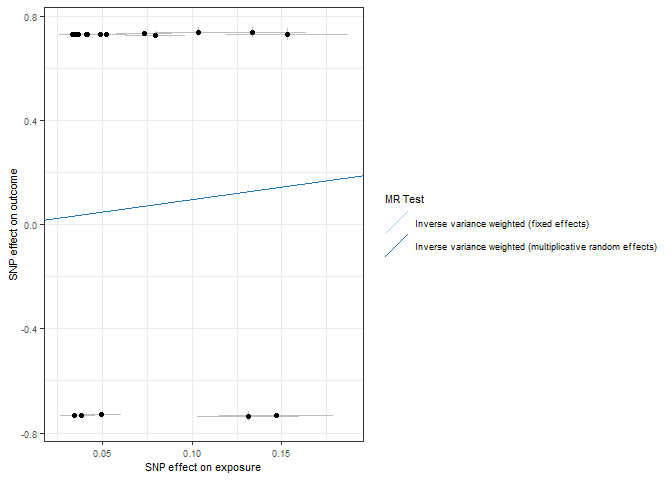<!-- -->

``` r
forrest_p <- mr_forest_plot(res_single)
forrest_p[[1]]
```

    ## Warning: Removed 1 row containing missing values or values outside the scale range
    ## (`geom_errorbarh()`).

    ## Warning: Removed 1 row containing missing values or values outside the scale range
    ## (`geom_point()`).

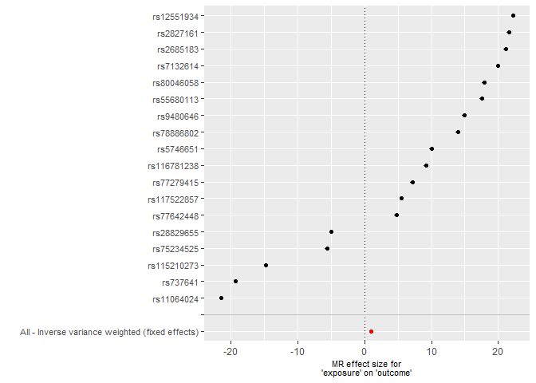<!-- -->

``` r
mr_dat <- read.csv("exposure/mr_dat_ptsd")
mr_res <- read.csv("exposure/mr_res_ptsd.csv")
res_single <- read.csv("exposure/res_single_ptsd.csv")

mr_res
```

    ##   X id.exposure id.outcome outcome exposure
    ## 1 1      B2Gh6u     1eddHN outcome exposure
    ## 2 2      B2Gh6u     1eddHN outcome exposure
    ##                                                      method nsnp         b
    ## 1                 Inverse variance weighted (fixed effects)   22 -1.156271
    ## 2 Inverse variance weighted (multiplicative random effects)   22 -1.156271
    ##           se          pval
    ## 1 0.05118945 5.678084e-113
    ## 2 1.81578723  5.242633e-01

``` r
res_pleio <- mr_pleiotropy_test(mr_dat)

res_pleio %>%
  select(-id.exposure, -id.outcome, -outcome, -exposure) %>%
  gt() %>%
  fmt_number(
    columns = c('egger_intercept', 'se')
  ) %>%
  fmt_number(
    columns = pval,
    rows = pval > 0.001,
    decimals = 3
  ) %>% 
  fmt_scientific(
    columns = pval,
    rows = pval <= 0.001,
    decimals = 1
  )
```

<div id="agnuqnssyo" style="padding-left:0px;padding-right:0px;padding-top:10px;padding-bottom:10px;overflow-x:auto;overflow-y:auto;width:auto;height:auto;">
<style>#agnuqnssyo table {
  font-family: system-ui, 'Segoe UI', Roboto, Helvetica, Arial, sans-serif, 'Apple Color Emoji', 'Segoe UI Emoji', 'Segoe UI Symbol', 'Noto Color Emoji';
  -webkit-font-smoothing: antialiased;
  -moz-osx-font-smoothing: grayscale;
}
&#10;#agnuqnssyo thead, #agnuqnssyo tbody, #agnuqnssyo tfoot, #agnuqnssyo tr, #agnuqnssyo td, #agnuqnssyo th {
  border-style: none;
}
&#10;#agnuqnssyo p {
  margin: 0;
  padding: 0;
}
&#10;#agnuqnssyo .gt_table {
  display: table;
  border-collapse: collapse;
  line-height: normal;
  margin-left: auto;
  margin-right: auto;
  color: #333333;
  font-size: 16px;
  font-weight: normal;
  font-style: normal;
  background-color: #FFFFFF;
  width: auto;
  border-top-style: solid;
  border-top-width: 2px;
  border-top-color: #A8A8A8;
  border-right-style: none;
  border-right-width: 2px;
  border-right-color: #D3D3D3;
  border-bottom-style: solid;
  border-bottom-width: 2px;
  border-bottom-color: #A8A8A8;
  border-left-style: none;
  border-left-width: 2px;
  border-left-color: #D3D3D3;
}
&#10;#agnuqnssyo .gt_caption {
  padding-top: 4px;
  padding-bottom: 4px;
}
&#10;#agnuqnssyo .gt_title {
  color: #333333;
  font-size: 125%;
  font-weight: initial;
  padding-top: 4px;
  padding-bottom: 4px;
  padding-left: 5px;
  padding-right: 5px;
  border-bottom-color: #FFFFFF;
  border-bottom-width: 0;
}
&#10;#agnuqnssyo .gt_subtitle {
  color: #333333;
  font-size: 85%;
  font-weight: initial;
  padding-top: 3px;
  padding-bottom: 5px;
  padding-left: 5px;
  padding-right: 5px;
  border-top-color: #FFFFFF;
  border-top-width: 0;
}
&#10;#agnuqnssyo .gt_heading {
  background-color: #FFFFFF;
  text-align: center;
  border-bottom-color: #FFFFFF;
  border-left-style: none;
  border-left-width: 1px;
  border-left-color: #D3D3D3;
  border-right-style: none;
  border-right-width: 1px;
  border-right-color: #D3D3D3;
}
&#10;#agnuqnssyo .gt_bottom_border {
  border-bottom-style: solid;
  border-bottom-width: 2px;
  border-bottom-color: #D3D3D3;
}
&#10;#agnuqnssyo .gt_col_headings {
  border-top-style: solid;
  border-top-width: 2px;
  border-top-color: #D3D3D3;
  border-bottom-style: solid;
  border-bottom-width: 2px;
  border-bottom-color: #D3D3D3;
  border-left-style: none;
  border-left-width: 1px;
  border-left-color: #D3D3D3;
  border-right-style: none;
  border-right-width: 1px;
  border-right-color: #D3D3D3;
}
&#10;#agnuqnssyo .gt_col_heading {
  color: #333333;
  background-color: #FFFFFF;
  font-size: 100%;
  font-weight: normal;
  text-transform: inherit;
  border-left-style: none;
  border-left-width: 1px;
  border-left-color: #D3D3D3;
  border-right-style: none;
  border-right-width: 1px;
  border-right-color: #D3D3D3;
  vertical-align: bottom;
  padding-top: 5px;
  padding-bottom: 6px;
  padding-left: 5px;
  padding-right: 5px;
  overflow-x: hidden;
}
&#10;#agnuqnssyo .gt_column_spanner_outer {
  color: #333333;
  background-color: #FFFFFF;
  font-size: 100%;
  font-weight: normal;
  text-transform: inherit;
  padding-top: 0;
  padding-bottom: 0;
  padding-left: 4px;
  padding-right: 4px;
}
&#10;#agnuqnssyo .gt_column_spanner_outer:first-child {
  padding-left: 0;
}
&#10;#agnuqnssyo .gt_column_spanner_outer:last-child {
  padding-right: 0;
}
&#10;#agnuqnssyo .gt_column_spanner {
  border-bottom-style: solid;
  border-bottom-width: 2px;
  border-bottom-color: #D3D3D3;
  vertical-align: bottom;
  padding-top: 5px;
  padding-bottom: 5px;
  overflow-x: hidden;
  display: inline-block;
  width: 100%;
}
&#10;#agnuqnssyo .gt_spanner_row {
  border-bottom-style: hidden;
}
&#10;#agnuqnssyo .gt_group_heading {
  padding-top: 8px;
  padding-bottom: 8px;
  padding-left: 5px;
  padding-right: 5px;
  color: #333333;
  background-color: #FFFFFF;
  font-size: 100%;
  font-weight: initial;
  text-transform: inherit;
  border-top-style: solid;
  border-top-width: 2px;
  border-top-color: #D3D3D3;
  border-bottom-style: solid;
  border-bottom-width: 2px;
  border-bottom-color: #D3D3D3;
  border-left-style: none;
  border-left-width: 1px;
  border-left-color: #D3D3D3;
  border-right-style: none;
  border-right-width: 1px;
  border-right-color: #D3D3D3;
  vertical-align: middle;
  text-align: left;
}
&#10;#agnuqnssyo .gt_empty_group_heading {
  padding: 0.5px;
  color: #333333;
  background-color: #FFFFFF;
  font-size: 100%;
  font-weight: initial;
  border-top-style: solid;
  border-top-width: 2px;
  border-top-color: #D3D3D3;
  border-bottom-style: solid;
  border-bottom-width: 2px;
  border-bottom-color: #D3D3D3;
  vertical-align: middle;
}
&#10;#agnuqnssyo .gt_from_md > :first-child {
  margin-top: 0;
}
&#10;#agnuqnssyo .gt_from_md > :last-child {
  margin-bottom: 0;
}
&#10;#agnuqnssyo .gt_row {
  padding-top: 8px;
  padding-bottom: 8px;
  padding-left: 5px;
  padding-right: 5px;
  margin: 10px;
  border-top-style: solid;
  border-top-width: 1px;
  border-top-color: #D3D3D3;
  border-left-style: none;
  border-left-width: 1px;
  border-left-color: #D3D3D3;
  border-right-style: none;
  border-right-width: 1px;
  border-right-color: #D3D3D3;
  vertical-align: middle;
  overflow-x: hidden;
}
&#10;#agnuqnssyo .gt_stub {
  color: #333333;
  background-color: #FFFFFF;
  font-size: 100%;
  font-weight: initial;
  text-transform: inherit;
  border-right-style: solid;
  border-right-width: 2px;
  border-right-color: #D3D3D3;
  padding-left: 5px;
  padding-right: 5px;
}
&#10;#agnuqnssyo .gt_stub_row_group {
  color: #333333;
  background-color: #FFFFFF;
  font-size: 100%;
  font-weight: initial;
  text-transform: inherit;
  border-right-style: solid;
  border-right-width: 2px;
  border-right-color: #D3D3D3;
  padding-left: 5px;
  padding-right: 5px;
  vertical-align: top;
}
&#10;#agnuqnssyo .gt_row_group_first td {
  border-top-width: 2px;
}
&#10;#agnuqnssyo .gt_row_group_first th {
  border-top-width: 2px;
}
&#10;#agnuqnssyo .gt_summary_row {
  color: #333333;
  background-color: #FFFFFF;
  text-transform: inherit;
  padding-top: 8px;
  padding-bottom: 8px;
  padding-left: 5px;
  padding-right: 5px;
}
&#10;#agnuqnssyo .gt_first_summary_row {
  border-top-style: solid;
  border-top-color: #D3D3D3;
}
&#10;#agnuqnssyo .gt_first_summary_row.thick {
  border-top-width: 2px;
}
&#10;#agnuqnssyo .gt_last_summary_row {
  padding-top: 8px;
  padding-bottom: 8px;
  padding-left: 5px;
  padding-right: 5px;
  border-bottom-style: solid;
  border-bottom-width: 2px;
  border-bottom-color: #D3D3D3;
}
&#10;#agnuqnssyo .gt_grand_summary_row {
  color: #333333;
  background-color: #FFFFFF;
  text-transform: inherit;
  padding-top: 8px;
  padding-bottom: 8px;
  padding-left: 5px;
  padding-right: 5px;
}
&#10;#agnuqnssyo .gt_first_grand_summary_row {
  padding-top: 8px;
  padding-bottom: 8px;
  padding-left: 5px;
  padding-right: 5px;
  border-top-style: double;
  border-top-width: 6px;
  border-top-color: #D3D3D3;
}
&#10;#agnuqnssyo .gt_last_grand_summary_row_top {
  padding-top: 8px;
  padding-bottom: 8px;
  padding-left: 5px;
  padding-right: 5px;
  border-bottom-style: double;
  border-bottom-width: 6px;
  border-bottom-color: #D3D3D3;
}
&#10;#agnuqnssyo .gt_striped {
  background-color: rgba(128, 128, 128, 0.05);
}
&#10;#agnuqnssyo .gt_table_body {
  border-top-style: solid;
  border-top-width: 2px;
  border-top-color: #D3D3D3;
  border-bottom-style: solid;
  border-bottom-width: 2px;
  border-bottom-color: #D3D3D3;
}
&#10;#agnuqnssyo .gt_footnotes {
  color: #333333;
  background-color: #FFFFFF;
  border-bottom-style: none;
  border-bottom-width: 2px;
  border-bottom-color: #D3D3D3;
  border-left-style: none;
  border-left-width: 2px;
  border-left-color: #D3D3D3;
  border-right-style: none;
  border-right-width: 2px;
  border-right-color: #D3D3D3;
}
&#10;#agnuqnssyo .gt_footnote {
  margin: 0px;
  font-size: 90%;
  padding-top: 4px;
  padding-bottom: 4px;
  padding-left: 5px;
  padding-right: 5px;
}
&#10;#agnuqnssyo .gt_sourcenotes {
  color: #333333;
  background-color: #FFFFFF;
  border-bottom-style: none;
  border-bottom-width: 2px;
  border-bottom-color: #D3D3D3;
  border-left-style: none;
  border-left-width: 2px;
  border-left-color: #D3D3D3;
  border-right-style: none;
  border-right-width: 2px;
  border-right-color: #D3D3D3;
}
&#10;#agnuqnssyo .gt_sourcenote {
  font-size: 90%;
  padding-top: 4px;
  padding-bottom: 4px;
  padding-left: 5px;
  padding-right: 5px;
}
&#10;#agnuqnssyo .gt_left {
  text-align: left;
}
&#10;#agnuqnssyo .gt_center {
  text-align: center;
}
&#10;#agnuqnssyo .gt_right {
  text-align: right;
  font-variant-numeric: tabular-nums;
}
&#10;#agnuqnssyo .gt_font_normal {
  font-weight: normal;
}
&#10;#agnuqnssyo .gt_font_bold {
  font-weight: bold;
}
&#10;#agnuqnssyo .gt_font_italic {
  font-style: italic;
}
&#10;#agnuqnssyo .gt_super {
  font-size: 65%;
}
&#10;#agnuqnssyo .gt_footnote_marks {
  font-size: 75%;
  vertical-align: 0.4em;
  position: initial;
}
&#10;#agnuqnssyo .gt_asterisk {
  font-size: 100%;
  vertical-align: 0;
}
&#10;#agnuqnssyo .gt_indent_1 {
  text-indent: 5px;
}
&#10;#agnuqnssyo .gt_indent_2 {
  text-indent: 10px;
}
&#10;#agnuqnssyo .gt_indent_3 {
  text-indent: 15px;
}
&#10;#agnuqnssyo .gt_indent_4 {
  text-indent: 20px;
}
&#10;#agnuqnssyo .gt_indent_5 {
  text-indent: 25px;
}
&#10;#agnuqnssyo .katex-display {
  display: inline-flex !important;
  margin-bottom: 0.75em !important;
}
&#10;#agnuqnssyo div.Reactable > div.rt-table > div.rt-thead > div.rt-tr.rt-tr-group-header > div.rt-th-group:after {
  height: 0px !important;
}
</style>
<table class="gt_table" data-quarto-disable-processing="false" data-quarto-bootstrap="false">
  <thead>
    <tr class="gt_col_headings">
      <th class="gt_col_heading gt_columns_bottom_border gt_right" rowspan="1" colspan="1" scope="col" id="egger_intercept">egger_intercept</th>
      <th class="gt_col_heading gt_columns_bottom_border gt_right" rowspan="1" colspan="1" scope="col" id="se">se</th>
      <th class="gt_col_heading gt_columns_bottom_border gt_right" rowspan="1" colspan="1" scope="col" id="pval">pval</th>
    </tr>
  </thead>
  <tbody class="gt_table_body">
    <tr><td headers="egger_intercept" class="gt_row gt_right">−0.19</td>
<td headers="se" class="gt_row gt_right">0.22</td>
<td headers="pval" class="gt_row gt_right">0.393</td></tr>
  </tbody>
  &#10;  
</table>
</div>

``` r
# Heterogeneity statistics 
res_het <- mr_heterogeneity(mr_dat, method_list = c(
  "mr_ivw_fe", "mr_ivw_mre"
))

res_het %>%
  select(-id.exposure, -id.outcome, -outcome, -exposure) %>%
  gt() %>%
  fmt_number(
    columns = Q
  ) %>%
  fmt_number(
    columns = Q_pval,
    rows = Q_pval > 0.001,
    decimals = 3
  ) %>% 
  fmt_scientific(
    columns = Q_pval,
    rows = Q_pval <= 0.001,
    decimals = 1
  )
```

<div id="eyujedbzvi" style="padding-left:0px;padding-right:0px;padding-top:10px;padding-bottom:10px;overflow-x:auto;overflow-y:auto;width:auto;height:auto;">
<style>#eyujedbzvi table {
  font-family: system-ui, 'Segoe UI', Roboto, Helvetica, Arial, sans-serif, 'Apple Color Emoji', 'Segoe UI Emoji', 'Segoe UI Symbol', 'Noto Color Emoji';
  -webkit-font-smoothing: antialiased;
  -moz-osx-font-smoothing: grayscale;
}
&#10;#eyujedbzvi thead, #eyujedbzvi tbody, #eyujedbzvi tfoot, #eyujedbzvi tr, #eyujedbzvi td, #eyujedbzvi th {
  border-style: none;
}
&#10;#eyujedbzvi p {
  margin: 0;
  padding: 0;
}
&#10;#eyujedbzvi .gt_table {
  display: table;
  border-collapse: collapse;
  line-height: normal;
  margin-left: auto;
  margin-right: auto;
  color: #333333;
  font-size: 16px;
  font-weight: normal;
  font-style: normal;
  background-color: #FFFFFF;
  width: auto;
  border-top-style: solid;
  border-top-width: 2px;
  border-top-color: #A8A8A8;
  border-right-style: none;
  border-right-width: 2px;
  border-right-color: #D3D3D3;
  border-bottom-style: solid;
  border-bottom-width: 2px;
  border-bottom-color: #A8A8A8;
  border-left-style: none;
  border-left-width: 2px;
  border-left-color: #D3D3D3;
}
&#10;#eyujedbzvi .gt_caption {
  padding-top: 4px;
  padding-bottom: 4px;
}
&#10;#eyujedbzvi .gt_title {
  color: #333333;
  font-size: 125%;
  font-weight: initial;
  padding-top: 4px;
  padding-bottom: 4px;
  padding-left: 5px;
  padding-right: 5px;
  border-bottom-color: #FFFFFF;
  border-bottom-width: 0;
}
&#10;#eyujedbzvi .gt_subtitle {
  color: #333333;
  font-size: 85%;
  font-weight: initial;
  padding-top: 3px;
  padding-bottom: 5px;
  padding-left: 5px;
  padding-right: 5px;
  border-top-color: #FFFFFF;
  border-top-width: 0;
}
&#10;#eyujedbzvi .gt_heading {
  background-color: #FFFFFF;
  text-align: center;
  border-bottom-color: #FFFFFF;
  border-left-style: none;
  border-left-width: 1px;
  border-left-color: #D3D3D3;
  border-right-style: none;
  border-right-width: 1px;
  border-right-color: #D3D3D3;
}
&#10;#eyujedbzvi .gt_bottom_border {
  border-bottom-style: solid;
  border-bottom-width: 2px;
  border-bottom-color: #D3D3D3;
}
&#10;#eyujedbzvi .gt_col_headings {
  border-top-style: solid;
  border-top-width: 2px;
  border-top-color: #D3D3D3;
  border-bottom-style: solid;
  border-bottom-width: 2px;
  border-bottom-color: #D3D3D3;
  border-left-style: none;
  border-left-width: 1px;
  border-left-color: #D3D3D3;
  border-right-style: none;
  border-right-width: 1px;
  border-right-color: #D3D3D3;
}
&#10;#eyujedbzvi .gt_col_heading {
  color: #333333;
  background-color: #FFFFFF;
  font-size: 100%;
  font-weight: normal;
  text-transform: inherit;
  border-left-style: none;
  border-left-width: 1px;
  border-left-color: #D3D3D3;
  border-right-style: none;
  border-right-width: 1px;
  border-right-color: #D3D3D3;
  vertical-align: bottom;
  padding-top: 5px;
  padding-bottom: 6px;
  padding-left: 5px;
  padding-right: 5px;
  overflow-x: hidden;
}
&#10;#eyujedbzvi .gt_column_spanner_outer {
  color: #333333;
  background-color: #FFFFFF;
  font-size: 100%;
  font-weight: normal;
  text-transform: inherit;
  padding-top: 0;
  padding-bottom: 0;
  padding-left: 4px;
  padding-right: 4px;
}
&#10;#eyujedbzvi .gt_column_spanner_outer:first-child {
  padding-left: 0;
}
&#10;#eyujedbzvi .gt_column_spanner_outer:last-child {
  padding-right: 0;
}
&#10;#eyujedbzvi .gt_column_spanner {
  border-bottom-style: solid;
  border-bottom-width: 2px;
  border-bottom-color: #D3D3D3;
  vertical-align: bottom;
  padding-top: 5px;
  padding-bottom: 5px;
  overflow-x: hidden;
  display: inline-block;
  width: 100%;
}
&#10;#eyujedbzvi .gt_spanner_row {
  border-bottom-style: hidden;
}
&#10;#eyujedbzvi .gt_group_heading {
  padding-top: 8px;
  padding-bottom: 8px;
  padding-left: 5px;
  padding-right: 5px;
  color: #333333;
  background-color: #FFFFFF;
  font-size: 100%;
  font-weight: initial;
  text-transform: inherit;
  border-top-style: solid;
  border-top-width: 2px;
  border-top-color: #D3D3D3;
  border-bottom-style: solid;
  border-bottom-width: 2px;
  border-bottom-color: #D3D3D3;
  border-left-style: none;
  border-left-width: 1px;
  border-left-color: #D3D3D3;
  border-right-style: none;
  border-right-width: 1px;
  border-right-color: #D3D3D3;
  vertical-align: middle;
  text-align: left;
}
&#10;#eyujedbzvi .gt_empty_group_heading {
  padding: 0.5px;
  color: #333333;
  background-color: #FFFFFF;
  font-size: 100%;
  font-weight: initial;
  border-top-style: solid;
  border-top-width: 2px;
  border-top-color: #D3D3D3;
  border-bottom-style: solid;
  border-bottom-width: 2px;
  border-bottom-color: #D3D3D3;
  vertical-align: middle;
}
&#10;#eyujedbzvi .gt_from_md > :first-child {
  margin-top: 0;
}
&#10;#eyujedbzvi .gt_from_md > :last-child {
  margin-bottom: 0;
}
&#10;#eyujedbzvi .gt_row {
  padding-top: 8px;
  padding-bottom: 8px;
  padding-left: 5px;
  padding-right: 5px;
  margin: 10px;
  border-top-style: solid;
  border-top-width: 1px;
  border-top-color: #D3D3D3;
  border-left-style: none;
  border-left-width: 1px;
  border-left-color: #D3D3D3;
  border-right-style: none;
  border-right-width: 1px;
  border-right-color: #D3D3D3;
  vertical-align: middle;
  overflow-x: hidden;
}
&#10;#eyujedbzvi .gt_stub {
  color: #333333;
  background-color: #FFFFFF;
  font-size: 100%;
  font-weight: initial;
  text-transform: inherit;
  border-right-style: solid;
  border-right-width: 2px;
  border-right-color: #D3D3D3;
  padding-left: 5px;
  padding-right: 5px;
}
&#10;#eyujedbzvi .gt_stub_row_group {
  color: #333333;
  background-color: #FFFFFF;
  font-size: 100%;
  font-weight: initial;
  text-transform: inherit;
  border-right-style: solid;
  border-right-width: 2px;
  border-right-color: #D3D3D3;
  padding-left: 5px;
  padding-right: 5px;
  vertical-align: top;
}
&#10;#eyujedbzvi .gt_row_group_first td {
  border-top-width: 2px;
}
&#10;#eyujedbzvi .gt_row_group_first th {
  border-top-width: 2px;
}
&#10;#eyujedbzvi .gt_summary_row {
  color: #333333;
  background-color: #FFFFFF;
  text-transform: inherit;
  padding-top: 8px;
  padding-bottom: 8px;
  padding-left: 5px;
  padding-right: 5px;
}
&#10;#eyujedbzvi .gt_first_summary_row {
  border-top-style: solid;
  border-top-color: #D3D3D3;
}
&#10;#eyujedbzvi .gt_first_summary_row.thick {
  border-top-width: 2px;
}
&#10;#eyujedbzvi .gt_last_summary_row {
  padding-top: 8px;
  padding-bottom: 8px;
  padding-left: 5px;
  padding-right: 5px;
  border-bottom-style: solid;
  border-bottom-width: 2px;
  border-bottom-color: #D3D3D3;
}
&#10;#eyujedbzvi .gt_grand_summary_row {
  color: #333333;
  background-color: #FFFFFF;
  text-transform: inherit;
  padding-top: 8px;
  padding-bottom: 8px;
  padding-left: 5px;
  padding-right: 5px;
}
&#10;#eyujedbzvi .gt_first_grand_summary_row {
  padding-top: 8px;
  padding-bottom: 8px;
  padding-left: 5px;
  padding-right: 5px;
  border-top-style: double;
  border-top-width: 6px;
  border-top-color: #D3D3D3;
}
&#10;#eyujedbzvi .gt_last_grand_summary_row_top {
  padding-top: 8px;
  padding-bottom: 8px;
  padding-left: 5px;
  padding-right: 5px;
  border-bottom-style: double;
  border-bottom-width: 6px;
  border-bottom-color: #D3D3D3;
}
&#10;#eyujedbzvi .gt_striped {
  background-color: rgba(128, 128, 128, 0.05);
}
&#10;#eyujedbzvi .gt_table_body {
  border-top-style: solid;
  border-top-width: 2px;
  border-top-color: #D3D3D3;
  border-bottom-style: solid;
  border-bottom-width: 2px;
  border-bottom-color: #D3D3D3;
}
&#10;#eyujedbzvi .gt_footnotes {
  color: #333333;
  background-color: #FFFFFF;
  border-bottom-style: none;
  border-bottom-width: 2px;
  border-bottom-color: #D3D3D3;
  border-left-style: none;
  border-left-width: 2px;
  border-left-color: #D3D3D3;
  border-right-style: none;
  border-right-width: 2px;
  border-right-color: #D3D3D3;
}
&#10;#eyujedbzvi .gt_footnote {
  margin: 0px;
  font-size: 90%;
  padding-top: 4px;
  padding-bottom: 4px;
  padding-left: 5px;
  padding-right: 5px;
}
&#10;#eyujedbzvi .gt_sourcenotes {
  color: #333333;
  background-color: #FFFFFF;
  border-bottom-style: none;
  border-bottom-width: 2px;
  border-bottom-color: #D3D3D3;
  border-left-style: none;
  border-left-width: 2px;
  border-left-color: #D3D3D3;
  border-right-style: none;
  border-right-width: 2px;
  border-right-color: #D3D3D3;
}
&#10;#eyujedbzvi .gt_sourcenote {
  font-size: 90%;
  padding-top: 4px;
  padding-bottom: 4px;
  padding-left: 5px;
  padding-right: 5px;
}
&#10;#eyujedbzvi .gt_left {
  text-align: left;
}
&#10;#eyujedbzvi .gt_center {
  text-align: center;
}
&#10;#eyujedbzvi .gt_right {
  text-align: right;
  font-variant-numeric: tabular-nums;
}
&#10;#eyujedbzvi .gt_font_normal {
  font-weight: normal;
}
&#10;#eyujedbzvi .gt_font_bold {
  font-weight: bold;
}
&#10;#eyujedbzvi .gt_font_italic {
  font-style: italic;
}
&#10;#eyujedbzvi .gt_super {
  font-size: 65%;
}
&#10;#eyujedbzvi .gt_footnote_marks {
  font-size: 75%;
  vertical-align: 0.4em;
  position: initial;
}
&#10;#eyujedbzvi .gt_asterisk {
  font-size: 100%;
  vertical-align: 0;
}
&#10;#eyujedbzvi .gt_indent_1 {
  text-indent: 5px;
}
&#10;#eyujedbzvi .gt_indent_2 {
  text-indent: 10px;
}
&#10;#eyujedbzvi .gt_indent_3 {
  text-indent: 15px;
}
&#10;#eyujedbzvi .gt_indent_4 {
  text-indent: 20px;
}
&#10;#eyujedbzvi .gt_indent_5 {
  text-indent: 25px;
}
&#10;#eyujedbzvi .katex-display {
  display: inline-flex !important;
  margin-bottom: 0.75em !important;
}
&#10;#eyujedbzvi div.Reactable > div.rt-table > div.rt-thead > div.rt-tr.rt-tr-group-header > div.rt-th-group:after {
  height: 0px !important;
}
</style>
<table class="gt_table" data-quarto-disable-processing="false" data-quarto-bootstrap="false">
  <thead>
    <tr class="gt_col_headings">
      <th class="gt_col_heading gt_columns_bottom_border gt_left" rowspan="1" colspan="1" scope="col" id="method">method</th>
      <th class="gt_col_heading gt_columns_bottom_border gt_right" rowspan="1" colspan="1" scope="col" id="Q">Q</th>
      <th class="gt_col_heading gt_columns_bottom_border gt_right" rowspan="1" colspan="1" scope="col" id="Q_df">Q_df</th>
      <th class="gt_col_heading gt_columns_bottom_border gt_right" rowspan="1" colspan="1" scope="col" id="Q_pval">Q_pval</th>
    </tr>
  </thead>
  <tbody class="gt_table_body">
    <tr><td headers="method" class="gt_row gt_left">Inverse variance weighted (fixed effects)</td>
<td headers="Q" class="gt_row gt_right">26,423.37</td>
<td headers="Q_df" class="gt_row gt_right">21</td>
<td headers="Q_pval" class="gt_row gt_right">0.0</td></tr>
    <tr><td headers="method" class="gt_row gt_left">Inverse variance weighted (multiplicative random effects)</td>
<td headers="Q" class="gt_row gt_right">26,423.37</td>
<td headers="Q_df" class="gt_row gt_right">21</td>
<td headers="Q_pval" class="gt_row gt_right">0.0</td></tr>
  </tbody>
  &#10;  
</table>
</div>

``` r
scatter_p <- mr_scatter_plot(mr_res, mr_dat)
scatter_out_p <- scatter_p[[1]] + theme_bw() +
  guides(color=guide_legend(ncol =1)) +
  theme(
    text = element_text(size = 8),
  )
scatter_out_p
```

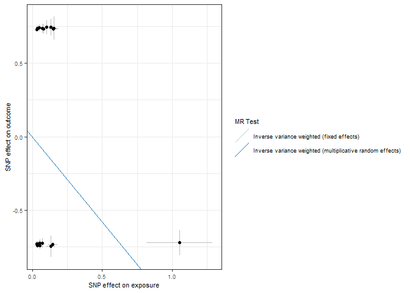<!-- -->

``` r
forrest_p <- mr_forest_plot(res_single)
forrest_p[[1]]
```

    ## Warning: Removed 1 row containing missing values or values outside the scale range
    ## (`geom_errorbarh()`).

    ## Warning: Removed 1 row containing missing values or values outside the scale range
    ## (`geom_point()`).

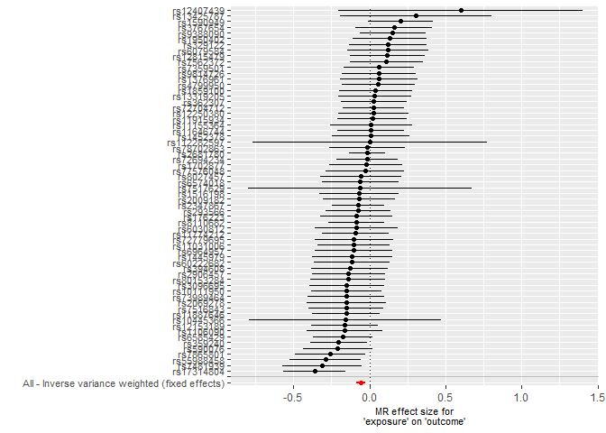<!-- -->

``` r
mr_dat <- read.csv("outcome/mr_dat_age")
mr_res <- read.csv("outcome/mr_res_age.csv")
res_single <- read.csv("outcome/res_single_age.csv")

mr_res
```

    ##   X id.exposure id.outcome outcome exposure
    ## 1 1      Hi6Pjk     3W3fLG outcome exposure
    ## 2 2      Hi6Pjk     3W3fLG outcome exposure
    ##                                                      method nsnp          b
    ## 1                 Inverse variance weighted (fixed effects)  367 0.03494023
    ## 2 Inverse variance weighted (multiplicative random effects)  367 0.03494023
    ##            se         pval
    ## 1 0.007795707 7.395266e-06
    ## 2 0.007582459 4.064947e-06

``` r
res_pleio <- mr_pleiotropy_test(mr_dat)

res_pleio %>%
  select(-id.exposure, -id.outcome, -outcome, -exposure) %>%
  gt() %>%
  fmt_number(
    columns = c('egger_intercept', 'se')
  ) %>%
  fmt_number(
    columns = pval,
    rows = pval > 0.001,
    decimals = 3
  ) %>% 
  fmt_scientific(
    columns = pval,
    rows = pval <= 0.001,
    decimals = 1
  )
```

<div id="nhtcjejvjf" style="padding-left:0px;padding-right:0px;padding-top:10px;padding-bottom:10px;overflow-x:auto;overflow-y:auto;width:auto;height:auto;">
<style>#nhtcjejvjf table {
  font-family: system-ui, 'Segoe UI', Roboto, Helvetica, Arial, sans-serif, 'Apple Color Emoji', 'Segoe UI Emoji', 'Segoe UI Symbol', 'Noto Color Emoji';
  -webkit-font-smoothing: antialiased;
  -moz-osx-font-smoothing: grayscale;
}
&#10;#nhtcjejvjf thead, #nhtcjejvjf tbody, #nhtcjejvjf tfoot, #nhtcjejvjf tr, #nhtcjejvjf td, #nhtcjejvjf th {
  border-style: none;
}
&#10;#nhtcjejvjf p {
  margin: 0;
  padding: 0;
}
&#10;#nhtcjejvjf .gt_table {
  display: table;
  border-collapse: collapse;
  line-height: normal;
  margin-left: auto;
  margin-right: auto;
  color: #333333;
  font-size: 16px;
  font-weight: normal;
  font-style: normal;
  background-color: #FFFFFF;
  width: auto;
  border-top-style: solid;
  border-top-width: 2px;
  border-top-color: #A8A8A8;
  border-right-style: none;
  border-right-width: 2px;
  border-right-color: #D3D3D3;
  border-bottom-style: solid;
  border-bottom-width: 2px;
  border-bottom-color: #A8A8A8;
  border-left-style: none;
  border-left-width: 2px;
  border-left-color: #D3D3D3;
}
&#10;#nhtcjejvjf .gt_caption {
  padding-top: 4px;
  padding-bottom: 4px;
}
&#10;#nhtcjejvjf .gt_title {
  color: #333333;
  font-size: 125%;
  font-weight: initial;
  padding-top: 4px;
  padding-bottom: 4px;
  padding-left: 5px;
  padding-right: 5px;
  border-bottom-color: #FFFFFF;
  border-bottom-width: 0;
}
&#10;#nhtcjejvjf .gt_subtitle {
  color: #333333;
  font-size: 85%;
  font-weight: initial;
  padding-top: 3px;
  padding-bottom: 5px;
  padding-left: 5px;
  padding-right: 5px;
  border-top-color: #FFFFFF;
  border-top-width: 0;
}
&#10;#nhtcjejvjf .gt_heading {
  background-color: #FFFFFF;
  text-align: center;
  border-bottom-color: #FFFFFF;
  border-left-style: none;
  border-left-width: 1px;
  border-left-color: #D3D3D3;
  border-right-style: none;
  border-right-width: 1px;
  border-right-color: #D3D3D3;
}
&#10;#nhtcjejvjf .gt_bottom_border {
  border-bottom-style: solid;
  border-bottom-width: 2px;
  border-bottom-color: #D3D3D3;
}
&#10;#nhtcjejvjf .gt_col_headings {
  border-top-style: solid;
  border-top-width: 2px;
  border-top-color: #D3D3D3;
  border-bottom-style: solid;
  border-bottom-width: 2px;
  border-bottom-color: #D3D3D3;
  border-left-style: none;
  border-left-width: 1px;
  border-left-color: #D3D3D3;
  border-right-style: none;
  border-right-width: 1px;
  border-right-color: #D3D3D3;
}
&#10;#nhtcjejvjf .gt_col_heading {
  color: #333333;
  background-color: #FFFFFF;
  font-size: 100%;
  font-weight: normal;
  text-transform: inherit;
  border-left-style: none;
  border-left-width: 1px;
  border-left-color: #D3D3D3;
  border-right-style: none;
  border-right-width: 1px;
  border-right-color: #D3D3D3;
  vertical-align: bottom;
  padding-top: 5px;
  padding-bottom: 6px;
  padding-left: 5px;
  padding-right: 5px;
  overflow-x: hidden;
}
&#10;#nhtcjejvjf .gt_column_spanner_outer {
  color: #333333;
  background-color: #FFFFFF;
  font-size: 100%;
  font-weight: normal;
  text-transform: inherit;
  padding-top: 0;
  padding-bottom: 0;
  padding-left: 4px;
  padding-right: 4px;
}
&#10;#nhtcjejvjf .gt_column_spanner_outer:first-child {
  padding-left: 0;
}
&#10;#nhtcjejvjf .gt_column_spanner_outer:last-child {
  padding-right: 0;
}
&#10;#nhtcjejvjf .gt_column_spanner {
  border-bottom-style: solid;
  border-bottom-width: 2px;
  border-bottom-color: #D3D3D3;
  vertical-align: bottom;
  padding-top: 5px;
  padding-bottom: 5px;
  overflow-x: hidden;
  display: inline-block;
  width: 100%;
}
&#10;#nhtcjejvjf .gt_spanner_row {
  border-bottom-style: hidden;
}
&#10;#nhtcjejvjf .gt_group_heading {
  padding-top: 8px;
  padding-bottom: 8px;
  padding-left: 5px;
  padding-right: 5px;
  color: #333333;
  background-color: #FFFFFF;
  font-size: 100%;
  font-weight: initial;
  text-transform: inherit;
  border-top-style: solid;
  border-top-width: 2px;
  border-top-color: #D3D3D3;
  border-bottom-style: solid;
  border-bottom-width: 2px;
  border-bottom-color: #D3D3D3;
  border-left-style: none;
  border-left-width: 1px;
  border-left-color: #D3D3D3;
  border-right-style: none;
  border-right-width: 1px;
  border-right-color: #D3D3D3;
  vertical-align: middle;
  text-align: left;
}
&#10;#nhtcjejvjf .gt_empty_group_heading {
  padding: 0.5px;
  color: #333333;
  background-color: #FFFFFF;
  font-size: 100%;
  font-weight: initial;
  border-top-style: solid;
  border-top-width: 2px;
  border-top-color: #D3D3D3;
  border-bottom-style: solid;
  border-bottom-width: 2px;
  border-bottom-color: #D3D3D3;
  vertical-align: middle;
}
&#10;#nhtcjejvjf .gt_from_md > :first-child {
  margin-top: 0;
}
&#10;#nhtcjejvjf .gt_from_md > :last-child {
  margin-bottom: 0;
}
&#10;#nhtcjejvjf .gt_row {
  padding-top: 8px;
  padding-bottom: 8px;
  padding-left: 5px;
  padding-right: 5px;
  margin: 10px;
  border-top-style: solid;
  border-top-width: 1px;
  border-top-color: #D3D3D3;
  border-left-style: none;
  border-left-width: 1px;
  border-left-color: #D3D3D3;
  border-right-style: none;
  border-right-width: 1px;
  border-right-color: #D3D3D3;
  vertical-align: middle;
  overflow-x: hidden;
}
&#10;#nhtcjejvjf .gt_stub {
  color: #333333;
  background-color: #FFFFFF;
  font-size: 100%;
  font-weight: initial;
  text-transform: inherit;
  border-right-style: solid;
  border-right-width: 2px;
  border-right-color: #D3D3D3;
  padding-left: 5px;
  padding-right: 5px;
}
&#10;#nhtcjejvjf .gt_stub_row_group {
  color: #333333;
  background-color: #FFFFFF;
  font-size: 100%;
  font-weight: initial;
  text-transform: inherit;
  border-right-style: solid;
  border-right-width: 2px;
  border-right-color: #D3D3D3;
  padding-left: 5px;
  padding-right: 5px;
  vertical-align: top;
}
&#10;#nhtcjejvjf .gt_row_group_first td {
  border-top-width: 2px;
}
&#10;#nhtcjejvjf .gt_row_group_first th {
  border-top-width: 2px;
}
&#10;#nhtcjejvjf .gt_summary_row {
  color: #333333;
  background-color: #FFFFFF;
  text-transform: inherit;
  padding-top: 8px;
  padding-bottom: 8px;
  padding-left: 5px;
  padding-right: 5px;
}
&#10;#nhtcjejvjf .gt_first_summary_row {
  border-top-style: solid;
  border-top-color: #D3D3D3;
}
&#10;#nhtcjejvjf .gt_first_summary_row.thick {
  border-top-width: 2px;
}
&#10;#nhtcjejvjf .gt_last_summary_row {
  padding-top: 8px;
  padding-bottom: 8px;
  padding-left: 5px;
  padding-right: 5px;
  border-bottom-style: solid;
  border-bottom-width: 2px;
  border-bottom-color: #D3D3D3;
}
&#10;#nhtcjejvjf .gt_grand_summary_row {
  color: #333333;
  background-color: #FFFFFF;
  text-transform: inherit;
  padding-top: 8px;
  padding-bottom: 8px;
  padding-left: 5px;
  padding-right: 5px;
}
&#10;#nhtcjejvjf .gt_first_grand_summary_row {
  padding-top: 8px;
  padding-bottom: 8px;
  padding-left: 5px;
  padding-right: 5px;
  border-top-style: double;
  border-top-width: 6px;
  border-top-color: #D3D3D3;
}
&#10;#nhtcjejvjf .gt_last_grand_summary_row_top {
  padding-top: 8px;
  padding-bottom: 8px;
  padding-left: 5px;
  padding-right: 5px;
  border-bottom-style: double;
  border-bottom-width: 6px;
  border-bottom-color: #D3D3D3;
}
&#10;#nhtcjejvjf .gt_striped {
  background-color: rgba(128, 128, 128, 0.05);
}
&#10;#nhtcjejvjf .gt_table_body {
  border-top-style: solid;
  border-top-width: 2px;
  border-top-color: #D3D3D3;
  border-bottom-style: solid;
  border-bottom-width: 2px;
  border-bottom-color: #D3D3D3;
}
&#10;#nhtcjejvjf .gt_footnotes {
  color: #333333;
  background-color: #FFFFFF;
  border-bottom-style: none;
  border-bottom-width: 2px;
  border-bottom-color: #D3D3D3;
  border-left-style: none;
  border-left-width: 2px;
  border-left-color: #D3D3D3;
  border-right-style: none;
  border-right-width: 2px;
  border-right-color: #D3D3D3;
}
&#10;#nhtcjejvjf .gt_footnote {
  margin: 0px;
  font-size: 90%;
  padding-top: 4px;
  padding-bottom: 4px;
  padding-left: 5px;
  padding-right: 5px;
}
&#10;#nhtcjejvjf .gt_sourcenotes {
  color: #333333;
  background-color: #FFFFFF;
  border-bottom-style: none;
  border-bottom-width: 2px;
  border-bottom-color: #D3D3D3;
  border-left-style: none;
  border-left-width: 2px;
  border-left-color: #D3D3D3;
  border-right-style: none;
  border-right-width: 2px;
  border-right-color: #D3D3D3;
}
&#10;#nhtcjejvjf .gt_sourcenote {
  font-size: 90%;
  padding-top: 4px;
  padding-bottom: 4px;
  padding-left: 5px;
  padding-right: 5px;
}
&#10;#nhtcjejvjf .gt_left {
  text-align: left;
}
&#10;#nhtcjejvjf .gt_center {
  text-align: center;
}
&#10;#nhtcjejvjf .gt_right {
  text-align: right;
  font-variant-numeric: tabular-nums;
}
&#10;#nhtcjejvjf .gt_font_normal {
  font-weight: normal;
}
&#10;#nhtcjejvjf .gt_font_bold {
  font-weight: bold;
}
&#10;#nhtcjejvjf .gt_font_italic {
  font-style: italic;
}
&#10;#nhtcjejvjf .gt_super {
  font-size: 65%;
}
&#10;#nhtcjejvjf .gt_footnote_marks {
  font-size: 75%;
  vertical-align: 0.4em;
  position: initial;
}
&#10;#nhtcjejvjf .gt_asterisk {
  font-size: 100%;
  vertical-align: 0;
}
&#10;#nhtcjejvjf .gt_indent_1 {
  text-indent: 5px;
}
&#10;#nhtcjejvjf .gt_indent_2 {
  text-indent: 10px;
}
&#10;#nhtcjejvjf .gt_indent_3 {
  text-indent: 15px;
}
&#10;#nhtcjejvjf .gt_indent_4 {
  text-indent: 20px;
}
&#10;#nhtcjejvjf .gt_indent_5 {
  text-indent: 25px;
}
&#10;#nhtcjejvjf .katex-display {
  display: inline-flex !important;
  margin-bottom: 0.75em !important;
}
&#10;#nhtcjejvjf div.Reactable > div.rt-table > div.rt-thead > div.rt-tr.rt-tr-group-header > div.rt-th-group:after {
  height: 0px !important;
}
</style>
<table class="gt_table" data-quarto-disable-processing="false" data-quarto-bootstrap="false">
  <thead>
    <tr class="gt_col_headings">
      <th class="gt_col_heading gt_columns_bottom_border gt_right" rowspan="1" colspan="1" scope="col" id="egger_intercept">egger_intercept</th>
      <th class="gt_col_heading gt_columns_bottom_border gt_right" rowspan="1" colspan="1" scope="col" id="se">se</th>
      <th class="gt_col_heading gt_columns_bottom_border gt_right" rowspan="1" colspan="1" scope="col" id="pval">pval</th>
    </tr>
  </thead>
  <tbody class="gt_table_body">
    <tr><td headers="egger_intercept" class="gt_row gt_right">0.00</td>
<td headers="se" class="gt_row gt_right">0.00</td>
<td headers="pval" class="gt_row gt_right">0.972</td></tr>
  </tbody>
  &#10;  
</table>
</div>

``` r
# Heterogeneity statistics 
res_het <- mr_heterogeneity(mr_dat, method_list = c(
  "mr_ivw_fe", "mr_ivw_mre"
))

res_het %>%
  select(-id.exposure, -id.outcome, -outcome, -exposure) %>%
  gt() %>%
  fmt_number(
    columns = Q
  ) %>%
  fmt_number(
    columns = Q_pval,
    rows = Q_pval > 0.001,
    decimals = 3
  ) %>% 
  fmt_scientific(
    columns = Q_pval,
    rows = Q_pval <= 0.001,
    decimals = 1
  )
```

<div id="cwhpnmewfm" style="padding-left:0px;padding-right:0px;padding-top:10px;padding-bottom:10px;overflow-x:auto;overflow-y:auto;width:auto;height:auto;">
<style>#cwhpnmewfm table {
  font-family: system-ui, 'Segoe UI', Roboto, Helvetica, Arial, sans-serif, 'Apple Color Emoji', 'Segoe UI Emoji', 'Segoe UI Symbol', 'Noto Color Emoji';
  -webkit-font-smoothing: antialiased;
  -moz-osx-font-smoothing: grayscale;
}
&#10;#cwhpnmewfm thead, #cwhpnmewfm tbody, #cwhpnmewfm tfoot, #cwhpnmewfm tr, #cwhpnmewfm td, #cwhpnmewfm th {
  border-style: none;
}
&#10;#cwhpnmewfm p {
  margin: 0;
  padding: 0;
}
&#10;#cwhpnmewfm .gt_table {
  display: table;
  border-collapse: collapse;
  line-height: normal;
  margin-left: auto;
  margin-right: auto;
  color: #333333;
  font-size: 16px;
  font-weight: normal;
  font-style: normal;
  background-color: #FFFFFF;
  width: auto;
  border-top-style: solid;
  border-top-width: 2px;
  border-top-color: #A8A8A8;
  border-right-style: none;
  border-right-width: 2px;
  border-right-color: #D3D3D3;
  border-bottom-style: solid;
  border-bottom-width: 2px;
  border-bottom-color: #A8A8A8;
  border-left-style: none;
  border-left-width: 2px;
  border-left-color: #D3D3D3;
}
&#10;#cwhpnmewfm .gt_caption {
  padding-top: 4px;
  padding-bottom: 4px;
}
&#10;#cwhpnmewfm .gt_title {
  color: #333333;
  font-size: 125%;
  font-weight: initial;
  padding-top: 4px;
  padding-bottom: 4px;
  padding-left: 5px;
  padding-right: 5px;
  border-bottom-color: #FFFFFF;
  border-bottom-width: 0;
}
&#10;#cwhpnmewfm .gt_subtitle {
  color: #333333;
  font-size: 85%;
  font-weight: initial;
  padding-top: 3px;
  padding-bottom: 5px;
  padding-left: 5px;
  padding-right: 5px;
  border-top-color: #FFFFFF;
  border-top-width: 0;
}
&#10;#cwhpnmewfm .gt_heading {
  background-color: #FFFFFF;
  text-align: center;
  border-bottom-color: #FFFFFF;
  border-left-style: none;
  border-left-width: 1px;
  border-left-color: #D3D3D3;
  border-right-style: none;
  border-right-width: 1px;
  border-right-color: #D3D3D3;
}
&#10;#cwhpnmewfm .gt_bottom_border {
  border-bottom-style: solid;
  border-bottom-width: 2px;
  border-bottom-color: #D3D3D3;
}
&#10;#cwhpnmewfm .gt_col_headings {
  border-top-style: solid;
  border-top-width: 2px;
  border-top-color: #D3D3D3;
  border-bottom-style: solid;
  border-bottom-width: 2px;
  border-bottom-color: #D3D3D3;
  border-left-style: none;
  border-left-width: 1px;
  border-left-color: #D3D3D3;
  border-right-style: none;
  border-right-width: 1px;
  border-right-color: #D3D3D3;
}
&#10;#cwhpnmewfm .gt_col_heading {
  color: #333333;
  background-color: #FFFFFF;
  font-size: 100%;
  font-weight: normal;
  text-transform: inherit;
  border-left-style: none;
  border-left-width: 1px;
  border-left-color: #D3D3D3;
  border-right-style: none;
  border-right-width: 1px;
  border-right-color: #D3D3D3;
  vertical-align: bottom;
  padding-top: 5px;
  padding-bottom: 6px;
  padding-left: 5px;
  padding-right: 5px;
  overflow-x: hidden;
}
&#10;#cwhpnmewfm .gt_column_spanner_outer {
  color: #333333;
  background-color: #FFFFFF;
  font-size: 100%;
  font-weight: normal;
  text-transform: inherit;
  padding-top: 0;
  padding-bottom: 0;
  padding-left: 4px;
  padding-right: 4px;
}
&#10;#cwhpnmewfm .gt_column_spanner_outer:first-child {
  padding-left: 0;
}
&#10;#cwhpnmewfm .gt_column_spanner_outer:last-child {
  padding-right: 0;
}
&#10;#cwhpnmewfm .gt_column_spanner {
  border-bottom-style: solid;
  border-bottom-width: 2px;
  border-bottom-color: #D3D3D3;
  vertical-align: bottom;
  padding-top: 5px;
  padding-bottom: 5px;
  overflow-x: hidden;
  display: inline-block;
  width: 100%;
}
&#10;#cwhpnmewfm .gt_spanner_row {
  border-bottom-style: hidden;
}
&#10;#cwhpnmewfm .gt_group_heading {
  padding-top: 8px;
  padding-bottom: 8px;
  padding-left: 5px;
  padding-right: 5px;
  color: #333333;
  background-color: #FFFFFF;
  font-size: 100%;
  font-weight: initial;
  text-transform: inherit;
  border-top-style: solid;
  border-top-width: 2px;
  border-top-color: #D3D3D3;
  border-bottom-style: solid;
  border-bottom-width: 2px;
  border-bottom-color: #D3D3D3;
  border-left-style: none;
  border-left-width: 1px;
  border-left-color: #D3D3D3;
  border-right-style: none;
  border-right-width: 1px;
  border-right-color: #D3D3D3;
  vertical-align: middle;
  text-align: left;
}
&#10;#cwhpnmewfm .gt_empty_group_heading {
  padding: 0.5px;
  color: #333333;
  background-color: #FFFFFF;
  font-size: 100%;
  font-weight: initial;
  border-top-style: solid;
  border-top-width: 2px;
  border-top-color: #D3D3D3;
  border-bottom-style: solid;
  border-bottom-width: 2px;
  border-bottom-color: #D3D3D3;
  vertical-align: middle;
}
&#10;#cwhpnmewfm .gt_from_md > :first-child {
  margin-top: 0;
}
&#10;#cwhpnmewfm .gt_from_md > :last-child {
  margin-bottom: 0;
}
&#10;#cwhpnmewfm .gt_row {
  padding-top: 8px;
  padding-bottom: 8px;
  padding-left: 5px;
  padding-right: 5px;
  margin: 10px;
  border-top-style: solid;
  border-top-width: 1px;
  border-top-color: #D3D3D3;
  border-left-style: none;
  border-left-width: 1px;
  border-left-color: #D3D3D3;
  border-right-style: none;
  border-right-width: 1px;
  border-right-color: #D3D3D3;
  vertical-align: middle;
  overflow-x: hidden;
}
&#10;#cwhpnmewfm .gt_stub {
  color: #333333;
  background-color: #FFFFFF;
  font-size: 100%;
  font-weight: initial;
  text-transform: inherit;
  border-right-style: solid;
  border-right-width: 2px;
  border-right-color: #D3D3D3;
  padding-left: 5px;
  padding-right: 5px;
}
&#10;#cwhpnmewfm .gt_stub_row_group {
  color: #333333;
  background-color: #FFFFFF;
  font-size: 100%;
  font-weight: initial;
  text-transform: inherit;
  border-right-style: solid;
  border-right-width: 2px;
  border-right-color: #D3D3D3;
  padding-left: 5px;
  padding-right: 5px;
  vertical-align: top;
}
&#10;#cwhpnmewfm .gt_row_group_first td {
  border-top-width: 2px;
}
&#10;#cwhpnmewfm .gt_row_group_first th {
  border-top-width: 2px;
}
&#10;#cwhpnmewfm .gt_summary_row {
  color: #333333;
  background-color: #FFFFFF;
  text-transform: inherit;
  padding-top: 8px;
  padding-bottom: 8px;
  padding-left: 5px;
  padding-right: 5px;
}
&#10;#cwhpnmewfm .gt_first_summary_row {
  border-top-style: solid;
  border-top-color: #D3D3D3;
}
&#10;#cwhpnmewfm .gt_first_summary_row.thick {
  border-top-width: 2px;
}
&#10;#cwhpnmewfm .gt_last_summary_row {
  padding-top: 8px;
  padding-bottom: 8px;
  padding-left: 5px;
  padding-right: 5px;
  border-bottom-style: solid;
  border-bottom-width: 2px;
  border-bottom-color: #D3D3D3;
}
&#10;#cwhpnmewfm .gt_grand_summary_row {
  color: #333333;
  background-color: #FFFFFF;
  text-transform: inherit;
  padding-top: 8px;
  padding-bottom: 8px;
  padding-left: 5px;
  padding-right: 5px;
}
&#10;#cwhpnmewfm .gt_first_grand_summary_row {
  padding-top: 8px;
  padding-bottom: 8px;
  padding-left: 5px;
  padding-right: 5px;
  border-top-style: double;
  border-top-width: 6px;
  border-top-color: #D3D3D3;
}
&#10;#cwhpnmewfm .gt_last_grand_summary_row_top {
  padding-top: 8px;
  padding-bottom: 8px;
  padding-left: 5px;
  padding-right: 5px;
  border-bottom-style: double;
  border-bottom-width: 6px;
  border-bottom-color: #D3D3D3;
}
&#10;#cwhpnmewfm .gt_striped {
  background-color: rgba(128, 128, 128, 0.05);
}
&#10;#cwhpnmewfm .gt_table_body {
  border-top-style: solid;
  border-top-width: 2px;
  border-top-color: #D3D3D3;
  border-bottom-style: solid;
  border-bottom-width: 2px;
  border-bottom-color: #D3D3D3;
}
&#10;#cwhpnmewfm .gt_footnotes {
  color: #333333;
  background-color: #FFFFFF;
  border-bottom-style: none;
  border-bottom-width: 2px;
  border-bottom-color: #D3D3D3;
  border-left-style: none;
  border-left-width: 2px;
  border-left-color: #D3D3D3;
  border-right-style: none;
  border-right-width: 2px;
  border-right-color: #D3D3D3;
}
&#10;#cwhpnmewfm .gt_footnote {
  margin: 0px;
  font-size: 90%;
  padding-top: 4px;
  padding-bottom: 4px;
  padding-left: 5px;
  padding-right: 5px;
}
&#10;#cwhpnmewfm .gt_sourcenotes {
  color: #333333;
  background-color: #FFFFFF;
  border-bottom-style: none;
  border-bottom-width: 2px;
  border-bottom-color: #D3D3D3;
  border-left-style: none;
  border-left-width: 2px;
  border-left-color: #D3D3D3;
  border-right-style: none;
  border-right-width: 2px;
  border-right-color: #D3D3D3;
}
&#10;#cwhpnmewfm .gt_sourcenote {
  font-size: 90%;
  padding-top: 4px;
  padding-bottom: 4px;
  padding-left: 5px;
  padding-right: 5px;
}
&#10;#cwhpnmewfm .gt_left {
  text-align: left;
}
&#10;#cwhpnmewfm .gt_center {
  text-align: center;
}
&#10;#cwhpnmewfm .gt_right {
  text-align: right;
  font-variant-numeric: tabular-nums;
}
&#10;#cwhpnmewfm .gt_font_normal {
  font-weight: normal;
}
&#10;#cwhpnmewfm .gt_font_bold {
  font-weight: bold;
}
&#10;#cwhpnmewfm .gt_font_italic {
  font-style: italic;
}
&#10;#cwhpnmewfm .gt_super {
  font-size: 65%;
}
&#10;#cwhpnmewfm .gt_footnote_marks {
  font-size: 75%;
  vertical-align: 0.4em;
  position: initial;
}
&#10;#cwhpnmewfm .gt_asterisk {
  font-size: 100%;
  vertical-align: 0;
}
&#10;#cwhpnmewfm .gt_indent_1 {
  text-indent: 5px;
}
&#10;#cwhpnmewfm .gt_indent_2 {
  text-indent: 10px;
}
&#10;#cwhpnmewfm .gt_indent_3 {
  text-indent: 15px;
}
&#10;#cwhpnmewfm .gt_indent_4 {
  text-indent: 20px;
}
&#10;#cwhpnmewfm .gt_indent_5 {
  text-indent: 25px;
}
&#10;#cwhpnmewfm .katex-display {
  display: inline-flex !important;
  margin-bottom: 0.75em !important;
}
&#10;#cwhpnmewfm div.Reactable > div.rt-table > div.rt-thead > div.rt-tr.rt-tr-group-header > div.rt-th-group:after {
  height: 0px !important;
}
</style>
<table class="gt_table" data-quarto-disable-processing="false" data-quarto-bootstrap="false">
  <thead>
    <tr class="gt_col_headings">
      <th class="gt_col_heading gt_columns_bottom_border gt_left" rowspan="1" colspan="1" scope="col" id="method">method</th>
      <th class="gt_col_heading gt_columns_bottom_border gt_right" rowspan="1" colspan="1" scope="col" id="Q">Q</th>
      <th class="gt_col_heading gt_columns_bottom_border gt_right" rowspan="1" colspan="1" scope="col" id="Q_df">Q_df</th>
      <th class="gt_col_heading gt_columns_bottom_border gt_right" rowspan="1" colspan="1" scope="col" id="Q_pval">Q_pval</th>
    </tr>
  </thead>
  <tbody class="gt_table_body">
    <tr><td headers="method" class="gt_row gt_left">Inverse variance weighted (fixed effects)</td>
<td headers="Q" class="gt_row gt_right">346.25</td>
<td headers="Q_df" class="gt_row gt_right">366</td>
<td headers="Q_pval" class="gt_row gt_right">0.764</td></tr>
    <tr><td headers="method" class="gt_row gt_left">Inverse variance weighted (multiplicative random effects)</td>
<td headers="Q" class="gt_row gt_right">346.25</td>
<td headers="Q_df" class="gt_row gt_right">366</td>
<td headers="Q_pval" class="gt_row gt_right">0.764</td></tr>
  </tbody>
  &#10;  
</table>
</div>

``` r
scatter_p <- mr_scatter_plot(mr_res, mr_dat)
scatter_out_p <- scatter_p[[1]] + theme_bw() +
  guides(color=guide_legend(ncol =1)) +
  theme(
    text = element_text(size = 8),
  )
scatter_out_p
```

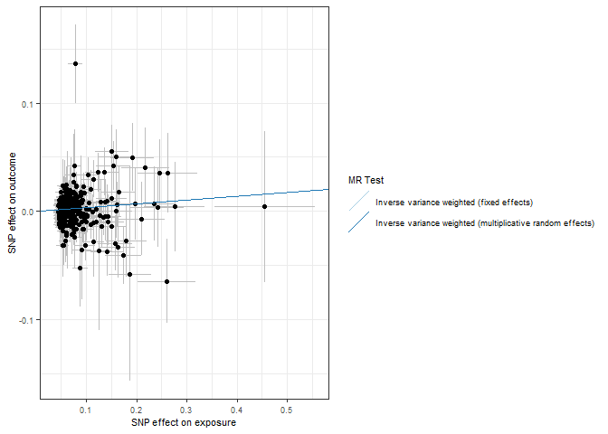<!-- -->

``` r
forrest_p <- mr_forest_plot(res_single)
forrest_p[[1]]
```

    ## Warning: Removed 1 row containing missing values or values outside the scale range
    ## (`geom_errorbarh()`).

    ## Warning: Removed 1 row containing missing values or values outside the scale range
    ## (`geom_point()`).

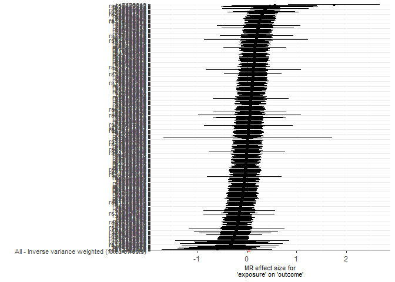<!-- -->

``` r
mr_dat <- read.csv("outcome/mr_dat_chrono")
mr_res <- read.csv("outcome/mr_res_chrono.csv")
res_single <- read.csv("outcome/res_single_chrono.csv")

mr_res
```

    ##   X id.exposure id.outcome outcome exposure
    ## 1 1      exRQza     3W3fLG outcome exposure
    ## 2 2      exRQza     3W3fLG outcome exposure
    ##                                                      method nsnp          b
    ## 1                 Inverse variance weighted (fixed effects)  696 0.04043958
    ## 2 Inverse variance weighted (multiplicative random effects)  696 0.04043958
    ##           se       pval
    ## 1 0.01912543 0.03447771
    ## 2 0.01917620 0.03495818

``` r
res_pleio <- mr_pleiotropy_test(mr_dat)

res_pleio %>%
  select(-id.exposure, -id.outcome, -outcome, -exposure) %>%
  gt() %>%
  fmt_number(
    columns = c('egger_intercept', 'se')
  ) %>%
  fmt_number(
    columns = pval,
    rows = pval > 0.001,
    decimals = 3
  ) %>% 
  fmt_scientific(
    columns = pval,
    rows = pval <= 0.001,
    decimals = 1
  )
```

<div id="ybpesyhvei" style="padding-left:0px;padding-right:0px;padding-top:10px;padding-bottom:10px;overflow-x:auto;overflow-y:auto;width:auto;height:auto;">
<style>#ybpesyhvei table {
  font-family: system-ui, 'Segoe UI', Roboto, Helvetica, Arial, sans-serif, 'Apple Color Emoji', 'Segoe UI Emoji', 'Segoe UI Symbol', 'Noto Color Emoji';
  -webkit-font-smoothing: antialiased;
  -moz-osx-font-smoothing: grayscale;
}
&#10;#ybpesyhvei thead, #ybpesyhvei tbody, #ybpesyhvei tfoot, #ybpesyhvei tr, #ybpesyhvei td, #ybpesyhvei th {
  border-style: none;
}
&#10;#ybpesyhvei p {
  margin: 0;
  padding: 0;
}
&#10;#ybpesyhvei .gt_table {
  display: table;
  border-collapse: collapse;
  line-height: normal;
  margin-left: auto;
  margin-right: auto;
  color: #333333;
  font-size: 16px;
  font-weight: normal;
  font-style: normal;
  background-color: #FFFFFF;
  width: auto;
  border-top-style: solid;
  border-top-width: 2px;
  border-top-color: #A8A8A8;
  border-right-style: none;
  border-right-width: 2px;
  border-right-color: #D3D3D3;
  border-bottom-style: solid;
  border-bottom-width: 2px;
  border-bottom-color: #A8A8A8;
  border-left-style: none;
  border-left-width: 2px;
  border-left-color: #D3D3D3;
}
&#10;#ybpesyhvei .gt_caption {
  padding-top: 4px;
  padding-bottom: 4px;
}
&#10;#ybpesyhvei .gt_title {
  color: #333333;
  font-size: 125%;
  font-weight: initial;
  padding-top: 4px;
  padding-bottom: 4px;
  padding-left: 5px;
  padding-right: 5px;
  border-bottom-color: #FFFFFF;
  border-bottom-width: 0;
}
&#10;#ybpesyhvei .gt_subtitle {
  color: #333333;
  font-size: 85%;
  font-weight: initial;
  padding-top: 3px;
  padding-bottom: 5px;
  padding-left: 5px;
  padding-right: 5px;
  border-top-color: #FFFFFF;
  border-top-width: 0;
}
&#10;#ybpesyhvei .gt_heading {
  background-color: #FFFFFF;
  text-align: center;
  border-bottom-color: #FFFFFF;
  border-left-style: none;
  border-left-width: 1px;
  border-left-color: #D3D3D3;
  border-right-style: none;
  border-right-width: 1px;
  border-right-color: #D3D3D3;
}
&#10;#ybpesyhvei .gt_bottom_border {
  border-bottom-style: solid;
  border-bottom-width: 2px;
  border-bottom-color: #D3D3D3;
}
&#10;#ybpesyhvei .gt_col_headings {
  border-top-style: solid;
  border-top-width: 2px;
  border-top-color: #D3D3D3;
  border-bottom-style: solid;
  border-bottom-width: 2px;
  border-bottom-color: #D3D3D3;
  border-left-style: none;
  border-left-width: 1px;
  border-left-color: #D3D3D3;
  border-right-style: none;
  border-right-width: 1px;
  border-right-color: #D3D3D3;
}
&#10;#ybpesyhvei .gt_col_heading {
  color: #333333;
  background-color: #FFFFFF;
  font-size: 100%;
  font-weight: normal;
  text-transform: inherit;
  border-left-style: none;
  border-left-width: 1px;
  border-left-color: #D3D3D3;
  border-right-style: none;
  border-right-width: 1px;
  border-right-color: #D3D3D3;
  vertical-align: bottom;
  padding-top: 5px;
  padding-bottom: 6px;
  padding-left: 5px;
  padding-right: 5px;
  overflow-x: hidden;
}
&#10;#ybpesyhvei .gt_column_spanner_outer {
  color: #333333;
  background-color: #FFFFFF;
  font-size: 100%;
  font-weight: normal;
  text-transform: inherit;
  padding-top: 0;
  padding-bottom: 0;
  padding-left: 4px;
  padding-right: 4px;
}
&#10;#ybpesyhvei .gt_column_spanner_outer:first-child {
  padding-left: 0;
}
&#10;#ybpesyhvei .gt_column_spanner_outer:last-child {
  padding-right: 0;
}
&#10;#ybpesyhvei .gt_column_spanner {
  border-bottom-style: solid;
  border-bottom-width: 2px;
  border-bottom-color: #D3D3D3;
  vertical-align: bottom;
  padding-top: 5px;
  padding-bottom: 5px;
  overflow-x: hidden;
  display: inline-block;
  width: 100%;
}
&#10;#ybpesyhvei .gt_spanner_row {
  border-bottom-style: hidden;
}
&#10;#ybpesyhvei .gt_group_heading {
  padding-top: 8px;
  padding-bottom: 8px;
  padding-left: 5px;
  padding-right: 5px;
  color: #333333;
  background-color: #FFFFFF;
  font-size: 100%;
  font-weight: initial;
  text-transform: inherit;
  border-top-style: solid;
  border-top-width: 2px;
  border-top-color: #D3D3D3;
  border-bottom-style: solid;
  border-bottom-width: 2px;
  border-bottom-color: #D3D3D3;
  border-left-style: none;
  border-left-width: 1px;
  border-left-color: #D3D3D3;
  border-right-style: none;
  border-right-width: 1px;
  border-right-color: #D3D3D3;
  vertical-align: middle;
  text-align: left;
}
&#10;#ybpesyhvei .gt_empty_group_heading {
  padding: 0.5px;
  color: #333333;
  background-color: #FFFFFF;
  font-size: 100%;
  font-weight: initial;
  border-top-style: solid;
  border-top-width: 2px;
  border-top-color: #D3D3D3;
  border-bottom-style: solid;
  border-bottom-width: 2px;
  border-bottom-color: #D3D3D3;
  vertical-align: middle;
}
&#10;#ybpesyhvei .gt_from_md > :first-child {
  margin-top: 0;
}
&#10;#ybpesyhvei .gt_from_md > :last-child {
  margin-bottom: 0;
}
&#10;#ybpesyhvei .gt_row {
  padding-top: 8px;
  padding-bottom: 8px;
  padding-left: 5px;
  padding-right: 5px;
  margin: 10px;
  border-top-style: solid;
  border-top-width: 1px;
  border-top-color: #D3D3D3;
  border-left-style: none;
  border-left-width: 1px;
  border-left-color: #D3D3D3;
  border-right-style: none;
  border-right-width: 1px;
  border-right-color: #D3D3D3;
  vertical-align: middle;
  overflow-x: hidden;
}
&#10;#ybpesyhvei .gt_stub {
  color: #333333;
  background-color: #FFFFFF;
  font-size: 100%;
  font-weight: initial;
  text-transform: inherit;
  border-right-style: solid;
  border-right-width: 2px;
  border-right-color: #D3D3D3;
  padding-left: 5px;
  padding-right: 5px;
}
&#10;#ybpesyhvei .gt_stub_row_group {
  color: #333333;
  background-color: #FFFFFF;
  font-size: 100%;
  font-weight: initial;
  text-transform: inherit;
  border-right-style: solid;
  border-right-width: 2px;
  border-right-color: #D3D3D3;
  padding-left: 5px;
  padding-right: 5px;
  vertical-align: top;
}
&#10;#ybpesyhvei .gt_row_group_first td {
  border-top-width: 2px;
}
&#10;#ybpesyhvei .gt_row_group_first th {
  border-top-width: 2px;
}
&#10;#ybpesyhvei .gt_summary_row {
  color: #333333;
  background-color: #FFFFFF;
  text-transform: inherit;
  padding-top: 8px;
  padding-bottom: 8px;
  padding-left: 5px;
  padding-right: 5px;
}
&#10;#ybpesyhvei .gt_first_summary_row {
  border-top-style: solid;
  border-top-color: #D3D3D3;
}
&#10;#ybpesyhvei .gt_first_summary_row.thick {
  border-top-width: 2px;
}
&#10;#ybpesyhvei .gt_last_summary_row {
  padding-top: 8px;
  padding-bottom: 8px;
  padding-left: 5px;
  padding-right: 5px;
  border-bottom-style: solid;
  border-bottom-width: 2px;
  border-bottom-color: #D3D3D3;
}
&#10;#ybpesyhvei .gt_grand_summary_row {
  color: #333333;
  background-color: #FFFFFF;
  text-transform: inherit;
  padding-top: 8px;
  padding-bottom: 8px;
  padding-left: 5px;
  padding-right: 5px;
}
&#10;#ybpesyhvei .gt_first_grand_summary_row {
  padding-top: 8px;
  padding-bottom: 8px;
  padding-left: 5px;
  padding-right: 5px;
  border-top-style: double;
  border-top-width: 6px;
  border-top-color: #D3D3D3;
}
&#10;#ybpesyhvei .gt_last_grand_summary_row_top {
  padding-top: 8px;
  padding-bottom: 8px;
  padding-left: 5px;
  padding-right: 5px;
  border-bottom-style: double;
  border-bottom-width: 6px;
  border-bottom-color: #D3D3D3;
}
&#10;#ybpesyhvei .gt_striped {
  background-color: rgba(128, 128, 128, 0.05);
}
&#10;#ybpesyhvei .gt_table_body {
  border-top-style: solid;
  border-top-width: 2px;
  border-top-color: #D3D3D3;
  border-bottom-style: solid;
  border-bottom-width: 2px;
  border-bottom-color: #D3D3D3;
}
&#10;#ybpesyhvei .gt_footnotes {
  color: #333333;
  background-color: #FFFFFF;
  border-bottom-style: none;
  border-bottom-width: 2px;
  border-bottom-color: #D3D3D3;
  border-left-style: none;
  border-left-width: 2px;
  border-left-color: #D3D3D3;
  border-right-style: none;
  border-right-width: 2px;
  border-right-color: #D3D3D3;
}
&#10;#ybpesyhvei .gt_footnote {
  margin: 0px;
  font-size: 90%;
  padding-top: 4px;
  padding-bottom: 4px;
  padding-left: 5px;
  padding-right: 5px;
}
&#10;#ybpesyhvei .gt_sourcenotes {
  color: #333333;
  background-color: #FFFFFF;
  border-bottom-style: none;
  border-bottom-width: 2px;
  border-bottom-color: #D3D3D3;
  border-left-style: none;
  border-left-width: 2px;
  border-left-color: #D3D3D3;
  border-right-style: none;
  border-right-width: 2px;
  border-right-color: #D3D3D3;
}
&#10;#ybpesyhvei .gt_sourcenote {
  font-size: 90%;
  padding-top: 4px;
  padding-bottom: 4px;
  padding-left: 5px;
  padding-right: 5px;
}
&#10;#ybpesyhvei .gt_left {
  text-align: left;
}
&#10;#ybpesyhvei .gt_center {
  text-align: center;
}
&#10;#ybpesyhvei .gt_right {
  text-align: right;
  font-variant-numeric: tabular-nums;
}
&#10;#ybpesyhvei .gt_font_normal {
  font-weight: normal;
}
&#10;#ybpesyhvei .gt_font_bold {
  font-weight: bold;
}
&#10;#ybpesyhvei .gt_font_italic {
  font-style: italic;
}
&#10;#ybpesyhvei .gt_super {
  font-size: 65%;
}
&#10;#ybpesyhvei .gt_footnote_marks {
  font-size: 75%;
  vertical-align: 0.4em;
  position: initial;
}
&#10;#ybpesyhvei .gt_asterisk {
  font-size: 100%;
  vertical-align: 0;
}
&#10;#ybpesyhvei .gt_indent_1 {
  text-indent: 5px;
}
&#10;#ybpesyhvei .gt_indent_2 {
  text-indent: 10px;
}
&#10;#ybpesyhvei .gt_indent_3 {
  text-indent: 15px;
}
&#10;#ybpesyhvei .gt_indent_4 {
  text-indent: 20px;
}
&#10;#ybpesyhvei .gt_indent_5 {
  text-indent: 25px;
}
&#10;#ybpesyhvei .katex-display {
  display: inline-flex !important;
  margin-bottom: 0.75em !important;
}
&#10;#ybpesyhvei div.Reactable > div.rt-table > div.rt-thead > div.rt-tr.rt-tr-group-header > div.rt-th-group:after {
  height: 0px !important;
}
</style>
<table class="gt_table" data-quarto-disable-processing="false" data-quarto-bootstrap="false">
  <thead>
    <tr class="gt_col_headings">
      <th class="gt_col_heading gt_columns_bottom_border gt_right" rowspan="1" colspan="1" scope="col" id="egger_intercept">egger_intercept</th>
      <th class="gt_col_heading gt_columns_bottom_border gt_right" rowspan="1" colspan="1" scope="col" id="se">se</th>
      <th class="gt_col_heading gt_columns_bottom_border gt_right" rowspan="1" colspan="1" scope="col" id="pval">pval</th>
    </tr>
  </thead>
  <tbody class="gt_table_body">
    <tr><td headers="egger_intercept" class="gt_row gt_right">0.00</td>
<td headers="se" class="gt_row gt_right">0.00</td>
<td headers="pval" class="gt_row gt_right">0.238</td></tr>
  </tbody>
  &#10;  
</table>
</div>

``` r
# Heterogeneity statistics 
res_het <- mr_heterogeneity(mr_dat, method_list = c(
  "mr_ivw_fe", "mr_ivw_mre"
))

res_het %>%
  select(-id.exposure, -id.outcome, -outcome, -exposure) %>%
  gt() %>%
  fmt_number(
    columns = Q
  ) %>%
  fmt_number(
    columns = Q_pval,
    rows = Q_pval > 0.001,
    decimals = 3
  ) %>% 
  fmt_scientific(
    columns = Q_pval,
    rows = Q_pval <= 0.001,
    decimals = 1
  )
```

<div id="jmuywxttdm" style="padding-left:0px;padding-right:0px;padding-top:10px;padding-bottom:10px;overflow-x:auto;overflow-y:auto;width:auto;height:auto;">
<style>#jmuywxttdm table {
  font-family: system-ui, 'Segoe UI', Roboto, Helvetica, Arial, sans-serif, 'Apple Color Emoji', 'Segoe UI Emoji', 'Segoe UI Symbol', 'Noto Color Emoji';
  -webkit-font-smoothing: antialiased;
  -moz-osx-font-smoothing: grayscale;
}
&#10;#jmuywxttdm thead, #jmuywxttdm tbody, #jmuywxttdm tfoot, #jmuywxttdm tr, #jmuywxttdm td, #jmuywxttdm th {
  border-style: none;
}
&#10;#jmuywxttdm p {
  margin: 0;
  padding: 0;
}
&#10;#jmuywxttdm .gt_table {
  display: table;
  border-collapse: collapse;
  line-height: normal;
  margin-left: auto;
  margin-right: auto;
  color: #333333;
  font-size: 16px;
  font-weight: normal;
  font-style: normal;
  background-color: #FFFFFF;
  width: auto;
  border-top-style: solid;
  border-top-width: 2px;
  border-top-color: #A8A8A8;
  border-right-style: none;
  border-right-width: 2px;
  border-right-color: #D3D3D3;
  border-bottom-style: solid;
  border-bottom-width: 2px;
  border-bottom-color: #A8A8A8;
  border-left-style: none;
  border-left-width: 2px;
  border-left-color: #D3D3D3;
}
&#10;#jmuywxttdm .gt_caption {
  padding-top: 4px;
  padding-bottom: 4px;
}
&#10;#jmuywxttdm .gt_title {
  color: #333333;
  font-size: 125%;
  font-weight: initial;
  padding-top: 4px;
  padding-bottom: 4px;
  padding-left: 5px;
  padding-right: 5px;
  border-bottom-color: #FFFFFF;
  border-bottom-width: 0;
}
&#10;#jmuywxttdm .gt_subtitle {
  color: #333333;
  font-size: 85%;
  font-weight: initial;
  padding-top: 3px;
  padding-bottom: 5px;
  padding-left: 5px;
  padding-right: 5px;
  border-top-color: #FFFFFF;
  border-top-width: 0;
}
&#10;#jmuywxttdm .gt_heading {
  background-color: #FFFFFF;
  text-align: center;
  border-bottom-color: #FFFFFF;
  border-left-style: none;
  border-left-width: 1px;
  border-left-color: #D3D3D3;
  border-right-style: none;
  border-right-width: 1px;
  border-right-color: #D3D3D3;
}
&#10;#jmuywxttdm .gt_bottom_border {
  border-bottom-style: solid;
  border-bottom-width: 2px;
  border-bottom-color: #D3D3D3;
}
&#10;#jmuywxttdm .gt_col_headings {
  border-top-style: solid;
  border-top-width: 2px;
  border-top-color: #D3D3D3;
  border-bottom-style: solid;
  border-bottom-width: 2px;
  border-bottom-color: #D3D3D3;
  border-left-style: none;
  border-left-width: 1px;
  border-left-color: #D3D3D3;
  border-right-style: none;
  border-right-width: 1px;
  border-right-color: #D3D3D3;
}
&#10;#jmuywxttdm .gt_col_heading {
  color: #333333;
  background-color: #FFFFFF;
  font-size: 100%;
  font-weight: normal;
  text-transform: inherit;
  border-left-style: none;
  border-left-width: 1px;
  border-left-color: #D3D3D3;
  border-right-style: none;
  border-right-width: 1px;
  border-right-color: #D3D3D3;
  vertical-align: bottom;
  padding-top: 5px;
  padding-bottom: 6px;
  padding-left: 5px;
  padding-right: 5px;
  overflow-x: hidden;
}
&#10;#jmuywxttdm .gt_column_spanner_outer {
  color: #333333;
  background-color: #FFFFFF;
  font-size: 100%;
  font-weight: normal;
  text-transform: inherit;
  padding-top: 0;
  padding-bottom: 0;
  padding-left: 4px;
  padding-right: 4px;
}
&#10;#jmuywxttdm .gt_column_spanner_outer:first-child {
  padding-left: 0;
}
&#10;#jmuywxttdm .gt_column_spanner_outer:last-child {
  padding-right: 0;
}
&#10;#jmuywxttdm .gt_column_spanner {
  border-bottom-style: solid;
  border-bottom-width: 2px;
  border-bottom-color: #D3D3D3;
  vertical-align: bottom;
  padding-top: 5px;
  padding-bottom: 5px;
  overflow-x: hidden;
  display: inline-block;
  width: 100%;
}
&#10;#jmuywxttdm .gt_spanner_row {
  border-bottom-style: hidden;
}
&#10;#jmuywxttdm .gt_group_heading {
  padding-top: 8px;
  padding-bottom: 8px;
  padding-left: 5px;
  padding-right: 5px;
  color: #333333;
  background-color: #FFFFFF;
  font-size: 100%;
  font-weight: initial;
  text-transform: inherit;
  border-top-style: solid;
  border-top-width: 2px;
  border-top-color: #D3D3D3;
  border-bottom-style: solid;
  border-bottom-width: 2px;
  border-bottom-color: #D3D3D3;
  border-left-style: none;
  border-left-width: 1px;
  border-left-color: #D3D3D3;
  border-right-style: none;
  border-right-width: 1px;
  border-right-color: #D3D3D3;
  vertical-align: middle;
  text-align: left;
}
&#10;#jmuywxttdm .gt_empty_group_heading {
  padding: 0.5px;
  color: #333333;
  background-color: #FFFFFF;
  font-size: 100%;
  font-weight: initial;
  border-top-style: solid;
  border-top-width: 2px;
  border-top-color: #D3D3D3;
  border-bottom-style: solid;
  border-bottom-width: 2px;
  border-bottom-color: #D3D3D3;
  vertical-align: middle;
}
&#10;#jmuywxttdm .gt_from_md > :first-child {
  margin-top: 0;
}
&#10;#jmuywxttdm .gt_from_md > :last-child {
  margin-bottom: 0;
}
&#10;#jmuywxttdm .gt_row {
  padding-top: 8px;
  padding-bottom: 8px;
  padding-left: 5px;
  padding-right: 5px;
  margin: 10px;
  border-top-style: solid;
  border-top-width: 1px;
  border-top-color: #D3D3D3;
  border-left-style: none;
  border-left-width: 1px;
  border-left-color: #D3D3D3;
  border-right-style: none;
  border-right-width: 1px;
  border-right-color: #D3D3D3;
  vertical-align: middle;
  overflow-x: hidden;
}
&#10;#jmuywxttdm .gt_stub {
  color: #333333;
  background-color: #FFFFFF;
  font-size: 100%;
  font-weight: initial;
  text-transform: inherit;
  border-right-style: solid;
  border-right-width: 2px;
  border-right-color: #D3D3D3;
  padding-left: 5px;
  padding-right: 5px;
}
&#10;#jmuywxttdm .gt_stub_row_group {
  color: #333333;
  background-color: #FFFFFF;
  font-size: 100%;
  font-weight: initial;
  text-transform: inherit;
  border-right-style: solid;
  border-right-width: 2px;
  border-right-color: #D3D3D3;
  padding-left: 5px;
  padding-right: 5px;
  vertical-align: top;
}
&#10;#jmuywxttdm .gt_row_group_first td {
  border-top-width: 2px;
}
&#10;#jmuywxttdm .gt_row_group_first th {
  border-top-width: 2px;
}
&#10;#jmuywxttdm .gt_summary_row {
  color: #333333;
  background-color: #FFFFFF;
  text-transform: inherit;
  padding-top: 8px;
  padding-bottom: 8px;
  padding-left: 5px;
  padding-right: 5px;
}
&#10;#jmuywxttdm .gt_first_summary_row {
  border-top-style: solid;
  border-top-color: #D3D3D3;
}
&#10;#jmuywxttdm .gt_first_summary_row.thick {
  border-top-width: 2px;
}
&#10;#jmuywxttdm .gt_last_summary_row {
  padding-top: 8px;
  padding-bottom: 8px;
  padding-left: 5px;
  padding-right: 5px;
  border-bottom-style: solid;
  border-bottom-width: 2px;
  border-bottom-color: #D3D3D3;
}
&#10;#jmuywxttdm .gt_grand_summary_row {
  color: #333333;
  background-color: #FFFFFF;
  text-transform: inherit;
  padding-top: 8px;
  padding-bottom: 8px;
  padding-left: 5px;
  padding-right: 5px;
}
&#10;#jmuywxttdm .gt_first_grand_summary_row {
  padding-top: 8px;
  padding-bottom: 8px;
  padding-left: 5px;
  padding-right: 5px;
  border-top-style: double;
  border-top-width: 6px;
  border-top-color: #D3D3D3;
}
&#10;#jmuywxttdm .gt_last_grand_summary_row_top {
  padding-top: 8px;
  padding-bottom: 8px;
  padding-left: 5px;
  padding-right: 5px;
  border-bottom-style: double;
  border-bottom-width: 6px;
  border-bottom-color: #D3D3D3;
}
&#10;#jmuywxttdm .gt_striped {
  background-color: rgba(128, 128, 128, 0.05);
}
&#10;#jmuywxttdm .gt_table_body {
  border-top-style: solid;
  border-top-width: 2px;
  border-top-color: #D3D3D3;
  border-bottom-style: solid;
  border-bottom-width: 2px;
  border-bottom-color: #D3D3D3;
}
&#10;#jmuywxttdm .gt_footnotes {
  color: #333333;
  background-color: #FFFFFF;
  border-bottom-style: none;
  border-bottom-width: 2px;
  border-bottom-color: #D3D3D3;
  border-left-style: none;
  border-left-width: 2px;
  border-left-color: #D3D3D3;
  border-right-style: none;
  border-right-width: 2px;
  border-right-color: #D3D3D3;
}
&#10;#jmuywxttdm .gt_footnote {
  margin: 0px;
  font-size: 90%;
  padding-top: 4px;
  padding-bottom: 4px;
  padding-left: 5px;
  padding-right: 5px;
}
&#10;#jmuywxttdm .gt_sourcenotes {
  color: #333333;
  background-color: #FFFFFF;
  border-bottom-style: none;
  border-bottom-width: 2px;
  border-bottom-color: #D3D3D3;
  border-left-style: none;
  border-left-width: 2px;
  border-left-color: #D3D3D3;
  border-right-style: none;
  border-right-width: 2px;
  border-right-color: #D3D3D3;
}
&#10;#jmuywxttdm .gt_sourcenote {
  font-size: 90%;
  padding-top: 4px;
  padding-bottom: 4px;
  padding-left: 5px;
  padding-right: 5px;
}
&#10;#jmuywxttdm .gt_left {
  text-align: left;
}
&#10;#jmuywxttdm .gt_center {
  text-align: center;
}
&#10;#jmuywxttdm .gt_right {
  text-align: right;
  font-variant-numeric: tabular-nums;
}
&#10;#jmuywxttdm .gt_font_normal {
  font-weight: normal;
}
&#10;#jmuywxttdm .gt_font_bold {
  font-weight: bold;
}
&#10;#jmuywxttdm .gt_font_italic {
  font-style: italic;
}
&#10;#jmuywxttdm .gt_super {
  font-size: 65%;
}
&#10;#jmuywxttdm .gt_footnote_marks {
  font-size: 75%;
  vertical-align: 0.4em;
  position: initial;
}
&#10;#jmuywxttdm .gt_asterisk {
  font-size: 100%;
  vertical-align: 0;
}
&#10;#jmuywxttdm .gt_indent_1 {
  text-indent: 5px;
}
&#10;#jmuywxttdm .gt_indent_2 {
  text-indent: 10px;
}
&#10;#jmuywxttdm .gt_indent_3 {
  text-indent: 15px;
}
&#10;#jmuywxttdm .gt_indent_4 {
  text-indent: 20px;
}
&#10;#jmuywxttdm .gt_indent_5 {
  text-indent: 25px;
}
&#10;#jmuywxttdm .katex-display {
  display: inline-flex !important;
  margin-bottom: 0.75em !important;
}
&#10;#jmuywxttdm div.Reactable > div.rt-table > div.rt-thead > div.rt-tr.rt-tr-group-header > div.rt-th-group:after {
  height: 0px !important;
}
</style>
<table class="gt_table" data-quarto-disable-processing="false" data-quarto-bootstrap="false">
  <thead>
    <tr class="gt_col_headings">
      <th class="gt_col_heading gt_columns_bottom_border gt_left" rowspan="1" colspan="1" scope="col" id="method">method</th>
      <th class="gt_col_heading gt_columns_bottom_border gt_right" rowspan="1" colspan="1" scope="col" id="Q">Q</th>
      <th class="gt_col_heading gt_columns_bottom_border gt_right" rowspan="1" colspan="1" scope="col" id="Q_df">Q_df</th>
      <th class="gt_col_heading gt_columns_bottom_border gt_right" rowspan="1" colspan="1" scope="col" id="Q_pval">Q_pval</th>
    </tr>
  </thead>
  <tbody class="gt_table_body">
    <tr><td headers="method" class="gt_row gt_left">Inverse variance weighted (fixed effects)</td>
<td headers="Q" class="gt_row gt_right">698.69</td>
<td headers="Q_df" class="gt_row gt_right">695</td>
<td headers="Q_pval" class="gt_row gt_right">0.454</td></tr>
    <tr><td headers="method" class="gt_row gt_left">Inverse variance weighted (multiplicative random effects)</td>
<td headers="Q" class="gt_row gt_right">698.69</td>
<td headers="Q_df" class="gt_row gt_right">695</td>
<td headers="Q_pval" class="gt_row gt_right">0.454</td></tr>
  </tbody>
  &#10;  
</table>
</div>

``` r
scatter_p <- mr_scatter_plot(mr_res, mr_dat)
scatter_out_p <- scatter_p[[1]] + theme_bw() +
  guides(color=guide_legend(ncol =1)) +
  theme(
    text = element_text(size = 8),
  )
scatter_out_p
```

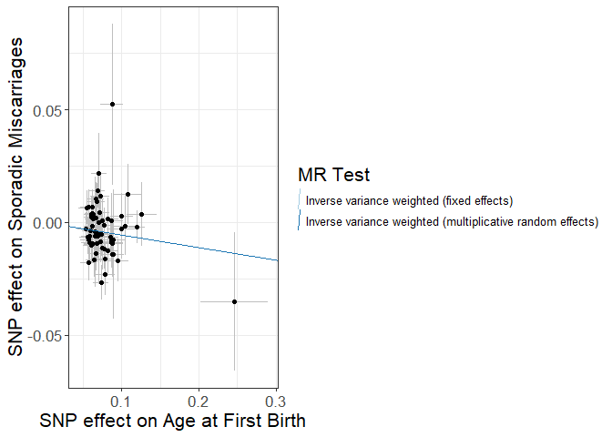<!-- -->

``` r
forrest_p <- mr_forest_plot(res_single)
forrest_p[[1]]
```

    ## Warning: Removed 1 row containing missing values or values outside the scale range
    ## (`geom_errorbarh()`).

    ## Warning: Removed 1 row containing missing values or values outside the scale range
    ## (`geom_point()`).

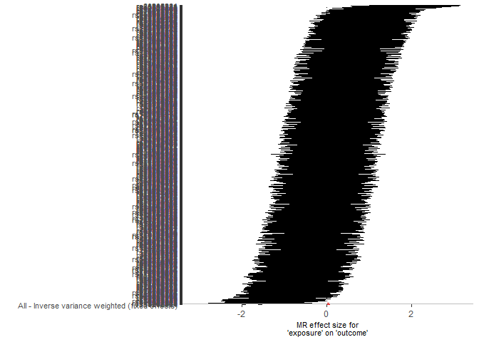<!-- -->

``` r
mr_dat <- read.csv("outcome/mr_dat_covid")
mr_res <- read.csv("outcome/mr_res_covid.csv")
res_single <- read.csv("outcome/res_single_covid.csv")

mr_res
```

    ##   X id.exposure id.outcome outcome exposure
    ## 1 1      yKdUNQ     3W3fLG outcome exposure
    ## 2 2      yKdUNQ     3W3fLG outcome exposure
    ##                                                      method nsnp          b
    ## 1                 Inverse variance weighted (fixed effects)   40 0.05722976
    ## 2 Inverse variance weighted (multiplicative random effects)   40 0.05722976
    ##           se       pval
    ## 1 0.02335167 0.01425478
    ## 2 0.02472935 0.02065433

``` r
res_pleio <- mr_pleiotropy_test(mr_dat)

res_pleio %>%
  select(-id.exposure, -id.outcome, -outcome, -exposure) %>%
  gt() %>%
  fmt_number(
    columns = c('egger_intercept', 'se')
  ) %>%
  fmt_number(
    columns = pval,
    rows = pval > 0.001,
    decimals = 3
  ) %>% 
  fmt_scientific(
    columns = pval,
    rows = pval <= 0.001,
    decimals = 1
  )
```

<div id="omwgwpzjtm" style="padding-left:0px;padding-right:0px;padding-top:10px;padding-bottom:10px;overflow-x:auto;overflow-y:auto;width:auto;height:auto;">
<style>#omwgwpzjtm table {
  font-family: system-ui, 'Segoe UI', Roboto, Helvetica, Arial, sans-serif, 'Apple Color Emoji', 'Segoe UI Emoji', 'Segoe UI Symbol', 'Noto Color Emoji';
  -webkit-font-smoothing: antialiased;
  -moz-osx-font-smoothing: grayscale;
}
&#10;#omwgwpzjtm thead, #omwgwpzjtm tbody, #omwgwpzjtm tfoot, #omwgwpzjtm tr, #omwgwpzjtm td, #omwgwpzjtm th {
  border-style: none;
}
&#10;#omwgwpzjtm p {
  margin: 0;
  padding: 0;
}
&#10;#omwgwpzjtm .gt_table {
  display: table;
  border-collapse: collapse;
  line-height: normal;
  margin-left: auto;
  margin-right: auto;
  color: #333333;
  font-size: 16px;
  font-weight: normal;
  font-style: normal;
  background-color: #FFFFFF;
  width: auto;
  border-top-style: solid;
  border-top-width: 2px;
  border-top-color: #A8A8A8;
  border-right-style: none;
  border-right-width: 2px;
  border-right-color: #D3D3D3;
  border-bottom-style: solid;
  border-bottom-width: 2px;
  border-bottom-color: #A8A8A8;
  border-left-style: none;
  border-left-width: 2px;
  border-left-color: #D3D3D3;
}
&#10;#omwgwpzjtm .gt_caption {
  padding-top: 4px;
  padding-bottom: 4px;
}
&#10;#omwgwpzjtm .gt_title {
  color: #333333;
  font-size: 125%;
  font-weight: initial;
  padding-top: 4px;
  padding-bottom: 4px;
  padding-left: 5px;
  padding-right: 5px;
  border-bottom-color: #FFFFFF;
  border-bottom-width: 0;
}
&#10;#omwgwpzjtm .gt_subtitle {
  color: #333333;
  font-size: 85%;
  font-weight: initial;
  padding-top: 3px;
  padding-bottom: 5px;
  padding-left: 5px;
  padding-right: 5px;
  border-top-color: #FFFFFF;
  border-top-width: 0;
}
&#10;#omwgwpzjtm .gt_heading {
  background-color: #FFFFFF;
  text-align: center;
  border-bottom-color: #FFFFFF;
  border-left-style: none;
  border-left-width: 1px;
  border-left-color: #D3D3D3;
  border-right-style: none;
  border-right-width: 1px;
  border-right-color: #D3D3D3;
}
&#10;#omwgwpzjtm .gt_bottom_border {
  border-bottom-style: solid;
  border-bottom-width: 2px;
  border-bottom-color: #D3D3D3;
}
&#10;#omwgwpzjtm .gt_col_headings {
  border-top-style: solid;
  border-top-width: 2px;
  border-top-color: #D3D3D3;
  border-bottom-style: solid;
  border-bottom-width: 2px;
  border-bottom-color: #D3D3D3;
  border-left-style: none;
  border-left-width: 1px;
  border-left-color: #D3D3D3;
  border-right-style: none;
  border-right-width: 1px;
  border-right-color: #D3D3D3;
}
&#10;#omwgwpzjtm .gt_col_heading {
  color: #333333;
  background-color: #FFFFFF;
  font-size: 100%;
  font-weight: normal;
  text-transform: inherit;
  border-left-style: none;
  border-left-width: 1px;
  border-left-color: #D3D3D3;
  border-right-style: none;
  border-right-width: 1px;
  border-right-color: #D3D3D3;
  vertical-align: bottom;
  padding-top: 5px;
  padding-bottom: 6px;
  padding-left: 5px;
  padding-right: 5px;
  overflow-x: hidden;
}
&#10;#omwgwpzjtm .gt_column_spanner_outer {
  color: #333333;
  background-color: #FFFFFF;
  font-size: 100%;
  font-weight: normal;
  text-transform: inherit;
  padding-top: 0;
  padding-bottom: 0;
  padding-left: 4px;
  padding-right: 4px;
}
&#10;#omwgwpzjtm .gt_column_spanner_outer:first-child {
  padding-left: 0;
}
&#10;#omwgwpzjtm .gt_column_spanner_outer:last-child {
  padding-right: 0;
}
&#10;#omwgwpzjtm .gt_column_spanner {
  border-bottom-style: solid;
  border-bottom-width: 2px;
  border-bottom-color: #D3D3D3;
  vertical-align: bottom;
  padding-top: 5px;
  padding-bottom: 5px;
  overflow-x: hidden;
  display: inline-block;
  width: 100%;
}
&#10;#omwgwpzjtm .gt_spanner_row {
  border-bottom-style: hidden;
}
&#10;#omwgwpzjtm .gt_group_heading {
  padding-top: 8px;
  padding-bottom: 8px;
  padding-left: 5px;
  padding-right: 5px;
  color: #333333;
  background-color: #FFFFFF;
  font-size: 100%;
  font-weight: initial;
  text-transform: inherit;
  border-top-style: solid;
  border-top-width: 2px;
  border-top-color: #D3D3D3;
  border-bottom-style: solid;
  border-bottom-width: 2px;
  border-bottom-color: #D3D3D3;
  border-left-style: none;
  border-left-width: 1px;
  border-left-color: #D3D3D3;
  border-right-style: none;
  border-right-width: 1px;
  border-right-color: #D3D3D3;
  vertical-align: middle;
  text-align: left;
}
&#10;#omwgwpzjtm .gt_empty_group_heading {
  padding: 0.5px;
  color: #333333;
  background-color: #FFFFFF;
  font-size: 100%;
  font-weight: initial;
  border-top-style: solid;
  border-top-width: 2px;
  border-top-color: #D3D3D3;
  border-bottom-style: solid;
  border-bottom-width: 2px;
  border-bottom-color: #D3D3D3;
  vertical-align: middle;
}
&#10;#omwgwpzjtm .gt_from_md > :first-child {
  margin-top: 0;
}
&#10;#omwgwpzjtm .gt_from_md > :last-child {
  margin-bottom: 0;
}
&#10;#omwgwpzjtm .gt_row {
  padding-top: 8px;
  padding-bottom: 8px;
  padding-left: 5px;
  padding-right: 5px;
  margin: 10px;
  border-top-style: solid;
  border-top-width: 1px;
  border-top-color: #D3D3D3;
  border-left-style: none;
  border-left-width: 1px;
  border-left-color: #D3D3D3;
  border-right-style: none;
  border-right-width: 1px;
  border-right-color: #D3D3D3;
  vertical-align: middle;
  overflow-x: hidden;
}
&#10;#omwgwpzjtm .gt_stub {
  color: #333333;
  background-color: #FFFFFF;
  font-size: 100%;
  font-weight: initial;
  text-transform: inherit;
  border-right-style: solid;
  border-right-width: 2px;
  border-right-color: #D3D3D3;
  padding-left: 5px;
  padding-right: 5px;
}
&#10;#omwgwpzjtm .gt_stub_row_group {
  color: #333333;
  background-color: #FFFFFF;
  font-size: 100%;
  font-weight: initial;
  text-transform: inherit;
  border-right-style: solid;
  border-right-width: 2px;
  border-right-color: #D3D3D3;
  padding-left: 5px;
  padding-right: 5px;
  vertical-align: top;
}
&#10;#omwgwpzjtm .gt_row_group_first td {
  border-top-width: 2px;
}
&#10;#omwgwpzjtm .gt_row_group_first th {
  border-top-width: 2px;
}
&#10;#omwgwpzjtm .gt_summary_row {
  color: #333333;
  background-color: #FFFFFF;
  text-transform: inherit;
  padding-top: 8px;
  padding-bottom: 8px;
  padding-left: 5px;
  padding-right: 5px;
}
&#10;#omwgwpzjtm .gt_first_summary_row {
  border-top-style: solid;
  border-top-color: #D3D3D3;
}
&#10;#omwgwpzjtm .gt_first_summary_row.thick {
  border-top-width: 2px;
}
&#10;#omwgwpzjtm .gt_last_summary_row {
  padding-top: 8px;
  padding-bottom: 8px;
  padding-left: 5px;
  padding-right: 5px;
  border-bottom-style: solid;
  border-bottom-width: 2px;
  border-bottom-color: #D3D3D3;
}
&#10;#omwgwpzjtm .gt_grand_summary_row {
  color: #333333;
  background-color: #FFFFFF;
  text-transform: inherit;
  padding-top: 8px;
  padding-bottom: 8px;
  padding-left: 5px;
  padding-right: 5px;
}
&#10;#omwgwpzjtm .gt_first_grand_summary_row {
  padding-top: 8px;
  padding-bottom: 8px;
  padding-left: 5px;
  padding-right: 5px;
  border-top-style: double;
  border-top-width: 6px;
  border-top-color: #D3D3D3;
}
&#10;#omwgwpzjtm .gt_last_grand_summary_row_top {
  padding-top: 8px;
  padding-bottom: 8px;
  padding-left: 5px;
  padding-right: 5px;
  border-bottom-style: double;
  border-bottom-width: 6px;
  border-bottom-color: #D3D3D3;
}
&#10;#omwgwpzjtm .gt_striped {
  background-color: rgba(128, 128, 128, 0.05);
}
&#10;#omwgwpzjtm .gt_table_body {
  border-top-style: solid;
  border-top-width: 2px;
  border-top-color: #D3D3D3;
  border-bottom-style: solid;
  border-bottom-width: 2px;
  border-bottom-color: #D3D3D3;
}
&#10;#omwgwpzjtm .gt_footnotes {
  color: #333333;
  background-color: #FFFFFF;
  border-bottom-style: none;
  border-bottom-width: 2px;
  border-bottom-color: #D3D3D3;
  border-left-style: none;
  border-left-width: 2px;
  border-left-color: #D3D3D3;
  border-right-style: none;
  border-right-width: 2px;
  border-right-color: #D3D3D3;
}
&#10;#omwgwpzjtm .gt_footnote {
  margin: 0px;
  font-size: 90%;
  padding-top: 4px;
  padding-bottom: 4px;
  padding-left: 5px;
  padding-right: 5px;
}
&#10;#omwgwpzjtm .gt_sourcenotes {
  color: #333333;
  background-color: #FFFFFF;
  border-bottom-style: none;
  border-bottom-width: 2px;
  border-bottom-color: #D3D3D3;
  border-left-style: none;
  border-left-width: 2px;
  border-left-color: #D3D3D3;
  border-right-style: none;
  border-right-width: 2px;
  border-right-color: #D3D3D3;
}
&#10;#omwgwpzjtm .gt_sourcenote {
  font-size: 90%;
  padding-top: 4px;
  padding-bottom: 4px;
  padding-left: 5px;
  padding-right: 5px;
}
&#10;#omwgwpzjtm .gt_left {
  text-align: left;
}
&#10;#omwgwpzjtm .gt_center {
  text-align: center;
}
&#10;#omwgwpzjtm .gt_right {
  text-align: right;
  font-variant-numeric: tabular-nums;
}
&#10;#omwgwpzjtm .gt_font_normal {
  font-weight: normal;
}
&#10;#omwgwpzjtm .gt_font_bold {
  font-weight: bold;
}
&#10;#omwgwpzjtm .gt_font_italic {
  font-style: italic;
}
&#10;#omwgwpzjtm .gt_super {
  font-size: 65%;
}
&#10;#omwgwpzjtm .gt_footnote_marks {
  font-size: 75%;
  vertical-align: 0.4em;
  position: initial;
}
&#10;#omwgwpzjtm .gt_asterisk {
  font-size: 100%;
  vertical-align: 0;
}
&#10;#omwgwpzjtm .gt_indent_1 {
  text-indent: 5px;
}
&#10;#omwgwpzjtm .gt_indent_2 {
  text-indent: 10px;
}
&#10;#omwgwpzjtm .gt_indent_3 {
  text-indent: 15px;
}
&#10;#omwgwpzjtm .gt_indent_4 {
  text-indent: 20px;
}
&#10;#omwgwpzjtm .gt_indent_5 {
  text-indent: 25px;
}
&#10;#omwgwpzjtm .katex-display {
  display: inline-flex !important;
  margin-bottom: 0.75em !important;
}
&#10;#omwgwpzjtm div.Reactable > div.rt-table > div.rt-thead > div.rt-tr.rt-tr-group-header > div.rt-th-group:after {
  height: 0px !important;
}
</style>
<table class="gt_table" data-quarto-disable-processing="false" data-quarto-bootstrap="false">
  <thead>
    <tr class="gt_col_headings">
      <th class="gt_col_heading gt_columns_bottom_border gt_right" rowspan="1" colspan="1" scope="col" id="egger_intercept">egger_intercept</th>
      <th class="gt_col_heading gt_columns_bottom_border gt_right" rowspan="1" colspan="1" scope="col" id="se">se</th>
      <th class="gt_col_heading gt_columns_bottom_border gt_right" rowspan="1" colspan="1" scope="col" id="pval">pval</th>
    </tr>
  </thead>
  <tbody class="gt_table_body">
    <tr><td headers="egger_intercept" class="gt_row gt_right">−0.01</td>
<td headers="se" class="gt_row gt_right">0.00</td>
<td headers="pval" class="gt_row gt_right">0.173</td></tr>
  </tbody>
  &#10;  
</table>
</div>

``` r
# Heterogeneity statistics 
res_het <- mr_heterogeneity(mr_dat, method_list = c(
  "mr_ivw_fe", "mr_ivw_mre"
))

res_het %>%
  select(-id.exposure, -id.outcome, -outcome, -exposure) %>%
  gt() %>%
  fmt_number(
    columns = Q
  ) %>%
  fmt_number(
    columns = Q_pval,
    rows = Q_pval > 0.001,
    decimals = 3
  ) %>% 
  fmt_scientific(
    columns = Q_pval,
    rows = Q_pval <= 0.001,
    decimals = 1
  )
```

<div id="dsmuiunbzm" style="padding-left:0px;padding-right:0px;padding-top:10px;padding-bottom:10px;overflow-x:auto;overflow-y:auto;width:auto;height:auto;">
<style>#dsmuiunbzm table {
  font-family: system-ui, 'Segoe UI', Roboto, Helvetica, Arial, sans-serif, 'Apple Color Emoji', 'Segoe UI Emoji', 'Segoe UI Symbol', 'Noto Color Emoji';
  -webkit-font-smoothing: antialiased;
  -moz-osx-font-smoothing: grayscale;
}
&#10;#dsmuiunbzm thead, #dsmuiunbzm tbody, #dsmuiunbzm tfoot, #dsmuiunbzm tr, #dsmuiunbzm td, #dsmuiunbzm th {
  border-style: none;
}
&#10;#dsmuiunbzm p {
  margin: 0;
  padding: 0;
}
&#10;#dsmuiunbzm .gt_table {
  display: table;
  border-collapse: collapse;
  line-height: normal;
  margin-left: auto;
  margin-right: auto;
  color: #333333;
  font-size: 16px;
  font-weight: normal;
  font-style: normal;
  background-color: #FFFFFF;
  width: auto;
  border-top-style: solid;
  border-top-width: 2px;
  border-top-color: #A8A8A8;
  border-right-style: none;
  border-right-width: 2px;
  border-right-color: #D3D3D3;
  border-bottom-style: solid;
  border-bottom-width: 2px;
  border-bottom-color: #A8A8A8;
  border-left-style: none;
  border-left-width: 2px;
  border-left-color: #D3D3D3;
}
&#10;#dsmuiunbzm .gt_caption {
  padding-top: 4px;
  padding-bottom: 4px;
}
&#10;#dsmuiunbzm .gt_title {
  color: #333333;
  font-size: 125%;
  font-weight: initial;
  padding-top: 4px;
  padding-bottom: 4px;
  padding-left: 5px;
  padding-right: 5px;
  border-bottom-color: #FFFFFF;
  border-bottom-width: 0;
}
&#10;#dsmuiunbzm .gt_subtitle {
  color: #333333;
  font-size: 85%;
  font-weight: initial;
  padding-top: 3px;
  padding-bottom: 5px;
  padding-left: 5px;
  padding-right: 5px;
  border-top-color: #FFFFFF;
  border-top-width: 0;
}
&#10;#dsmuiunbzm .gt_heading {
  background-color: #FFFFFF;
  text-align: center;
  border-bottom-color: #FFFFFF;
  border-left-style: none;
  border-left-width: 1px;
  border-left-color: #D3D3D3;
  border-right-style: none;
  border-right-width: 1px;
  border-right-color: #D3D3D3;
}
&#10;#dsmuiunbzm .gt_bottom_border {
  border-bottom-style: solid;
  border-bottom-width: 2px;
  border-bottom-color: #D3D3D3;
}
&#10;#dsmuiunbzm .gt_col_headings {
  border-top-style: solid;
  border-top-width: 2px;
  border-top-color: #D3D3D3;
  border-bottom-style: solid;
  border-bottom-width: 2px;
  border-bottom-color: #D3D3D3;
  border-left-style: none;
  border-left-width: 1px;
  border-left-color: #D3D3D3;
  border-right-style: none;
  border-right-width: 1px;
  border-right-color: #D3D3D3;
}
&#10;#dsmuiunbzm .gt_col_heading {
  color: #333333;
  background-color: #FFFFFF;
  font-size: 100%;
  font-weight: normal;
  text-transform: inherit;
  border-left-style: none;
  border-left-width: 1px;
  border-left-color: #D3D3D3;
  border-right-style: none;
  border-right-width: 1px;
  border-right-color: #D3D3D3;
  vertical-align: bottom;
  padding-top: 5px;
  padding-bottom: 6px;
  padding-left: 5px;
  padding-right: 5px;
  overflow-x: hidden;
}
&#10;#dsmuiunbzm .gt_column_spanner_outer {
  color: #333333;
  background-color: #FFFFFF;
  font-size: 100%;
  font-weight: normal;
  text-transform: inherit;
  padding-top: 0;
  padding-bottom: 0;
  padding-left: 4px;
  padding-right: 4px;
}
&#10;#dsmuiunbzm .gt_column_spanner_outer:first-child {
  padding-left: 0;
}
&#10;#dsmuiunbzm .gt_column_spanner_outer:last-child {
  padding-right: 0;
}
&#10;#dsmuiunbzm .gt_column_spanner {
  border-bottom-style: solid;
  border-bottom-width: 2px;
  border-bottom-color: #D3D3D3;
  vertical-align: bottom;
  padding-top: 5px;
  padding-bottom: 5px;
  overflow-x: hidden;
  display: inline-block;
  width: 100%;
}
&#10;#dsmuiunbzm .gt_spanner_row {
  border-bottom-style: hidden;
}
&#10;#dsmuiunbzm .gt_group_heading {
  padding-top: 8px;
  padding-bottom: 8px;
  padding-left: 5px;
  padding-right: 5px;
  color: #333333;
  background-color: #FFFFFF;
  font-size: 100%;
  font-weight: initial;
  text-transform: inherit;
  border-top-style: solid;
  border-top-width: 2px;
  border-top-color: #D3D3D3;
  border-bottom-style: solid;
  border-bottom-width: 2px;
  border-bottom-color: #D3D3D3;
  border-left-style: none;
  border-left-width: 1px;
  border-left-color: #D3D3D3;
  border-right-style: none;
  border-right-width: 1px;
  border-right-color: #D3D3D3;
  vertical-align: middle;
  text-align: left;
}
&#10;#dsmuiunbzm .gt_empty_group_heading {
  padding: 0.5px;
  color: #333333;
  background-color: #FFFFFF;
  font-size: 100%;
  font-weight: initial;
  border-top-style: solid;
  border-top-width: 2px;
  border-top-color: #D3D3D3;
  border-bottom-style: solid;
  border-bottom-width: 2px;
  border-bottom-color: #D3D3D3;
  vertical-align: middle;
}
&#10;#dsmuiunbzm .gt_from_md > :first-child {
  margin-top: 0;
}
&#10;#dsmuiunbzm .gt_from_md > :last-child {
  margin-bottom: 0;
}
&#10;#dsmuiunbzm .gt_row {
  padding-top: 8px;
  padding-bottom: 8px;
  padding-left: 5px;
  padding-right: 5px;
  margin: 10px;
  border-top-style: solid;
  border-top-width: 1px;
  border-top-color: #D3D3D3;
  border-left-style: none;
  border-left-width: 1px;
  border-left-color: #D3D3D3;
  border-right-style: none;
  border-right-width: 1px;
  border-right-color: #D3D3D3;
  vertical-align: middle;
  overflow-x: hidden;
}
&#10;#dsmuiunbzm .gt_stub {
  color: #333333;
  background-color: #FFFFFF;
  font-size: 100%;
  font-weight: initial;
  text-transform: inherit;
  border-right-style: solid;
  border-right-width: 2px;
  border-right-color: #D3D3D3;
  padding-left: 5px;
  padding-right: 5px;
}
&#10;#dsmuiunbzm .gt_stub_row_group {
  color: #333333;
  background-color: #FFFFFF;
  font-size: 100%;
  font-weight: initial;
  text-transform: inherit;
  border-right-style: solid;
  border-right-width: 2px;
  border-right-color: #D3D3D3;
  padding-left: 5px;
  padding-right: 5px;
  vertical-align: top;
}
&#10;#dsmuiunbzm .gt_row_group_first td {
  border-top-width: 2px;
}
&#10;#dsmuiunbzm .gt_row_group_first th {
  border-top-width: 2px;
}
&#10;#dsmuiunbzm .gt_summary_row {
  color: #333333;
  background-color: #FFFFFF;
  text-transform: inherit;
  padding-top: 8px;
  padding-bottom: 8px;
  padding-left: 5px;
  padding-right: 5px;
}
&#10;#dsmuiunbzm .gt_first_summary_row {
  border-top-style: solid;
  border-top-color: #D3D3D3;
}
&#10;#dsmuiunbzm .gt_first_summary_row.thick {
  border-top-width: 2px;
}
&#10;#dsmuiunbzm .gt_last_summary_row {
  padding-top: 8px;
  padding-bottom: 8px;
  padding-left: 5px;
  padding-right: 5px;
  border-bottom-style: solid;
  border-bottom-width: 2px;
  border-bottom-color: #D3D3D3;
}
&#10;#dsmuiunbzm .gt_grand_summary_row {
  color: #333333;
  background-color: #FFFFFF;
  text-transform: inherit;
  padding-top: 8px;
  padding-bottom: 8px;
  padding-left: 5px;
  padding-right: 5px;
}
&#10;#dsmuiunbzm .gt_first_grand_summary_row {
  padding-top: 8px;
  padding-bottom: 8px;
  padding-left: 5px;
  padding-right: 5px;
  border-top-style: double;
  border-top-width: 6px;
  border-top-color: #D3D3D3;
}
&#10;#dsmuiunbzm .gt_last_grand_summary_row_top {
  padding-top: 8px;
  padding-bottom: 8px;
  padding-left: 5px;
  padding-right: 5px;
  border-bottom-style: double;
  border-bottom-width: 6px;
  border-bottom-color: #D3D3D3;
}
&#10;#dsmuiunbzm .gt_striped {
  background-color: rgba(128, 128, 128, 0.05);
}
&#10;#dsmuiunbzm .gt_table_body {
  border-top-style: solid;
  border-top-width: 2px;
  border-top-color: #D3D3D3;
  border-bottom-style: solid;
  border-bottom-width: 2px;
  border-bottom-color: #D3D3D3;
}
&#10;#dsmuiunbzm .gt_footnotes {
  color: #333333;
  background-color: #FFFFFF;
  border-bottom-style: none;
  border-bottom-width: 2px;
  border-bottom-color: #D3D3D3;
  border-left-style: none;
  border-left-width: 2px;
  border-left-color: #D3D3D3;
  border-right-style: none;
  border-right-width: 2px;
  border-right-color: #D3D3D3;
}
&#10;#dsmuiunbzm .gt_footnote {
  margin: 0px;
  font-size: 90%;
  padding-top: 4px;
  padding-bottom: 4px;
  padding-left: 5px;
  padding-right: 5px;
}
&#10;#dsmuiunbzm .gt_sourcenotes {
  color: #333333;
  background-color: #FFFFFF;
  border-bottom-style: none;
  border-bottom-width: 2px;
  border-bottom-color: #D3D3D3;
  border-left-style: none;
  border-left-width: 2px;
  border-left-color: #D3D3D3;
  border-right-style: none;
  border-right-width: 2px;
  border-right-color: #D3D3D3;
}
&#10;#dsmuiunbzm .gt_sourcenote {
  font-size: 90%;
  padding-top: 4px;
  padding-bottom: 4px;
  padding-left: 5px;
  padding-right: 5px;
}
&#10;#dsmuiunbzm .gt_left {
  text-align: left;
}
&#10;#dsmuiunbzm .gt_center {
  text-align: center;
}
&#10;#dsmuiunbzm .gt_right {
  text-align: right;
  font-variant-numeric: tabular-nums;
}
&#10;#dsmuiunbzm .gt_font_normal {
  font-weight: normal;
}
&#10;#dsmuiunbzm .gt_font_bold {
  font-weight: bold;
}
&#10;#dsmuiunbzm .gt_font_italic {
  font-style: italic;
}
&#10;#dsmuiunbzm .gt_super {
  font-size: 65%;
}
&#10;#dsmuiunbzm .gt_footnote_marks {
  font-size: 75%;
  vertical-align: 0.4em;
  position: initial;
}
&#10;#dsmuiunbzm .gt_asterisk {
  font-size: 100%;
  vertical-align: 0;
}
&#10;#dsmuiunbzm .gt_indent_1 {
  text-indent: 5px;
}
&#10;#dsmuiunbzm .gt_indent_2 {
  text-indent: 10px;
}
&#10;#dsmuiunbzm .gt_indent_3 {
  text-indent: 15px;
}
&#10;#dsmuiunbzm .gt_indent_4 {
  text-indent: 20px;
}
&#10;#dsmuiunbzm .gt_indent_5 {
  text-indent: 25px;
}
&#10;#dsmuiunbzm .katex-display {
  display: inline-flex !important;
  margin-bottom: 0.75em !important;
}
&#10;#dsmuiunbzm div.Reactable > div.rt-table > div.rt-thead > div.rt-tr.rt-tr-group-header > div.rt-th-group:after {
  height: 0px !important;
}
</style>
<table class="gt_table" data-quarto-disable-processing="false" data-quarto-bootstrap="false">
  <thead>
    <tr class="gt_col_headings">
      <th class="gt_col_heading gt_columns_bottom_border gt_left" rowspan="1" colspan="1" scope="col" id="method">method</th>
      <th class="gt_col_heading gt_columns_bottom_border gt_right" rowspan="1" colspan="1" scope="col" id="Q">Q</th>
      <th class="gt_col_heading gt_columns_bottom_border gt_right" rowspan="1" colspan="1" scope="col" id="Q_df">Q_df</th>
      <th class="gt_col_heading gt_columns_bottom_border gt_right" rowspan="1" colspan="1" scope="col" id="Q_pval">Q_pval</th>
    </tr>
  </thead>
  <tbody class="gt_table_body">
    <tr><td headers="method" class="gt_row gt_left">Inverse variance weighted (fixed effects)</td>
<td headers="Q" class="gt_row gt_right">43.74</td>
<td headers="Q_df" class="gt_row gt_right">39</td>
<td headers="Q_pval" class="gt_row gt_right">0.277</td></tr>
    <tr><td headers="method" class="gt_row gt_left">Inverse variance weighted (multiplicative random effects)</td>
<td headers="Q" class="gt_row gt_right">43.74</td>
<td headers="Q_df" class="gt_row gt_right">39</td>
<td headers="Q_pval" class="gt_row gt_right">0.277</td></tr>
  </tbody>
  &#10;  
</table>
</div>

``` r
scatter_p <- mr_scatter_plot(mr_res, mr_dat)
scatter_out_p <- scatter_p[[1]] + theme_bw() +
  guides(color=guide_legend(ncol =1)) +
  theme(
    text = element_text(size = 8),
  )
scatter_out_p
```

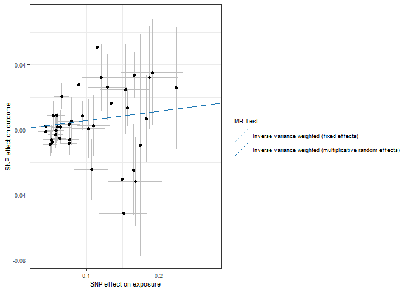<!-- -->

``` r
forrest_p <- mr_forest_plot(res_single)
forrest_p[[1]]
```

    ## Warning: Removed 1 row containing missing values or values outside the scale range
    ## (`geom_errorbarh()`).

    ## Warning: Removed 1 row containing missing values or values outside the scale range
    ## (`geom_point()`).

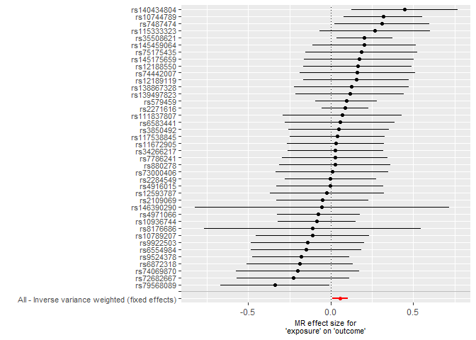<!-- -->

``` r
mr_dat <- read.csv("outcome/mr_dat_income")
mr_res <- read.csv("outcome/mr_res_income.csv")
res_single <- read.csv("outcome/res_single_income.csv")

mr_res
```

    ##   X id.exposure id.outcome outcome exposure
    ## 1 1      ny6UH8     3W3fLG outcome exposure
    ## 2 2      ny6UH8     3W3fLG outcome exposure
    ##                                                      method nsnp           b
    ## 1                 Inverse variance weighted (fixed effects)  218 -0.02855802
    ## 2 Inverse variance weighted (multiplicative random effects)  218 -0.02855802
    ##           se      pval
    ## 1 0.06022835 0.6353841
    ## 2 0.05714573 0.6172580

``` r
res_pleio <- mr_pleiotropy_test(mr_dat)

res_pleio %>%
  select(-id.exposure, -id.outcome, -outcome, -exposure) %>%
  gt() %>%
  fmt_number(
    columns = c('egger_intercept', 'se')
  ) %>%
  fmt_number(
    columns = pval,
    rows = pval > 0.001,
    decimals = 3
  ) %>% 
  fmt_scientific(
    columns = pval,
    rows = pval <= 0.001,
    decimals = 1
  )
```

<div id="vlgemgmvhj" style="padding-left:0px;padding-right:0px;padding-top:10px;padding-bottom:10px;overflow-x:auto;overflow-y:auto;width:auto;height:auto;">
<style>#vlgemgmvhj table {
  font-family: system-ui, 'Segoe UI', Roboto, Helvetica, Arial, sans-serif, 'Apple Color Emoji', 'Segoe UI Emoji', 'Segoe UI Symbol', 'Noto Color Emoji';
  -webkit-font-smoothing: antialiased;
  -moz-osx-font-smoothing: grayscale;
}
&#10;#vlgemgmvhj thead, #vlgemgmvhj tbody, #vlgemgmvhj tfoot, #vlgemgmvhj tr, #vlgemgmvhj td, #vlgemgmvhj th {
  border-style: none;
}
&#10;#vlgemgmvhj p {
  margin: 0;
  padding: 0;
}
&#10;#vlgemgmvhj .gt_table {
  display: table;
  border-collapse: collapse;
  line-height: normal;
  margin-left: auto;
  margin-right: auto;
  color: #333333;
  font-size: 16px;
  font-weight: normal;
  font-style: normal;
  background-color: #FFFFFF;
  width: auto;
  border-top-style: solid;
  border-top-width: 2px;
  border-top-color: #A8A8A8;
  border-right-style: none;
  border-right-width: 2px;
  border-right-color: #D3D3D3;
  border-bottom-style: solid;
  border-bottom-width: 2px;
  border-bottom-color: #A8A8A8;
  border-left-style: none;
  border-left-width: 2px;
  border-left-color: #D3D3D3;
}
&#10;#vlgemgmvhj .gt_caption {
  padding-top: 4px;
  padding-bottom: 4px;
}
&#10;#vlgemgmvhj .gt_title {
  color: #333333;
  font-size: 125%;
  font-weight: initial;
  padding-top: 4px;
  padding-bottom: 4px;
  padding-left: 5px;
  padding-right: 5px;
  border-bottom-color: #FFFFFF;
  border-bottom-width: 0;
}
&#10;#vlgemgmvhj .gt_subtitle {
  color: #333333;
  font-size: 85%;
  font-weight: initial;
  padding-top: 3px;
  padding-bottom: 5px;
  padding-left: 5px;
  padding-right: 5px;
  border-top-color: #FFFFFF;
  border-top-width: 0;
}
&#10;#vlgemgmvhj .gt_heading {
  background-color: #FFFFFF;
  text-align: center;
  border-bottom-color: #FFFFFF;
  border-left-style: none;
  border-left-width: 1px;
  border-left-color: #D3D3D3;
  border-right-style: none;
  border-right-width: 1px;
  border-right-color: #D3D3D3;
}
&#10;#vlgemgmvhj .gt_bottom_border {
  border-bottom-style: solid;
  border-bottom-width: 2px;
  border-bottom-color: #D3D3D3;
}
&#10;#vlgemgmvhj .gt_col_headings {
  border-top-style: solid;
  border-top-width: 2px;
  border-top-color: #D3D3D3;
  border-bottom-style: solid;
  border-bottom-width: 2px;
  border-bottom-color: #D3D3D3;
  border-left-style: none;
  border-left-width: 1px;
  border-left-color: #D3D3D3;
  border-right-style: none;
  border-right-width: 1px;
  border-right-color: #D3D3D3;
}
&#10;#vlgemgmvhj .gt_col_heading {
  color: #333333;
  background-color: #FFFFFF;
  font-size: 100%;
  font-weight: normal;
  text-transform: inherit;
  border-left-style: none;
  border-left-width: 1px;
  border-left-color: #D3D3D3;
  border-right-style: none;
  border-right-width: 1px;
  border-right-color: #D3D3D3;
  vertical-align: bottom;
  padding-top: 5px;
  padding-bottom: 6px;
  padding-left: 5px;
  padding-right: 5px;
  overflow-x: hidden;
}
&#10;#vlgemgmvhj .gt_column_spanner_outer {
  color: #333333;
  background-color: #FFFFFF;
  font-size: 100%;
  font-weight: normal;
  text-transform: inherit;
  padding-top: 0;
  padding-bottom: 0;
  padding-left: 4px;
  padding-right: 4px;
}
&#10;#vlgemgmvhj .gt_column_spanner_outer:first-child {
  padding-left: 0;
}
&#10;#vlgemgmvhj .gt_column_spanner_outer:last-child {
  padding-right: 0;
}
&#10;#vlgemgmvhj .gt_column_spanner {
  border-bottom-style: solid;
  border-bottom-width: 2px;
  border-bottom-color: #D3D3D3;
  vertical-align: bottom;
  padding-top: 5px;
  padding-bottom: 5px;
  overflow-x: hidden;
  display: inline-block;
  width: 100%;
}
&#10;#vlgemgmvhj .gt_spanner_row {
  border-bottom-style: hidden;
}
&#10;#vlgemgmvhj .gt_group_heading {
  padding-top: 8px;
  padding-bottom: 8px;
  padding-left: 5px;
  padding-right: 5px;
  color: #333333;
  background-color: #FFFFFF;
  font-size: 100%;
  font-weight: initial;
  text-transform: inherit;
  border-top-style: solid;
  border-top-width: 2px;
  border-top-color: #D3D3D3;
  border-bottom-style: solid;
  border-bottom-width: 2px;
  border-bottom-color: #D3D3D3;
  border-left-style: none;
  border-left-width: 1px;
  border-left-color: #D3D3D3;
  border-right-style: none;
  border-right-width: 1px;
  border-right-color: #D3D3D3;
  vertical-align: middle;
  text-align: left;
}
&#10;#vlgemgmvhj .gt_empty_group_heading {
  padding: 0.5px;
  color: #333333;
  background-color: #FFFFFF;
  font-size: 100%;
  font-weight: initial;
  border-top-style: solid;
  border-top-width: 2px;
  border-top-color: #D3D3D3;
  border-bottom-style: solid;
  border-bottom-width: 2px;
  border-bottom-color: #D3D3D3;
  vertical-align: middle;
}
&#10;#vlgemgmvhj .gt_from_md > :first-child {
  margin-top: 0;
}
&#10;#vlgemgmvhj .gt_from_md > :last-child {
  margin-bottom: 0;
}
&#10;#vlgemgmvhj .gt_row {
  padding-top: 8px;
  padding-bottom: 8px;
  padding-left: 5px;
  padding-right: 5px;
  margin: 10px;
  border-top-style: solid;
  border-top-width: 1px;
  border-top-color: #D3D3D3;
  border-left-style: none;
  border-left-width: 1px;
  border-left-color: #D3D3D3;
  border-right-style: none;
  border-right-width: 1px;
  border-right-color: #D3D3D3;
  vertical-align: middle;
  overflow-x: hidden;
}
&#10;#vlgemgmvhj .gt_stub {
  color: #333333;
  background-color: #FFFFFF;
  font-size: 100%;
  font-weight: initial;
  text-transform: inherit;
  border-right-style: solid;
  border-right-width: 2px;
  border-right-color: #D3D3D3;
  padding-left: 5px;
  padding-right: 5px;
}
&#10;#vlgemgmvhj .gt_stub_row_group {
  color: #333333;
  background-color: #FFFFFF;
  font-size: 100%;
  font-weight: initial;
  text-transform: inherit;
  border-right-style: solid;
  border-right-width: 2px;
  border-right-color: #D3D3D3;
  padding-left: 5px;
  padding-right: 5px;
  vertical-align: top;
}
&#10;#vlgemgmvhj .gt_row_group_first td {
  border-top-width: 2px;
}
&#10;#vlgemgmvhj .gt_row_group_first th {
  border-top-width: 2px;
}
&#10;#vlgemgmvhj .gt_summary_row {
  color: #333333;
  background-color: #FFFFFF;
  text-transform: inherit;
  padding-top: 8px;
  padding-bottom: 8px;
  padding-left: 5px;
  padding-right: 5px;
}
&#10;#vlgemgmvhj .gt_first_summary_row {
  border-top-style: solid;
  border-top-color: #D3D3D3;
}
&#10;#vlgemgmvhj .gt_first_summary_row.thick {
  border-top-width: 2px;
}
&#10;#vlgemgmvhj .gt_last_summary_row {
  padding-top: 8px;
  padding-bottom: 8px;
  padding-left: 5px;
  padding-right: 5px;
  border-bottom-style: solid;
  border-bottom-width: 2px;
  border-bottom-color: #D3D3D3;
}
&#10;#vlgemgmvhj .gt_grand_summary_row {
  color: #333333;
  background-color: #FFFFFF;
  text-transform: inherit;
  padding-top: 8px;
  padding-bottom: 8px;
  padding-left: 5px;
  padding-right: 5px;
}
&#10;#vlgemgmvhj .gt_first_grand_summary_row {
  padding-top: 8px;
  padding-bottom: 8px;
  padding-left: 5px;
  padding-right: 5px;
  border-top-style: double;
  border-top-width: 6px;
  border-top-color: #D3D3D3;
}
&#10;#vlgemgmvhj .gt_last_grand_summary_row_top {
  padding-top: 8px;
  padding-bottom: 8px;
  padding-left: 5px;
  padding-right: 5px;
  border-bottom-style: double;
  border-bottom-width: 6px;
  border-bottom-color: #D3D3D3;
}
&#10;#vlgemgmvhj .gt_striped {
  background-color: rgba(128, 128, 128, 0.05);
}
&#10;#vlgemgmvhj .gt_table_body {
  border-top-style: solid;
  border-top-width: 2px;
  border-top-color: #D3D3D3;
  border-bottom-style: solid;
  border-bottom-width: 2px;
  border-bottom-color: #D3D3D3;
}
&#10;#vlgemgmvhj .gt_footnotes {
  color: #333333;
  background-color: #FFFFFF;
  border-bottom-style: none;
  border-bottom-width: 2px;
  border-bottom-color: #D3D3D3;
  border-left-style: none;
  border-left-width: 2px;
  border-left-color: #D3D3D3;
  border-right-style: none;
  border-right-width: 2px;
  border-right-color: #D3D3D3;
}
&#10;#vlgemgmvhj .gt_footnote {
  margin: 0px;
  font-size: 90%;
  padding-top: 4px;
  padding-bottom: 4px;
  padding-left: 5px;
  padding-right: 5px;
}
&#10;#vlgemgmvhj .gt_sourcenotes {
  color: #333333;
  background-color: #FFFFFF;
  border-bottom-style: none;
  border-bottom-width: 2px;
  border-bottom-color: #D3D3D3;
  border-left-style: none;
  border-left-width: 2px;
  border-left-color: #D3D3D3;
  border-right-style: none;
  border-right-width: 2px;
  border-right-color: #D3D3D3;
}
&#10;#vlgemgmvhj .gt_sourcenote {
  font-size: 90%;
  padding-top: 4px;
  padding-bottom: 4px;
  padding-left: 5px;
  padding-right: 5px;
}
&#10;#vlgemgmvhj .gt_left {
  text-align: left;
}
&#10;#vlgemgmvhj .gt_center {
  text-align: center;
}
&#10;#vlgemgmvhj .gt_right {
  text-align: right;
  font-variant-numeric: tabular-nums;
}
&#10;#vlgemgmvhj .gt_font_normal {
  font-weight: normal;
}
&#10;#vlgemgmvhj .gt_font_bold {
  font-weight: bold;
}
&#10;#vlgemgmvhj .gt_font_italic {
  font-style: italic;
}
&#10;#vlgemgmvhj .gt_super {
  font-size: 65%;
}
&#10;#vlgemgmvhj .gt_footnote_marks {
  font-size: 75%;
  vertical-align: 0.4em;
  position: initial;
}
&#10;#vlgemgmvhj .gt_asterisk {
  font-size: 100%;
  vertical-align: 0;
}
&#10;#vlgemgmvhj .gt_indent_1 {
  text-indent: 5px;
}
&#10;#vlgemgmvhj .gt_indent_2 {
  text-indent: 10px;
}
&#10;#vlgemgmvhj .gt_indent_3 {
  text-indent: 15px;
}
&#10;#vlgemgmvhj .gt_indent_4 {
  text-indent: 20px;
}
&#10;#vlgemgmvhj .gt_indent_5 {
  text-indent: 25px;
}
&#10;#vlgemgmvhj .katex-display {
  display: inline-flex !important;
  margin-bottom: 0.75em !important;
}
&#10;#vlgemgmvhj div.Reactable > div.rt-table > div.rt-thead > div.rt-tr.rt-tr-group-header > div.rt-th-group:after {
  height: 0px !important;
}
</style>
<table class="gt_table" data-quarto-disable-processing="false" data-quarto-bootstrap="false">
  <thead>
    <tr class="gt_col_headings">
      <th class="gt_col_heading gt_columns_bottom_border gt_right" rowspan="1" colspan="1" scope="col" id="egger_intercept">egger_intercept</th>
      <th class="gt_col_heading gt_columns_bottom_border gt_right" rowspan="1" colspan="1" scope="col" id="se">se</th>
      <th class="gt_col_heading gt_columns_bottom_border gt_right" rowspan="1" colspan="1" scope="col" id="pval">pval</th>
    </tr>
  </thead>
  <tbody class="gt_table_body">
    <tr><td headers="egger_intercept" class="gt_row gt_right">0.00</td>
<td headers="se" class="gt_row gt_right">0.00</td>
<td headers="pval" class="gt_row gt_right">0.345</td></tr>
  </tbody>
  &#10;  
</table>
</div>

``` r
# Heterogeneity statistics 
res_het <- mr_heterogeneity(mr_dat, method_list = c(
  "mr_ivw_fe", "mr_ivw_mre"
))

res_het %>%
  select(-id.exposure, -id.outcome, -outcome, -exposure) %>%
  gt() %>%
  fmt_number(
    columns = Q
  ) %>%
  fmt_number(
    columns = Q_pval,
    rows = Q_pval > 0.001,
    decimals = 3
  ) %>% 
  fmt_scientific(
    columns = Q_pval,
    rows = Q_pval <= 0.001,
    decimals = 1
  )
```

<div id="szgjhmhjcl" style="padding-left:0px;padding-right:0px;padding-top:10px;padding-bottom:10px;overflow-x:auto;overflow-y:auto;width:auto;height:auto;">
<style>#szgjhmhjcl table {
  font-family: system-ui, 'Segoe UI', Roboto, Helvetica, Arial, sans-serif, 'Apple Color Emoji', 'Segoe UI Emoji', 'Segoe UI Symbol', 'Noto Color Emoji';
  -webkit-font-smoothing: antialiased;
  -moz-osx-font-smoothing: grayscale;
}
&#10;#szgjhmhjcl thead, #szgjhmhjcl tbody, #szgjhmhjcl tfoot, #szgjhmhjcl tr, #szgjhmhjcl td, #szgjhmhjcl th {
  border-style: none;
}
&#10;#szgjhmhjcl p {
  margin: 0;
  padding: 0;
}
&#10;#szgjhmhjcl .gt_table {
  display: table;
  border-collapse: collapse;
  line-height: normal;
  margin-left: auto;
  margin-right: auto;
  color: #333333;
  font-size: 16px;
  font-weight: normal;
  font-style: normal;
  background-color: #FFFFFF;
  width: auto;
  border-top-style: solid;
  border-top-width: 2px;
  border-top-color: #A8A8A8;
  border-right-style: none;
  border-right-width: 2px;
  border-right-color: #D3D3D3;
  border-bottom-style: solid;
  border-bottom-width: 2px;
  border-bottom-color: #A8A8A8;
  border-left-style: none;
  border-left-width: 2px;
  border-left-color: #D3D3D3;
}
&#10;#szgjhmhjcl .gt_caption {
  padding-top: 4px;
  padding-bottom: 4px;
}
&#10;#szgjhmhjcl .gt_title {
  color: #333333;
  font-size: 125%;
  font-weight: initial;
  padding-top: 4px;
  padding-bottom: 4px;
  padding-left: 5px;
  padding-right: 5px;
  border-bottom-color: #FFFFFF;
  border-bottom-width: 0;
}
&#10;#szgjhmhjcl .gt_subtitle {
  color: #333333;
  font-size: 85%;
  font-weight: initial;
  padding-top: 3px;
  padding-bottom: 5px;
  padding-left: 5px;
  padding-right: 5px;
  border-top-color: #FFFFFF;
  border-top-width: 0;
}
&#10;#szgjhmhjcl .gt_heading {
  background-color: #FFFFFF;
  text-align: center;
  border-bottom-color: #FFFFFF;
  border-left-style: none;
  border-left-width: 1px;
  border-left-color: #D3D3D3;
  border-right-style: none;
  border-right-width: 1px;
  border-right-color: #D3D3D3;
}
&#10;#szgjhmhjcl .gt_bottom_border {
  border-bottom-style: solid;
  border-bottom-width: 2px;
  border-bottom-color: #D3D3D3;
}
&#10;#szgjhmhjcl .gt_col_headings {
  border-top-style: solid;
  border-top-width: 2px;
  border-top-color: #D3D3D3;
  border-bottom-style: solid;
  border-bottom-width: 2px;
  border-bottom-color: #D3D3D3;
  border-left-style: none;
  border-left-width: 1px;
  border-left-color: #D3D3D3;
  border-right-style: none;
  border-right-width: 1px;
  border-right-color: #D3D3D3;
}
&#10;#szgjhmhjcl .gt_col_heading {
  color: #333333;
  background-color: #FFFFFF;
  font-size: 100%;
  font-weight: normal;
  text-transform: inherit;
  border-left-style: none;
  border-left-width: 1px;
  border-left-color: #D3D3D3;
  border-right-style: none;
  border-right-width: 1px;
  border-right-color: #D3D3D3;
  vertical-align: bottom;
  padding-top: 5px;
  padding-bottom: 6px;
  padding-left: 5px;
  padding-right: 5px;
  overflow-x: hidden;
}
&#10;#szgjhmhjcl .gt_column_spanner_outer {
  color: #333333;
  background-color: #FFFFFF;
  font-size: 100%;
  font-weight: normal;
  text-transform: inherit;
  padding-top: 0;
  padding-bottom: 0;
  padding-left: 4px;
  padding-right: 4px;
}
&#10;#szgjhmhjcl .gt_column_spanner_outer:first-child {
  padding-left: 0;
}
&#10;#szgjhmhjcl .gt_column_spanner_outer:last-child {
  padding-right: 0;
}
&#10;#szgjhmhjcl .gt_column_spanner {
  border-bottom-style: solid;
  border-bottom-width: 2px;
  border-bottom-color: #D3D3D3;
  vertical-align: bottom;
  padding-top: 5px;
  padding-bottom: 5px;
  overflow-x: hidden;
  display: inline-block;
  width: 100%;
}
&#10;#szgjhmhjcl .gt_spanner_row {
  border-bottom-style: hidden;
}
&#10;#szgjhmhjcl .gt_group_heading {
  padding-top: 8px;
  padding-bottom: 8px;
  padding-left: 5px;
  padding-right: 5px;
  color: #333333;
  background-color: #FFFFFF;
  font-size: 100%;
  font-weight: initial;
  text-transform: inherit;
  border-top-style: solid;
  border-top-width: 2px;
  border-top-color: #D3D3D3;
  border-bottom-style: solid;
  border-bottom-width: 2px;
  border-bottom-color: #D3D3D3;
  border-left-style: none;
  border-left-width: 1px;
  border-left-color: #D3D3D3;
  border-right-style: none;
  border-right-width: 1px;
  border-right-color: #D3D3D3;
  vertical-align: middle;
  text-align: left;
}
&#10;#szgjhmhjcl .gt_empty_group_heading {
  padding: 0.5px;
  color: #333333;
  background-color: #FFFFFF;
  font-size: 100%;
  font-weight: initial;
  border-top-style: solid;
  border-top-width: 2px;
  border-top-color: #D3D3D3;
  border-bottom-style: solid;
  border-bottom-width: 2px;
  border-bottom-color: #D3D3D3;
  vertical-align: middle;
}
&#10;#szgjhmhjcl .gt_from_md > :first-child {
  margin-top: 0;
}
&#10;#szgjhmhjcl .gt_from_md > :last-child {
  margin-bottom: 0;
}
&#10;#szgjhmhjcl .gt_row {
  padding-top: 8px;
  padding-bottom: 8px;
  padding-left: 5px;
  padding-right: 5px;
  margin: 10px;
  border-top-style: solid;
  border-top-width: 1px;
  border-top-color: #D3D3D3;
  border-left-style: none;
  border-left-width: 1px;
  border-left-color: #D3D3D3;
  border-right-style: none;
  border-right-width: 1px;
  border-right-color: #D3D3D3;
  vertical-align: middle;
  overflow-x: hidden;
}
&#10;#szgjhmhjcl .gt_stub {
  color: #333333;
  background-color: #FFFFFF;
  font-size: 100%;
  font-weight: initial;
  text-transform: inherit;
  border-right-style: solid;
  border-right-width: 2px;
  border-right-color: #D3D3D3;
  padding-left: 5px;
  padding-right: 5px;
}
&#10;#szgjhmhjcl .gt_stub_row_group {
  color: #333333;
  background-color: #FFFFFF;
  font-size: 100%;
  font-weight: initial;
  text-transform: inherit;
  border-right-style: solid;
  border-right-width: 2px;
  border-right-color: #D3D3D3;
  padding-left: 5px;
  padding-right: 5px;
  vertical-align: top;
}
&#10;#szgjhmhjcl .gt_row_group_first td {
  border-top-width: 2px;
}
&#10;#szgjhmhjcl .gt_row_group_first th {
  border-top-width: 2px;
}
&#10;#szgjhmhjcl .gt_summary_row {
  color: #333333;
  background-color: #FFFFFF;
  text-transform: inherit;
  padding-top: 8px;
  padding-bottom: 8px;
  padding-left: 5px;
  padding-right: 5px;
}
&#10;#szgjhmhjcl .gt_first_summary_row {
  border-top-style: solid;
  border-top-color: #D3D3D3;
}
&#10;#szgjhmhjcl .gt_first_summary_row.thick {
  border-top-width: 2px;
}
&#10;#szgjhmhjcl .gt_last_summary_row {
  padding-top: 8px;
  padding-bottom: 8px;
  padding-left: 5px;
  padding-right: 5px;
  border-bottom-style: solid;
  border-bottom-width: 2px;
  border-bottom-color: #D3D3D3;
}
&#10;#szgjhmhjcl .gt_grand_summary_row {
  color: #333333;
  background-color: #FFFFFF;
  text-transform: inherit;
  padding-top: 8px;
  padding-bottom: 8px;
  padding-left: 5px;
  padding-right: 5px;
}
&#10;#szgjhmhjcl .gt_first_grand_summary_row {
  padding-top: 8px;
  padding-bottom: 8px;
  padding-left: 5px;
  padding-right: 5px;
  border-top-style: double;
  border-top-width: 6px;
  border-top-color: #D3D3D3;
}
&#10;#szgjhmhjcl .gt_last_grand_summary_row_top {
  padding-top: 8px;
  padding-bottom: 8px;
  padding-left: 5px;
  padding-right: 5px;
  border-bottom-style: double;
  border-bottom-width: 6px;
  border-bottom-color: #D3D3D3;
}
&#10;#szgjhmhjcl .gt_striped {
  background-color: rgba(128, 128, 128, 0.05);
}
&#10;#szgjhmhjcl .gt_table_body {
  border-top-style: solid;
  border-top-width: 2px;
  border-top-color: #D3D3D3;
  border-bottom-style: solid;
  border-bottom-width: 2px;
  border-bottom-color: #D3D3D3;
}
&#10;#szgjhmhjcl .gt_footnotes {
  color: #333333;
  background-color: #FFFFFF;
  border-bottom-style: none;
  border-bottom-width: 2px;
  border-bottom-color: #D3D3D3;
  border-left-style: none;
  border-left-width: 2px;
  border-left-color: #D3D3D3;
  border-right-style: none;
  border-right-width: 2px;
  border-right-color: #D3D3D3;
}
&#10;#szgjhmhjcl .gt_footnote {
  margin: 0px;
  font-size: 90%;
  padding-top: 4px;
  padding-bottom: 4px;
  padding-left: 5px;
  padding-right: 5px;
}
&#10;#szgjhmhjcl .gt_sourcenotes {
  color: #333333;
  background-color: #FFFFFF;
  border-bottom-style: none;
  border-bottom-width: 2px;
  border-bottom-color: #D3D3D3;
  border-left-style: none;
  border-left-width: 2px;
  border-left-color: #D3D3D3;
  border-right-style: none;
  border-right-width: 2px;
  border-right-color: #D3D3D3;
}
&#10;#szgjhmhjcl .gt_sourcenote {
  font-size: 90%;
  padding-top: 4px;
  padding-bottom: 4px;
  padding-left: 5px;
  padding-right: 5px;
}
&#10;#szgjhmhjcl .gt_left {
  text-align: left;
}
&#10;#szgjhmhjcl .gt_center {
  text-align: center;
}
&#10;#szgjhmhjcl .gt_right {
  text-align: right;
  font-variant-numeric: tabular-nums;
}
&#10;#szgjhmhjcl .gt_font_normal {
  font-weight: normal;
}
&#10;#szgjhmhjcl .gt_font_bold {
  font-weight: bold;
}
&#10;#szgjhmhjcl .gt_font_italic {
  font-style: italic;
}
&#10;#szgjhmhjcl .gt_super {
  font-size: 65%;
}
&#10;#szgjhmhjcl .gt_footnote_marks {
  font-size: 75%;
  vertical-align: 0.4em;
  position: initial;
}
&#10;#szgjhmhjcl .gt_asterisk {
  font-size: 100%;
  vertical-align: 0;
}
&#10;#szgjhmhjcl .gt_indent_1 {
  text-indent: 5px;
}
&#10;#szgjhmhjcl .gt_indent_2 {
  text-indent: 10px;
}
&#10;#szgjhmhjcl .gt_indent_3 {
  text-indent: 15px;
}
&#10;#szgjhmhjcl .gt_indent_4 {
  text-indent: 20px;
}
&#10;#szgjhmhjcl .gt_indent_5 {
  text-indent: 25px;
}
&#10;#szgjhmhjcl .katex-display {
  display: inline-flex !important;
  margin-bottom: 0.75em !important;
}
&#10;#szgjhmhjcl div.Reactable > div.rt-table > div.rt-thead > div.rt-tr.rt-tr-group-header > div.rt-th-group:after {
  height: 0px !important;
}
</style>
<table class="gt_table" data-quarto-disable-processing="false" data-quarto-bootstrap="false">
  <thead>
    <tr class="gt_col_headings">
      <th class="gt_col_heading gt_columns_bottom_border gt_left" rowspan="1" colspan="1" scope="col" id="method">method</th>
      <th class="gt_col_heading gt_columns_bottom_border gt_right" rowspan="1" colspan="1" scope="col" id="Q">Q</th>
      <th class="gt_col_heading gt_columns_bottom_border gt_right" rowspan="1" colspan="1" scope="col" id="Q_df">Q_df</th>
      <th class="gt_col_heading gt_columns_bottom_border gt_right" rowspan="1" colspan="1" scope="col" id="Q_pval">Q_pval</th>
    </tr>
  </thead>
  <tbody class="gt_table_body">
    <tr><td headers="method" class="gt_row gt_left">Inverse variance weighted (fixed effects)</td>
<td headers="Q" class="gt_row gt_right">195.36</td>
<td headers="Q_df" class="gt_row gt_right">217</td>
<td headers="Q_pval" class="gt_row gt_right">0.852</td></tr>
    <tr><td headers="method" class="gt_row gt_left">Inverse variance weighted (multiplicative random effects)</td>
<td headers="Q" class="gt_row gt_right">195.36</td>
<td headers="Q_df" class="gt_row gt_right">217</td>
<td headers="Q_pval" class="gt_row gt_right">0.852</td></tr>
  </tbody>
  &#10;  
</table>
</div>

``` r
scatter_p <- mr_scatter_plot(mr_res, mr_dat)
scatter_out_p <- scatter_p[[1]] + theme_bw() +
  guides(color=guide_legend(ncol =1)) +
  theme(
    text = element_text(size = 8),
  )
scatter_out_p
```

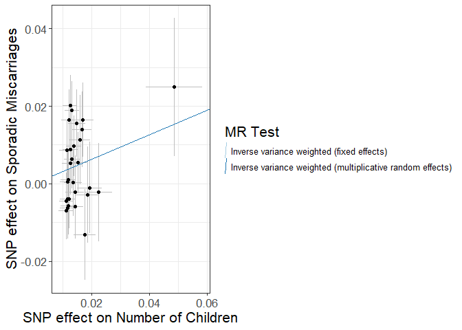<!-- -->

``` r
forrest_p <- mr_forest_plot(res_single)
forrest_p[[1]]
```

    ## Warning: Removed 1 row containing missing values or values outside the scale range
    ## (`geom_errorbarh()`).

    ## Warning: Removed 1 row containing missing values or values outside the scale range
    ## (`geom_point()`).

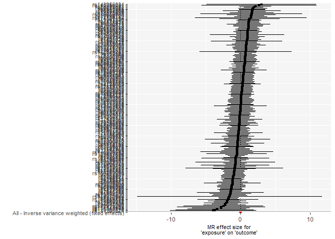<!-- -->

``` r
mr_dat <- read.csv("outcome/mr_dat_insomnia")
mr_res <- read.csv("outcome/mr_res_insomnia.csv")
res_single <- read.csv("outcome/res_single_insomnia.csv")

mr_res
```

    ##   X id.exposure id.outcome outcome exposure
    ## 1 1      EggU0Z     3W3fLG outcome exposure
    ## 2 2      EggU0Z     3W3fLG outcome exposure
    ##                                                      method nsnp             b
    ## 1                 Inverse variance weighted (fixed effects)  145 -0.0001405256
    ## 2 Inverse variance weighted (multiplicative random effects)  145 -0.0001405256
    ##            se      pval
    ## 1 0.001077383 0.8962244
    ## 2 0.001065282 0.8950523

``` r
res_pleio <- mr_pleiotropy_test(mr_dat)

res_pleio %>%
  select(-id.exposure, -id.outcome, -outcome, -exposure) %>%
  gt() %>%
  fmt_number(
    columns = c('egger_intercept', 'se')
  ) %>%
  fmt_number(
    columns = pval,
    rows = pval > 0.001,
    decimals = 3
  ) %>% 
  fmt_scientific(
    columns = pval,
    rows = pval <= 0.001,
    decimals = 1
  )
```

<div id="ebvaajzzgl" style="padding-left:0px;padding-right:0px;padding-top:10px;padding-bottom:10px;overflow-x:auto;overflow-y:auto;width:auto;height:auto;">
<style>#ebvaajzzgl table {
  font-family: system-ui, 'Segoe UI', Roboto, Helvetica, Arial, sans-serif, 'Apple Color Emoji', 'Segoe UI Emoji', 'Segoe UI Symbol', 'Noto Color Emoji';
  -webkit-font-smoothing: antialiased;
  -moz-osx-font-smoothing: grayscale;
}
&#10;#ebvaajzzgl thead, #ebvaajzzgl tbody, #ebvaajzzgl tfoot, #ebvaajzzgl tr, #ebvaajzzgl td, #ebvaajzzgl th {
  border-style: none;
}
&#10;#ebvaajzzgl p {
  margin: 0;
  padding: 0;
}
&#10;#ebvaajzzgl .gt_table {
  display: table;
  border-collapse: collapse;
  line-height: normal;
  margin-left: auto;
  margin-right: auto;
  color: #333333;
  font-size: 16px;
  font-weight: normal;
  font-style: normal;
  background-color: #FFFFFF;
  width: auto;
  border-top-style: solid;
  border-top-width: 2px;
  border-top-color: #A8A8A8;
  border-right-style: none;
  border-right-width: 2px;
  border-right-color: #D3D3D3;
  border-bottom-style: solid;
  border-bottom-width: 2px;
  border-bottom-color: #A8A8A8;
  border-left-style: none;
  border-left-width: 2px;
  border-left-color: #D3D3D3;
}
&#10;#ebvaajzzgl .gt_caption {
  padding-top: 4px;
  padding-bottom: 4px;
}
&#10;#ebvaajzzgl .gt_title {
  color: #333333;
  font-size: 125%;
  font-weight: initial;
  padding-top: 4px;
  padding-bottom: 4px;
  padding-left: 5px;
  padding-right: 5px;
  border-bottom-color: #FFFFFF;
  border-bottom-width: 0;
}
&#10;#ebvaajzzgl .gt_subtitle {
  color: #333333;
  font-size: 85%;
  font-weight: initial;
  padding-top: 3px;
  padding-bottom: 5px;
  padding-left: 5px;
  padding-right: 5px;
  border-top-color: #FFFFFF;
  border-top-width: 0;
}
&#10;#ebvaajzzgl .gt_heading {
  background-color: #FFFFFF;
  text-align: center;
  border-bottom-color: #FFFFFF;
  border-left-style: none;
  border-left-width: 1px;
  border-left-color: #D3D3D3;
  border-right-style: none;
  border-right-width: 1px;
  border-right-color: #D3D3D3;
}
&#10;#ebvaajzzgl .gt_bottom_border {
  border-bottom-style: solid;
  border-bottom-width: 2px;
  border-bottom-color: #D3D3D3;
}
&#10;#ebvaajzzgl .gt_col_headings {
  border-top-style: solid;
  border-top-width: 2px;
  border-top-color: #D3D3D3;
  border-bottom-style: solid;
  border-bottom-width: 2px;
  border-bottom-color: #D3D3D3;
  border-left-style: none;
  border-left-width: 1px;
  border-left-color: #D3D3D3;
  border-right-style: none;
  border-right-width: 1px;
  border-right-color: #D3D3D3;
}
&#10;#ebvaajzzgl .gt_col_heading {
  color: #333333;
  background-color: #FFFFFF;
  font-size: 100%;
  font-weight: normal;
  text-transform: inherit;
  border-left-style: none;
  border-left-width: 1px;
  border-left-color: #D3D3D3;
  border-right-style: none;
  border-right-width: 1px;
  border-right-color: #D3D3D3;
  vertical-align: bottom;
  padding-top: 5px;
  padding-bottom: 6px;
  padding-left: 5px;
  padding-right: 5px;
  overflow-x: hidden;
}
&#10;#ebvaajzzgl .gt_column_spanner_outer {
  color: #333333;
  background-color: #FFFFFF;
  font-size: 100%;
  font-weight: normal;
  text-transform: inherit;
  padding-top: 0;
  padding-bottom: 0;
  padding-left: 4px;
  padding-right: 4px;
}
&#10;#ebvaajzzgl .gt_column_spanner_outer:first-child {
  padding-left: 0;
}
&#10;#ebvaajzzgl .gt_column_spanner_outer:last-child {
  padding-right: 0;
}
&#10;#ebvaajzzgl .gt_column_spanner {
  border-bottom-style: solid;
  border-bottom-width: 2px;
  border-bottom-color: #D3D3D3;
  vertical-align: bottom;
  padding-top: 5px;
  padding-bottom: 5px;
  overflow-x: hidden;
  display: inline-block;
  width: 100%;
}
&#10;#ebvaajzzgl .gt_spanner_row {
  border-bottom-style: hidden;
}
&#10;#ebvaajzzgl .gt_group_heading {
  padding-top: 8px;
  padding-bottom: 8px;
  padding-left: 5px;
  padding-right: 5px;
  color: #333333;
  background-color: #FFFFFF;
  font-size: 100%;
  font-weight: initial;
  text-transform: inherit;
  border-top-style: solid;
  border-top-width: 2px;
  border-top-color: #D3D3D3;
  border-bottom-style: solid;
  border-bottom-width: 2px;
  border-bottom-color: #D3D3D3;
  border-left-style: none;
  border-left-width: 1px;
  border-left-color: #D3D3D3;
  border-right-style: none;
  border-right-width: 1px;
  border-right-color: #D3D3D3;
  vertical-align: middle;
  text-align: left;
}
&#10;#ebvaajzzgl .gt_empty_group_heading {
  padding: 0.5px;
  color: #333333;
  background-color: #FFFFFF;
  font-size: 100%;
  font-weight: initial;
  border-top-style: solid;
  border-top-width: 2px;
  border-top-color: #D3D3D3;
  border-bottom-style: solid;
  border-bottom-width: 2px;
  border-bottom-color: #D3D3D3;
  vertical-align: middle;
}
&#10;#ebvaajzzgl .gt_from_md > :first-child {
  margin-top: 0;
}
&#10;#ebvaajzzgl .gt_from_md > :last-child {
  margin-bottom: 0;
}
&#10;#ebvaajzzgl .gt_row {
  padding-top: 8px;
  padding-bottom: 8px;
  padding-left: 5px;
  padding-right: 5px;
  margin: 10px;
  border-top-style: solid;
  border-top-width: 1px;
  border-top-color: #D3D3D3;
  border-left-style: none;
  border-left-width: 1px;
  border-left-color: #D3D3D3;
  border-right-style: none;
  border-right-width: 1px;
  border-right-color: #D3D3D3;
  vertical-align: middle;
  overflow-x: hidden;
}
&#10;#ebvaajzzgl .gt_stub {
  color: #333333;
  background-color: #FFFFFF;
  font-size: 100%;
  font-weight: initial;
  text-transform: inherit;
  border-right-style: solid;
  border-right-width: 2px;
  border-right-color: #D3D3D3;
  padding-left: 5px;
  padding-right: 5px;
}
&#10;#ebvaajzzgl .gt_stub_row_group {
  color: #333333;
  background-color: #FFFFFF;
  font-size: 100%;
  font-weight: initial;
  text-transform: inherit;
  border-right-style: solid;
  border-right-width: 2px;
  border-right-color: #D3D3D3;
  padding-left: 5px;
  padding-right: 5px;
  vertical-align: top;
}
&#10;#ebvaajzzgl .gt_row_group_first td {
  border-top-width: 2px;
}
&#10;#ebvaajzzgl .gt_row_group_first th {
  border-top-width: 2px;
}
&#10;#ebvaajzzgl .gt_summary_row {
  color: #333333;
  background-color: #FFFFFF;
  text-transform: inherit;
  padding-top: 8px;
  padding-bottom: 8px;
  padding-left: 5px;
  padding-right: 5px;
}
&#10;#ebvaajzzgl .gt_first_summary_row {
  border-top-style: solid;
  border-top-color: #D3D3D3;
}
&#10;#ebvaajzzgl .gt_first_summary_row.thick {
  border-top-width: 2px;
}
&#10;#ebvaajzzgl .gt_last_summary_row {
  padding-top: 8px;
  padding-bottom: 8px;
  padding-left: 5px;
  padding-right: 5px;
  border-bottom-style: solid;
  border-bottom-width: 2px;
  border-bottom-color: #D3D3D3;
}
&#10;#ebvaajzzgl .gt_grand_summary_row {
  color: #333333;
  background-color: #FFFFFF;
  text-transform: inherit;
  padding-top: 8px;
  padding-bottom: 8px;
  padding-left: 5px;
  padding-right: 5px;
}
&#10;#ebvaajzzgl .gt_first_grand_summary_row {
  padding-top: 8px;
  padding-bottom: 8px;
  padding-left: 5px;
  padding-right: 5px;
  border-top-style: double;
  border-top-width: 6px;
  border-top-color: #D3D3D3;
}
&#10;#ebvaajzzgl .gt_last_grand_summary_row_top {
  padding-top: 8px;
  padding-bottom: 8px;
  padding-left: 5px;
  padding-right: 5px;
  border-bottom-style: double;
  border-bottom-width: 6px;
  border-bottom-color: #D3D3D3;
}
&#10;#ebvaajzzgl .gt_striped {
  background-color: rgba(128, 128, 128, 0.05);
}
&#10;#ebvaajzzgl .gt_table_body {
  border-top-style: solid;
  border-top-width: 2px;
  border-top-color: #D3D3D3;
  border-bottom-style: solid;
  border-bottom-width: 2px;
  border-bottom-color: #D3D3D3;
}
&#10;#ebvaajzzgl .gt_footnotes {
  color: #333333;
  background-color: #FFFFFF;
  border-bottom-style: none;
  border-bottom-width: 2px;
  border-bottom-color: #D3D3D3;
  border-left-style: none;
  border-left-width: 2px;
  border-left-color: #D3D3D3;
  border-right-style: none;
  border-right-width: 2px;
  border-right-color: #D3D3D3;
}
&#10;#ebvaajzzgl .gt_footnote {
  margin: 0px;
  font-size: 90%;
  padding-top: 4px;
  padding-bottom: 4px;
  padding-left: 5px;
  padding-right: 5px;
}
&#10;#ebvaajzzgl .gt_sourcenotes {
  color: #333333;
  background-color: #FFFFFF;
  border-bottom-style: none;
  border-bottom-width: 2px;
  border-bottom-color: #D3D3D3;
  border-left-style: none;
  border-left-width: 2px;
  border-left-color: #D3D3D3;
  border-right-style: none;
  border-right-width: 2px;
  border-right-color: #D3D3D3;
}
&#10;#ebvaajzzgl .gt_sourcenote {
  font-size: 90%;
  padding-top: 4px;
  padding-bottom: 4px;
  padding-left: 5px;
  padding-right: 5px;
}
&#10;#ebvaajzzgl .gt_left {
  text-align: left;
}
&#10;#ebvaajzzgl .gt_center {
  text-align: center;
}
&#10;#ebvaajzzgl .gt_right {
  text-align: right;
  font-variant-numeric: tabular-nums;
}
&#10;#ebvaajzzgl .gt_font_normal {
  font-weight: normal;
}
&#10;#ebvaajzzgl .gt_font_bold {
  font-weight: bold;
}
&#10;#ebvaajzzgl .gt_font_italic {
  font-style: italic;
}
&#10;#ebvaajzzgl .gt_super {
  font-size: 65%;
}
&#10;#ebvaajzzgl .gt_footnote_marks {
  font-size: 75%;
  vertical-align: 0.4em;
  position: initial;
}
&#10;#ebvaajzzgl .gt_asterisk {
  font-size: 100%;
  vertical-align: 0;
}
&#10;#ebvaajzzgl .gt_indent_1 {
  text-indent: 5px;
}
&#10;#ebvaajzzgl .gt_indent_2 {
  text-indent: 10px;
}
&#10;#ebvaajzzgl .gt_indent_3 {
  text-indent: 15px;
}
&#10;#ebvaajzzgl .gt_indent_4 {
  text-indent: 20px;
}
&#10;#ebvaajzzgl .gt_indent_5 {
  text-indent: 25px;
}
&#10;#ebvaajzzgl .katex-display {
  display: inline-flex !important;
  margin-bottom: 0.75em !important;
}
&#10;#ebvaajzzgl div.Reactable > div.rt-table > div.rt-thead > div.rt-tr.rt-tr-group-header > div.rt-th-group:after {
  height: 0px !important;
}
</style>
<table class="gt_table" data-quarto-disable-processing="false" data-quarto-bootstrap="false">
  <thead>
    <tr class="gt_col_headings">
      <th class="gt_col_heading gt_columns_bottom_border gt_right" rowspan="1" colspan="1" scope="col" id="egger_intercept">egger_intercept</th>
      <th class="gt_col_heading gt_columns_bottom_border gt_right" rowspan="1" colspan="1" scope="col" id="se">se</th>
      <th class="gt_col_heading gt_columns_bottom_border gt_right" rowspan="1" colspan="1" scope="col" id="pval">pval</th>
    </tr>
  </thead>
  <tbody class="gt_table_body">
    <tr><td headers="egger_intercept" class="gt_row gt_right">0.03</td>
<td headers="se" class="gt_row gt_right">0.10</td>
<td headers="pval" class="gt_row gt_right">0.720</td></tr>
  </tbody>
  &#10;  
</table>
</div>

``` r
# Heterogeneity statistics 
res_het <- mr_heterogeneity(mr_dat, method_list = c(
  "mr_ivw_fe", "mr_ivw_mre"
))

res_het %>%
  select(-id.exposure, -id.outcome, -outcome, -exposure) %>%
  gt() %>%
  fmt_number(
    columns = Q
  ) %>%
  fmt_number(
    columns = Q_pval,
    rows = Q_pval > 0.001,
    decimals = 3
  ) %>% 
  fmt_scientific(
    columns = Q_pval,
    rows = Q_pval <= 0.001,
    decimals = 1
  )
```

<div id="lnaihaooli" style="padding-left:0px;padding-right:0px;padding-top:10px;padding-bottom:10px;overflow-x:auto;overflow-y:auto;width:auto;height:auto;">
<style>#lnaihaooli table {
  font-family: system-ui, 'Segoe UI', Roboto, Helvetica, Arial, sans-serif, 'Apple Color Emoji', 'Segoe UI Emoji', 'Segoe UI Symbol', 'Noto Color Emoji';
  -webkit-font-smoothing: antialiased;
  -moz-osx-font-smoothing: grayscale;
}
&#10;#lnaihaooli thead, #lnaihaooli tbody, #lnaihaooli tfoot, #lnaihaooli tr, #lnaihaooli td, #lnaihaooli th {
  border-style: none;
}
&#10;#lnaihaooli p {
  margin: 0;
  padding: 0;
}
&#10;#lnaihaooli .gt_table {
  display: table;
  border-collapse: collapse;
  line-height: normal;
  margin-left: auto;
  margin-right: auto;
  color: #333333;
  font-size: 16px;
  font-weight: normal;
  font-style: normal;
  background-color: #FFFFFF;
  width: auto;
  border-top-style: solid;
  border-top-width: 2px;
  border-top-color: #A8A8A8;
  border-right-style: none;
  border-right-width: 2px;
  border-right-color: #D3D3D3;
  border-bottom-style: solid;
  border-bottom-width: 2px;
  border-bottom-color: #A8A8A8;
  border-left-style: none;
  border-left-width: 2px;
  border-left-color: #D3D3D3;
}
&#10;#lnaihaooli .gt_caption {
  padding-top: 4px;
  padding-bottom: 4px;
}
&#10;#lnaihaooli .gt_title {
  color: #333333;
  font-size: 125%;
  font-weight: initial;
  padding-top: 4px;
  padding-bottom: 4px;
  padding-left: 5px;
  padding-right: 5px;
  border-bottom-color: #FFFFFF;
  border-bottom-width: 0;
}
&#10;#lnaihaooli .gt_subtitle {
  color: #333333;
  font-size: 85%;
  font-weight: initial;
  padding-top: 3px;
  padding-bottom: 5px;
  padding-left: 5px;
  padding-right: 5px;
  border-top-color: #FFFFFF;
  border-top-width: 0;
}
&#10;#lnaihaooli .gt_heading {
  background-color: #FFFFFF;
  text-align: center;
  border-bottom-color: #FFFFFF;
  border-left-style: none;
  border-left-width: 1px;
  border-left-color: #D3D3D3;
  border-right-style: none;
  border-right-width: 1px;
  border-right-color: #D3D3D3;
}
&#10;#lnaihaooli .gt_bottom_border {
  border-bottom-style: solid;
  border-bottom-width: 2px;
  border-bottom-color: #D3D3D3;
}
&#10;#lnaihaooli .gt_col_headings {
  border-top-style: solid;
  border-top-width: 2px;
  border-top-color: #D3D3D3;
  border-bottom-style: solid;
  border-bottom-width: 2px;
  border-bottom-color: #D3D3D3;
  border-left-style: none;
  border-left-width: 1px;
  border-left-color: #D3D3D3;
  border-right-style: none;
  border-right-width: 1px;
  border-right-color: #D3D3D3;
}
&#10;#lnaihaooli .gt_col_heading {
  color: #333333;
  background-color: #FFFFFF;
  font-size: 100%;
  font-weight: normal;
  text-transform: inherit;
  border-left-style: none;
  border-left-width: 1px;
  border-left-color: #D3D3D3;
  border-right-style: none;
  border-right-width: 1px;
  border-right-color: #D3D3D3;
  vertical-align: bottom;
  padding-top: 5px;
  padding-bottom: 6px;
  padding-left: 5px;
  padding-right: 5px;
  overflow-x: hidden;
}
&#10;#lnaihaooli .gt_column_spanner_outer {
  color: #333333;
  background-color: #FFFFFF;
  font-size: 100%;
  font-weight: normal;
  text-transform: inherit;
  padding-top: 0;
  padding-bottom: 0;
  padding-left: 4px;
  padding-right: 4px;
}
&#10;#lnaihaooli .gt_column_spanner_outer:first-child {
  padding-left: 0;
}
&#10;#lnaihaooli .gt_column_spanner_outer:last-child {
  padding-right: 0;
}
&#10;#lnaihaooli .gt_column_spanner {
  border-bottom-style: solid;
  border-bottom-width: 2px;
  border-bottom-color: #D3D3D3;
  vertical-align: bottom;
  padding-top: 5px;
  padding-bottom: 5px;
  overflow-x: hidden;
  display: inline-block;
  width: 100%;
}
&#10;#lnaihaooli .gt_spanner_row {
  border-bottom-style: hidden;
}
&#10;#lnaihaooli .gt_group_heading {
  padding-top: 8px;
  padding-bottom: 8px;
  padding-left: 5px;
  padding-right: 5px;
  color: #333333;
  background-color: #FFFFFF;
  font-size: 100%;
  font-weight: initial;
  text-transform: inherit;
  border-top-style: solid;
  border-top-width: 2px;
  border-top-color: #D3D3D3;
  border-bottom-style: solid;
  border-bottom-width: 2px;
  border-bottom-color: #D3D3D3;
  border-left-style: none;
  border-left-width: 1px;
  border-left-color: #D3D3D3;
  border-right-style: none;
  border-right-width: 1px;
  border-right-color: #D3D3D3;
  vertical-align: middle;
  text-align: left;
}
&#10;#lnaihaooli .gt_empty_group_heading {
  padding: 0.5px;
  color: #333333;
  background-color: #FFFFFF;
  font-size: 100%;
  font-weight: initial;
  border-top-style: solid;
  border-top-width: 2px;
  border-top-color: #D3D3D3;
  border-bottom-style: solid;
  border-bottom-width: 2px;
  border-bottom-color: #D3D3D3;
  vertical-align: middle;
}
&#10;#lnaihaooli .gt_from_md > :first-child {
  margin-top: 0;
}
&#10;#lnaihaooli .gt_from_md > :last-child {
  margin-bottom: 0;
}
&#10;#lnaihaooli .gt_row {
  padding-top: 8px;
  padding-bottom: 8px;
  padding-left: 5px;
  padding-right: 5px;
  margin: 10px;
  border-top-style: solid;
  border-top-width: 1px;
  border-top-color: #D3D3D3;
  border-left-style: none;
  border-left-width: 1px;
  border-left-color: #D3D3D3;
  border-right-style: none;
  border-right-width: 1px;
  border-right-color: #D3D3D3;
  vertical-align: middle;
  overflow-x: hidden;
}
&#10;#lnaihaooli .gt_stub {
  color: #333333;
  background-color: #FFFFFF;
  font-size: 100%;
  font-weight: initial;
  text-transform: inherit;
  border-right-style: solid;
  border-right-width: 2px;
  border-right-color: #D3D3D3;
  padding-left: 5px;
  padding-right: 5px;
}
&#10;#lnaihaooli .gt_stub_row_group {
  color: #333333;
  background-color: #FFFFFF;
  font-size: 100%;
  font-weight: initial;
  text-transform: inherit;
  border-right-style: solid;
  border-right-width: 2px;
  border-right-color: #D3D3D3;
  padding-left: 5px;
  padding-right: 5px;
  vertical-align: top;
}
&#10;#lnaihaooli .gt_row_group_first td {
  border-top-width: 2px;
}
&#10;#lnaihaooli .gt_row_group_first th {
  border-top-width: 2px;
}
&#10;#lnaihaooli .gt_summary_row {
  color: #333333;
  background-color: #FFFFFF;
  text-transform: inherit;
  padding-top: 8px;
  padding-bottom: 8px;
  padding-left: 5px;
  padding-right: 5px;
}
&#10;#lnaihaooli .gt_first_summary_row {
  border-top-style: solid;
  border-top-color: #D3D3D3;
}
&#10;#lnaihaooli .gt_first_summary_row.thick {
  border-top-width: 2px;
}
&#10;#lnaihaooli .gt_last_summary_row {
  padding-top: 8px;
  padding-bottom: 8px;
  padding-left: 5px;
  padding-right: 5px;
  border-bottom-style: solid;
  border-bottom-width: 2px;
  border-bottom-color: #D3D3D3;
}
&#10;#lnaihaooli .gt_grand_summary_row {
  color: #333333;
  background-color: #FFFFFF;
  text-transform: inherit;
  padding-top: 8px;
  padding-bottom: 8px;
  padding-left: 5px;
  padding-right: 5px;
}
&#10;#lnaihaooli .gt_first_grand_summary_row {
  padding-top: 8px;
  padding-bottom: 8px;
  padding-left: 5px;
  padding-right: 5px;
  border-top-style: double;
  border-top-width: 6px;
  border-top-color: #D3D3D3;
}
&#10;#lnaihaooli .gt_last_grand_summary_row_top {
  padding-top: 8px;
  padding-bottom: 8px;
  padding-left: 5px;
  padding-right: 5px;
  border-bottom-style: double;
  border-bottom-width: 6px;
  border-bottom-color: #D3D3D3;
}
&#10;#lnaihaooli .gt_striped {
  background-color: rgba(128, 128, 128, 0.05);
}
&#10;#lnaihaooli .gt_table_body {
  border-top-style: solid;
  border-top-width: 2px;
  border-top-color: #D3D3D3;
  border-bottom-style: solid;
  border-bottom-width: 2px;
  border-bottom-color: #D3D3D3;
}
&#10;#lnaihaooli .gt_footnotes {
  color: #333333;
  background-color: #FFFFFF;
  border-bottom-style: none;
  border-bottom-width: 2px;
  border-bottom-color: #D3D3D3;
  border-left-style: none;
  border-left-width: 2px;
  border-left-color: #D3D3D3;
  border-right-style: none;
  border-right-width: 2px;
  border-right-color: #D3D3D3;
}
&#10;#lnaihaooli .gt_footnote {
  margin: 0px;
  font-size: 90%;
  padding-top: 4px;
  padding-bottom: 4px;
  padding-left: 5px;
  padding-right: 5px;
}
&#10;#lnaihaooli .gt_sourcenotes {
  color: #333333;
  background-color: #FFFFFF;
  border-bottom-style: none;
  border-bottom-width: 2px;
  border-bottom-color: #D3D3D3;
  border-left-style: none;
  border-left-width: 2px;
  border-left-color: #D3D3D3;
  border-right-style: none;
  border-right-width: 2px;
  border-right-color: #D3D3D3;
}
&#10;#lnaihaooli .gt_sourcenote {
  font-size: 90%;
  padding-top: 4px;
  padding-bottom: 4px;
  padding-left: 5px;
  padding-right: 5px;
}
&#10;#lnaihaooli .gt_left {
  text-align: left;
}
&#10;#lnaihaooli .gt_center {
  text-align: center;
}
&#10;#lnaihaooli .gt_right {
  text-align: right;
  font-variant-numeric: tabular-nums;
}
&#10;#lnaihaooli .gt_font_normal {
  font-weight: normal;
}
&#10;#lnaihaooli .gt_font_bold {
  font-weight: bold;
}
&#10;#lnaihaooli .gt_font_italic {
  font-style: italic;
}
&#10;#lnaihaooli .gt_super {
  font-size: 65%;
}
&#10;#lnaihaooli .gt_footnote_marks {
  font-size: 75%;
  vertical-align: 0.4em;
  position: initial;
}
&#10;#lnaihaooli .gt_asterisk {
  font-size: 100%;
  vertical-align: 0;
}
&#10;#lnaihaooli .gt_indent_1 {
  text-indent: 5px;
}
&#10;#lnaihaooli .gt_indent_2 {
  text-indent: 10px;
}
&#10;#lnaihaooli .gt_indent_3 {
  text-indent: 15px;
}
&#10;#lnaihaooli .gt_indent_4 {
  text-indent: 20px;
}
&#10;#lnaihaooli .gt_indent_5 {
  text-indent: 25px;
}
&#10;#lnaihaooli .katex-display {
  display: inline-flex !important;
  margin-bottom: 0.75em !important;
}
&#10;#lnaihaooli div.Reactable > div.rt-table > div.rt-thead > div.rt-tr.rt-tr-group-header > div.rt-th-group:after {
  height: 0px !important;
}
</style>
<table class="gt_table" data-quarto-disable-processing="false" data-quarto-bootstrap="false">
  <thead>
    <tr class="gt_col_headings">
      <th class="gt_col_heading gt_columns_bottom_border gt_left" rowspan="1" colspan="1" scope="col" id="method">method</th>
      <th class="gt_col_heading gt_columns_bottom_border gt_right" rowspan="1" colspan="1" scope="col" id="Q">Q</th>
      <th class="gt_col_heading gt_columns_bottom_border gt_right" rowspan="1" colspan="1" scope="col" id="Q_df">Q_df</th>
      <th class="gt_col_heading gt_columns_bottom_border gt_right" rowspan="1" colspan="1" scope="col" id="Q_pval">Q_pval</th>
    </tr>
  </thead>
  <tbody class="gt_table_body">
    <tr><td headers="method" class="gt_row gt_left">Inverse variance weighted (fixed effects)</td>
<td headers="Q" class="gt_row gt_right">140.78</td>
<td headers="Q_df" class="gt_row gt_right">144</td>
<td headers="Q_pval" class="gt_row gt_right">0.560</td></tr>
    <tr><td headers="method" class="gt_row gt_left">Inverse variance weighted (multiplicative random effects)</td>
<td headers="Q" class="gt_row gt_right">140.78</td>
<td headers="Q_df" class="gt_row gt_right">144</td>
<td headers="Q_pval" class="gt_row gt_right">0.560</td></tr>
  </tbody>
  &#10;  
</table>
</div>

``` r
scatter_p <- mr_scatter_plot(mr_res, mr_dat)
scatter_out_p <- scatter_p[[1]] + theme_bw() +
  guides(color=guide_legend(ncol =1)) +
  theme(
    text = element_text(size = 8),
  )
scatter_out_p
```

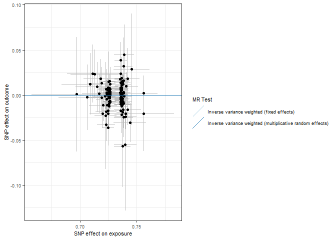<!-- -->

``` r
forrest_p <- mr_forest_plot(res_single)
forrest_p[[1]]
```

    ## Warning: Removed 1 row containing missing values or values outside the scale range
    ## (`geom_errorbarh()`).

    ## Warning: Removed 1 row containing missing values or values outside the scale range
    ## (`geom_point()`).

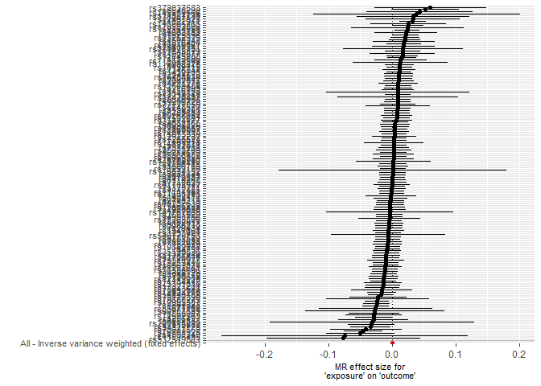<!-- -->

``` r
mr_dat <- read.csv("outcome/mr_dat_ptsd")
mr_res <- read.csv("outcome/mr_res_ptsd.csv")
res_single <- read.csv("outcome/res_single_ptsd.csv")

mr_res
```

    ##   X id.exposure id.outcome outcome exposure
    ## 1 1      uRiplM     3W3fLG outcome exposure
    ## 2 2      uRiplM     3W3fLG outcome exposure
    ##                                                      method nsnp            b
    ## 1                 Inverse variance weighted (fixed effects)   39 -0.001575663
    ## 2 Inverse variance weighted (multiplicative random effects)   39 -0.001575663
    ##            se      pval
    ## 1 0.002747119 0.5662594
    ## 2 0.002625357 0.5483924

``` r
res_pleio <- mr_pleiotropy_test(mr_dat)

res_pleio %>%
  select(-id.exposure, -id.outcome, -outcome, -exposure) %>%
  gt() %>%
  fmt_number(
    columns = c('egger_intercept', 'se')
  ) %>%
  fmt_number(
    columns = pval,
    rows = pval > 0.001,
    decimals = 3
  ) %>% 
  fmt_scientific(
    columns = pval,
    rows = pval <= 0.001,
    decimals = 1
  )
```

<div id="nvqthqfbfu" style="padding-left:0px;padding-right:0px;padding-top:10px;padding-bottom:10px;overflow-x:auto;overflow-y:auto;width:auto;height:auto;">
<style>#nvqthqfbfu table {
  font-family: system-ui, 'Segoe UI', Roboto, Helvetica, Arial, sans-serif, 'Apple Color Emoji', 'Segoe UI Emoji', 'Segoe UI Symbol', 'Noto Color Emoji';
  -webkit-font-smoothing: antialiased;
  -moz-osx-font-smoothing: grayscale;
}
&#10;#nvqthqfbfu thead, #nvqthqfbfu tbody, #nvqthqfbfu tfoot, #nvqthqfbfu tr, #nvqthqfbfu td, #nvqthqfbfu th {
  border-style: none;
}
&#10;#nvqthqfbfu p {
  margin: 0;
  padding: 0;
}
&#10;#nvqthqfbfu .gt_table {
  display: table;
  border-collapse: collapse;
  line-height: normal;
  margin-left: auto;
  margin-right: auto;
  color: #333333;
  font-size: 16px;
  font-weight: normal;
  font-style: normal;
  background-color: #FFFFFF;
  width: auto;
  border-top-style: solid;
  border-top-width: 2px;
  border-top-color: #A8A8A8;
  border-right-style: none;
  border-right-width: 2px;
  border-right-color: #D3D3D3;
  border-bottom-style: solid;
  border-bottom-width: 2px;
  border-bottom-color: #A8A8A8;
  border-left-style: none;
  border-left-width: 2px;
  border-left-color: #D3D3D3;
}
&#10;#nvqthqfbfu .gt_caption {
  padding-top: 4px;
  padding-bottom: 4px;
}
&#10;#nvqthqfbfu .gt_title {
  color: #333333;
  font-size: 125%;
  font-weight: initial;
  padding-top: 4px;
  padding-bottom: 4px;
  padding-left: 5px;
  padding-right: 5px;
  border-bottom-color: #FFFFFF;
  border-bottom-width: 0;
}
&#10;#nvqthqfbfu .gt_subtitle {
  color: #333333;
  font-size: 85%;
  font-weight: initial;
  padding-top: 3px;
  padding-bottom: 5px;
  padding-left: 5px;
  padding-right: 5px;
  border-top-color: #FFFFFF;
  border-top-width: 0;
}
&#10;#nvqthqfbfu .gt_heading {
  background-color: #FFFFFF;
  text-align: center;
  border-bottom-color: #FFFFFF;
  border-left-style: none;
  border-left-width: 1px;
  border-left-color: #D3D3D3;
  border-right-style: none;
  border-right-width: 1px;
  border-right-color: #D3D3D3;
}
&#10;#nvqthqfbfu .gt_bottom_border {
  border-bottom-style: solid;
  border-bottom-width: 2px;
  border-bottom-color: #D3D3D3;
}
&#10;#nvqthqfbfu .gt_col_headings {
  border-top-style: solid;
  border-top-width: 2px;
  border-top-color: #D3D3D3;
  border-bottom-style: solid;
  border-bottom-width: 2px;
  border-bottom-color: #D3D3D3;
  border-left-style: none;
  border-left-width: 1px;
  border-left-color: #D3D3D3;
  border-right-style: none;
  border-right-width: 1px;
  border-right-color: #D3D3D3;
}
&#10;#nvqthqfbfu .gt_col_heading {
  color: #333333;
  background-color: #FFFFFF;
  font-size: 100%;
  font-weight: normal;
  text-transform: inherit;
  border-left-style: none;
  border-left-width: 1px;
  border-left-color: #D3D3D3;
  border-right-style: none;
  border-right-width: 1px;
  border-right-color: #D3D3D3;
  vertical-align: bottom;
  padding-top: 5px;
  padding-bottom: 6px;
  padding-left: 5px;
  padding-right: 5px;
  overflow-x: hidden;
}
&#10;#nvqthqfbfu .gt_column_spanner_outer {
  color: #333333;
  background-color: #FFFFFF;
  font-size: 100%;
  font-weight: normal;
  text-transform: inherit;
  padding-top: 0;
  padding-bottom: 0;
  padding-left: 4px;
  padding-right: 4px;
}
&#10;#nvqthqfbfu .gt_column_spanner_outer:first-child {
  padding-left: 0;
}
&#10;#nvqthqfbfu .gt_column_spanner_outer:last-child {
  padding-right: 0;
}
&#10;#nvqthqfbfu .gt_column_spanner {
  border-bottom-style: solid;
  border-bottom-width: 2px;
  border-bottom-color: #D3D3D3;
  vertical-align: bottom;
  padding-top: 5px;
  padding-bottom: 5px;
  overflow-x: hidden;
  display: inline-block;
  width: 100%;
}
&#10;#nvqthqfbfu .gt_spanner_row {
  border-bottom-style: hidden;
}
&#10;#nvqthqfbfu .gt_group_heading {
  padding-top: 8px;
  padding-bottom: 8px;
  padding-left: 5px;
  padding-right: 5px;
  color: #333333;
  background-color: #FFFFFF;
  font-size: 100%;
  font-weight: initial;
  text-transform: inherit;
  border-top-style: solid;
  border-top-width: 2px;
  border-top-color: #D3D3D3;
  border-bottom-style: solid;
  border-bottom-width: 2px;
  border-bottom-color: #D3D3D3;
  border-left-style: none;
  border-left-width: 1px;
  border-left-color: #D3D3D3;
  border-right-style: none;
  border-right-width: 1px;
  border-right-color: #D3D3D3;
  vertical-align: middle;
  text-align: left;
}
&#10;#nvqthqfbfu .gt_empty_group_heading {
  padding: 0.5px;
  color: #333333;
  background-color: #FFFFFF;
  font-size: 100%;
  font-weight: initial;
  border-top-style: solid;
  border-top-width: 2px;
  border-top-color: #D3D3D3;
  border-bottom-style: solid;
  border-bottom-width: 2px;
  border-bottom-color: #D3D3D3;
  vertical-align: middle;
}
&#10;#nvqthqfbfu .gt_from_md > :first-child {
  margin-top: 0;
}
&#10;#nvqthqfbfu .gt_from_md > :last-child {
  margin-bottom: 0;
}
&#10;#nvqthqfbfu .gt_row {
  padding-top: 8px;
  padding-bottom: 8px;
  padding-left: 5px;
  padding-right: 5px;
  margin: 10px;
  border-top-style: solid;
  border-top-width: 1px;
  border-top-color: #D3D3D3;
  border-left-style: none;
  border-left-width: 1px;
  border-left-color: #D3D3D3;
  border-right-style: none;
  border-right-width: 1px;
  border-right-color: #D3D3D3;
  vertical-align: middle;
  overflow-x: hidden;
}
&#10;#nvqthqfbfu .gt_stub {
  color: #333333;
  background-color: #FFFFFF;
  font-size: 100%;
  font-weight: initial;
  text-transform: inherit;
  border-right-style: solid;
  border-right-width: 2px;
  border-right-color: #D3D3D3;
  padding-left: 5px;
  padding-right: 5px;
}
&#10;#nvqthqfbfu .gt_stub_row_group {
  color: #333333;
  background-color: #FFFFFF;
  font-size: 100%;
  font-weight: initial;
  text-transform: inherit;
  border-right-style: solid;
  border-right-width: 2px;
  border-right-color: #D3D3D3;
  padding-left: 5px;
  padding-right: 5px;
  vertical-align: top;
}
&#10;#nvqthqfbfu .gt_row_group_first td {
  border-top-width: 2px;
}
&#10;#nvqthqfbfu .gt_row_group_first th {
  border-top-width: 2px;
}
&#10;#nvqthqfbfu .gt_summary_row {
  color: #333333;
  background-color: #FFFFFF;
  text-transform: inherit;
  padding-top: 8px;
  padding-bottom: 8px;
  padding-left: 5px;
  padding-right: 5px;
}
&#10;#nvqthqfbfu .gt_first_summary_row {
  border-top-style: solid;
  border-top-color: #D3D3D3;
}
&#10;#nvqthqfbfu .gt_first_summary_row.thick {
  border-top-width: 2px;
}
&#10;#nvqthqfbfu .gt_last_summary_row {
  padding-top: 8px;
  padding-bottom: 8px;
  padding-left: 5px;
  padding-right: 5px;
  border-bottom-style: solid;
  border-bottom-width: 2px;
  border-bottom-color: #D3D3D3;
}
&#10;#nvqthqfbfu .gt_grand_summary_row {
  color: #333333;
  background-color: #FFFFFF;
  text-transform: inherit;
  padding-top: 8px;
  padding-bottom: 8px;
  padding-left: 5px;
  padding-right: 5px;
}
&#10;#nvqthqfbfu .gt_first_grand_summary_row {
  padding-top: 8px;
  padding-bottom: 8px;
  padding-left: 5px;
  padding-right: 5px;
  border-top-style: double;
  border-top-width: 6px;
  border-top-color: #D3D3D3;
}
&#10;#nvqthqfbfu .gt_last_grand_summary_row_top {
  padding-top: 8px;
  padding-bottom: 8px;
  padding-left: 5px;
  padding-right: 5px;
  border-bottom-style: double;
  border-bottom-width: 6px;
  border-bottom-color: #D3D3D3;
}
&#10;#nvqthqfbfu .gt_striped {
  background-color: rgba(128, 128, 128, 0.05);
}
&#10;#nvqthqfbfu .gt_table_body {
  border-top-style: solid;
  border-top-width: 2px;
  border-top-color: #D3D3D3;
  border-bottom-style: solid;
  border-bottom-width: 2px;
  border-bottom-color: #D3D3D3;
}
&#10;#nvqthqfbfu .gt_footnotes {
  color: #333333;
  background-color: #FFFFFF;
  border-bottom-style: none;
  border-bottom-width: 2px;
  border-bottom-color: #D3D3D3;
  border-left-style: none;
  border-left-width: 2px;
  border-left-color: #D3D3D3;
  border-right-style: none;
  border-right-width: 2px;
  border-right-color: #D3D3D3;
}
&#10;#nvqthqfbfu .gt_footnote {
  margin: 0px;
  font-size: 90%;
  padding-top: 4px;
  padding-bottom: 4px;
  padding-left: 5px;
  padding-right: 5px;
}
&#10;#nvqthqfbfu .gt_sourcenotes {
  color: #333333;
  background-color: #FFFFFF;
  border-bottom-style: none;
  border-bottom-width: 2px;
  border-bottom-color: #D3D3D3;
  border-left-style: none;
  border-left-width: 2px;
  border-left-color: #D3D3D3;
  border-right-style: none;
  border-right-width: 2px;
  border-right-color: #D3D3D3;
}
&#10;#nvqthqfbfu .gt_sourcenote {
  font-size: 90%;
  padding-top: 4px;
  padding-bottom: 4px;
  padding-left: 5px;
  padding-right: 5px;
}
&#10;#nvqthqfbfu .gt_left {
  text-align: left;
}
&#10;#nvqthqfbfu .gt_center {
  text-align: center;
}
&#10;#nvqthqfbfu .gt_right {
  text-align: right;
  font-variant-numeric: tabular-nums;
}
&#10;#nvqthqfbfu .gt_font_normal {
  font-weight: normal;
}
&#10;#nvqthqfbfu .gt_font_bold {
  font-weight: bold;
}
&#10;#nvqthqfbfu .gt_font_italic {
  font-style: italic;
}
&#10;#nvqthqfbfu .gt_super {
  font-size: 65%;
}
&#10;#nvqthqfbfu .gt_footnote_marks {
  font-size: 75%;
  vertical-align: 0.4em;
  position: initial;
}
&#10;#nvqthqfbfu .gt_asterisk {
  font-size: 100%;
  vertical-align: 0;
}
&#10;#nvqthqfbfu .gt_indent_1 {
  text-indent: 5px;
}
&#10;#nvqthqfbfu .gt_indent_2 {
  text-indent: 10px;
}
&#10;#nvqthqfbfu .gt_indent_3 {
  text-indent: 15px;
}
&#10;#nvqthqfbfu .gt_indent_4 {
  text-indent: 20px;
}
&#10;#nvqthqfbfu .gt_indent_5 {
  text-indent: 25px;
}
&#10;#nvqthqfbfu .katex-display {
  display: inline-flex !important;
  margin-bottom: 0.75em !important;
}
&#10;#nvqthqfbfu div.Reactable > div.rt-table > div.rt-thead > div.rt-tr.rt-tr-group-header > div.rt-th-group:after {
  height: 0px !important;
}
</style>
<table class="gt_table" data-quarto-disable-processing="false" data-quarto-bootstrap="false">
  <thead>
    <tr class="gt_col_headings">
      <th class="gt_col_heading gt_columns_bottom_border gt_right" rowspan="1" colspan="1" scope="col" id="egger_intercept">egger_intercept</th>
      <th class="gt_col_heading gt_columns_bottom_border gt_right" rowspan="1" colspan="1" scope="col" id="se">se</th>
      <th class="gt_col_heading gt_columns_bottom_border gt_right" rowspan="1" colspan="1" scope="col" id="pval">pval</th>
    </tr>
  </thead>
  <tbody class="gt_table_body">
    <tr><td headers="egger_intercept" class="gt_row gt_right">−0.06</td>
<td headers="se" class="gt_row gt_right">0.06</td>
<td headers="pval" class="gt_row gt_right">0.349</td></tr>
  </tbody>
  &#10;  
</table>
</div>

``` r
# Heterogeneity statistics 
res_het <- mr_heterogeneity(mr_dat, method_list = c(
  "mr_ivw_fe", "mr_ivw_mre"
))

res_het %>%
  select(-id.exposure, -id.outcome, -outcome, -exposure) %>%
  gt() %>%
  fmt_number(
    columns = Q
  ) %>%
  fmt_number(
    columns = Q_pval,
    rows = Q_pval > 0.001,
    decimals = 3
  ) %>% 
  fmt_scientific(
    columns = Q_pval,
    rows = Q_pval <= 0.001,
    decimals = 1
  )
```

<div id="nfebiwhinf" style="padding-left:0px;padding-right:0px;padding-top:10px;padding-bottom:10px;overflow-x:auto;overflow-y:auto;width:auto;height:auto;">
<style>#nfebiwhinf table {
  font-family: system-ui, 'Segoe UI', Roboto, Helvetica, Arial, sans-serif, 'Apple Color Emoji', 'Segoe UI Emoji', 'Segoe UI Symbol', 'Noto Color Emoji';
  -webkit-font-smoothing: antialiased;
  -moz-osx-font-smoothing: grayscale;
}
&#10;#nfebiwhinf thead, #nfebiwhinf tbody, #nfebiwhinf tfoot, #nfebiwhinf tr, #nfebiwhinf td, #nfebiwhinf th {
  border-style: none;
}
&#10;#nfebiwhinf p {
  margin: 0;
  padding: 0;
}
&#10;#nfebiwhinf .gt_table {
  display: table;
  border-collapse: collapse;
  line-height: normal;
  margin-left: auto;
  margin-right: auto;
  color: #333333;
  font-size: 16px;
  font-weight: normal;
  font-style: normal;
  background-color: #FFFFFF;
  width: auto;
  border-top-style: solid;
  border-top-width: 2px;
  border-top-color: #A8A8A8;
  border-right-style: none;
  border-right-width: 2px;
  border-right-color: #D3D3D3;
  border-bottom-style: solid;
  border-bottom-width: 2px;
  border-bottom-color: #A8A8A8;
  border-left-style: none;
  border-left-width: 2px;
  border-left-color: #D3D3D3;
}
&#10;#nfebiwhinf .gt_caption {
  padding-top: 4px;
  padding-bottom: 4px;
}
&#10;#nfebiwhinf .gt_title {
  color: #333333;
  font-size: 125%;
  font-weight: initial;
  padding-top: 4px;
  padding-bottom: 4px;
  padding-left: 5px;
  padding-right: 5px;
  border-bottom-color: #FFFFFF;
  border-bottom-width: 0;
}
&#10;#nfebiwhinf .gt_subtitle {
  color: #333333;
  font-size: 85%;
  font-weight: initial;
  padding-top: 3px;
  padding-bottom: 5px;
  padding-left: 5px;
  padding-right: 5px;
  border-top-color: #FFFFFF;
  border-top-width: 0;
}
&#10;#nfebiwhinf .gt_heading {
  background-color: #FFFFFF;
  text-align: center;
  border-bottom-color: #FFFFFF;
  border-left-style: none;
  border-left-width: 1px;
  border-left-color: #D3D3D3;
  border-right-style: none;
  border-right-width: 1px;
  border-right-color: #D3D3D3;
}
&#10;#nfebiwhinf .gt_bottom_border {
  border-bottom-style: solid;
  border-bottom-width: 2px;
  border-bottom-color: #D3D3D3;
}
&#10;#nfebiwhinf .gt_col_headings {
  border-top-style: solid;
  border-top-width: 2px;
  border-top-color: #D3D3D3;
  border-bottom-style: solid;
  border-bottom-width: 2px;
  border-bottom-color: #D3D3D3;
  border-left-style: none;
  border-left-width: 1px;
  border-left-color: #D3D3D3;
  border-right-style: none;
  border-right-width: 1px;
  border-right-color: #D3D3D3;
}
&#10;#nfebiwhinf .gt_col_heading {
  color: #333333;
  background-color: #FFFFFF;
  font-size: 100%;
  font-weight: normal;
  text-transform: inherit;
  border-left-style: none;
  border-left-width: 1px;
  border-left-color: #D3D3D3;
  border-right-style: none;
  border-right-width: 1px;
  border-right-color: #D3D3D3;
  vertical-align: bottom;
  padding-top: 5px;
  padding-bottom: 6px;
  padding-left: 5px;
  padding-right: 5px;
  overflow-x: hidden;
}
&#10;#nfebiwhinf .gt_column_spanner_outer {
  color: #333333;
  background-color: #FFFFFF;
  font-size: 100%;
  font-weight: normal;
  text-transform: inherit;
  padding-top: 0;
  padding-bottom: 0;
  padding-left: 4px;
  padding-right: 4px;
}
&#10;#nfebiwhinf .gt_column_spanner_outer:first-child {
  padding-left: 0;
}
&#10;#nfebiwhinf .gt_column_spanner_outer:last-child {
  padding-right: 0;
}
&#10;#nfebiwhinf .gt_column_spanner {
  border-bottom-style: solid;
  border-bottom-width: 2px;
  border-bottom-color: #D3D3D3;
  vertical-align: bottom;
  padding-top: 5px;
  padding-bottom: 5px;
  overflow-x: hidden;
  display: inline-block;
  width: 100%;
}
&#10;#nfebiwhinf .gt_spanner_row {
  border-bottom-style: hidden;
}
&#10;#nfebiwhinf .gt_group_heading {
  padding-top: 8px;
  padding-bottom: 8px;
  padding-left: 5px;
  padding-right: 5px;
  color: #333333;
  background-color: #FFFFFF;
  font-size: 100%;
  font-weight: initial;
  text-transform: inherit;
  border-top-style: solid;
  border-top-width: 2px;
  border-top-color: #D3D3D3;
  border-bottom-style: solid;
  border-bottom-width: 2px;
  border-bottom-color: #D3D3D3;
  border-left-style: none;
  border-left-width: 1px;
  border-left-color: #D3D3D3;
  border-right-style: none;
  border-right-width: 1px;
  border-right-color: #D3D3D3;
  vertical-align: middle;
  text-align: left;
}
&#10;#nfebiwhinf .gt_empty_group_heading {
  padding: 0.5px;
  color: #333333;
  background-color: #FFFFFF;
  font-size: 100%;
  font-weight: initial;
  border-top-style: solid;
  border-top-width: 2px;
  border-top-color: #D3D3D3;
  border-bottom-style: solid;
  border-bottom-width: 2px;
  border-bottom-color: #D3D3D3;
  vertical-align: middle;
}
&#10;#nfebiwhinf .gt_from_md > :first-child {
  margin-top: 0;
}
&#10;#nfebiwhinf .gt_from_md > :last-child {
  margin-bottom: 0;
}
&#10;#nfebiwhinf .gt_row {
  padding-top: 8px;
  padding-bottom: 8px;
  padding-left: 5px;
  padding-right: 5px;
  margin: 10px;
  border-top-style: solid;
  border-top-width: 1px;
  border-top-color: #D3D3D3;
  border-left-style: none;
  border-left-width: 1px;
  border-left-color: #D3D3D3;
  border-right-style: none;
  border-right-width: 1px;
  border-right-color: #D3D3D3;
  vertical-align: middle;
  overflow-x: hidden;
}
&#10;#nfebiwhinf .gt_stub {
  color: #333333;
  background-color: #FFFFFF;
  font-size: 100%;
  font-weight: initial;
  text-transform: inherit;
  border-right-style: solid;
  border-right-width: 2px;
  border-right-color: #D3D3D3;
  padding-left: 5px;
  padding-right: 5px;
}
&#10;#nfebiwhinf .gt_stub_row_group {
  color: #333333;
  background-color: #FFFFFF;
  font-size: 100%;
  font-weight: initial;
  text-transform: inherit;
  border-right-style: solid;
  border-right-width: 2px;
  border-right-color: #D3D3D3;
  padding-left: 5px;
  padding-right: 5px;
  vertical-align: top;
}
&#10;#nfebiwhinf .gt_row_group_first td {
  border-top-width: 2px;
}
&#10;#nfebiwhinf .gt_row_group_first th {
  border-top-width: 2px;
}
&#10;#nfebiwhinf .gt_summary_row {
  color: #333333;
  background-color: #FFFFFF;
  text-transform: inherit;
  padding-top: 8px;
  padding-bottom: 8px;
  padding-left: 5px;
  padding-right: 5px;
}
&#10;#nfebiwhinf .gt_first_summary_row {
  border-top-style: solid;
  border-top-color: #D3D3D3;
}
&#10;#nfebiwhinf .gt_first_summary_row.thick {
  border-top-width: 2px;
}
&#10;#nfebiwhinf .gt_last_summary_row {
  padding-top: 8px;
  padding-bottom: 8px;
  padding-left: 5px;
  padding-right: 5px;
  border-bottom-style: solid;
  border-bottom-width: 2px;
  border-bottom-color: #D3D3D3;
}
&#10;#nfebiwhinf .gt_grand_summary_row {
  color: #333333;
  background-color: #FFFFFF;
  text-transform: inherit;
  padding-top: 8px;
  padding-bottom: 8px;
  padding-left: 5px;
  padding-right: 5px;
}
&#10;#nfebiwhinf .gt_first_grand_summary_row {
  padding-top: 8px;
  padding-bottom: 8px;
  padding-left: 5px;
  padding-right: 5px;
  border-top-style: double;
  border-top-width: 6px;
  border-top-color: #D3D3D3;
}
&#10;#nfebiwhinf .gt_last_grand_summary_row_top {
  padding-top: 8px;
  padding-bottom: 8px;
  padding-left: 5px;
  padding-right: 5px;
  border-bottom-style: double;
  border-bottom-width: 6px;
  border-bottom-color: #D3D3D3;
}
&#10;#nfebiwhinf .gt_striped {
  background-color: rgba(128, 128, 128, 0.05);
}
&#10;#nfebiwhinf .gt_table_body {
  border-top-style: solid;
  border-top-width: 2px;
  border-top-color: #D3D3D3;
  border-bottom-style: solid;
  border-bottom-width: 2px;
  border-bottom-color: #D3D3D3;
}
&#10;#nfebiwhinf .gt_footnotes {
  color: #333333;
  background-color: #FFFFFF;
  border-bottom-style: none;
  border-bottom-width: 2px;
  border-bottom-color: #D3D3D3;
  border-left-style: none;
  border-left-width: 2px;
  border-left-color: #D3D3D3;
  border-right-style: none;
  border-right-width: 2px;
  border-right-color: #D3D3D3;
}
&#10;#nfebiwhinf .gt_footnote {
  margin: 0px;
  font-size: 90%;
  padding-top: 4px;
  padding-bottom: 4px;
  padding-left: 5px;
  padding-right: 5px;
}
&#10;#nfebiwhinf .gt_sourcenotes {
  color: #333333;
  background-color: #FFFFFF;
  border-bottom-style: none;
  border-bottom-width: 2px;
  border-bottom-color: #D3D3D3;
  border-left-style: none;
  border-left-width: 2px;
  border-left-color: #D3D3D3;
  border-right-style: none;
  border-right-width: 2px;
  border-right-color: #D3D3D3;
}
&#10;#nfebiwhinf .gt_sourcenote {
  font-size: 90%;
  padding-top: 4px;
  padding-bottom: 4px;
  padding-left: 5px;
  padding-right: 5px;
}
&#10;#nfebiwhinf .gt_left {
  text-align: left;
}
&#10;#nfebiwhinf .gt_center {
  text-align: center;
}
&#10;#nfebiwhinf .gt_right {
  text-align: right;
  font-variant-numeric: tabular-nums;
}
&#10;#nfebiwhinf .gt_font_normal {
  font-weight: normal;
}
&#10;#nfebiwhinf .gt_font_bold {
  font-weight: bold;
}
&#10;#nfebiwhinf .gt_font_italic {
  font-style: italic;
}
&#10;#nfebiwhinf .gt_super {
  font-size: 65%;
}
&#10;#nfebiwhinf .gt_footnote_marks {
  font-size: 75%;
  vertical-align: 0.4em;
  position: initial;
}
&#10;#nfebiwhinf .gt_asterisk {
  font-size: 100%;
  vertical-align: 0;
}
&#10;#nfebiwhinf .gt_indent_1 {
  text-indent: 5px;
}
&#10;#nfebiwhinf .gt_indent_2 {
  text-indent: 10px;
}
&#10;#nfebiwhinf .gt_indent_3 {
  text-indent: 15px;
}
&#10;#nfebiwhinf .gt_indent_4 {
  text-indent: 20px;
}
&#10;#nfebiwhinf .gt_indent_5 {
  text-indent: 25px;
}
&#10;#nfebiwhinf .katex-display {
  display: inline-flex !important;
  margin-bottom: 0.75em !important;
}
&#10;#nfebiwhinf div.Reactable > div.rt-table > div.rt-thead > div.rt-tr.rt-tr-group-header > div.rt-th-group:after {
  height: 0px !important;
}
</style>
<table class="gt_table" data-quarto-disable-processing="false" data-quarto-bootstrap="false">
  <thead>
    <tr class="gt_col_headings">
      <th class="gt_col_heading gt_columns_bottom_border gt_left" rowspan="1" colspan="1" scope="col" id="method">method</th>
      <th class="gt_col_heading gt_columns_bottom_border gt_right" rowspan="1" colspan="1" scope="col" id="Q">Q</th>
      <th class="gt_col_heading gt_columns_bottom_border gt_right" rowspan="1" colspan="1" scope="col" id="Q_df">Q_df</th>
      <th class="gt_col_heading gt_columns_bottom_border gt_right" rowspan="1" colspan="1" scope="col" id="Q_pval">Q_pval</th>
    </tr>
  </thead>
  <tbody class="gt_table_body">
    <tr><td headers="method" class="gt_row gt_left">Inverse variance weighted (fixed effects)</td>
<td headers="Q" class="gt_row gt_right">34.71</td>
<td headers="Q_df" class="gt_row gt_right">38</td>
<td headers="Q_pval" class="gt_row gt_right">0.623</td></tr>
    <tr><td headers="method" class="gt_row gt_left">Inverse variance weighted (multiplicative random effects)</td>
<td headers="Q" class="gt_row gt_right">34.71</td>
<td headers="Q_df" class="gt_row gt_right">38</td>
<td headers="Q_pval" class="gt_row gt_right">0.623</td></tr>
  </tbody>
  &#10;  
</table>
</div>

``` r
scatter_p <- mr_scatter_plot(mr_res, mr_dat)
scatter_out_p <- scatter_p[[1]] + theme_bw() +
  guides(color=guide_legend(ncol =1)) +
  theme(
    text = element_text(size = 8),
  )
scatter_out_p
```

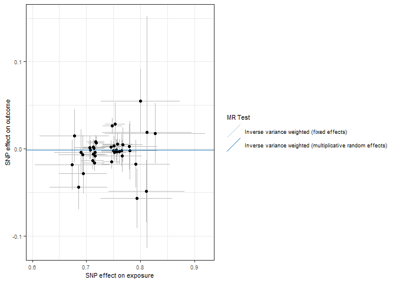<!-- -->

``` r
forrest_p <- mr_forest_plot(res_single)
forrest_p[[1]]
```

    ## Warning: Removed 1 row containing missing values or values outside the scale range
    ## (`geom_errorbarh()`).

    ## Warning: Removed 1 row containing missing values or values outside the scale range
    ## (`geom_point()`).

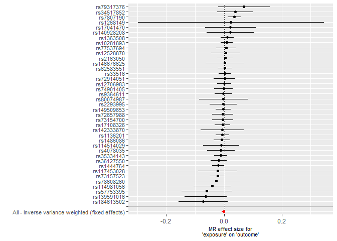<!-- -->
